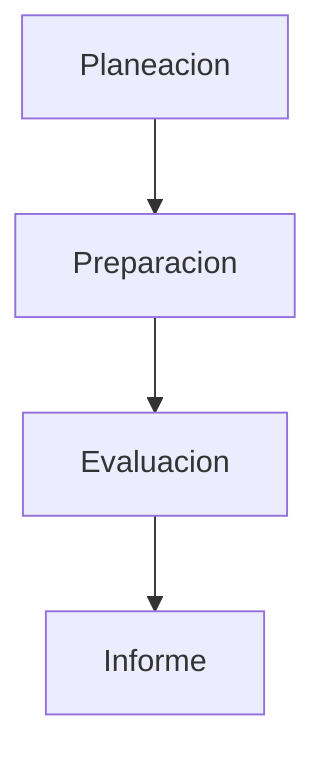
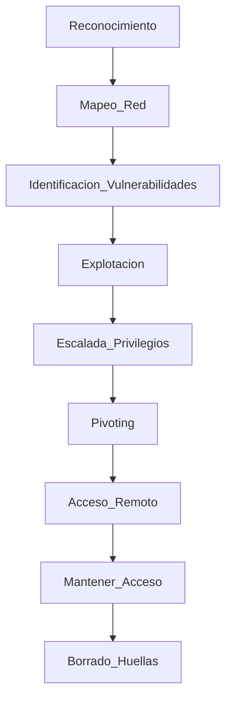
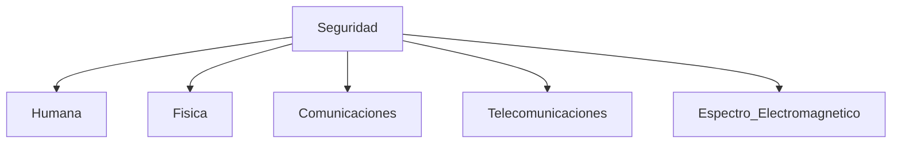
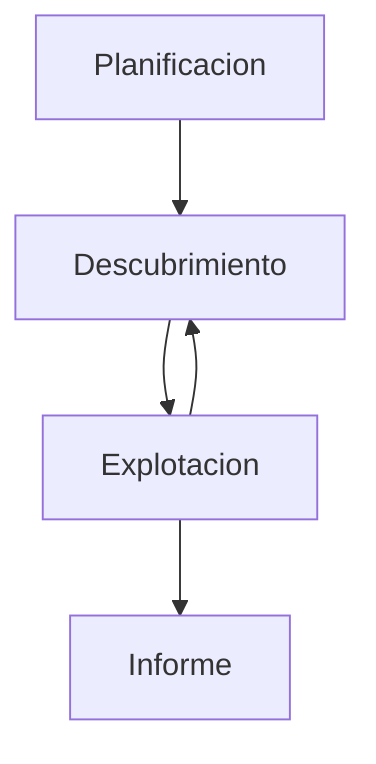
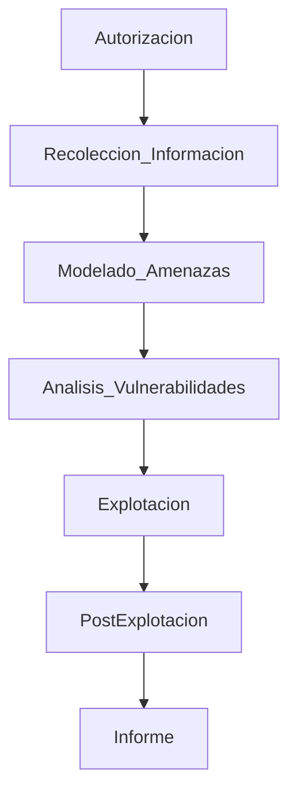

# Metodologías De Auditorías De Seguridad

## 1. Introducción a Las Metodologías De Auditoría De Seguridad

Las **metodologías de auditoría de seguridad** son marcos estructurados que guían el proceso de evaluación de la seguridad de sistemas, redes y aplicaciones.

Su objetivo es:

- Establecer **procedimientos sistemáticos** para evaluar la seguridad.
    
- Garantizar que la auditoría **cubra todos los aspectos relevantes**.
    
- Proporcionar **estándares y buenas prácticas** para realizar pruebas de seguridad.

Estas metodologías son utilizadas principalmente en:

- Auditorías técnicas
    
- Pruebas de penetración (Pentesting)
    
- Evaluación de vulnerabilidades
    
- Auditorías de seguridad de aplicaciones

---

# 2. Principales Metodologías De Auditoría De Seguridad

Las metodologías más utilizadas en auditorías de seguridad incluyen:

|Metodología|Organización|Área principal|
|---|---|---|
|ISSAF|Open Information Systems Security Group|Pentesting general|
|OSSTMM|ISECOM|Evaluación de seguridad global|
|PTES|Community Standard|Pentesting|
|NIST SP 800-115|NIST|Guía de pruebas de seguridad|
|OWASP Testing Guide|OWASP|Seguridad de aplicaciones web|
|OWISAM / WISAM|OWASP|Auditoría de redes WiFi|
|OASAM|OWASP|Seguridad en aplicaciones Android|
|Common Criteria (ISO 15408)|ISO|Certificación de productos de seguridad|

Cada metodología tiene **enfoques y objetivos distintos**, dependiendo del tipo de sistema evaluado.

---

# 3. ISSAF (Information Systems Security Assessment Framework)

## Definición

**ISSAF** es un marco de trabajo que proporciona una guía detallada para realizar **evaluaciones de seguridad y pruebas de penetración**.

Se caracteriza por ofrecer:

- Procedimientos detallados
    
- Técnicas de explotación
    
- Contramedidas recomendadas

Una característica importante es que **explica tanto qué hacer como cómo hacerlo**.

---

## Estructura De ISSAF

Cada **criterio de evaluación** incluye:

|Elemento|Descripción|
|---|---|
|Descripción|Qué se evalúa|
|Objetivo|Propósito del control|
|Prerrequisitos|Condiciones necesarias|
|Proceso|Procedimiento de evaluación|
|Resultados esperados|Qué se espera encontrar|
|Contramedidas|Soluciones recomendadas|
|Referencias|Documentación adicional|

---

## Fases De ISSAF

La metodología se estructura en **3 fases principales y 9 pasos**.

### Fases Principales

|Fase|Actividad|
|---|---|
|Planeación|Definir alcance y objetivos|
|Preparación|Preparar herramientas y entorno|
|Evaluación|Realizar pruebas de seguridad|

---

## Fases Del Proceso De Pentesting En ISSAF

Durante la fase de evaluación se realizan las etapas típicas de un **test de penetración**.

### Etapas Principales

1. Recolección de información
    
2. Mapeo de red
    
3. Identificación de vulnerabilidades
    
4. Explotación
    
5. Escalada de privilegios
    
6. Pivoting (expansión dentro de la red)
    
7. Compromiso de sistemas
    
8. Persistencia
    
9. Eliminación de rastros

---

## Limitación De ISSAF

Aunque es una metodología muy detallada, **no se actualiza desde 2006**, lo que reduce su aplicabilidad frente a amenazas modernas.

Sin embargo, sigue siendo útil para **formación de auditores principiantes**.

---

# 4. OSSTMM (Open Source Security Testing Methodology Manual)

## Definición

**OSSTMM** es una metodología desarrollada por **ISECOM** para evaluar la seguridad de una organización de manera integral.

A diferencia de ISSAF:

- Indica **qué evaluar**
    
- Pero no siempre explica **cómo hacerlo**

---

## Áreas De Seguridad Evaluadas Por OSSTMM

### Dominios Principales

|Dominio|Descripción|
|---|---|
|Seguridad humana|Riesgos relacionados con personas|
|Seguridad física|Protección de instalaciones|
|Seguridad de comunicaciones|Redes de datos|
|Telecomunicaciones|Infraestructura de comunicación|
|Seguridad electromagnética|Protección contra emisiones|

---

## Ataques TEMPEST

Una parte interesante de OSSTMM analiza ataques relacionados con **emanaciones electromagnéticas**.

### Qué Es Un Ataque TEMPEST

Un ataque **TEMPEST** consiste en interceptar las emisiones electromagnéticas de dispositivos electrónicos para reconstruir la información que procesan.

Ejemplo:

- Recuperar información mostrada en un monitor
    
- Interceptar señales de dispositivos electrónicos

Estos ataques pueden realizarse desde el exterior del edificio y **no dejan evidencia directa**.

---

# 5. NIST SP 800-115

## Definición

La guía **NIST SP 800-115** proporciona un marco para realizar **pruebas técnicas de seguridad en sistemas de información**.

Es ampliamente utilizada en organizaciones gubernamentales y privadas.

---

## Fases Del Modelo NIST

### Fases

|Fase|Descripción|
|---|---|
|Planificación|Definir objetivos y alcance|
|Descubrimiento|Identificar vulnerabilidades|
|Explotación|Intentar comprometer el sistema|
|Informe|Documentar resultados|

Una característica importante es que permite **volver a la fase de descubrimiento** si se identifican nuevas vulnerabilidades durante la explotación.

---

# 6. PTES (Penetration Testing Execution Standard)

## Definición

**PTES** es un estándar para ejecutar **pruebas de penetración profesionales**.

Define **7 fases principales** del proceso de pentesting.

---

## Fases De PTES

### Fases Explicadas

|Fase|Objetivo|
|---|---|
|Autorización|Permiso legal para realizar pruebas|
|Recolección de información|Reconocimiento|
|Modelado de amenazas|Identificar objetivos|
|Análisis de vulnerabilidades|Buscar debilidades|
|Explotación|Acceder a sistemas|
|Post-explotación|Expandir acceso|
|Informe|Documentar resultados|

La **fase de autorización** es crucial para evitar problemas legales.

---

# 7. OWASP Testing Guide

## Definición

La **OWASP Testing Guide** es la principal metodología para auditar **seguridad en aplicaciones web**.

Actualmente es uno de los estándares más utilizados en **pentesting web**.

---

## Características Principales

- 11 objetivos de control
    
- 87 controles de seguridad

Estos controles cubren áreas como:

|Área|Ejemplo de vulnerabilidad|
|---|---|
|Autenticación|Password weak policies|
|Autorización|Escalada de privilegios|
|Validación de entradas|SQL Injection|
|Gestión de sesión|Session hijacking|

Esta metodología es considerada la **referencia principal en auditorías web**.

---

# 8. Metodología Para Auditoría De Redes WiFi

## OWISAM / WISAM

Esta metodología está orientada a la **evaluación de seguridad de redes inalámbricas** basadas en el estándar **IEEE 802.11**.

Características principales:

- 10 objetivos de control
    
- 64 controles de seguridad

Evalúa aspectos como:

- Autenticación WiFi
    
- Configuración de redes
    
- Seguridad de puntos de acceso
    
- Ataques Evil Twin
    
- Ataques de desautenticación

---

# 9. Open Android Security Assessment Methodology (OASAM)

## Definición

La **OASAM** es una metodología diseñada para auditar **seguridad de aplicaciones Android**.

Incluye una taxonomía estructurada de controles de seguridad.

---

## Controles De Seguridad

Esta metodología incluye **59 controles organizados en 9 objetivos**.

|Objetivo|Área|
|---|---|
|Information Gathering|Recolección de información|
|Configuration|Configuración|
|Authentication|Autenticación|
|Cryptography|Criptografía|
|Data Leakage|Fuga de información|
|Data Validation|Validación de datos|
|Spoofing|Suplantación|
|Unauthorized Access|Acceso no autorizado|
|Business Logic|Lógica de negocio|

---

# 10. Common Criteria (ISO 15408)

## Definición

**Common Criteria (ISO 15408)** es un estándar internacional para la **evaluación y certificación de seguridad de productos de TI**.

Se utilize principalmente para evaluar:

- Hardware
    
- Software
    
- Sistemas de seguridad

---

## Estructura Del Estándar

La norma se compone de **tres documentos principales**.

|Documento|Contenido|
|---|---|
|Parte 1|Conceptos y principios|
|Parte 2|Requisitos de seguridad|
|Parte 3|Metodología de evaluación|

---

## Aplicación Práctica

Common Criteria se utilize para:

- Certificar productos de seguridad
    
- Definir requisitos de seguridad
    
- Evaluar sistemas antes de su adquisición

Esto es especialmente útil en **procesos de compra tecnológica**.

---

# Resumen De Puntos Clave

- Las **metodologías de auditoría de seguridad** proporcionan un marco estructurado para evaluar la seguridad de sistemas.
    
- **ISSAF** ofrece una metodología detallada para realizar pentesting.
    
- **OSSTMM** evalúa la seguridad desde múltiples dominios incluyendo aspectos humanos y físicos.
    
- **NIST SP 800-115** es una guía para realizar pruebas técnicas de seguridad.
    
- **PTES** define un proceso professional para pruebas de penetración.
    
- **OWASP Testing Guide** es la referencia principal para auditorías de seguridad en aplicaciones web.
    
- Existen metodologías específicas para **WiFi (OWISAM)** y **Android (OASAM)**.
    
- **Common Criteria (ISO 15408)** es el estándar internacional para certificación de seguridad de productos TI.

---

## MicroTest

1. ¿Cuál de las siguientes metodologías se considera un marco de trabajo?
    
    - La respuesta: D. The Information System Security Assessment Framework (ISSAF).
        
    - Justificación: **ISSAF** se describe como un **framework (marco de trabajo)** más que como una metodología estricta. Proporciona un conjunto estructurado de **prácticas, criterios de evaluación y procedimientos** que guían las evaluaciones de seguridad. Las otras opciones son metodologías o guías específicas para pruebas de seguridad.
        
2. Señala la respuesta correcta. ¿Qué metodología puede llegar a set un estándar internacional?
    
    - La respuesta: A. The Open Source Security Testing Methodology Manual (OSSTMM).
        
    - Justificación: **OSSTMM** es una metodología desarrollada por ISECOM que ha buscado convertirse en un **estándar internacional similar a una norma ISO**, aunque todavía no lo ha conseguido oficialmente. Las otras opciones no están orientadas a convertirse en estándares internacionales de ese tipo.
        
3. Señala la respuesta incorrecta. Controles de la metodología Open Web Application Security Project (OWASP):
    
    - La respuesta: C. Información clasificada.
        
    - Justificación: La **OWASP Testing Guide** incluye controles relacionados con seguridad de aplicaciones web como **autorización, gestión de sesiones y manejo de errores**, ya que estos afectan directamente la seguridad de aplicaciones. **Información clasificada** no es un control típico dentro de OWASP para pruebas de seguridad web, por lo que es la opción incorrecta.