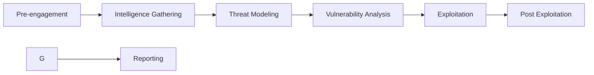

# Tema 10 — Auditorías De Cumplimiento Y Metodologías De Auditoría

## 1. Introducción Al Tema

El tema aborda dos bloques principales dentro de la auditoría de seguridad de la información:

1. **Auditorías de cumplimiento**
    
2. **Metodologías de auditoría de seguridad**

Las auditorías de seguridad permiten evaluar si una organización cumple con **normativas, estándares y buenas prácticas de seguridad**, así como analizar **vulnerabilidades técnicas y organizativas**.

---

# 2. Auditorías De Cumplimiento

## 2.1 Definición

Una **auditoría de cumplimiento (Compliance Audit)** es un proceso mediante el cual se evalúa si una organización **cumple con una norma, regulación o estándar específico**.

### Objetivo Principal

Medir el **gap (brecha)** entre:

- **Lo que la organización tiene implementado**
    
- **Lo que exige la norma o regulación**

Si existe una diferencia significativa entre ambos, la organización **no cumple** completamente con el estándar.

### Proceso General

---

## 2.2 Tipos De Auditorías De Cumplimiento

Durante el tema se estudiaron **cuatro tipos principales**.

|Tipo de auditoría|Objetivo|Contexto|
|---|---|---|
|Protección de datos|Garantizar el uso adecuado de datos personales|Legislación nacional de privacidad|
|Esquema Nacional de Seguridad (ENS)|Asegurar la seguridad de sistemas en organismos públicos|Administración pública|
|PCI DSS|Proteger transacciones con tarjetas de pago|Sector financiero y comercio electrónico|
|ISO 27001|Certificar un sistema de gestión de seguridad de la información|Organizaciones de cualquier sector|

---

# 3. Auditoría De Protección De Datos

## 3.1 Definición

Las auditorías de **protección de datos** evalúan si una organización cumple con las **leyes de privacidad y protección de datos personales**.

En la mayoría de países existen leyes específicas, por ejemplo:

- **GDPR (Europa)**
    
- **LFPDPPP (México)**

---

## 3.2 Concepto De Dato Personal

### Dato Personal

Información que permite **identificar directa o indirectamente a una persona**.

Ejemplos:

- Nombre
    
- Dirección
    
- Número de identificación
    
- Datos biométricos

---

### Diferencia Entre Tipos De Datos

|Tipo de dato|Definición|
|---|---|
|Dato personal|Información que identifica a una persona|
|Dato sensible|Datos especialmente protegidos (raza, religión, salud, ideología)|
|Dato clasificado|Información protegida por confidencialidad organizacional|

La **clasificación de datos sensibles** se basa en características como:

- raza
    
- religión
    
- ideología política
    
- salud
    
- orientación sexual

---

# 4. Esquema Nacional De Seguridad (ENS)

## 4.1 Definición

El **ENS** es un marco normativo que establece **controles y objetivos de seguridad** para sistemas de información en el sector público.

### Elementos Principales

- Objetivos de control
    
- Controles de seguridad
    
- Evaluación del cumplimiento

Su finalidad es garantizar:

- **confidencialidad**
    
- **integridad**
    
- **disponibilidad**

de la información.

---

# 5. PCI DSS (Payment Card Industry Data Security Standard)

## 5.1 Definición

**PCI DSS** es un estándar de seguridad creado para **proteger las transacciones con tarjetas de pago**.

Se aplica principalmente a:

- bancos
    
- plataformas de pago
    
- comercios electrónicos
    
- empresas que procesan pagos

---

## 5.2 Importancia

Aunque es obligatorio principalmente para el sector financiero, **cualquier negocio que procese pagos debería cumplirlo**.

### Objetivos De PCI DSS

Algunos de los controles más importantes incluyen:

- protección de datos de tarjeta
    
- redes seguras
    
- control de accesos
    
- monitorización de sistemas
    
- pruebas de seguridad

---

# 6. Auditoría ISO 27001

## 6.1 Definición

**ISO 27001** es una norma internacional para implementar un **Sistema de Gestión de Seguridad de la Información (SGSI)**.

Su objetivo es gestionar sistemáticamente:

- riesgos de seguridad
    
- políticas de seguridad
    
- controles de protección

---

## 6.2 Proceso De Certificación

Antes de obtener la certificación ISO 27001, se deben realizar dos auditorías.

### Importancia De la Auditoría Interna

La auditoría interna se realiza para:

- detectar errores antes de la auditoría externa
    
- evitar fallar en la certificación
    
- reducir costos de nuevas auditorías externas

---

# 7. Metodologías De Auditoría De Seguridad

## 7.1 Definición

Las **metodologías de auditoría de seguridad** proporcionan un **conjunto estructurado de procesos, fases y controles** para evaluar la seguridad de sistemas de información.

Sirven como guía para:

- auditores de seguridad
    
- pentesters
    
- consultores de ciberseguridad

---

# 8. Principales Metodologías De Auditoría

## 8.1 Comparación General

|Metodología|Enfoque principal|Característica|
|---|---|---|
|ISSAF|Evaluación completa de seguridad|Framework detallado|
|OSSTMM|Auditoría de seguridad integral|Define qué hacer|
|PTES|Pruebas de penetración|Metodología pentesting|
|NIST 800-115|Guía de pruebas de seguridad|Recomendaciones técnicas|
|OWASP Testing Guide|Seguridad de aplicaciones web|Referencia para auditorías web|
|OWASP WSTG WiFi|Seguridad de redes inalámbricas|Auditoría WiFi|
|OWASP MASTG|Seguridad de apps móviles|Auditoría Android|
|Common Criteria|Certificación de productos|Norma ISO 15408|

---

# 9. ISSAF (Information System Security Assessment Framework)

## Definición

**ISSAF** es un **framework de auditoría de seguridad** que proporciona criterios detallados para evaluar sistemas de información.

### Características

- Define **qué hacer**
    
- Define **cómo hacerlo**
    
- Muy detallado
    
- Ideal para auditores principiantes

### Desventaja

No se actualiza desde **2006**.

---

# 10. OSSTMM

## Definición

**Open Source Security Testing Methodology Manual (OSSTMM)** es una metodología abierta para pruebas de seguridad.

### Característica Principal

Define **qué pruebas deben realizarse**, pero **no explica cómo realizarlas**.

### Estado

Ha intentado convertirse en **estándar ISO**, aunque aún no lo ha logrado.

---

# 11. PTES

## Definición

**Penetration Testing Execution Standard (PTES)** es una metodología enfocada en **pruebas de penetración**.

### Fases Principales

Se centra en **simular ataques reales** contra sistemas.

---

# 12. NIST 800-115

## Definición

Guía desarrollada por **NIST** para realizar pruebas de seguridad en sistemas de información.

### Características

Incluye fases típicas de pentesting:

- planificación
    
- descubrimiento
    
- explotación
    
- reporte

### Punto Más Importante

Proporciona **recomendaciones para los hallazgos** que deben incluirse en el informe de auditoría.

---

# 13. OWASP Testing Guide

## Definición

La **OWASP Testing Guide** es la principal metodología para realizar **auditorías de seguridad en aplicaciones web**.

### Características

- 11 objetivos de control
    
- 84 controles de seguridad

### Ejemplos De Controles

- autenticación
    
- autorización
    
- gestión de sesiones
    
- validación de entradas
    
- manejo de errores

Es considerada **la referencia principal para auditoría de seguridad web**.

---

# 14. OWASP Para Auditoría WiFi

Existe una metodología OWASP específica para **auditoría de redes WiFi**.

## Características

- basada en el estándar **IEEE 802.11**
    
- **10 objetivos de control**
    
- **64 controles de seguridad**

Se utilize para evaluar:

- autenticación WiFi
    
- cifrado
    
- configuración de redes inalámbricas
    
- vulnerabilidades de acceso inalámbrico

---

# 15. OWASP Para Seguridad Android

OWASP también dispone de una metodología enfocada a **auditoría de aplicaciones móviles Android**.

## Características

Incluye controles relacionados con:

- autenticación
    
- criptografía
    
- validación de datos
    
- fuga de información
    
- lógica de negocio
    
- ataques de spoofing

Es útil tanto para:

- desarrolladores
    
- auditores de seguridad

---

# 16. Common Criteria (ISO 15408)

## Definición

**Common Criteria** es un estándar internacional para la **evaluación y certificación de seguridad de productos hardware y software**.

Regulado por:

**ISO/IEC 15408**

---

## Objetivo

Evaluar la seguridad de:

- dispositivos
    
- sistemas operativos
    
- hardware
    
- software

---

## Reconocimiento Internacional

Una evaluación realizada bajo **Common Criteria** en un país es **reconocida automáticamente en otros países participantes**.

Esto facilita:

- certificación internacional
    
- evaluación estandarizada de productos

---

# 17. Resumen De Puntos Clave

- Las **auditorías de cumplimiento** evalúan si una organización cumple con normas o regulaciones.
    
- El objetivo es medir el **gap entre lo implementado y lo requerido por la norma**.
    
- Las principales auditorías vistas fueron:
    
    - Protección de datos
        
    - ENS
        
    - PCI DSS
        
    - ISO 27001
        
- ISO 27001 require **auditoría interna antes de auditoría externa** para certificación.
    
- Las **metodologías de auditoría de seguridad** proporcionan procesos estructurados para evaluar sistemas.
    
- **ISSAF** es un framework detallado que explica qué hacer y cómo hacerlo.
    
- **OSSTMM** define qué pruebas realizar, pero no cómo.
    
- **PTES** es una metodología para pruebas de penetración.
    
- **NIST 800-115** proporciona guías y recomendaciones para auditorías.
    
- **OWASP Testing Guide** es la referencia principal para auditoría de aplicaciones web.
    
- **Common Criteria (ISO 15408)** es un estándar internacional para certificación de seguridad de productos.

---

## MicroTest