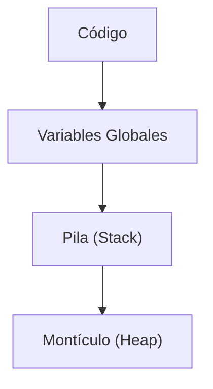
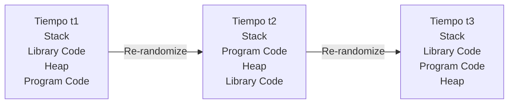

# Notas De Estudio: Ataques Al Código E Inyección De Código

## 1. Introducción a Los Ataques Al Código

En ciberseguridad, los ataques no solo se dirigen a redes o sistemas operativos como entidades externas, sino también **al propio código**:

- Código desarrollado a medida por programadores.
    
- Código interno del sistema operativo.
    
- Librerías y ejecutables auxiliares.

Estos ataques suelen explotar **malas prácticas de programación** y deficiencias en la validación de datos, dando lugar a vulnerabilidades graves como la **inyección de código** y el **desbordamiento de buffer**.

---

## 2. Buenas Prácticas Vs Malas Prácticas De Programación

### 2.1 Malas Prácticas Comunes

- **Reutilización de código sin análisis profundo**: integrar código de terceros puede introducir vulnerabilidades en la interacción entre módulos.
    
- **Falta de validación de entradas**.
    
- **Gestión insegura de credenciales** (claves almacenadas o transmitidas en texto plano).
    
- **Ausencia de monitoreo continuo** del comportamiento del software.

### 2.2 Buenas Prácticas Esenciales

- Análisis de código **estático** y **dinámico**.
    
- Manejo seguro de claves mediante:
    
    - Hashing.
        
    - Uso de _salt_ y _pepper_ para evitar ataques con tablas arcoíris.
        
- Verificación estricta de tipos y tamaños de datos.
    
- Validación de toda entrada externa.
    
- Principio de **mínimos privilegios**.

---

## 3. Análisis De Código En El Ciclo De Vida Del Software

### 3.1 Análisis Estático

- Se realiza sobre el código **sin ejecutarlo**.
    
- Busca vulnerabilidades potenciales en estructuras, flujos y uso de memoria.
    
- Se aplica durante la fase de desarrollo.

### 3.2 Análisis Dinámico

- Se ejecuta el programa y se somete a pruebas.
    
- Incluye **pentesting** y pruebas de estrés.
    
- Verifica el comportamiento real del sistema frente a entradas maliciosas.

|Tipo de análisis|Memento|Objetivo principal|
|---|---|---|
|Estático|Desarrollo|Detectar vulnerabilidades en el código|
|Dinámico|Ejecución|Verificar comportamiento ante ataques|

---

## 4. Validación De Entrada Y Puntos De Inyección

La **validación de entrada** es el principal mecanismo de defensa contra la inyección de código.

### 4.1 Fuentes De Entrada Vulnerables

- Archivos:
    
    - Configuración.
        
    - Bases de datos.
        
    - Archivos temporales.
        
- Variables de entorno.
    
- Parámetros de línea de commandos.
    
- Formularios web y listas desplegables.
    
- Cookies.
    
- Servicios de correo electrónico.

Si estas entradas no se validan correctamente, un atacante puede introducir **código ejecutable** en lugar de datos esperados.

---

## 5. Inyección De Código (Code Injection)

### 5.1 Definición

La inyección de código ocurre cuando un atacante introduce instrucciones maliciosas que el sistema interpreta y ejecuta como parte legítima del programa.

### 5.2 Ejemplo: Inyección SQL

- Un programa construye consultas concatenando cadenas.
    
- El atacante introduce delimitadores (`;`) y commandos adicionales.
    
- Resultado: ejecución de instrucciones no previstas, como borrado de tablas.

### 5.3 Inyección De Commandos Del Sistema (ejemplo En C)

**Escenario**:

1. El programa solicita:
    
    - Archivo fuente.
        
    - Archivo destino.
        
2. Construye un commando del sistema (`cp fuente destino`).
    
3. Usa `system()` para ejecutarlo.

**Ataque**:

- El atacante introduce en el destino:

    ```Python
    destino; rm -rs /
    ```

- Si el programa tiene privilegios elevados, se ejecuta un borrado recursivo del sistema.

**Conclusión**: concatenar entradas del usuario en commandos del sistema es extremadamente peligroso.

---

## 6. Desbordamiento De Buffer (Buffer Overflow)

### 6.1 Definición

Un **desbordamiento de buffer** ocurre cuando se escribe más información de la que un espacio de memoria reservado puede container, sobrescribiendo áreas adyacentes.

### 6.2 Objetivo Del Atacante

- Sobrescribir datos críticos (como direcciones de retorno).
    
- Redirigir el flujo de ejecución hacia código malicioso.

---

## 7. Organización De la Memoria De Un Programa

Cuando un programa se carga en memoria, normalmente se divide en cuatro regiones:



### 7.1 Regiones De Memoria

- **Código**: instrucciones ejecutables.
    
- **Variables globales**: creadas en tiempo de compilación.
    
- **Pila (Stack)**:
    
    - Variables locales.
        
    - Direcciones de retorno.
        
    - Contexto de llamadas a funciones.
        
- **Montículo (Heap)**:
    
    - Memoria asignada dinámicamente en tiempo de ejecución (`malloc`, `new`).

|Región|Creación|Uso principal|
|---|---|---|
|Código|Compilación|Instrucciones del programa|
|Globales|Compilación|Datos persistentes|
|Pila|Ejecución|Variables locales y retornos|
|Heap|Ejecución|Objetos y memoria dinámica|

---

## 8. Ejemplo Clásico: Desbordamiento De Pila

### 8.1 Escenario Del Programa

- Función con:
    
    - Un arreglo de caracteres (`char buffer[128]`).
        
    - Una variable entera.
        
- No existe verificación del tamaño de entrada.

### 8.2 Ataque Paso a Paso

1. El atacante introduce una cadena mayor a 128 caracteres.
    
2. El exceso de datos sobrescribe:
    
    - Variables locales.
        
    - Dirección de retorno.
        
3. El atacante coloca:
    
    - Código malicioso en el buffer.
        
    - Una dirección de retorno modificada que apunta a ese código.
        
4. Al finalizar la función, el programa salta al código inyectado.

---

## 9. Medidas Básicas contra Desbordamiento De Buffer

- Verificar **tipo y tamaño** de todas las variables.
    
- Evitar funciones inseguras (por ejemplo, `gets`).
    
- Deshabilitar ejecución en regiones de datos (stack/heap).
    
- Uso de protecciones del sistema operativo:
    
    - Aleatorización del espacio de direcciones (ASLR).
        
    - Páginas no ejecutables.

---

## 10. Inyección De Código En El Sistema Operativo

### 10.1 Ejecutables Portables (PE) En Windows

Los **PE (Portable Executable)** incluyen:

- Ejecutables.
    
- DLLs.
    
- Controladores.
    
- Protectores de pantalla.

Estos archivos:

- No se cargan completamente en memoria.
    
- Se importan dinámicamente según necesidad.

#### Clasificación Por Tipo De Archivo

|Tipo|Extensión|Descripción|
|---|---|---|
|Ejecutables|`.exe`|Programas con un **Entry Point** definido que permite al usuario ejecutar la aplicación.|
|Bibliotecas de Enlace Dinámico|`.dll`|Proveen funcionalidades reutilizables que pueden set invocadas por uno o varios `.exe`.|
|Archivos del Panel de Control|`.cpl`|DLL especializadas utilizadas por la ventana de configuración de Windows.|
|Protectores de Pantalla|`.scr`|Animaciones con formato PE que pueden ejecutarse como programas.|
|Controladores de Dispositivo|`.sys`|Programas con **privilegios de kernel** que permiten la comunicación entre el hardware y el sistema operativo.|

---

#### Clasificación Por Tipo De Código

|Tipo|Descripción|
|---|---|
|Native PE|Código escrito directamente en **lenguaje ensamblador o máquina**, ejecutado sin capas intermedias.|
|Managed PE (.NET)|Contienen código **Common Intermediate Language (CIL)** y dependen del **runtime de .NET** para su ejecución.|

---

#### Clasificación Por Subsistema

|Subsistema|Descripción|Ejemplos|
|---|---|---|
|Native|No requieren subsistema de usuario; típicamente utilizados por components del kernel.|`ntoskrnl.exe`, controladores|
|Windows GUI|Programas con interfaz gráfica (ventanas, botones, gráficos).|Chrome, Word|
|Windows CLI (Console)|Programas que se ejecutan en la terminal o consola.|`ping`, `ipconfig`|

---

### 10.2 Riesgo

- Atacantes realizan **ingeniería inversa**.
    
- Identifican puntos de entrada no verificados.
    
- Inyectan código malicioso en procesos comunes.

### 10.3 Procesos Críticos

- `svchost.exe`: hospeda múltiples servicios del sistema.
    
- `explorer.exe`: interfaz gráfica y barra de tareas.
    
- Servicios del sistema y demonios (ej. `systemd` en Linux).

Si un malware controla estos procesos, obtiene **privilegios elevados**.

---

## 11. Ingeniería Inversa Y Desensamblado

- **Desensambladores**: traducen código máquina a ensamblador.
    
- **Descompiladores**: generan aproximaciones en lenguajes de alto nivel.
    
- Permiten comprender la lógica interna del programa para explotarlo.

---

## 12. Return-Oriented Programming (ROP)

### 12.1 Definición

ROP es una técnica donde:

- No se inyecta un programa completo.
    
- Se reutilizan fragmentos de código existentes (_gadgets_).
    
- Se encadenan mediante direcciones de retorno manipuladas.

#### Return-Oriented Programming (ROP)

**Definición**  
ROP (Return-Oriented Programming) es una técnica avanzada de **buffer overflow** que, en lugar de inyectar directamente código malicioso en la pila y desviar el flujo de ejecución hacia él, **reutiliza secuencias de código ya existentes en memoria** (RAM o bibliotecas compartidas).

Estas secuencias reutilizadas se llaman **gadgets**.

**Gadgets**

- Son pequeñas porciones de código máquina.
    
- Generalmente terminan con una instrucción `ret`.
    
- Ya existen dentro del binario o de librerías cargadas.

**Ejemplo conceptual de gadgets**

```asm
pop reg
ret
```

- `pop reg`: extrae un valor de la pila y lo guarda en un registro.
    
- `ret`: extrae la siguiente dirección de la pila y salta a ella.

Encadenando múltiples gadgets, el atacante puede construir una **ROP chain**, logrando ejecutar acciones complejas sin inyectar código nuevo.

**Ventaja principal de ROP**

- Permite evadir protecciones modernas como:
    
    - Memoria no ejecutable (NX).
        
    - Aleatorización del espacio de direcciones (ASLR).
        
- No depende de ejecutar código inyectado directamente.

---

#### Egg Hunter

**Definición**  
Un **egghunter** es una porción **muy pequeña de shellcode** cuyo objetivo es **localizar un shellcode más grande** que ya fue inyectado en la memoria del proceso vulnerable, pero cuya ubicación exacta el atacante desconoce.

**Motivación**  
Debido a:

- ASLR.
    
- Distribución dinámica de la memoria.
    
- Restricciones de espacio en el punto de inyección.

El atacante no sabe dónde quedó el payload principal.

**Funcionamiento general**

1. El egghunter se inyecta en una región pequeña y controllable.
    
2. Recorre la memoria del proceso.
    
3. Busca una marca conocida (_egg_).
    
4. Al encontrarla, transfiere la ejecución al shellcode completo.

---

#### Dificultades Que Debe Superar El Atacante

- Desconocer la ubicación exacta del payload.
    
- Limitaciones de espacio para inyectar código.
    
- Protecciones del sistema operativo:
    
    - ASLR.
        
    - Segmentación de memoria.
        
    - Regiones no ejecutables.
        
- Necesidad de conocer con precisión la estructura de la pila y el heap.

---

#### Relación Entre ROP Y Egg Hunter

- El **egghunter** se usa para localizar el payload.
    
- **ROP** se utilize para ejecutar lógica maliciosa reutilizando código existente.
    
- Ambas técnicas suelen combinarse en exploits modernos para maximizar efectividad y evasión de defensas.

### 12.2 Motivación

- Los sistemas modernos aleatorizan la memoria.
    
- El atacante no sabe dónde quedó su código.
    
- ROP evita la necesidad de conocer direcciones exactas del código inyectado.

### 12.3 Estructura General

- **Egg hunter**: pequeño código que localiza el payload.
    
- **ROP chain**: secuencia de retornos que ejecutan acciones maliciosas.

---

## 13. Desbordamiento De Buffer Con Egg Hunter

El **desbordamiento de buffer con egghunter** es una técnica utilizada cuando el atacante **no conoce la ubicación exacta del shellcode principal** en memoria y el espacio disponible para inyección directa es limitado.

El ataque se divide en **dos components principales**:

- Shellcode principal (grande).
    
- Egg hunter (pequeño).

---

### 13.1 Algoritmo General Del Ataque Con Egg Hunter

#### Paso 1: Inyección Del Shellcode Principal (payload)

- El atacante inyecta el **shellcode malicioso grande** en la memoria del proceso vulnerable.
    
- Normalmente se coloca en:
    
    - Heap (montículo).
        
    - Otras regiones accesibles de memoria.
        
- Este shellcode se precede por una **etiqueta especial llamada egg**.

**Egg**

- Es una secuencia corta de bytes.
    
- Ejemplo conceptual: 4 bytes repetidos dos veces.
    
- Se elige de forma que sea **muy poco probable** que aparezca de manera natural en memoria.

---

#### Paso 2: Inyección Del Egg Hunter

- El **egghunter** es un código extremadamente pequeño.
    
- Está diseñado para caber dentro del espacio limitado del buffer overflow.
    
- Su única función es **buscar el egg en la memoria del proceso**.

---

#### Paso 3: Búsqueda Del Egg

El egghunter:

1. Escanea progresivamente la memoria del proceso.
    
2. Utilize llamadas al sistema para intentar acceder a rangos de memoria.
    
3. Si una región es accessible:
    
    - Compara su contenido con el patrón del egg.
        
4. Cuando encuentra una coincidencia:
    
    - Verifica que el egg esté repetido (para evitar falsos positivos).

---

#### Paso 4: Transferencia Del Flujo De Ejecución

- Una vez identificado el egg correcto:
    
    - El egghunter calcula la dirección inmediatamente posterior al egg.
        
    - Transfiere el flujo de ejecución a esa dirección.
        
- Se ejecuta el **shellcode principal**, completando el ataque.

---

## 14. Relación Con la Aleatorización De Memoria (ASLR)

La técnica del egghunter surge como respuesta directa a **ASLR** y otras defensas modernas.

### 14.1 ASLR (Address Space Layout Randomization)

**Definición**  
ASLR es una técnica de seguridad que **aleatoriza las direcciones base** de:

- Código del programa.
    
- Pila (stack).
    
- Montículo (heap).
    
- Librerías compartidas.

Esto se realiza **cada vez que el programa se carga en memoria**.

---

### 14.2 Visualización De la Re-aleatorización De Memoria

El siguiente diagrama representa cómo, con el paso del tiempo y cada ejecución, el sistema operativo **reorganiza las regiones de memoria**, dificultando la predicción de direcciones por parte del atacante:



**Interpretación**

- El orden relativo de las regiones cambia.
    
- Las direcciones base no son constantes.
    
- El atacante no puede asumir ubicaciones fijas para el shellcode.

---

## 15. Defensas Modernas Y Endurecimiento Del Entorno

Las defensas actuales han obligado a los atacantes a desarrollar técnicas más complejas como ROP + egghunter.

### 15.1 DEP (Data Execution Prevention)

- Marca regiones de datos como **no ejecutables**.
    
- Impide ejecutar código directamente desde stack o heap.

### 15.2 Control Flow Guard (CFG)

- Restringe los destinos válidos de saltos indirectos.
    
- Evita desvíos arbitrarios del flujo de ejecución.

### 15.3 Consecuencia Para El Atacante

- Mayor complejidad en los exploits.
    
- Uso combinado de:
    
    - ROP chains.
        
    - Egg hunters.
        
    - Ingeniería inversa avanzada.

El libro _The Shellcoder’s Handbook_ documenta múltiples estrategias para evadir estas contramedidas.

---

## 16. Uso Seguro De la Memoria En Windows

### 16.1 ASLR En Windows

- A partir de **Windows 8**, ASLR se aplica de forma sistemática.
    
- Se aleatoriza:
    
    - Dirección inicial del ejecutable.
        
    - Stack.
        
    - Heap.
        
    - Librerías.

**Objetivo**

- Impedir que el atacante conozca:
    
    - Dónde inyectar código.
        
    - Dónde redirigir el flujo de ejecución.

---

### 16.2 Evolución Histórica De ASLR

- Implementado inicialmente en:
    
    - OpenBSD.
        
    - Linux.
        
- Posteriormente adoptado por:
    
    - Windows.
        
    - macOS.

---

### 16.3 Limitaciones De ASLR

- Existen ataques que reducen su efectividad:
    
    - Ataques por software.
        
    - Ataques por hardware.
        
- Ejemplo:
    
    - **ASLR + Cache attacks**, que filtran información sobre direcciones reales.

---

## 17. Resumen De Puntos Clave

- El egghunter permite localizar shellcode cuando su dirección es desconocida.
    
- El ataque se divide en payload grande + código buscador pequeño.
    
- ASLR complica la explotación al aleatorizar la memoria.
    
- ROP y egghunters surgen para evadir DEP, ASLR y CFG.
    
- Windows, Linux y macOS utilizan ASLR como defensa estándar.
    
- Ninguna defensa es absoluta; la seguridad depende de capas múltiples.

- Los ataques al código son tan críticos como los ataques a redes.
    
- La validación de entradas es la primera línea de defensa.
    
- El desbordamiento de buffer permite modificar el flujo de ejecución.
    
- La pila y el heap son objetivos comunes.
    
- Ejecutables y servicios del sistema operativo son blancos frecuentes.
    
- ROP es una técnica avanzada para evadir protecciones modernas.

---

## MicroTest