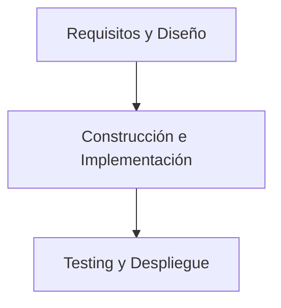

# Presentación De la Asignatura: Herramientas Y Plataformas Para El Desarrollo De Software

## 1. Objetivo General De la Asignatura

La asignatura busca proporcionar una **comprensión integral y práctica** de herramientas, toolkits y plataformas que apoyan **todas las etapas del ciclo de vida del desarrollo de software**.  
El enfoque es **holístico**, cubriendo desde la captura de requisitos hasta el despliegue y la monitorización, con especial atención a tecnologías **Java**, **.NET**, **desarrollo móvil**, **arquitecturas distribuidas** y **arquitecturas dirigidas por eventos**.

---

# 2. Concepto De Plataforma En El Desarrollo De Software

## 2.1 Definición De “Software Tools”

Una _software tool_ es cualquier programa o utilidad que asiste al equipo de desarrollo en tareas como:

- Crear y editar código
    
- Depurar
    
- Mantener software
    
- Automatizar tareas relacionadas con el desarrollo

## 2.2 Definición Adoptada En la Asignatura

Una **plataforma de desarrollo de software** es cualquier solución informática que:

- Automatiza o mejora tareas de cualquier etapa del ciclo de vida
    
- Facilita la colaboración
    
- Optimiza procesos técnicos

## 2.3 Importancia

Las plataformas actúan como **aceleradores** del desarrollo, permitiendo:

- Reducir esfuerzo manual
    
- Mejorar la consistencia
    
- Aumentar la productividad
    
- Integrar tecnologías heterogéneas mediante estándares y protocolos

---

# 3. Enfoque Holístico Y Arquitecturas Heterogéneas

## 3.1 Arquitecturas Distribuidas Y Orientadas a Eventos

Estas arquitecturas permiten diseñar soluciones compuestas por:

- **Módulos heterogéneos**, desarrollados en diferentes pilas
    
- Comunicación basada en **estándares y protocolos comunes**
    
- Integración fluida entre servicios, aplicaciones móviles y backends

## 3.2 Relevancia

Fomentan sistemas escalables, mantenibles y alineados a tendencias modernas de software.

---

# 4. Estructura De Contenidos De la Asignatura

## 4.1 Criterio Adoptado

La asignatura se organiza en **tres grandes bloques**, siguiendo el ciclo de vida tradicional del software.

## 4.2 Bloques Y Temas

|Bloque|Temas|Contenido Principal|
|---|---|---|
|**1. Primeras fases**|2–3|Requisitos, análisis, diseño, mockups, documentación|
|**2. Construcción**|4–8|Low-code/no-code, Java, .NET, ingeniería de servicios, desarrollo móvil|
|**3. Testing y despliegue**|9–10|Pruebas unitarias, integración, aceptación, despliegue, monitorización|

---

# 5. Actividades Y Aplicación Práctica

## 5.1 Actividad Individual

Enfocada en **requisitos y diseño** mediante:

- Técnicas de mapeo
    
- Historias de usuario
    
- Mockups / wireframes  
    Uso de una aplicación existente para inferir requisitos y diseñar pantallas.

## 5.2 Actividad Autocorregible

Implementación paso a paso en **.NET**:

- Integración con un servicio externo mediante API REST
    
- Construcción incremental de funcionalidad

## 5.3 Actividad Grupal

Automatización de pruebas para una solución cliente-servidor:

- Pruebas de aceptación
    
- Pruebas funcionales
    
- Testeo de servicios vía REST
    
- Automatización de interacción con aplicación web
    
- Pruebas de carga
    
- Uso de **Gherkin** para definir criterios de aceptación legibles por negocio y técnicos

---

# 6. Temario Resumido

|Tema|Enfoque|Herramientas / Conceptos|
|---|---|---|
|**1**|Control de versiones|Git, repositorios|
|**2**|Requisitos|Técnicas, mockups|
|**3**|Ciclo de vida y diseño|UML, modelado, documentación|
|**4**|Low-code / no-code|Plataformas open source y comerciales|
|**5**|Desarrollo Java|IDEs, compilación, toolkits|
|**6**|Desarrollo .NET|Entornos, frameworks|
|**7**|Ingeniería de servicios|Documentación, emulación, aceleradores|
|**8**|Desarrollo móvil|Toolkits, frameworks|
|**9**|Testing completo|Unitario, integración, sistema, aceptación|
|**10**|Despliegue y monitorización|Middleware y soporte para SOA|

---

# 7. Rol Del Equipo, Metodología Y Herramientas

## 7.1 Elementos Esenciales En El Desarrollo De Software

- **Personas**: roles especializados, trabajo colaborativo
    
- **Procesos / metodologías**: guían el orden y la forma de trabajar
    
- **Herramientas / plataformas**: automatizan y simplifican tareas

## 7.2 Mensaje Clave

Las herramientas **no sustituyen**:

- La captura de necesidades
    
- El diseño de arquitectura
    
- La definición de pruebas
    
- La comprensión del dominio

Son **facilitadoras**, no reemplazos del trabajo humano y metodológico.

---

# Resumen De Puntos Clave

- La asignatura ofrece una visión integral del **ciclo de vida del desarrollo de software** y las herramientas que lo soportan.
    
- Se estudian plataformas para **requisitos, diseño, implementación, servicios, testing y despliegue**.
    
- Se enfatiza la importancia de **arquitecturas distribuidas y heterogéneas**.
    
- Las actividades permiten aplicar conceptos de manera **práctica**: requisitos, integración REST, automatización de pruebas.
    
- Las herramientas apoyan, pero las **personas y procesos** definen la calidad del software.

