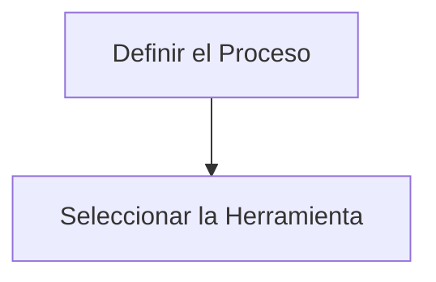

# Notas De Estudio: Contexto De Las Plataformas De Desarrollogit De Software

---

# 1. Introducción Y Objetivos De Aprendizaje

## Objetivos Principales

- Comprender el **contexto de las plataformas de desarrollo de software** dentro del proceso global de construcción de software.
    
- Diferenciar plataformas frente a **metodologías** y **personas** en los equipos de desarrollo.
    
- Aclarar el alcance del término **plataforma** frente a otros conceptos relacionados.
    
- Entender **criterios de clasificación** de plataformas y el modelo adoptado en la asignatura.

---

# 2. Components Esenciales Del Desarrollo De Software

El desarrollo de software require tres elementos fundamentales:

|Elemento|Descripción|Rol en el desarrollo|
|---|---|---|
|**Personas**|Equipos especializados en roles específicos|Realizan análisis, diseño, programación, pruebas, etc.|
|**Procesos / Metodologías**|Conjunto de pasos y prácticas que guían el desarrollo|Definen _cómo_ se debe trabajar|
|**Herramientas / Plataformas**|Soluciones que automatizan o facilitan tareas|Aceleran y simplifican actividades|

## Influencia Histórica

- Inspirado por iniciativas de los años 90 del **Software Engineering Institute (SEI)**
    
- Enfoque: _Software Process Improvement_
    
- Importancia en establecer procesos robustos antes de pensar en herramientas

---

# 3. Principio Fundamental: El Proceso Antes Que la Herramienta

## La Reflexión De Grady Booch

- Uno de los creadores de **UML**
    
- Author del **método Booch** para análisis y diseño orientado a objetos
    
- Cita clave: _“A fool with a tool is still a fool.”_

## Interpretación

- La herramienta por sí sola no garantiza mejora ni calidad.
    
- Un equipo sin proceso definido puede automatizar tareas **irrelevantes o incorrectas**.
    
- Adoptar una herramienta no debe forzar la adaptación del proceso a la plataforma.
    
- El orden recomendado:

## Riesgos De Seleccionar Herramientas Primero

- Actividades automatizadas que **no tienen sentido metodológico**
    
- Actividades esenciales **sin soporte**, por lo que no se ejecutan
    
- Dependencia de las limitaciones de la herramienta
    
- Pérdida de flexibilidad y calidad del proceso

---

# 4. Término “Plataforma” Y Conceptos Relacionados

## 4.1 Terminología En Inglés: _Software Tools_

Definidas como:

- Programas o utilidades que **asisten en la creación, edición, depuración, mantenimiento o ejecución** de tareas de desarrollo.

## 4.2 Conceptos Relacionados

|Término|Uso principal|
|---|---|
|**Library**|Repositorio de funciones reutilizables|
|**Toolkit**|Conjunto de herramientas cohesivas|
|**Framework**|Estructura base para desarrollar aplicaciones|
|**SDK (Software Development Kit)**|Paquete de herramientas, librerías y documentación para crear aplicaciones|
|**Interpreter / Engine**|Entorno de ejecución especializado|
|**Plataforma**|En infraestructura: hardware, OS, nube; en este curso: conjunto de herramientas que apoyan el ciclo de vida|

---

# 5. Definición De Plataforma Adoptada En la Asignatura

**Plataforma de desarrollo de software:**  
Solución informática que **ayuda a realizar tareas** de un equipo de desarrollo en **cualquiera de las etapas** del ciclo de vida del software.

Incluye:

- Herramientas para requisitos, diseño, codificación
    
- Sistemas para pruebas, despliegue
    
- Entornos especializados según la pila tecnológica

---

# 6. Clasificación De Plataformas

Clasificar plataformas permite:

- Entender su propósito
    
- Visualizar su papel dentro del proceso
    
- Organizar los temas de la asignatura de forma coherente

## 6.1 Clasificación Según Somerville (perspectiva funcional)

Criterio: función específica que cumple la plataforma.

Ejemplos de categorías:

- Planificación
    
- Gestión de cambios
    
- Prototipado
    
- Documentación
    
- Pruebas

## 6.2 Clasificación Según SWEBoK

- Combina **función** + **parte del proceso donde se utilize**
    
- Detalla **tipos y subtipos** de herramientas
    
- Más orientado a estándares y buenas prácticas de ingeniería del software

## 6.3 Dificultades De Una Clasificación Única

- Muchas herramientas cumplen **múltiples funciones**
    
- Algunas pertenecen a varios momentos del ciclo de vida
    
- Es difícil asignarlas a un solo ámbito funcional o de proceso

---

# 7. Criterio De Clasificación Adoptado En la Asignatura

La asignatura adopta un criterio mixto:

## 7.1 Primer Bloque: Ciclo De Vida Inicial

- Requisitos
    
- Análisis
    
- Diseño

## 7.2 Segundo Bloque: Construcción

- Low-code
    
- Desarrollo Java
    
- Desarrollo .NET
    
- Sistemas distribuidos
    
- Ingeniería de servicios
    
- Desarrollo móvil

## 7.3 Tercer Bloque: Testing Y Despliegue

- Pruebas
    
- Despliegue
    
- Monitorización

Esta estructura proporciona una visión coherente del ciclo completo.

---

# Resumen De Puntos Clave

- Las plataformas son solo **una parte** del proceso global del desarrollo; personas y metodologías son igualmente esenciales.
    
- El principio fundamental: **primero se define el proceso y luego se eligen las herramientas**.
    
- Existen múltiples términos relacionados (framework, SDK, toolkit), pero en esta asignatura _plataforma_ significa toda solución que facilita tareas del ciclo de vida.
    
- Clasificar plataformas ayuda a entender su función, aunque las clasificaciones tradicionales tienen limitaciones.
    
- La asignatura adopta un modelo propio organizado por **ciclo de vida** y **pilas tecnológicas**.

---

## MicroTest

1. **Los elementos a considerar en el ámbito del desarrollo de software son:**
    
    - **La respuesta:** c. Procesos, personas y herramientas.
        
    - **Justificación:** El transcript destaca que el desarrollo de software require tres pilares fundamentales: personas (equipos especializados), procesos o metodologías (cómo se trabaja) y herramientas/plataformas (qué apoya y automatiza el trabajo).

---

1. **A la hora de plantear una sistemática del desarrollo de software:**
    
    - **La respuesta:** d. Primero va el método de trabajo, después las herramientas.
        
    - **Justificación:** Según la reflexión basada en Grady Booch, primero debe definirse el proceso; elegir herramientas antes puede generar automatización de actividades que no tienen sentido metodológico o dejar sin cubrir actividades esenciales.

---

1. **El término de plataforma en la asignatura:**
    
    - **La respuesta:** b. Es cualquier solución informática que acelera las labores de un equipo de desarrollo de software en cualquiera de las fases del ciclo de vida.
        
    - **Justificación:** En la asignatura, “plataforma” se define como toda solución que ayuda a realizar tareas del equipo de desarrollo a lo largo del ciclo de vida del software, no limitada solo a infraestructura ni restringida a SDKs o librerías.