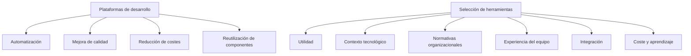

# Notas De Estudio

## Idea Clave 2: Valor Y Utilidad De Las Plataformas De Desarrollo De Software

---

# 1. Introducción a Las Plataformas De Apoyo Al Desarrollo De Software

## Definición

**Plataformas de apoyo al desarrollo de software**: Conjunto de herramientas, servicios y entornos diseñados para asistir en las distintas fases del ciclo de vida del software, automatizando tareas, facilitando la comunicación y reduciendo errores humanos.

## Propósito General

- Mejorar productividad y eficiencia del equipo.
    
- Automatizar procesos en el ciclo de vida del software.
    
- Reducir errores manuales.
    
- Facilitar comunicación y coordinación entre miembros del proyecto.

---

# 2. Beneficios Principales Del Uso De Plataformas

## 2.1 Automatización Del Ciclo De Vida Del Software

Permiten automatizar procesos de desarrollo, construcción, pruebas y mantenimiento.

## 2.2 Minimización De Errores Manuales

Al estandarizar y automatizar tareas repetitivas, disminuye la posibilidad de fallos humanos.

## 2.3 Programación Estructurada

Genera programas más ordenados y coherentes, lo que facilita:

- Pruebas
    
- Verificación y validación
    
- Mantenimiento posterior

## 2.4 Facilitan Pruebas Y Entornos De Validación

Crean entornos de prueba consistentes antes de liberar el software a producción.

## 2.5 Reducción De Sobrecostes Y Retrasos

Controlan mejor el proceso y disminuyen riesgos tecnológicos.

## 2.6 Estímulo a la Reutilización De Components

Permiten aprovechar:

- Código existente
    
- Components internos
    
- Soluciones ya probadas

Esto acelera el desarrollo y reduce errores.

## 2.7 Reducción Del Esfuerzo De Migración Tecnológica

Facilitan la transformación de sistemas heredados a nuevas tecnologías.

## 2.8 Disminución Del Coste Operativo

Optimización de recursos computacionales y de infraestructura.

## 2.9 Mejora De la Calidad Del Software

- Código más robusto
    
- Identificación temprana de errores
    
- Mantenimiento más sencillo

---

# 3. Limitaciones Y Consideraciones Importantes

## 3.1 No Sustituyen El Pensamiento Crítico

Tareas fundamentales que siguen requiriendo esfuerzo humano:

- Comprender requisitos
    
- Diseñar arquitectura
    
- Definir estrategias de prueba
    
- Proponer soluciones técnicas

## 3.2 No Son Soluciones Mágicas

Aumentan la eficiencia, pero no reemplazan la importancia de:

- Buenas prácticas
    
- Un equipo competente
    
- Procesos bien definidos

---

# 4. Criterios Para Seleccionar Herramientas O Plataformas

## Visión General

No todas las herramientas son apropiadas para todos los proyectos. La selección depende del contexto tecnológico, capacidades del equipo, coste y políticas organizacionales.

## Tabla: Criterios Principales De Selección

|Criterio|Descripción|
|---|---|
|**Utilidad**|Qué tanto aporta la herramienta al objetivo del proyecto.|
|**Aplicabilidad al contexto tecnológico**|Adecuación según si el desarrollo es web, móvil, escritorio, servicios o nube.|
|**Normativas de la empresa**|Políticas internas pueden obligar el uso de ciertas herramientas.|
|**Estandarización**|Permite movilidad entre proyectos y procesos unificados.|
|**Experiencia previa del equipo**|Reduce curva de aprendizaje y acelera adopción.|
|**Integración con otras herramientas**|Aporta mayor valor cuando puede compartir o fusionar información.|
|**Coste de uso y licenciamiento**|Impacto en presupuesto.|
|**Curva de aprendizaje**|Tiempo requerido para aprender, integrar y usar eficientemente.|

---

# 5. Relaciones Entre Conceptos

---

# 6. Resumen De Puntos Clave

- Las plataformas de desarrollo aumentan productividad, eficiencia y calidad del software.
    
- Ayudan a automatizar procesos y reducir errores humanos.
    
- Facilitan pruebas, mantenimiento y reutilización de código.
    
- No reemplazan el juicio técnico ni las actividades cognitivas del equipo.
    
- La selección de una herramienta depende de su utilidad, integración, coste, normativa y experiencia del equipo.

---

# MicroTest

1. **El principal valor de una plataforma de apoyo al desarrollo de software es:**
    
    - **La respuesta:** c. Mejorar la productividad y eficiencia del equipo de desarrollo.
        
    - **Justificación:** El transcript enfatiza que el objetivo general de estas plataformas es aumentar la productividad y eficiencia mediante la automatización, reducción de errores y mejora en la comunicación. No se menciona que busquen independizar personas o procesos, sino apoyar el trabajo del equipo.
        
2. **Selecciona qué beneficio no es propio del uso de una plataforma de apoyo al desarrollo de software:**
    
    - **La respuesta:** b. Entender y analizar los requisitos.
        
    - **Justificación:** El transcript señala claramente que herramientas y plataformas no reemplazan tareas cognitivas como comprender requisitos, diseñar soluciones o definir estrategias. Las demás opciones sí corresponden directamente a beneficios descritos: reducción de errores, facilitación de pruebas y disminución de sobrecostes.
        
3. **Selecciona qué criterios pueden set considerados a la hora de seleccionar una plataforma de apoyo al desarrollo de software:**
    
    - **La respuesta:** d. Todos los anteriores.
        
    - **Justificación:** El transcript menciona explícitamente que deben considerarse el coste de aprendizaje, la integración con otras herramientas y el coste de uso, entre otros. Por lo tanto, todos los criterios listados son válidos.
      
      