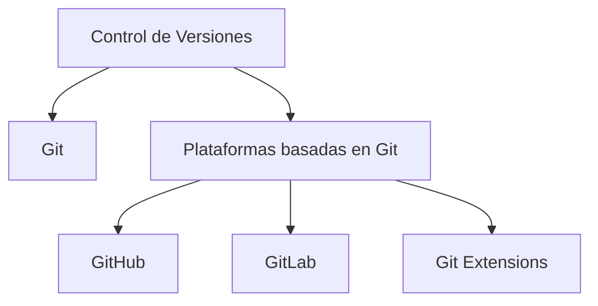

# Notas De Estudio

## Plataformas Para El Control De Versiones

---

## 1. Introducción Al Control De Versiones

### Definición

El **control de versiones** es una técnica que permite gestionar, rastrear y organizar los cambios realizados en los archivos de un proyecto (unidad de control: el fichero). Facilita conocer quién realizó un cambio, cuándo y qué modificó.

### Importancia

- Permite **mantener historial** del proyecto.
    
- Facilita **revertir cambios** incorrectos (rollback).
    
- Soporta **trabajo colaborativo** y simultáneo.
    
- Ayuda a establecer **trazabilidad** entre modificaciones y elementos del proyecto (por ejemplo, cambios asociados a corrección de un issue).

---

## 2. Control De Versiones En El CMMI for Development

### CMMI for Development

Modelo que establece prácticas y requisitos para asegurar calidad y madurez en procesos de desarrollo.

### Relación Con El Control De Versiones

El **área de proceso “Gestión de la Configuración”** establece prácticas como:

|Práctica CMMI|Descripción|
|---|---|
|Política de gestión de la configuración|Definir reglas, procedimientos y responsabilidades para gestionar cambios.|
|Control de cambios|Proceso documentado para evaluar, aprobar y registrar cambios en elementos de configuración.|
|Revisión/Auditorías de configuración|Evaluación periódica para asegurar cumplimiento de estándares y políticas.|

Estas prácticas garantizan que el producto evolucione de manera controlada y trazable.

---

## 3. Beneficios Del Control De Versiones

|Beneficio|Explicación|
|---|---|
|Historial completo|Acceso a todos los cambios realizados en el proyecto.|
|Rollback|Revertir modificaciones que generaron errores.|
|Trabajo colaborativo|Diferentes usuarios pueden trabajar en paralelo.|
|Integración|Combinar de forma eficiente aportaciones de varios desarrolladores.|
|Trazabilidad|Relacionar cambios con tareas, issues o requisitos específicos.|

---

## 4. Plataformas De Control De Versiones

### Vista General (Mermaid)

---

## 5. Git: Sistema De Control De Versiones Distribuido

### Definición

**Git** es un sistema distribuido que permite trabajar localmente y sincronizar cambios con un repositorio remoto. Permite crear ramas, fusionar cambios y mantener un historial completo.

### Características Clave

- Distribuido: cada usuario tiene copia completa del historial.
    
- Trabajo simultáneo en diferentes ramas.
    
- Fusión y resolución de conflictos eficiente.
    
- Popularidad por rendimiento, flexibilidad y extensions.

---

## 6. Git Extensions

Herramienta gráfica que permite ejecutar commandos Git desde una interfaz visual.  
Facilita tareas para usuarios sin experiencia en la terminal.

---

## 7. GitHub

### Definición

Plataforma colaborativa basada en la nube que utilize Git. Permite alojar repositorios, colaborar y gestionar proyectos de software.

### Funcionalidades

- Revisión de código.
    
- Gestión de incidencias (issues).
    
- Pull requests.
    
- Wikis.
    
- Herramientas de comunicación y seguimiento.

Es ampliamente utilizada en proyectos de código abierto. Fue adquirida por Microsoft en 2018.

---

## 8. GitLab

### Definición

Plataforma completa basada en Git para gestionar el ciclo de vida del software.

### Funcionalidades Clave

- Repositorios de código.
    
- Seguimiento de incidencias.
    
- Integración y entrega continua (CI/CD).
    
- Revisión de código.
    
- Planificación y documentación del proyecto.

### Diferencias Frente a GitHub

|Característica|GitHub|GitLab|
|---|---|---|
|Instalación local (on-premise)|Limitada|Sí, completamente soportada|
|CI/CD integrado|Menos integrado|Muy robusto y nativo|
|Enfoque|Colaboración y repositorios|Plataforma completa DevOps|

---

## 9. Comparación General De Herramientas

|Herramienta|Tipo|Ventajas Principales|
|---|---|---|
|Git|Sistema de control de versiones|Rapidez, distribución, uso local/remoto|
|Git Extensions|Interfaz gráfica|Facilidad de uso|
|GitHub|Plataforma colaborativa|Comunidad grande, herramientas de colaboración|
|GitLab|Plataforma DevOps|CI/CD robusto, despliegue on-premise|

---

## 10. Resumen De Puntos Clave

- El control de versiones es esencial para gestionar cambios en proyectos de software.
    
- CMMI define prácticas para asegurar que los cambios son controlados, revisados y trazables.
    
- Git es el sistema de control de versiones más utilizado actualmente.
    
- GitHub y GitLab son plataformas basadas en Git que facilitan la colaboración.
    
- GitLab destaca por su enfoque integral DevOps y posibilidad de set instalado localmente.

---

## MicroTest

1. El objetivo de controlar las versiones es:
    
    - **La respuesta:** c. Poder guardar una historia para revertir cambios.
        
    - **Justificación:** El control de versiones permite mantener un historial detallado de modificaciones, lo que facilita revertir cambios que generen errores o resultados no deseados.
        
2. Marca la respuesta incorrecta:
    
    - **La respuesta:** b. Con Git, se tiene una trazabilidad exhaustiva entre código, requisitos e incidencias.
        
    - **Justificación:** Git permite cierta trazabilidad, pero no de manera “exhaustiva” por sí solo; esta se logra mediante herramientas adicionales como GitHub o GitLab, no únicamente con Git.
        
3. GitLab es una plataforma integral de desarrollo de software basada en web que proporciona:
    
    - **La respuesta:** d. Todas las anteriores.
        
    - **Justificación:** GitLab incluye repositorios de código, seguimiento de problemas, pipelines CI/CD y herramientas de revisión de código, cubriendo todas las opciones mencionadas.