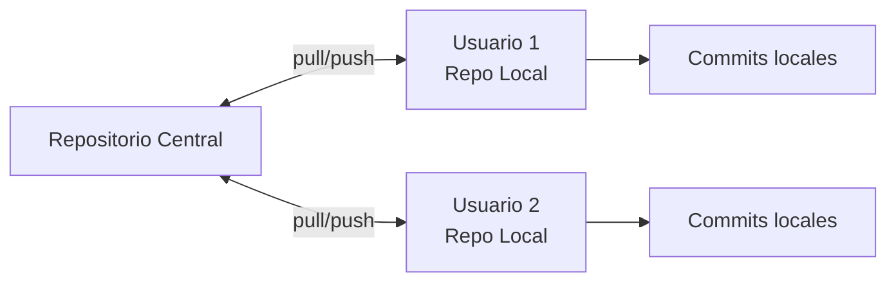
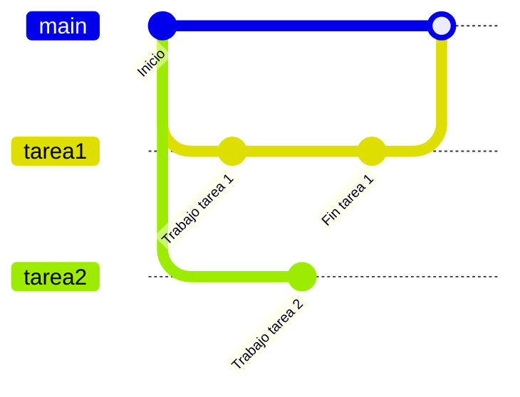
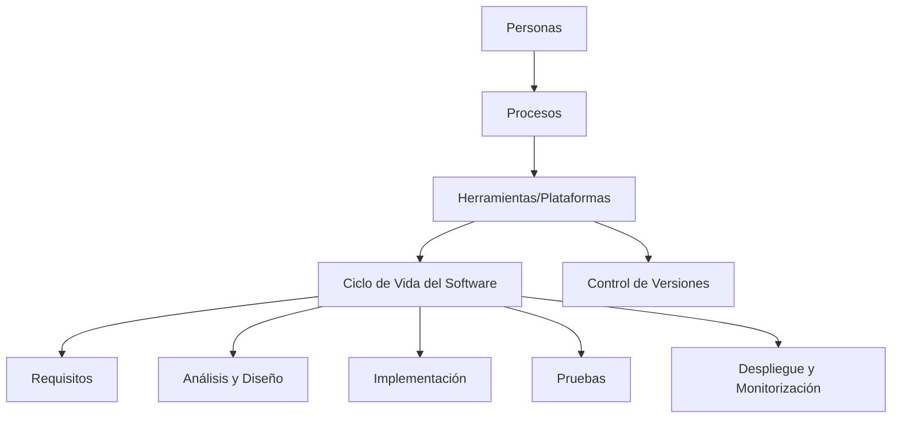

# Notas De Estudio

## Tema 1: Resumen General

## 1. Contexto Del Desarrollo De Software

### 1.1 Personas, Procesos Y Herramientas

- **Personas:** Conforman el equipo de desarrollo y cumplen roles especializados.
    
- **Procesos:** Métodos y formas de trabajo que definen cómo se realizan las actividades.
    
- **Herramientas (Plataformas):** Software que permite automatizar o facilitar los procesos definidos.

**Idea clave:** Los procesos deben definirse antes de elegir herramientas. Las herramientas deben adaptarse al proceso, no al revés.

### 1.2 Ejemplo: Gestión De Tareas

- Si un equipo ya tiene un tablero Kanban o Scrum con un flujo propio, una herramienta como Jira o Trello puede no coincidir exactamente.
    
- Definir primero el proceso evita depender de configuraciones rígidas o campos innecesarios.

---

## 2. Concepto De Plataforma

### 2.1 Definición

En este curso, **plataforma** se considera equivalente a “software tools” que apoyan todo el ciclo de vida del desarrollo de software.

### 2.2 Aplicación a Todo El Ciclo De Vida

|Etapa|Herramientas/Conceptos Asociados|
|---|---|
|Requisitos|Historias de usuario, mockups|
|Análisis y diseño|Application Lifecycle Management (ALM), herramientas CASE|
|Implementación|Low-code, herramientas para Java, .NET, servicios, móviles|
|Pruebas|Unitarias, integración, sistema, aceptación|
|Despliegue y monitorización|Arquitecturas dirigidas por eventos, sistemas distribuidos|

### 2.3 Independencia De Metodología

Estas herramientas funcionan tanto en metodologías tradicionales (waterfall) como ágiles (iteraciones).

---

## 3. Valor Y Utilidad De Las Plataformas

### 3.1 Objetivo Principal: Eficiencia

Eficiencia implica:

- Hacer el trabajo más rápido → menor time to market.
    
- Requerir menos recursos → menos esfuerzo o personal.
    
- Mejor calidad → menos errores en producción, menos deuda técnica, mantenimiento más sencillo.

### 3.2 Límites De Las Herramientas

- No reemplazan el pensamiento ni el diseño.
    
- No sustituyen la definición de procesos.
    
- Ayudan a automatizar, pero no deciden por el equipo.

---

## 4. Criterios De Selección De Herramientas

### 4.1 Criterios Comunes

- Coste.
    
- Capacidad de integración.
    
- Experiencia previa (reduce curva de aprendizaje).
    
- Alineamiento con el proceso definido.

### 4.2 Método De Selección

1. Definir criterios basados en necesidades reales.
    
2. Construir una tabla donde se comparen las herramientas.
    
3. Elegir la que mejor se adapter al proceso y al contexto del equipo.

### 4.3 Criterios Usados En la Asignatura

- Basados en el **ciclo de vida del software** en los primeros temas.
    
- Basados en **tecnologías específicas** en temas intermedios (low-code, Java, .NET, servicios, móvil).
    
- Regreso a pruebas, despliegue y monitorización para cerrar el ciclo.

---

## 5. Control De Versiones

### 5.1 Concepto

Permite saber **quién** cambió **qué** y **cuándo**, manteniendo un historial de modificaciones.  
No se usa para culpar, sino para:

- Realizar **rollback** cuando sea necesario.
    
- Integrar trabajo de forma ordenada.
    
- Paralelizar cambios en un proyecto.

### 5.2 Evolución

- Sistemas antiguos: CVS, Subversion.
    
- Sistemas actuales: casi todos basados en **Git**.

### 5.3 Funcionamiento De Git

#### 5.3.1 Flujo Básico

1. Existe un repositorio central.
    
2. Cada usuario hace un **clone** y obtiene un repositorio local.
    
3. El usuario modifica archivos en su copia local.
    
4. Cambios pasan a **stage** y luego se confirman con **commit**.
    
5. Para sincronizar, el usuario realiza un **push** hacia el repositorio central.
    
6. Otros usuarios realizan **pull** para traer cambios.

#### Diagrama Mermaid

### 5.4 Ramas En Git

Una **rama** permite trabajar en paralelo sin afectar la rama principal.

- La rama principal suele llamarse **master** o **main**.
    
- Se crean ramas para tareas, clientes o características.
    
- Al finalizar una tarea, se hace un **merge** hacia la rama principal si no hay conflictos.

#### Ejemplo En Mermaid

---

## 6. Relación Global Del Tema

---

## Resumen De Puntos Clave

- Personas, procesos y herramientas son los pilares del desarrollo; el proceso va primero.
    
- Una plataforma apoya el ciclo completo del desarrollo, no solo una fase.
    
- El valor principal: eficiencia, menor costo y mayor calidad.
    
- Los criterios de selección deben alinearse con el proceso y necesidades reales.
    
- Git es el sistema dominante de control de versiones; permite trabajo paralelo y seguimiento histórico.
    
- Las ramas permiten desarrollar características sin afectar la versión principal.
    
- Herramientas complementarias como GitHub, GitLab y Bitbucket integran incidencias y CI/CD.

---

## MicroTest

