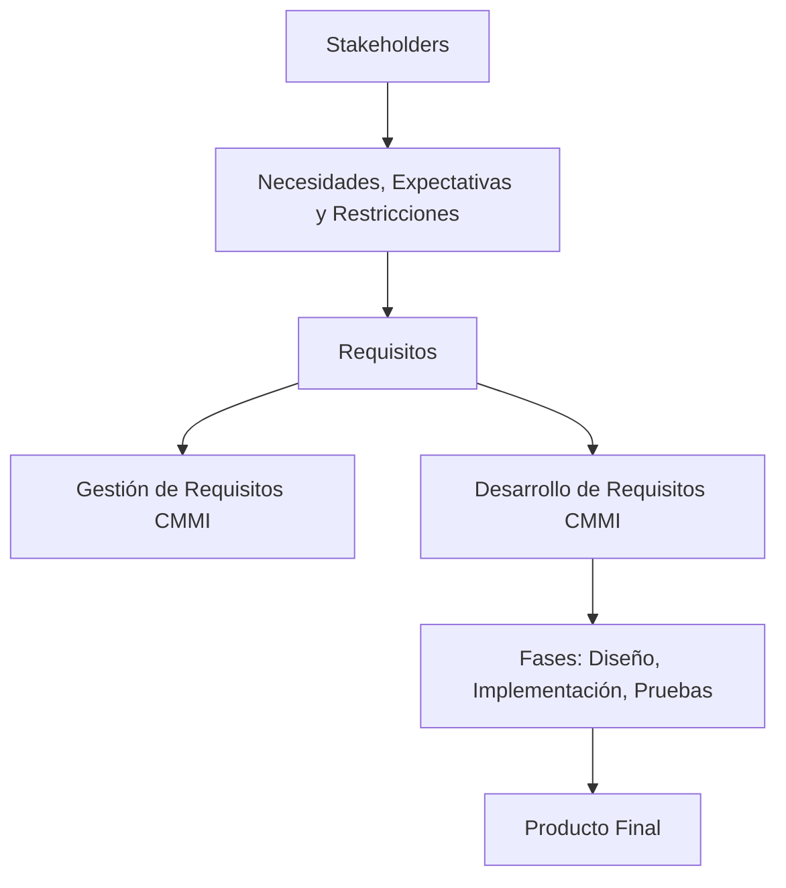

# Notas De Estudio

## Contexto De Las Plataformas De Requisitos

## 1. Introducción Al Contexto De Requisitos

Los requisitos constituyen la base del desarrollo de software. Comprenderlos permite orientar correctamente el diseño, la implementación, las pruebas y la evaluación final del producto.

### Objetivos Principales

- Identificar condiciones necesarias para comprender el desarrollo de software.
    
- Entender los conceptos asociados a los requisitos.
    
- Reconocer su importancia dentro del proceso de desarrollo.
    
- Determinar el alcance de su gestión y elaboración.

---

## 2. Definiciones De Requisitos

### 2.1 Definición Según IEEE

El IEEE define un **requisito de software** como:

1. **Una condición o capacidad esencial para que el usuario resuelva un problema o logre un objetivo.**
    
2. **Una condición o capacidad que un sistema o componente debe cumplir para ajustarse a un contrato, estándar o especificación.**
    
3. **Una representación documentada de alguno de los dos puntos anteriores.**

### 2.2 Limitaciones De Esta Definición

Aunque ampliamente usada, la definición no cubre completamente:

- Necesidades de los desarrolladores.
    
- Diferencias entre cliente y usuario.
    
- Restricciones que afectan al sistema.

---

## 3. Ampliación Del Concepto De Requisito

### 3.1 Definición Según Chimuturi

Un **requisito** es una **necesidad, expectativa, restricción o historia** definida por cualquiera de los actores involucrados (**stakeholders**) que el software debe satisfacer en algún punto de su desarrollo.

### 3.2 Relevancia De Los Requisitos

- Permiten **alinear perspectivas** entre todos los participantes del proyecto.
    
- Establecen **objetivos y expectativas comunes**.
    
- Constituyen la **base del diseño, implementación y pruebas**.
    
- Funcionan como **criterio para evaluar el éxito del proyecto**.

---

## 4. Importancia De Los Requisitos

### 4.1 Rol Estratégico

Los requisitos determinan **qué se debe construir** y guían todas las etapas posteriores.  
Un error en los requisitos se propaga a fases avanzadas donde es más costoso corregirlo.

### 4.2 Aporte De Fred Brooks

Fred Brooks, author de _The Mythical Man-Month_, destacó que:

- La tarea más desafiante del desarrollo de software es **definir correctamente qué construir**.
    
- Los desarrolladores deben **extraer y refinar iterativamente** los requisitos.
    
- Los clientes suelen carecer de una comprensión clara del problema.

---

## 5. Gestión Y Desarrollo De Requisitos En CMMI

El modelo **CMMI** divide el tratamiento de requisitos en dos áreas de proceso:  
**Gestión de Requisitos** y **Desarrollo de Requisitos**.

### 5.1 Gestión De Requisitos

Proceso orientado a:

- Identificar.
    
- Documentar.
    
- Verificar.
    
- Gestionar requisitos durante todo el ciclo de vida.

Objetivo: Garantizar que los requisitos sean **claros, verificables, comprensibles y alineados** con los objetivos del proyecto.

### 5.2 Desarrollo De Requisitos

Se enfoca en:

- Establecer y mantener los requisitos del producto o sistema.
    
- Identificación y análisis.
    
- Especificación.
    
- Validación.

Objetivo: Asegurar que los requisitos estén **bien definidos, sean verificables y estén alineados** con las metas del proyecto.

---

## 6. Representación Visual Del Rol De Los Requisitos

---

## 7. Tabla Resumen De Definiciones De Requisitos

|Fuente|Definición|Alcance|Limitaciones|
|---|---|---|---|
|IEEE|Condiciones o capacidades necesarias para usuarios o sistemas; documentación de estas.|Formal y contractual.|Poco énfasis en perspectivas múltiples o restricciones.|
|Chimuturi|Necesidad, expectativa, restricción o historia definida por stakeholders.|Amplio e inclusivo.|Require buena gestión para evitar ambigüedades.|

---

## Resumen De Puntos Clave

- Los requisitos definen **qué debe construirse** y son esenciales para el éxito del proyecto.
    
- El IEEE proporciona una definición formal, pero con limitaciones prácticas.
    
- Chimuturi amplía la definición para incluir necesidades y restricciones de todos los stakeholders.
    
- Los requisitos deben set **obtenidos, analizados, documentados y gestionados** durante todo el ciclo de vida.
    
- En CMMI se diferencian dos áreas: **gestión** y **desarrollo** de requisitos.
    
- La claridad y alineación de requisitos influye directamente en la calidad del producto final.

---

## MicroTest

1. Según Chemuturi, un requisito de software es:
    
    - **La respuesta:** a
        
    - **Justificación:** Chemuturi define un requisito como una necesidad, expectativa, restricción o interfaz establecida por _cualquier_ stakeholder, no solo el usuario, y que debe set satisfecha por el producto en algún memento del desarrollo.
        
2. Según Fred Brooks, la parte más difícil de construir un sistema de software es:
    
    - **La respuesta:** b
        
    - **Justificación:** Brooks afirma que lo más difícil es determinar correctamente **qué construir**, ya que los clientes suelen no tener claro lo que necesitan y los requisitos deben refinarse iterativamente.
        
3. En el modelo CMMI, en relación con los requisitos:
    
    - **La respuesta:** d
        
    - **Justificación:** El modelo CMMI incluye gestión de requisitos, desarrollo de requisitos y distingue ambas áreas; todas las opciones describen correctamente estos aspectos.