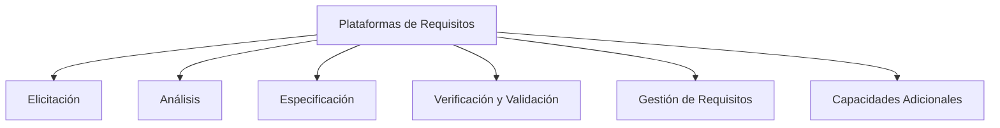

# **Notas De Estudio – Valor Y Utilidad De Las Plataformas De Requisitos**

## 1. Introducción

Las plataformas de requisitos ofrecen soporte para gestionar y documentar requisitos, pero **no reemplazan la labor intellectual** de extraer, formular, analizar y estructurar dichos requisitos. Su valor reside en ayudar a centralizar, organizar y mantener trazabilidad, no en realizar la ingeniería de requisitos por sí mismas.

---

## 2. Qué NO Hacen Las Plataformas De Requisitos

Aunque son herramientas muy útiles, **no realizan las actividades esenciales de ingeniería de requisitos**, tales como:

- Extraer los requisitos desde los stakeholders.
    
- Formular preguntas correctas o interpretar respuestas.
    
- Distinguir deseos, expectativas, necesidades y requisitos reales.
    
- Estructurar la información o definir prioridades.

### Importante

Estas tareas **dependen del equipo y de los procesos**, no de las herramientas.  
La ingeniería de requisitos es una disciplina centrada en **personas + métodos**, no en tecnología.

---

## 3. Qué SÍ Aportan Las Plataformas De Requisitos

### 3.1 Centralización De la Información

- Permiten almacenar todos los requisitos en un único lugar.
    
- Evitan la dispersión en múltiples documentos.

### 3.2 Facilitan la Colaboración

- Ofrecen acceso compartido a documentos.
    
- Mejoran la comunicación entre equipo y stakeholders.

### 3.3 Historial Y Control De Cambios

- Registro detallado de modificaciones, revisiones y actualizaciones.
    
- Facilitan auditorías y revisiones.

### 3.4 Generación De Documentación Formal

- Permiten exportar o producir documentos consistentes y claros.
    
- Facilitan la validación por parte de usuarios y equipos.

### 3.5 Alineación Con Estándares Y Normativas

- Ayudan a asegurar que los requisitos cumplen criterios de calidad.
    
- Apoyan la conformidad con prácticas de la industria.

### 3.6 Contribución Al Éxito Del Proyecto

Las herramientas apoyan en:

- Calidad
    
- Eficiencia
    
- Organización estructurada del proceso de requisitos

---

## 4. Criterios Para Seleccionar Una Plataforma De Requisitos

Según la norma **ISO/IEC/IEEE TR 24766**, la evaluación puede realizarse en **6 categorías clave**.

### Tabla – Categorías De Evaluación De Plataformas De Requisitos

|Categoría|Descripción|
|---|---|
|**Obtención (Elicitación)**|Capacidad para capturar necesidades de stakeholders y comprender objetivos del negocio.|
|**Análisis**|Soporte para descomposición, estructuración y evaluación de viabilidad y riesgos.|
|**Especificación**|Ayuda para documentar requisitos con claridad, coherencia y verificabilidad.|
|**Verificación y validación**|Mecanismos para asegurar conformidad con requisitos definidos y prevenir malentendidos.|
|**Gestión de requisitos**|Control de cambios, mantenimiento de integridad y gestión del ciclo de vida.|
|**Otras capacidades**|Trazabilidad avanzada, integración con otras herramientas y soporte a la colaboración.|

---

## 5. Detalle De Los Criterios Esenciales

### 5.1 Obtención (Elicitación)

Proceso clave que involucra a todos los stakeholders.  
Objetivo: rastrear necesidades reales del negocio y alinear expectativas.

### 5.2 Análisis

Utilize técnicas como **Work Breakdown Structure (WBS)**.  
Permite:

- Identificar components
    
- Analizar requisitos funcionales y no funcionales
    
- Evaluar viabilidad y riesgos

### 5.3 Especificación

Busca:

- Claridad
    
- Coherencia
    
- Comprensibilidad  
    Requisitos documentados de forma verificable.

### 5.4 Verificación Y Validación

Procesos complementarios:

- **Verificación:** “¿Estamos construyendo el producto correctamente?”
    
- **Validación:** “¿Estamos construyendo el producto adecuado?”

Evitan confusiones en fases posteriores.

### 5.5 Gestión De Requisitos

Controla el cambio durante todo el ciclo de vida.  
Incluye:

- Procedimientos automatizados para evaluar/aprobar cambios
    
- Documentación del impacto de las modificaciones

### 5.6 Capacidades Adicionales

- Matrices de trazabilidad automáticas
    
- Integración con herramientas de diseño, pruebas o gestión
    
- Mejora del trabajo colaborativo

---

## 6. Relación Entre Categorías (Diagrama Mermaid)

---

## **Resumen De Los Puntos clave**

- Las plataformas de requisitos **no realizan la ingeniería de requisitos**, solo la apoyan.
    
- Aportan valor mediante **centralización, colaboración, trazabilidad y documentación**.
    
- No sustituyen la interpretación, análisis y definición realizados por las personas.
    
- Los criterios de selección incluyen **elicitación, análisis, especificación, verificación, validación y gestión**.
    
- Son esenciales para mantener orden, control y calidad en el ciclo de vida del software.

---

## **MicroTest**

1. **Marca la respuesta incorrecta:**
    
    - **La respuesta:** b
        
    - **Justificación:** Las plataformas de requisitos _no obtienen_ los requisitos ni independizan al equipo; solo los gestionan. La obtención y estructuración de requisitos sigue siendo responsabilidad humana.
        
2. **En relación con las plataformas de requisitos, marca la respuesta incorrecta:**
    
    - **La respuesta:** c
        
    - **Justificación:** Las plataformas no obtienen requisitos automáticamente mediante formularios llenados por el cliente; solo ayudan a documentar, organizar y gestionar los requisitos ingresados por el equipo.
        
3. **La norma ISO/IEC TR 24766:2009 proporciona una guía para evaluar las capacidades de herramientas de ingeniería de requisitos en seis categorías clave, entre las que no está:**
    
    - **La respuesta:** D. La ingeniería de requisitos.
        
    - **Justificación:** La obtención (elicitación) de requisitos no forma parte de las capacidades evaluadas por la norma, ya que las herramientas no realizan la elicitación; esta es una actividad humana.