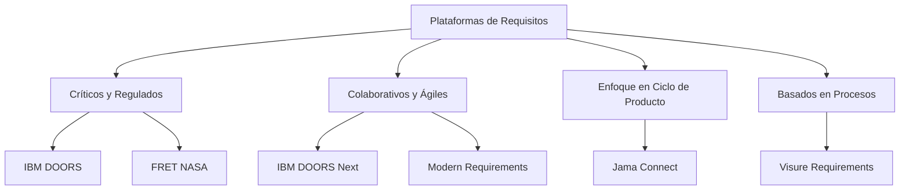

# Nota De Estudio: Principales Plataformas De Requisitos

---

# 1. Comparativas Y Evaluaciones De Herramientas De Requisitos

## 1.1 Evaluación De Carrillo Y DGEA (2021)

- Se evaluaron **13 herramientas** seleccionadas entre **más de 200 disponibles** en el mercado.
    
- El análisis se representó mediante un **cuadrante**, considerando:
    
    - Nivel tecnológico y precio.
        
    - Nivel de funcionalidad.

**Distribución en el cuadrante:**

- **Cuadrante superior derecho:** herramientas más potentes → _IBM DOORS_.
    
- **Cuadrante inferior izquierdo:** menor funcionalidad → _Microsoft Office_ u otras herramientas ofimáticas.
    
- **Regiones intermedias:**
    
    - Herramientas de gestión de tareas con capacidad de registrar requisitos: _Asana, Jira_.
        
    - Herramientas más orientadas a ingeniería de software: _Enterprise Architect_, con soporte para requisitos.

## 1.2 Importancia Del “suficientemente bueno”

- Determinar qué herramienta es adecuada depende de:
    
    - La **metodología de requisitos** de la organización.
        
    - Las **necesidades específicas** del negocio.
        
    - El proceso debe guiar la elección de la herramienta, no al revés.

---

# 2. Estudio De Sey Level

## 2.1 Alcance Del Estudio

- Consideró **150 herramientas**.
    
- Analizó **más de 200 criterios**.

## 2.2 Diez Características Clave De Análisis

Algunas de las capacidades evaluadas:

- Priorización de requisitos.
    
- Trazabilidad y dependencias.
    
- Revisión y colaboración.
    
- Control de cambios.
    
- Modelado visual.

## 2.3 Uso Del Mapa De Calor

- Permite comparar la herramienta usada por una empresa con las **21 evaluadas en detalle**.
    
- Ayuda a determinar:
    
    - Si la herramienta actual es adecuada.
        
    - O si es necesario adoptar una nueva.

---

# 3. Principales Plataformas De Requisitos

## 3.1 IBM DOORS Y DOORS Next

### IBM DOORS

- Enfocada en proyectos complejos y críticos.
    
- Características principales:
    
    - Módulos estructurados.
        
    - Importación y exportación de datos.
        
    - Firmas electrónicas.
        
    - Trazabilidad completa.
        
    - API programmable (_DOORS Extension Language – DXL_).
        
- Uso típico:
    
    - Automoción, aeronáutica, ferrocarril, maquinaria.
        
    - Proyectos donde un error resulta crítico o costoso.

### IBM DOORS Next

- Plataforma web colaborativa.
    
- Capacidades visuals, planificación e integración con pruebas.
    
- Se puede usar en conjunto con DOORS “clásico”.

## 3.2 Jama Connect

- Plataforma integral para desarrollo de productos.
    
- Facilita la conexión entre:
    
    - Requisitos.
        
    - Pruebas.
        
    - Gestión de riesgos.
        
- Funcionalidades:
    
    - Gestión del ciclo de desarrollo.
        
    - Soporte a metodologías variadas.
        
    - Interfaz intuitiva.
        
    - Integración con Jira, Crowley, GitHub.
        
    - Alta trazabilidad entre actividades.

## 3.3 Modern Requirements for DevOps

- Integrado en **Azure DevOps**.
    
- Muy bien valorado por analistas.
    
- Capacidades incluidas:
    
    - Documentación de requisitos.
        
    - Casos de uso.
        
    - Revisiones en línea.
        
    - Trazabilidad extremo a extremo.
        
    - Módulos “Smart”:
        
        - Análisis de trazas.
            
        - Gestión de revisiones.
            
    - Módulo de IA llamado **Alice**.
        
    - Modelado con diagrams y simulaciones.
        
- Enfoque: acelerar proyectos y asegurar calidad.

## 3.4 Visure Requirements

- Enfoque basado en procesos.
    
- Plataforma centralizada para:
    
    - Pruebas de aceptación.
        
    - Colaboración.
        
    - Gestión del ciclo de vida de requisitos.
        
- Características:
    
    - Multiusuario.
        
    - Alta personalización.
        
    - Reutilización de requisitos.
        
    - Integraciones y referencias actualizables.

## 3.5 FRET (NASA)

- Orientado a entornos críticos del sector aeronáutico.
    
- Permite:
    
    - Especificar y formalizar requisitos.
        
    - Analizar requisitos mediante:
        
        - Lenguaje natural especializado.
            
        - Representaciones matemáticas.
            
        - Diagrams.
            
- Maneja requisitos jerárquicos y exportables.
    
- Útil cuando los requisitos pueden cuantificarse para análisis de cumplimiento previo al diseño.

---

# 4. Tabla Comparativa De Plataforma Y Enfoque

|Plataforma|Enfoque|Tipo de Proyecto|Fortalezas principales|
|---|---|---|---|
|IBM DOORS|Requisitos críticos|Sistemas complejos|Trazabilidad, módulos, API, madurez|
|IBM DOORS Next|Colaboración web|Equipos distribuidos|Visualización, planificación, integración|
|Jama Connect|Desarrollo de productos|Proyectos iterativos|Riesgos, pruebas, trazabilidad|
|Modern Requirements (DevOps)|Integración con Azure|DevOps / CI-CD|Diagrams, IA, revisiones|
|Visure Requirements|Procesos formales|Ingeniería regulada|Personalización, ciclo completo|
|FRET|Sector aeronáutico|Requisitos críticos formales|Formalización, análisis previo|

---

# 5. Diagrama De Relación Entre Plataformas Y Uso

---

# Resumen De Puntos Clave

- Existen numerosas herramientas de requisitos; su elección depende de la metodología de la organización.
    
- Estudios comparativos ayudan a identificar fortalezas y debilidades basadas en criterios técnicos, funcionales y metodológicos.
    
- IBM DOORS lidera en entornos críticos, mientras que herramientas como Jama, Visure o Modern Requirements destacan por su enfoque colaborativo o de proceso.
    
- FRET representa una herramienta especializada en requisitos formales para el sector aeronáutico.
    
- Las capacidades clave incluyen trazabilidad, colaboración, priorización, revisión y modelado visual.

---

# MicroTest

1. Según el estudio realizado por Carrillo de Gea y colaboradores, la herramienta con mayor funcionalidad y precio en su estudio comparativo es:
    
    - **La respuesta:** d. IBM Doors
        
    - **Justificación:** En el estudio comparativo, IBM DOORS aparece situada en el cuadrante superior derecho, lo que indica que es la herramienta con mayor nivel de funcionalidad y precio frente a las demás evaluadas.
        
2. La solución de gestión de requisitos mejor valorada por los analistas, en general, es:
    
    - **La respuesta:** a. Modern Requirements4DevOps
        
    - **Justificación:** El transcript indica que Modern Requirements for DevOps es una solución muy bien valorada por los analistas y está integrada en Azure DevOps, destacándose por sus capacidades avanzadas.
        
3. La NASA dispone de un marco para la obtención, especificación, formalización y comprensión de requisitos para el sector aeronáutico, conocido como:
    
    - **La respuesta:** c. FRET: Formal Requirements Elicitation Tool
        
    - **Justificación:** El transcript menciona explícitamente que FRET es la herramienta propuesta por la NASA para gestión formal de requisitos en entornos aeronáuticos.