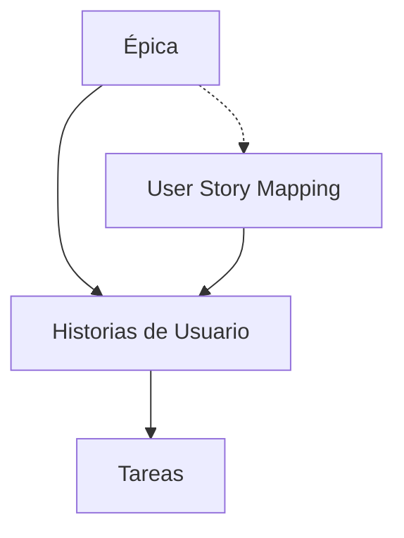

# Plataformas Para Historias De Usuario Y Prototipos De Interfaz Gráfica

**Notas de estudio**

---

## 1. Introducción a Las Plataformas Basadas En Historias De Usuario Y Prototipos

Las plataformas de historias de usuario y prototipos son herramientas clave dentro de la ingeniería de requisitos. Su objetivo es **facilitar la comprensión, el análisis y la validación de funcionalidades** antes del desarrollo, apoyándose en representaciones visuals y descripciones centradas en el usuario.

Estas plataformas permiten:

- Obtener requisitos de forma más clara mediante visualizaciones (mockups, wireframes).
    
- Facilitar la comunicación entre equipos: clientes, diseñadores, desarrolladores y stakeholders.
    
- Identificar problemas temprano, reduciendo costos y retrabajo.

---

## 2. Historias De Usuario

### 2.1 Definición

Una **historia de usuario (User Story)** es una descripción informal de una funcionalidad de software **desde la perspectiva del usuario final** y centrada en el valor que aporta. Es fundamental en metodologías ágiles como **Scrum** o **Kanban**.

### 2.2 Estructura Típica

Suele expresarse como:  
_“Como [tipo de usuario], quiero [funcionalidad], para [beneficio].”_

### 2.3 Jerarquía De Historias

Las historias suelen organizarse en los siguientes niveles:

|Nivel|Descripción|
|---|---|
|**Épica**|Gran funcionalidad o necesidad general.|
|**Historia de usuario**|Funcionalidad concreta para un usuario.|
|**Tareas / Subtareas**|Trabajo técnico necesario para implementar la historia.|

### 2.4 User Story Mapping

El **User Story Mapping** es una técnica visual para organizar funcionalidades y releases.

#### Características

- Descubre features del producto.
    
- Ofrece una visión global compartida.
    
- Organiza historias por versiones (releases).
    
- Muy útil para Product Owners.

### Diagrama De Relación (Mermaid)

---

## 3. Plataformas Basadas En Historias De Usuario

A continuación se presentan varias herramientas utilizadas para gestionar historias de usuario y su planificación:

### Tabla Comparativa General

| Plataforma                      | Enfoque principal             | Características destacadas                                               |
| ------------------------------- | ----------------------------- | ------------------------------------------------------------------------ |
| **Jira + Agile User Story Map** | Gestión de tareas y proyectos | Extensión para story maps, priorización visual, colaboración.            |
| **CardBoard**                   | Story mapping visual          | Colaboración, planificación ágil, interfaz intuitiva.                    |
| **StoriesOnBoard**              | User Story Mapping            | Visión del producto, descomposición de historias, soporte para releases. |
| **Avion**                       | Product planning              | Roadmaps basados en historias, priorización y estructura clara.          |

---

## 4. Plataformas Para Prototipado Y Diseño De Interfaz Gráfica

Los prototipos son esenciales para adquirir requisitos mediante representaciones visuals que ayudan a anticipar problemas antes del desarrollo.

### 4.1 Balsamiq

- Prototipado rápido (low-fidelity).
    
- Aspecto deliberadamente simple: dirige la conversación al **funcional** y no al diseño final.
    
- Ideal para sesiones iniciales de conceptualización.

### 4.2 Sketch

- Herramienta de diseño vectorial.
    
- Orientada a UI avanzada y prototipos interactivos.
    
- Permite colaboración y exportación para desarrolladores.

### 4.3 Figma

- Plataforma colaborativa en la nube.
    
- Edición en tiempo real por múltiples usuarios.
    
- Permite diseño, prototipado y comentarios en un único espacio.

### 4.4 UX/UI Tools: Uizard

- Creación rápida de interfaces mediante plantillas intuitivas.
    
- Permite generar prototipos visuals y components reutilizables.

---

## 5. Por Qué Los Prototipos Son Útiles Para Requisitos

Los **mockups y wireframes** permiten:

- Visualizar el funcionamiento del sistema antes de desarrollarlo.
    
- Alinear expectativas entre stakeholders.
    
- Evitar cambios costosos en fases tardías.
    
- Complementar y reforzar historias de usuario con representaciones gráficas.

---

## Resumen De Puntos Clave

- Las historias de usuario describen funcionalidades desde la perspectiva del usuario y aportan valor al negocio.
    
- El User Story Mapping organiza visualmente funcionalidades, prioridades y releases.
    
- Herramientas como Jira, CardBoard, StoriesOnBoard y Avion facilitan la gestión ágil de requisitos.
    
- Prototipos y mockups (Balsamiq, Figma, Sketch) permiten visualizar requisitos, mejorar la comprensión y reducir errores.
    
- Las plataformas de prototipos no solo sirven para diseño, sino también para **obtener y validar requisitos**.

---

## MicroTest

1. Marca qué plataforma no está orientada a gestionar requisitos usando historias de usuario
    
    - **La respuesta:** b. Figma
        
    - **Justificación:** Figma es una herramienta de diseño y prototipado de interfaces, no una plataforma para la gestión de requisitos mediante historias de usuario. Avion, Cardboard y StoriesOnBoard sí están orientadas a story mapping y gestión ágil de historias.
        
2. ¿Qué afirmación describe mejor el concepto de user story mapping?
    
    - **La respuesta:** c. Es una técnica de descubrimiento de productos que ayuda a esbozar nuevas características desde la perspectiva del usuario final.
        
    - **Justificación:** El user story mapping organiza funcionalidades desde la perspectiva del usuario, permitiendo visualizar el producto, priorizar y planificar versiones. No tiene relación con bases de datos, construcción o análisis financiero.
        
3. Marca qué plataformas están orientadas a realizar prototipos de interfaz de usuario
    
    - **La respuesta:** d. Todas las anteriores.
        
    - **Justificación:** Balsamiq, MockFlow y UIZard son herramientas enfocadas en prototipado, wireframes y diseño visual, por lo que todas corresponden correctamente a plataformas de prototipado de interfaz.

## Story Mapping

<iframe title="¿Cómo hacer un User Story Mapping?" src="https://www.youtube.com/embed/XnqvAWM4S1o?start=2&amp;feature=oembed" height="113" width="200" allowfullscreen="" allow="fullscreen" style="aspect-ratio: 1.76991 / 1; width: 100%; height: 100%;"></iframe>