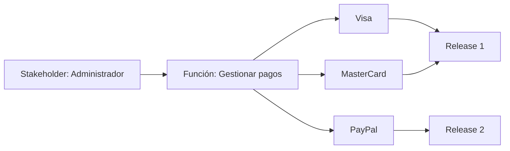
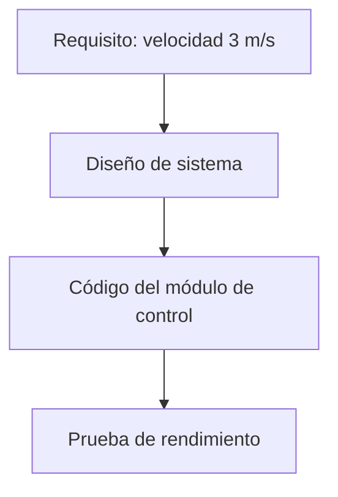

# **Notas De Estudio – Resumen Del Tema 2**

## 1. Contexto De Las Plataformas De Gestión De Requisitos

### 1.1. Importancia De Los Requisitos En El Ciclo De Vida Del Software

Los requisitos definen **qué debe construirse**, no _cómo_. Constituyen la base del desarrollo, del diseño y de la validación.

- Son una representación documentada de la necesidad del cliente.
    
- Deben incluir **criterios de validación**, especialmente en requisitos no funcionales (rendimiento, seguridad, escalabilidad, usabilidad).
    
- Permiten establecer acuerdos y expectativas entre cliente, diseño, desarrollo, QA y dirección.

**Cita clave de Frederick Brooks:**  
La tarea más difícil en ingeniería del software es determinar exactamente _qué_ construir.

### 1.2. Problema Común

Los clientes no suelen saber expresar sus necesidades en lenguaje técnico.  
El equipo debe:

- Hacer las preguntas adecuadas.
    
- Interpretar correctamente las respuestas.
    
- Diferenciar necesidades, deseos y restricciones.

---

## 2. Requisitos: Definición, Validación Y Perspectivas

### 2.1. Tipos De Representación De Requisitos

|Tipo|Perspectiva|Característica|Ejemplo|
|---|---|---|---|
|Textuales|Sistema|Describen lo que debe hacer el sistema|“El sistema enviará un email al registrarse”|
|Casos de uso|Actor/Usuario|Interacción usuario–sistema|“El usuario inicia sesión ingresando sus credenciales”|
|Historias de usuario|Valor/Producto|Qué aporta al usuario|“Como cliente, quiero pagar con tarjeta para finalizar mi compra”|
|User Story Mapping|Producto/Release|Organización por flujos y versiones|Flujo de pagos dividido en Visa, MasterCard, PayPal|

### 2.2. Importancia De Los Criterios De Validación

Un requisito debe set **verificable**:

- Incorrecto: “El sistema será rápido.”
    
- Correcto: “100 usuarios concurrentes podrán iniciar sesión en menos de 5 segundos.”

Validar permite asegurar aceptación, calidad y alineación con objetivos.

---

## 3. Gestión Vs Desarrollo De Requisitos

### 3.1. Gestión De Requisitos

Incluye:

- Identificar
    
- Documentar
    
- Verificar
    
- Gestionar

Objetivo: que los requisitos sean **comprensibles**, verificables y alineados.

### 3.2. Desarrollo De Requisitos

Incluye:

- Identificar
    
- Analizar
    
- Especificar
    
- Valorar

Objetivo: establecer requisitos claros y útiles para planificar el desarrollo.

### 3.3. Modelo De Madurez

El área de requisitos se divide en dos procesos independientes pero relacionados:

- **Gestión de requisitos**
    
- **Desarrollo de requisitos**

---

## 4. User Stories Y User Story Mapping

### 4.1. Historias De Usuario

Formato típico:

- Como _tipo de usuario_
    
- Quiero _funcionalidad_
    
- Para _beneficio o valor_

Enfocadas en **qué** valor recibe el usuario.

### 4.2. User Story Mapping

Técnica de Design Thinking para:

- Organizar funcionalidades por flujos.
    
- Dividir el producto en releases.
    
- Compartir una visión global del producto.

Ejemplo gráfico simplificado:

---

## 5. Wireframes Y Mockups Como Herramientas Para Requisitos

### 5.1. Uso De Prototipos En Requisitos

Aunque su uso principal es UI/UX, ayudan a:

- Visualizar ideas.
    
- Facilitar comunicación con el usuario.
    
- Aclarar flujos y detectar necesidades.

### 5.2. Tipos

|Tipo|Propósito|Ejemplo|
|---|---|---|
|Wireframe|Boceto básico, conceptual|Balsamiq|
|Mockup|Diseño más realista|Figma, Sketch|

**Nota:** Balsamiq favorece conversaciones funcionales al no enfocarse en detalles visuals.

---

## 6. Valor Y Utilidad De Las Plataformas De Requisitos

### 6.1. No Sustituyen Al Análisis

Las herramientas ayudan a:

- Documentar
    
- Descomponer
    
- Gestionar
    
- Validar  
    Pero **no hacen la elicitación**: el equipo debe extraer la información del cliente.

### 6.2. Áreas De Valor

- Estructuración de requisitos
    
- Colaboración
    
- Exportación a múltiples formatos
    
- Automatización de estados y flujos
    
- Visualización del advance
    
- Trazabilidad

---

## 7. Trazabilidad De Requisitos

### 7.1. ¿Qué Es la Trazabilidad?

Conectar requisitos con decisiones, diseño, código y pruebas.

### 7.2. ¿Para Qué Sirve?

- Evaluar impacto de cambios
    
- Asegurar cumplimiento normativo en sectores críticos
    
- Facilitar mantenimiento
    
- Relacionar pruebas con requisitos

Ejemplo simplificado:

---

## 8. Plataformas De Gestión De Requisitos

### 8.1. Plataformas Más Destacadas

|Plataforma|Características|
|---|---|
|IBM DOORS|Muy utilizada en sectores críticos, altamente trazable, robusta pero costosa|
|Modern Requirements4DevOps|De las más valoradas por analistas|
|FRET (NASA)|Enfocada en entornos aeronáuticos|

### 8.2. Exportación Y Funciones Comunes

- Árbol de requisitos
    
- Fichas con atributos
    
- Colaboración
    
- Exportación a PDF, Word, etc.
    
- Gestión del cambio
    
- Integración con herramientas del ciclo de vida

---

## 9. Plataformas Para User Story Mapping

Herramientas orientadas a épicas y funcionalidades, con interacción de arrastrar y soltar:

- Avion
    
- StoriesOnBoard
    
- FeatureMap (descontinuada en 2024)
    
- Jira / Trello (requieren extensions para story mapping)

Diferencia importante:

- **Story mapping** = Perspectiva del producto
    
- **Tableros de tareas (kanban)** = Perspectiva del trabajo técnico

---

## 10. Plataformas De Wireframes Y UI Prototyping

### 10.1. Herramientas Mencionadas

|Herramienta|Enfoque|
|---|---|
|Balsamiq|Wireframes de baja fidelidad|
|Figma|Diseño interactivo colaborativo|
|Sketch|Diseño vectorial avanzado|

---

# **Resumen De Puntos Clave**

- Los requisitos son fundamentales: determinan **qué** construir.
    
- Deben incluir criterios de validación claros y verificables.
    
- Distintas perspectivas: texto, casos de uso, historias de usuario, story mapping.
    
- Story mapping organiza el producto por flujos y releases.
    
- Wireframes y mockups ayudan a clarificar requisitos con el usuario.
    
- Las herramientas no sustituyen el análisis: solo estructuran y documentan.
    
- La trazabilidad es crucial para gestionar cambios e impacto.
    
- Plataformas destacadas: IBM DOORS, Modern Requirements4DevOps, FRET.
    
- Story mapping y tableros de tareas NO son lo mismo.

---

## **MicroTest**