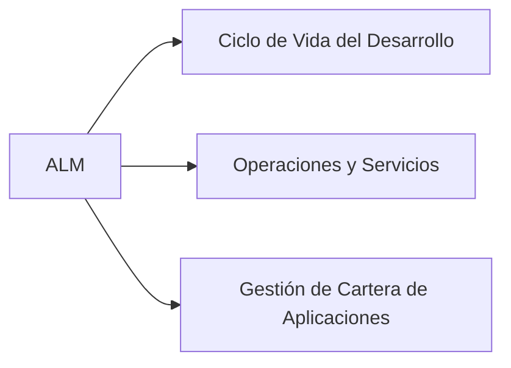
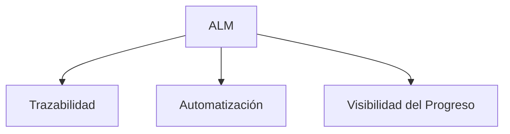

# Notas De Estudio: Plataformas De Ingeniería De Software, ALM Y Herramientas CASE

---

## 1. Contexto General De Las Plataformas De Ingeniería De Software

### Definición

Las **plataformas que respaldan actividades de ingeniería de software** son sistemas que apoyan todas las fases del ciclo de vida del desarrollo, desde la concepción hasta la retirada del software.

### Relevancia

Permiten integrar, coordinar y automatizar distintos procesos para lograr:

- Desarrollo más rápido.
    
- Mejor calidad.
    
- Reducción de errores.
    
- Gestión unificada del ciclo de vida.

---

## 2. Application Lifecycle Management (ALM)

### Definición

**Application Lifecycle Management (ALM)** es la gestión integral de todo el ciclo de vida de las aplicaciones: concepción, desarrollo, pruebas, despliegue, mantenimiento y retirada.

### Objetivo

Proveer una visión holística que permita controlar y coordinar todos los aspectos del desarrollo y mantenimiento de software.

### Comparación Con SDLC

|Concepto|Definición|Alcance|
|---|---|---|
|**SDLC (Software Development Life Cycle)**|Conjunto de procesos y etapas para crear o modificar software.|Se centra en desarrollo y entrega.|
|**ALM**|Gestión integral desde idea hasta retiro del software.|Incluye SDLC + operación + soporte + gestión de cartera.|

**Relación:**  
SDLC es un **subconjunto** de ALM.

---

## 3. Perspectivas Del ALM

ALM se analiza desde **tres perspectivas**, cada una atendida por distintos roles y prioridades.

### 3.1 Perspectiva Del Ciclo De Vida Del Desarrollo

- Enfocada en proyectos o productos en construcción o mantenimiento.
    
- Incluye análisis, diseño, codificación, pruebas y evolución.

### 3.2 Perspectiva De Administración De Servicios U Operaciones

- Enfocada en software ya desplegado en producción.
    
- Incluye soporte técnico, monitoreo, gestión de incidencias e infraestructura.

### 3.3 Perspectiva De Gestión De la Cartera De Aplicaciones (APM)

- Incluye productos futuros o en evaluación.
    
- Atiende ideas, análisis de viabilidad y planificación estratégica.

### Visión Integrada

Tener estas tres perspectivas unificadas permite:

- Priorizar correctamente.
    
- Evaluar el estado real de todos los activos de software.
    
- Mantener coherencia entre nuevas iniciativas, desarrollo actual y operación.

#### Diagrama ALM — Perspectivas

---

## 4. Pilares Fundamentales Del ALM

### 4.1 Trazabilidad

**Definición:** Capacidad de seguir requisitos, cambios y artefactos desde su origen hasta su implementación.

**Importancia:**

- Identificar impacto de cambios.
    
- Rastrear errores hasta su origen.
    
- Cumplimiento normativo.

Ejemplos de preguntas que responde:

- ¿Cuánto costará modificar esta funcionalidad?
    
- ¿Qué módulos dependen de este requerimiento?

### 4.2 Automatización De Procesos De Alto Nivel

**Definición:** Uso de herramientas para automatizar tareas dentro del ciclo de vida.

**Beneficios:**

- Reduce errores.
    
- Aumenta eficiencia.
    
- Estandariza la ejecución de procesos.

Permite medir en qué etapas conviene automatizar.

### 4.3 Visibilidad Del Progreso

**Definición:** Capacidad de monitorear el estado real del proyecto.

**Importancia:**

- Permite identificar si se construyen nuevas funcionalidades o se corrige deuda técnica.
    
- Facilita la toma de decisiones gerenciales.

Ejemplo:  
Saber si el equipo está dedicando 60% del tiempo a correcciones puede indicar acumulación de deuda técnica.

#### Diagrama De Pilares Del ALM

---

## 5. Herramientas CASE (Computer-Aided Software Engineering)

### Definición

Las **herramientas CASE** son aplicaciones que apoyan actividades de análisis, diseño, documentación y otras fases del desarrollo mediante técnicas asistidas por computadora.

### Usos Principales

- Análisis de requerimientos.
    
- Diseño de arquitectura.
    
- Modelado de bases de datos.
    
- Elaboración de documentación.
    
- Generación de diagrams.

### Usuarios Típicos

- Analistas.
    
- Ingenieros de software.
    
- Líderes técnicos.
    
- Gerentes.

### Beneficios

|Beneficio|Descripción|
|---|---|
|Estandarización|Reduce ambigüedades en análisis y diseño.|
|Automatización|Genera artefactos automáticamente.|
|Mejora de calidad|Detecta errores tempranos.|

---

## 6. Relación Entre ALM Y CASE

Aunque ambos apoyan el ciclo de vida del software:

- **ALM** gestiona el ciclo completo.
    
- **CASE** se enfoca en análisis y diseño asistidos.

---

## 7. Información Adicional Relevante

- Integrar ALM con CASE potencia eficiencia y evita duplicidades.
    
- Las organizaciones maduras utilizan ALM para una visión global y CASE para trabajo técnico especializado.
    
- Una buena trazabilidad dentro del ALM se potencia con modelos creados en herramientas CASE.

---

## Resumen De Puntos Clave

- ALM abarca todo el ciclo de vida del software; SDLC es solo una parte del mismo.
    
- ALM se compone de tres perspectivas: desarrollo, operaciones y cartera.
    
- Sus pilares son trazabilidad, automatización y visibilidad del progreso.
    
- Las herramientas CASE apoyan sobre todo análisis, diseño y documentación.
    
- ALM y CASE no compiten: se complementan para mejorar calidad y eficiencia.

---

## MicroTest

1. ¿Cuál de las siguientes afirmaciones describe con precisión el concepto de application lifecycle management (ALM)?
    
    - **La respuesta:** c
        
    - **Justificación:** ALM gestiona de manera integral todo el ciclo de vida de una aplicación, desde su concepción hasta su implementación y retiro, incluyendo trazabilidad, automatización y visibilidad del progreso. Las demás opciones reducen o distorsionan su alcance.
        
2. ¿Cuál de las siguientes afirmaciones describe adecuadamente el software development life cycle (SDLC) y su diferencia con el application lifecycle management (ALM)?
    
    - **La respuesta:** b
        
    - **Justificación:** SDLC se enfoca en las fases de desarrollo y entrega del software, mientras que ALM abarca el ciclo completo: concepción, desarrollo, operación, soporte y retirada. No son sinónimos ni metodologías contrapuestas.
        
3. ¿Cuál de los siguientes pilares fundamentales de application lifecycle management (ALM) se centra en rastrear los requisitos hasta el código entregado y garantizar la conexión entre diferentes partes del software?
    
    - **La respuesta:** b
        
    - **Justificación:** La trazabilidad permite seguir cada requisito desde su origen hasta su implementación final, asegurando coherencia y control del impacto de cambios. Las otras opciones corresponden a distintos pilares u objetivos.