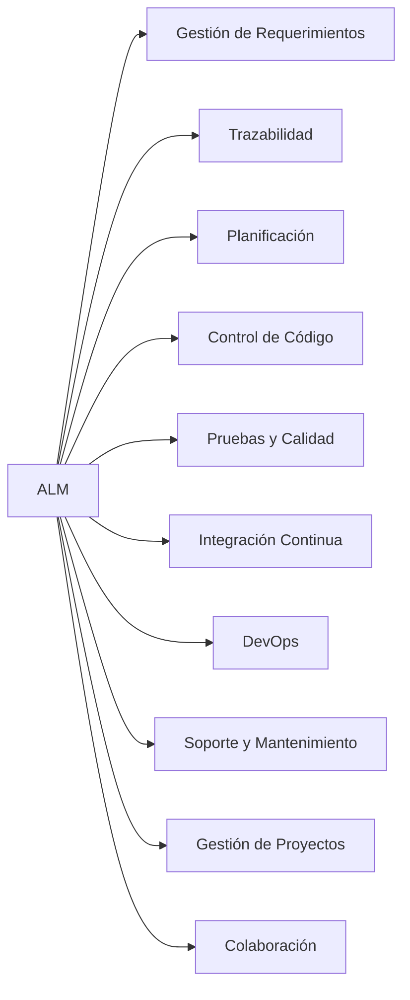
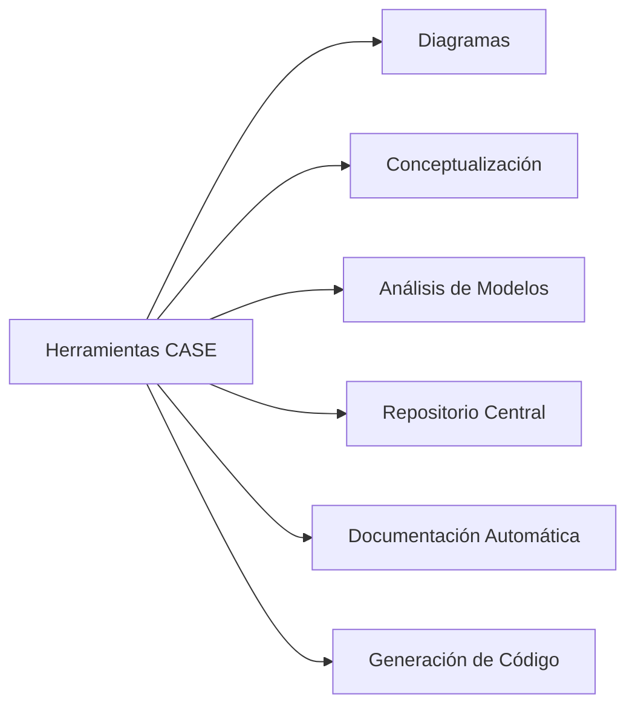

# Notas De Estudio: Valor Y Utilidad De Las Plataformas De Ingeniería De Software (ALM Y CASE)

---

## 1. Introducción General

Las plataformas de ingeniería de software brindan soporte para gestionar el ciclo de vida completo de las aplicaciones (**ALM**) y para asistir técnicamente el desarrollo mediante herramientas automatizadas (**CASE**).  
Su valor radica en mejorar la calidad, eficiencia, trazabilidad y colaboración dentro del proceso de desarrollo.

---

## 2. Valor Y Utilidad De ALM (Application Lifecycle Management)

Las plataformas **ALM** aportan funciones clave que permiten gestionar de forma integrada el ciclo de vida de la aplicación, desde requerimientos hasta despliegue y soporte.

### 2.1 Gestión De Requerimientos

**Definición:** Proceso para capturar, administrar, vincular y mantener la información sobre necesidades del sistema.  
**Funciones aportadas por ALM:**

- Captura estructurada de requisitos.
    
- Soporte a metodologías diversas (cascada, ágil).
    
- Gestión de casos de uso, escenarios y enlaces entre requisitos.
    
- Ideal para procesos complejos donde se require control de versiones y trazabilidad.

### 2.2 Trazabilidad

**Definición:** Capacidad de conectar cada requerimiento con elementos posteriores (análisis, diseño, código, pruebas).  
**Relevancia:**

- Garantiza consistencia entre fases.
    
- Reduce errores.
    
- Facilita auditorías y control del cambio.

### 2.3 Estimación Y Planificación

Las herramientas ALM facilitan:

- Planificación en cascada o ágil.
    
- Estimación de tareas y esfuerzo.
    
- Workflows para gestión de procesos y calidad.
    
- Visión del progreso y dependencias.

### 2.4 Gestión Del Desarrollo Y Código Fuente

Aunque la codificación no es parte directa de ALM, **la gestión del código sí lo es**.

- Integración con sistemas de control de versiones.
    
- Soporte para diferentes modelos de branching y fusión.
    
- Gestión de ramas y flujo de trabajo de desarrollo.

### 2.5 Pruebas Y Garantía De Calidad

Funciones clave:

- Gestión de casos de prueba (creación, modificación, filtrado).
    
- Definición de pasos y parámetros.
    
- Integración con sistemas de pruebas automatizadas.
    
- Seguimiento del estado de pruebas y defectos.

### 2.6 Integración Con Integración Continua (CI)

Las herramientas ALM se integran con servidores como:

- Jenkins
    
- Otros sistemas de CI/CD  
    **Objetivo:** Generar informes unificados que relacionan compilaciones con artefactos del ALM.

### 2.7 Funciones Adicionales De ALM Que Aportan Valor

|Función|Descripción|
|---|---|
|**DevOps**|Fusiona desarrollo y operaciones; permite pruebas en entornos reales; esencial para ciclos ágiles y nube.|
|**Soporte y Mantenimiento**|Gestión de incidencias, atención al usuario, creación de nuevas historias según las necesidades detectadas.|
|**Gestión de Actividades, Proyectos y Carteras**|Visualización del estado de proyectos, dependencias y priorización estratégica.|
|**Colaboración y Comunicación**|Información centralizada, comunicación en tiempo real, registro confiable de intercambios.|

### Diagrama: Funciones De ALM

---

## 3. Valor Y Utilidad De Las Herramientas CASE (Computer-Aided Software Engineering)

Las herramientas **CASE** permiten acelerar, estandarizar y mejorar el análisis, diseño y documentación del software mediante automatización.

### 3.1 Aceleración Del Desarrollo

Reducen tiempos mediante automatización de tareas técnicas y análisis semiautomatizados.

### 3.2 Detección Temprana De Errores

CASE ayuda a identificar:

- Inconsistencias.
    
- Redundancias.
    
- Omisiones en modelos o diagrams.  
    Esto evita corregir errores costosos en etapas posteriores.

### 3.3 Elaboración De Diagrams

Permiten modelar visualmente:

- Flujos de datos.
    
- Arquitecturas.
    
- Components.
    
- Procesos del sistema.

### 3.4 Conceptualización De Necesidades

Facilitan comprender y representar relaciones e interdependencias entre requisitos y components.

### 3.5 Análisis Automático De Modelos

Permiten revisar automáticamente la información modelada para asegurar coherencia y calidad.

### 3.6 Repositorio Centralizado

Todos los artefactos (diagrams, reportes, documentación) se almacenan en un punto único.

### 3.7 Generación Automática De Documentación

Produce documentación:

- Técnica
    
- Funcional
    
- Para usuarios finales  
    Cumpliendo estándares formales cuando es necesario.

### 3.8 Generación Automática De Código

A partir de modelos bien definidos puede generar código base, optimizando el inicio del desarrollo.

### Diagrama: Funciones De CASE

---

## 4. Relación Entre ALM Y CASE

|Aspecto|ALM|CASE|
|---|---|---|
|Enfoque|Gestión integral del ciclo de vida|Soporte técnico al análisis y diseño|
|Ámbito|Requerimientos → despliegue → soporte|Análisis → diseño → documentación|
|Valor|Control, trazabilidad, coordinación|Automatización técnica y modelado visual|
|Integración|Alta con CI/CD y DevOps|Alta con actividades de diseño|

**Conclusión:** ALM gestiona _qué_ y _cuándo_, CASE ayuda a estructurar _cómo_.

---

## Resumen De Puntos Clave

- ALM aporta valor mediante funciones integradas: requerimientos, trazabilidad, planificación, control de código, pruebas, CI, DevOps, soporte y colaboración.
    
- CASE acelera el desarrollo mediante diagrams, análisis automatizado, repositorios centralizados y generación automática de documentación y código.
    
- ALM y CASE se complementan: uno gestiona el ciclo completo y el otro optimiza su etapa técnica.

---

## MicroTest

1. ¿Cuál es uno de los beneficios del análisis automatizado de modelos en herramientas CASE?
    
    - **La respuesta:** c
        
    - **Justificación:** El análisis automatizado permite detectar inconsistencias, redundancias u omisiones en los modelos, lo cual es una de las funciones clave de las herramientas CASE. Las otras opciones son funcionalidades, pero no corresponden específicamente al beneficio del análisis automatizado.
        
2. ¿Cuál es una integración común que las herramientas de ALM permiten para el despliegue del software?
    
    - **La respuesta:** b
        
    - **Justificación:** Las suites ALM suelen integrarse con servidores de integración continua como Jenkins para automatizar el build, pruebas y despliegue. Las otras opciones no están directamente relacionadas con despliegue.
        
3. ¿Qué distingue a las suites ALM de las meras herramientas de gestión de proyectos o seguimiento de problemas?
    
    - **La respuesta:** A.
        
    - **Justificación:** La captura automática de requisitos y su alineación con el ciclo de vida completo del software es una capacidad avanzada que va más allá de las herramientas de gestión de proyectos o issue tracking. Las otras opciones son funciones más básicas o ajenas a ALM.

## Recommended Reading

[[es_a-guide-to-calculating-the-roi-of-application-lifecycle-management-tools.pdf]]
