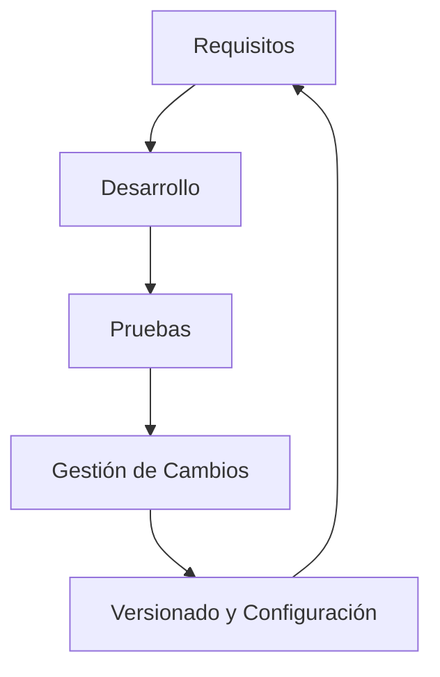

# Plataformas De Application Lifecycle Management (ALM)

## Introducción a Las Plataformas ALM

Las plataformas ALM están diseñadas para gestionar de forma integral el ciclo de vida de las aplicaciones: desde los requisitos y la planificación, hasta el desarrollo, las pruebas, el despliegue y la operación. Cada suite ofrece distintas capacidades enfocadas en trazabilidad, colaboración, gestión de versiones e integración continua.

## Cuadrante De Plataformas ALM Más Referenciadas

Algunas de las plataformas más mencionadas en informes tecnológicos incluyen:

|Plataforma / Vendor|Características destacadas|
|---|---|
|**SpiraTeam (Inflectra)**|Alta presencia en cuadrantes superiores, trazabilidad completa.|
|**CodeBeamer (Intland)**|Capacidades avanzadas, especialmente para entornos regulados.|
|**Atlassian Suite (Jira, Confluence, Bitbucket, Bamboo)**|Integración de múltiples herramientas para componer una suite ALM.|
|**IBM Rational, Microfocus, Microsoft, Polarion, Siemens**|Experiencia consolidada y soluciones maduras.|

---

# Atlassian Como Suite ALM

## Components Principales

La solución ALM de Atlassian no es un producto único, sino la integración de varias herramientas:

|Herramienta|Función|
|---|---|
|**Jira**|Planificación, seguimiento de proyectos, incidencias y problemas.|
|**Confluence**|Gestión de documentos y conocimiento, colaboración.|
|**Bitbucket**|Repositorio Git con solicitudes de cambio y revisión en línea.|
|**Bamboo**|Integración continua, ejecución de pruebas y despliegue.|

## Características Clave

- No es una solución _out of the box_; funciona integrando varias aplicaciones.
    
- Facilita trazabilidad desde requisitos → desarrollo → pruebas → despliegue.
    
- Favorece la colaboración en equipos distribuidos.
    
- Permite automatización a través de CI/CD con Bamboo.

---

# CodeBeamer

## Descripción General

CodeBeamer es una plataforma ALM avanzada con capacidades especiales para industrias reguladas y procesos complejos de ingeniería.

## Funcionalidades Principales

- Gestión integral de **requisitos, tareas, proyectos, pruebas, cambios y configuración**.
    
- Soporte a **líneas de productos** y control de variantes.
    
- Workflows digitales adaptables a entornos críticos (automoción, aeronáutica).
    
- Entorno seguro para trabajar con software y hardware.

## Beneficios Destacados

- Facilita el cumplimiento normativo (ISO, Automotive SPICE, DO-178C, etc.).
    
- Aumenta la transparencia y colaboración.
    
- Automatiza el control de requisitos con restricciones normativas.
    
- Reduce complejidad en procesos de ingeniería multidisciplinaria.

## Ejemplo De Flujo Conceptual

---

# SpiraTeam (Inflectra)

## Visión General

SpiraTeam es una solución ALM completa diseñada para ofrecer trazabilidad de extremo a extremo, desde requisitos hasta pruebas y versiones.

## Capacidades Importantes

- Gestión de requisitos con versionado.
    
- Control de versiones integrado.
    
- Gestión de iteraciones, tareas, defectos y código.
    
- Trazabilidad total entre elementos del ciclo de vida.
    
- Ideal para **industrias reguladas y normadas**.

## Funcionalidades De Pruebas

- Gestión de casos de prueba.
    
- Automatización y ejecución de pruebas manuales y automáticas.
    
- Informes personalizables.

## Soporte Metodológico

Compatible con:

- Scrum
    
- Kanban
    
- Modelos híbridos

## Tableros Y Métricas

Incluye dashboards con métricas clave de:

- Calidad
    
- Advance de proyecto
    
- Resultados de pruebas
    
- Incidencias abiertas

---

# Comparación General

|Plataforma|Fortalezas|Ideal Para|
|---|---|---|
|**Atlassian Suite**|Flexibilidad, integración, colaboración|Equipos ágiles con múltiples herramientas|
|**CodeBeamer**|Cumplimiento normativo, complejidad técnica, ingeniería|Automoción, aeroespacial, dispositivos médicos|
|**SpiraTeam**|Trazabilidad completa, gestión de pruebas robusta|Proyectos regulados y controlados por normas|

---

# Resumen De Puntos Clave

- Las plataformas ALM permiten una gestión integral del ciclo de vida del software.
    
- Atlassian ofrece una suite basada en la integración de herramientas separadas.
    
- CodeBeamer se enfoca en cumplir normativas y manejar procesos complejos.
    
- SpiraTeam destaca por su trazabilidad completa y fuerte gestión de pruebas.
    
- Las suites ALM buscan unir planificación, desarrollo, pruebas, versionado y despliegue en un único entorno.

---

## MicroTest

1. ¿Qué funcionalidades ofrece Codebeamer para el desarrollo colaborativo y eficiencia en la ingeniería de líneas de productos?
    
    - **La respuesta:** c. Desarrollo de software y garantía de calidad.
        
    - **Justificación:** Codebeamer destaca por integrar gestión de requisitos, desarrollo de software, pruebas y cumplimiento normativo, todo dentro de workflows colaborativos diseñados para líneas de productos complejas. Esto incluye funciones orientadas a calidad y desarrollo, no solo tareas aisladas o CI/CD.
        
2. ¿Cuál de las siguientes plataformas combina productos como Jira Software, Confluence, Stash y Bamboo para ofrecer una herramienta application lifecycle management (ALM) competente y de servicio completo?
    
    - **La respuesta:** c. Suite de Atlassian.
        
    - **Justificación:** Atlassian integra Jira, Confluence, Bitbucket (antes Stash) y Bamboo para formar una suite ALM completa a través de la combinación de sus herramientas, no como un único producto. Ninguna de las otras opciones utilize esta combinación.
        
3. ¿Cuál de las siguientes afirmaciones describe mejor a SpiraTeam, la plataforma ALM de Inflectra?
    
    - **La respuesta:** b. SpiraTeam es una solución colaborativa de gestión del ciclo de vida de las aplicaciones diseñada para empresas que utilizan métodos agile.
        
    - **Justificación:** SpiraTeam se caracteriza por ofrecer trazabilidad total, gestión de requisitos, pruebas, defectos y versiones, además de soportar metodologías ágiles como Scrum y Kanban. No es una plataforma de código abierto ni está centrada solo en tareas o correo.

<iframe src="https://www.softwarereviews.com/categories/application-lifecycle-management" allow="fullscreen" allowfullscreen="" style="height:100%;width:100%; aspect-ratio: 16 / 9; "></iframe>

