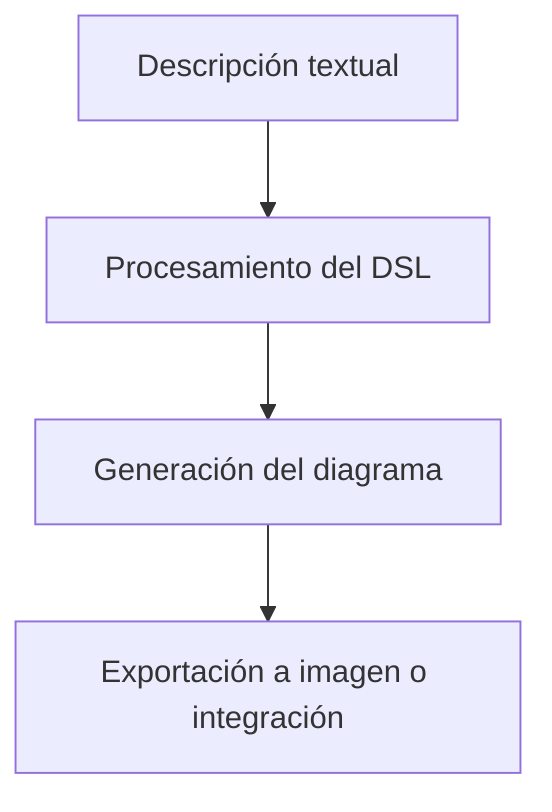
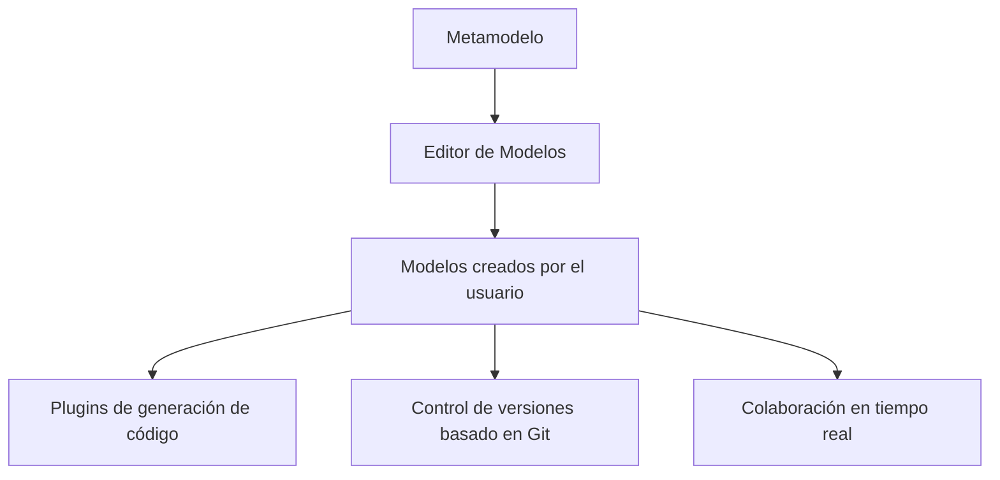

# **Notas De Estudio – Plataformas CASE (Computer-Aided Software Engineering) – Parte 1**

---

## **1. Introducción a Las Herramientas CASE**

### **Definición**

Las herramientas CASE (Computer-Aided Software Engineering) son plataformas diseñadas para apoyar el **análisis**, **diseño**, **modelado**, **documentación**, **simulación** y otros procesos relacionados con el desarrollo de sistemas intensivos en software.

### **Relevancia**

Estas herramientas permiten:

- Estandarizar procesos de desarrollo.
    
- Aumentar la productividad.
    
- Detectar errores temprano mediante análisis formales.
    
- Facilitar la colaboración y la gestión del conocimiento.

---

## **2. Principales Plataformas CASE Mencionadas**

|Categoría|Herramientas destacadas|
|---|---|
|CASE para ingeniería de software|Eclipse Papyrus, Enterprise Architect, StarUML, Visual Paradigm, PlantUML, WebGME|
|Herramientas orientadas a sistemas críticos|Cameo, integraciones con Matlab/Simulink|
|Herramientas de diagramación modernas|Lucidchart, Draw.io|

---

## **3. Eclipse Papyrus**

### **Descripción general**

Herramienta de código abierto perteneciente a la Fundación Eclipse, orientada al modelado de sistemas y al cumplimiento de estándares.

### **Soporte De Estándares**

Incluye soporte para:

- **UML 2.5**
    
- **SysML (CCML)**
    
- **fUML (Foundational UML)**
    
- **ALF (Action Language for Foundational UML)**
    
- **MARTE**
    
- **BPMN Profiles**
    
- **ISO 42010**  
    Entre otros.

### **Características principales**

- **Alta personalización:**  
    Adaptación de perfiles UML, paletas, menús, vistas y estilos.
    
- **Ingeniería dirigida por modelos (MDE):**  
    Integración con simulación, pruebas formales, análisis de rendimiento y seguridad.
    
- **Base para soluciones industriales:**  
    Usada como núcleo en otras herramientas profesionales.
    
- **Transición a Papyrus Web:**  
    Migración hacia una plataforma basada en navegador utilizando Sirius Web.

---

## **4. Papyrus Web**

### **Características Del Entorno web**

- Misma funcionalidad conceptual que Papyrus, pero con arquitectura completamente nueva.
    
- Basada en tecnologías web modernas.
    
- Permite modelar sin instalar software, solo desde el navegador.
    
- Mayor accesibilidad y colaboración.

---

## **5. PlantUML**

### **Definición**

Herramienta para generar diagrams a partir de **descripciones textuales**, usando un DSL (Domain Specific Language).

### **Tipos De Diagrams soportados**

- Diagrams UML: clases, actividad, secuencia, estado.
    
- Diagrams no UML: Gantt, ER, flujos, etc.

### **Ventajas**

- Creación rápida sin interfaz gráfica.
    
- Fácil edición mediante texto.
    
- Integración con editores como VS Code o Sublime.
    
- Generación automática de imágenes para documentación.
    
- Perfecto para _pipelines automatizados_.

### **Ejemplo (del transcript)**

Código textual:

```Python
@startuml
Alice -> Bob: Hola
@enduml
```

Resultado:  
Diagrama de secuencia donde _Alice envía un mensaje a Bob_.

### **Relación Entre Elementos En PlantUML (MermaidJs)**



---

## **6. WebGME (Web-based Generic Modeling Environment)**

### **Descripción general**

Evolución web de GME, diseñada para modelado colaborativo en la nube.

### **Características clave**

- **100% basada en navegador:** No require instalación.
    
- **Colaboración en tiempo real:** Múltiples usuarios trabajando simultáneamente.
    
- **Edición visual de modelos:** Diagrams interactivos.
    
- **Control de versiones para modelos:** Basado en una versión adaptada de Git.
    
- **Alta extensibilidad:**  
    Permite personalizar dominios mediante **metamodelado**.
    
- **Generación automática de código:** A través de plugins configurables.
    
- **Plantillas y semillas de proyecto:** Facilitan comenzar nuevos modelos.
    
- **Metamodelado obligatorio:**  
    Cada modelo debe basarse en un metamodelo definido por el usuario o preexistente.

### **Diagrama MermaidJs: Arquitectura Conceptual De WebGME**



---

## **7. Comparación General De Las herramientas**

|Herramienta|Tipo|Características destacadas|
|---|---|---|
|**Papyrus**|Modelado UML/SysML|Estándares, MDE, altamente personalizable|
|**Papyrus Web**|Modelado web|Trabajo desde navegador, arquitectura moderna|
|**PlantUML**|Diagramación textual|DSL textual, automatizable, rápida edición|
|**WebGME**|Modelado basado en web|Colaboración real, metamodelado, extensible|

---

## **Resumen De Puntos Clave**

- Las herramientas CASE permiten modelar, analizar y diseñar sistemas intensivos en software.
    
- Eclipse Papyrus es una de las soluciones más completas y orientadas al cumplimiento de estándares.
    
- PlantUML permite crear diagrams usando solo texto, lo cual facilita automatización.
    
- WebGME ofrece modelado colaborativo en la nube, control de versiones y metamodelado avanzado.
    
- La tendencia actual es migrar herramientas CASE hacia entornos web colaborativos.

---

## **MicroTest**

1. ¿Cuál de las siguientes plataformas CASE es compatible con los catorce tipos de diagrams de software UML 2.5?
    
    - **La respuesta:** c. Eclipse Papyrus.
        
    - **Justificación:** Altova UModel es una herramienta CASE avanzada que soporta **todos los diagrams UML 2.5**, mientras que las otras opciones tienen soporte parcial o no cumplen íntegramente con el estándar.
        
2. ¿Qué plataforma CASE se menciona como una solución comercial de Sparx Systems con capacidades integradas de gestión de requisitos y trazabilidad completa desde los requisitos hasta la implementación?
    
    - **La respuesta:** c. Enterprise Architect
        
    - **Justificación:** Enterprise Architect, de Sparx Systems, es una herramienta CASE comercial reconocida por ofrecer **gestión de requisitos, trazabilidad completa y modelado integral**, características que no aplican a las demás opciones.
        
3. ¿Cuál de las siguientes herramientas CASE se describe como un proyecto de código abierto que genera diversos tipos de diagrams, incluyendo diagrams de secuencia, casos de uso, clases y actividades?
    
    - **La respuesta:** a. Plant UML
        
    - **Justificación:** PlantUML es una herramienta **open source** famosa por generar múltiples tipos de diagrams UML mediante texto, incluidos secuencia, actividades, clases y casos de uso, cosa que no cumplen las demás en ese formato ni con ese enfoque.