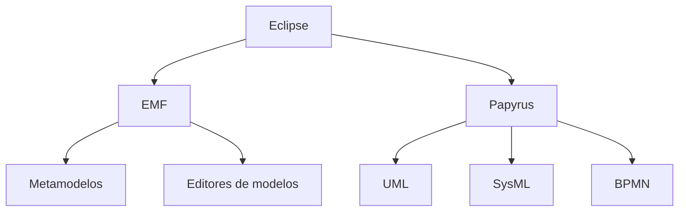

# **Notas De Estudio – Plataformas CASE: Papyrus (Eclipse)**

## 1. Introducción a Papyrus

### ¿Qué Es Papyrus?

Papyrus es una herramienta **CASE (Computer-Aided Software Engineering)** que forma parte de la **Fundación Eclipse**.  
Está diseñada para realizar **modelado de software con UML (Unified Modeling Language)**, y funciona como un entorno de modelado dentro del propio Eclipse.

### Características Principales

- Forma parte del ecosistema **Eclipse Modeling**.
    
- Basado en **EMF (Eclipse Modeling Framework)**.
    
- Permite trabajar con:
    
    - UML
        
    - UML ejecutable (xUML)
        
    - UML para ingeniería de sistemas (SysML)
        
    - BPMN para modelado de procesos
        
    - OMEI para intercambio de modelos entre herramientas

## 2. Relación Con Eclipse Modeling Framework (EMF)

### Definición De EMF

EMF es un framework de Eclipse para:

- Definir **metamodelos**
    
- Generar **modelos**, **editores**, **transformadores**
    
- Crear herramientas específicas para modelado (GMF, GEF, Eugenia, etc.)

### Relevancia

Papyrus aprovecha este ecosistema para integrarse y permitir:

- Generación de código desde modelos UML
    
- Ingeniería inversa (código → modelo UML)
    
- Interacción con plugins de modelado avanzados

### Diagrama De Relaciones

## 3. Capacidades De Papyrus Como Herramienta CASE

Papyrus no es solo un editor gráfico; es un **entorno de modelado completo** que soporta validaciones, restricciones y anotaciones del estándar UML 2.5.

### Diagrams Soportados Por Papyrus

Organizados por categorías UML:

|Categoría|Diagrams|
|---|---|
|Estructurales|Clases, Objetos, Paquetes, Components, Despliegue|
|Comportamiento|Casos de uso, Actividades, State Machine|
|Interacción|Secuencia, Comunicación, Timing, Interaction Overview|

Papyrus permite:

- Editor Drag & Drop
    
- Propiedades avanzadas de cada elemento
    
- Validación de restricciones
    
- Jerarquías y relaciones complejas
    
- Exportación de modelos

## 4. Instalación Y Configuración

Papyrus se puede instalar de dos formas:

- Desde **Eclipse Marketplace**
    
- Desde la página official de Papyrus en Eclipse.org

Al iniciar:

1. Eclipse solicita un **workspace**.
    
2. Se crea un **proyecto Papyrus**.
    
3. Se selecciona el tipo de diagrama (por ejemplo, casos de uso).

## 5. Ejemplos Prácticos De Uso

### 5.1 Creación De Un Diagrama De Casos De Uso

**Paso a paso:**

1. Crear un proyecto “demo Papyrus”.
    
2. Seleccionar tipo “Use Case Diagram”.
    
3. Arrastrar un “Actor” al lienzo.
    
4. Nombrarlo como “Usuario”.
    
5. Crear caso de uso “Entrar en sesión”.
    
6. Conectar actor y caso de uso mediante _usage_.
    
7. Configurar propiedades desde el panel inferior.

Este ejemplo demuestra:

- Uso del editor visual
    
- Cumplimiento del estándar UML 2.5
    
- Manejo de estereotipos UML

### 5.2 Creación De Un Diagrama De Actividad

**Elementos claves utilizados:**

- Nodo inicial
    
- Actividades
    
- Particiones (swimlanes)
    
- Flujos de control

### 5.3 Creación De Un Diagrama De Clases

**Caso del video: clase Libro**

1. Crear clase “Libro”.
    
2. Agregar propiedades:
    
    - nombre
        
    - ISBN
        
3. Crear clase “Hijo”.
    
4. Aplicar una relación de **generalización** (herencia).

Esto muestra la facilidad del modelado estructurado usando drag & drop.

## 6. Limitaciones Y Críticas Del Uso De Papyrus

Papyrus, aunque completo, presenta algunos puntos débiles:

### Limitaciones Señaladas

- Orientado originalmente a entornos académicos
    
- Estabilidad limitada para uso industrial
    
- Documentación desactualizada (tutoriales de 2010–2011)
    
- Comunidad activa, pero con ejemplos obsoletos

### Relevancia En Ingeniería

A pesar de estos problemas, sigue siendo una herramienta poderosa por su:

- Integración con EMF
    
- Soporte de múltiples estándares
    
- Capacidad de generación y transformación de modelos

## 7. Integración Con EMF Para Generación De Código

Papyrus permite:

- **Generación de código desde UML**
    
- **Ingeniería inversa** (UML desde código)
    
- Conexión con transformadores e infraestructura de modelado

Esto lo posiciona como una herramienta útil en:

- MDD (Model Driven Development)
    
- MDA (Model Driven Architecture)

---

# **Resumen De Puntos clave**

- Papyrus es un entorno CASE dentro de Eclipse especializado en UML.
    
- Se integra con EMF, permitiendo crear y transformar modelos complejos.
    
- Soporta múltiples estándares: UML, xUML, SysML, BPMN.
    
- Permite crear diagrams con drag & drop y validaciones automáticas.
    
- Su documentación está desactualizada, pero sigue siendo potente en entornos académicos y proyectos de investigación.
    
- Permite generación de código y modelado avanzado mediante plugins.

---

## **MicroTest**