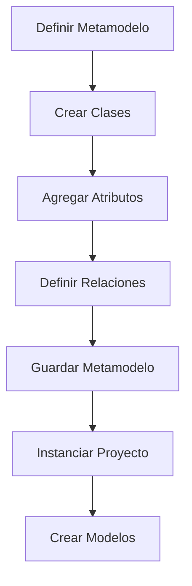
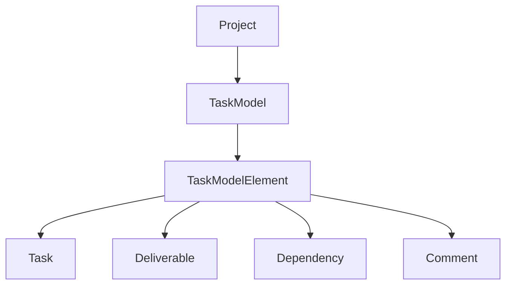

# Notas De Estudio – Plataformas CASE: WebGME Y Metamodelado

## 1. Introducción a WebGME

### Definición General

WebGME es una **plataforma CASE (Computer-Aided Software Engineering)** orientada al **metamodelado** y a la **generación automática de editores de modelos**.  
Es la evolución web de **GME (Generic Modeling Environment)** desarrollada en la Universidad de Vanderbilt, en Estados Unidos.

### Objetivo Principal

Permitir que el usuario **defina sus propios metamodelos** y, a partir de ellos, la herramienta genere automáticamente:

- Editores de modelos
    
- Relaciones, restricciones y validaciones
    
- Estructuras jerárquicas de modelado

WebGME está basada completamente en modelos: todos los elementos que se manipulan representan instancias o definiciones dentro de un metamodelo.

---

## 2. Relación Con la Metamodelización Y MOF

### Concepto De Metamodelo

Un metamodelo es una **descripción del tipo de modelos que podemos crear**, definiendo:

- Clases
    
- Relaciones
    
- Contención
    
- Atributos
    
- Restricciones

WebGME permite crear metamodelos que actúan como la base para los modelos instanciados.

### Comparación Con Estándares (MOF, EMF, Ecore)

|Entorno|Base Tecnológica|Naturaleza|
|---|---|---|
|MOF|Meta Object Facility|Estándar official de OMG|
|Eclipse EMF|Ecore|Subconjunto de MOF|
|Sirius|Basado en EMF|Modelado visual|
|WebGME|Notación propia|Similar visualmente a UML/Ecore pero no es equivalente|

WebGME incluye una notación parecida a un **diagrama de clases**, pero no es UML ni MOF estándar.

---

## 3. Arquitectura Conceptual De WebGME

### Perspectivas

WebGME trabaja con **perspectivas visuals**, donde cada vista representa un nivel o tipo de modelado:

- Vista del metamodelo
    
- Vista del proyecto (instancias)
    
- Vista de composición

### Jerarquía De Elementos

Todos los elementos del metamodelo se derivan de una clase base llamada:

**First Class Object**

### Flujo General Del Metamodelado En WebGME

---

## 4. Creación De Un Metamodelo: Ejemplo Paso a Paso

### 4.1 Definición Inicial Del Metamodelo

El ejemplo del transcript demuestra un metamodelo sencillo:

- Project
    
- TaskModel
    
- TaskModelElement
    
    - Task
        
    - Deliverable
        
    - Dependency
        
- Comment

### 4.2 Representación Jerárquica

### 4.3 Atributos Definidos

|Clase|Atributos|
|---|---|
|Task|priority (1–10), description|
|Deliverable|description (multilínea, edición HTML)|
|Dependency|relación entre dos TaskModelElement (source → target)|
|TaskModelElement|puede container una colección de Comments|
|Comment|texto simple|

### 4.4 Relaciones Del Metamodelo

- **Herencia:** Task, Deliverable y Dependency heredan de TaskModelElement.
    
- **Contención:** Un TaskModel contiene múltiples TaskModelElement.
    
- **Referencias:** Dependency apunta a dos elementos: source y target.

---

## 5. Instanciación Del Modelo

Una vez creado el metamodelo, WebGME permite generar instancias:

1. Crear un **Proyecto**
    
2. Crear una instancia de **TaskModel**
    
3. Añadir elementos según el metamodelo:
    
    - Tasks (tarea 1, tarea 2, tarea 3)
        
    - Deliverables
        
    - Dependencies
        
    - Comments

### Ejemplo Del Transcript

- Tareas creadas: tarea 1, tarea 2, tarea 3
    
- Dependencias: tarea 2 depende de tarea 1; tarea 3 depende de tarea 2
    
- Deliverable agregado: deliverable 1
    
- Comments asociados: comentarios en un TaskModelElement

---

## 6. Actualización Dinámica Del Modelo

WebGME permite que cualquier modificación del metamodelo se **refleje automáticamente** en las instancias.

Ejemplo:

1. En el metamodelo, agregar atributo **ruta** en Deliverable
    
2. Volver al modelo instanciado
    
3. Deliverable muestra el nuevo campo de forma inmediata

Este mecanismo garantiza **coherencia** entre el metamodelo y todos los modelos existentes.

---

## 7. Buenas Prácticas

- Mantener los metamodelos en un proyecto **separado**, importado como librería
    
- Evitar mezclar instancias y definiciones dentro del mismo proyecto
    
- Marcar como **abstractas** las clases que no deben instanciarse (por ejemplo, TaskModelElement)

---

## 8. Ventajas Y Alcance De WebGME

### Ventajas

- Generación automática de editores de modelo
    
- Basado completamente en modelos
    
- Capacidad de validación y restricciones
    
- Extensible mediante scripts, decoradores y transformadores
    
- Integración con GitHub y despliegue local o vía Docker

### Usos Típicos

- Ingeniería de software basada en modelos
    
- Desarrollo de lenguajes específicos de dominio (DSL)
    
- Automatización de pipelines de modelado
    
- Simulación y análisis estructurado

---

## 9. Resumen De Puntos Clave

- WebGME es una herramienta CASE orientada al metamodelado.
    
- Permite crear editores de modelos basados en metamodelos definidos por el usuario.
    
- Usa una notación propia, similar pero no igual a UML o Ecore.
    
- Todo modelo se organiza bajo **First Class Object**.
    
- Las instancias se sincronizan automáticamente cuando el metamodelo cambia.
    
- Permite definir clases, atributos, relaciones y colecciones de forma visual.

---

## MicroTest

1. **A la hora de crear un metamodelo en WebGME, ¿qué notación se usa?**
    
    - **La respuesta: c. Un modelo gráfico inspirado en un diagrama de clases UML pero que no es compatible con MOF, sino que tiene sus propios elementos.**
        
    - **Justificación:**  
        El transcript explica que WebGME utilize una notación **similar visualmente a UML/Ecore**, pero **no es UML ni MOF**, ya que WebGME tiene **su propia notación y elementos propios** para metamodelar.
        
2. **El elemento FCO de un metamodelo en WebGME:**
    
    - **La respuesta: b. Es un elemento first class object del que se heredan todos los demás.**
        
    - **Justificación:**  
        En WebGME todos los elementos del metamodelo **derivan de una clase padre llamada First Class Object (FCO)**. Es la raíz de la jerarquía del metamodelo.
        
3. **Para establecer un elemento en un metamodelo que sea un connector entre dos elementos:**
    
    - **La respuesta: d. Hay que utilizar el pointer y seleccionar los elementos src y dst.**
        
    - **Justificación:**  
        El transcript indica que para representar una dependencia/relación entre dos elementos, WebGME usa **pointers**, configurando explícitamente el **source (src)** y el **destination (dst)** del connector.
        