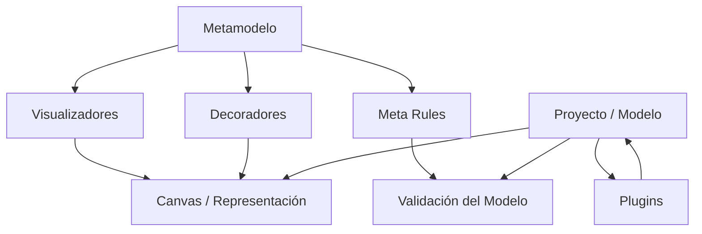

# Notas De Estudio – Plataformas CASE: WebGME (Funcionalidades Avanzadas)

## 1. Introducción a Las Funcionalidades Avanzadas De WebGME

Estas notas profundizan en las capacidades más avanzadas que WebGME ofrece además del metamodelado básico y la generación automática de editores.  
WebGME extiende su utilidad mediante decoradores, visualizadores, reglas de validación, colaboración en tiempo real y ejecución de plugins para transformaciones entre modelos.

---

## 2. Decoradores En WebGME

### Definición

Un _decorador_ en WebGME especifica **cómo se visualiza un elemento del modelo**, tanto en la paleta como cuando se arrastra al canvas.

### Tipos De Personalización Permitidos

- Cambio de íconos o representaciones visuals.
    
- Modificación del estilo de flechas o conexiones.
    
- Mostrar u ocultar nombres o etiquetas.
    
- Personalización a nivel:
    
    - **Metamodelo** (afecta a todas las instancias).
        
    - **Modelo específico** (solo afecta a un elemento concreto).

### Ejemplos Del Transcript

- Asignar a un Deliverable un ícono de "documento".
    
- Cambiar la flecha de una Dependency para que se vea como “puntero”.
    
- Ocultar la etiqueta "Dependency" en el modelo.

### Programación De Decoradores

WebGME permite crear decoradores personalizados en **JavaScript**, extendiendo los que vienen por defecto.

---

## 3. Visualizadores (Visualizers)

### Definición

Los visualizadores determinan **cómo se muestra internamente el modelo en el canvas**.

### Visualizadores Incluidos

|Visualizador|Función|
|---|---|
|Composition Visualizer|Vista principal de drag-and-drop para construir modelos.|
|Meta Visualizer|Permite editar metamodelos.|
|GraphView|Vista gráfica centrada en jerarquías e hijos.|

### Ejemplo Del Transcript: Uso De GraphView

1. Se define que una tarea puede container subtareas (composición).
    
2. Se agregan subtareas debajo de una tarea principal.
    
3. En GraphView se visualiza el árbol completo de elementos hijos.

### Programabilidad

WebGME permite crear visualizadores personalizados mediante JavaScript.

---

## 4. Meta Rules (Restricciones)

### Definición

Las **meta rules** son restricciones que controlan la validez del modelo respecto al metamodelo.  
Pueden aplicarse en:

- El **metamodelo**, mediante cardinalidades y restricciones estructurales.
    
- El **modelo**, mediante validaciones dinámicas.

### Ejemplo Del Transcript

- Se modifica la cardinalidad de Comments para exigir **al menos dos**.
    
- El sistema valida el modelo e indica:
    
    - El TaskModel no es válido porque tiene menos comentarios de los permitidos.

### Tipos De Restricciones Comunes

- Cardinalidad mínima o máxima.
    
- Tipos de elementos permitidos.
    
- Estructuras jerárquicas válidas.
    
- Unicidad de nombres u otros atributos.

---

## 5. Trabajo Colaborativo Y Control De Versiones

### Colaboración En Tiempo Real

WebGME permite que múltiples usuarios editen el mismo modelo simultáneamente, con visualización en vivo de cambios.

### Control De Versiones

- Registro histórico de cambios.
    
- Posibilidad de crear ramas.
    
- Cambios aislados en ramas específicas.
    
- Comparación entre ramas.

### Ejemplo Explicado

1. Se crea una rama.
    
2. Se mueven elementos dentro de esa rama.
    
3. Al volver a master, los cambios no se reflejan allí.  
    Esto permite flujos de trabajo similares a los usados en entornos de desarrollo de software.

---

## 6. Plugins En WebGME

### Definición

Los **plugins** son scripts programados en JavaScript que permiten realizar **transformaciones entre modelos** o generar artefactos externos.

### Usos Comunes

- Generar código fuente a partir de modelos.
    
- Crear modelos derivados.
    
- Sincronizar elementos entre dos modelos distintos.
    
- Aplicar reglas de validación avanzadas.

### APIs Disponibles

WebGME proporciona dos tipos de API:

|API|Descripción|
|---|---|
|Core API|Permite recorrer nodos, hijos, pointers, conexiones y containments.|
|Web API (REST)|Acceso distribuido a información almacenada, ejecución remota de plugins.|

### Ejemplo Del Transcript

- Buscar todas las instancias de tipo _Task_.
    
- Buscar tareas que tengan una dependencia definida.
    
- Manipulación estructurada mediante el Core API.

---

## 7. Relación Entre Decoradores, Visualizadores, Reglas Y Plugins

---

## 8. Resumen De Puntos Clave

- WebGME permite personalizar la representación visual mediante decoradores.
    
- Los visualizadores determinan cómo navegamos y manipulamos el modelo.
    
- Las meta rules permiten definir y verificar restricciones estructurales.
    
- La plataforma soporta edición colaborativa con control de versiones y ramas.
    
- Los plugins permiten transformaciones entre modelos, generación de código y automatización.
    
- La herramienta es completamente extensible mediante programación en JavaScript.

---

## MicroTest

1. **En WebGME, los components para poder cambiar la forma en la que un elemento se visualiza en pantalla se denominan:**
    
    - **La respuesta: b. Decoradores.**
        
    - **Justificación:**  
        En el transcript se explica que los _decoradores_ permiten modificar cómo se ve un elemento al arrastrarlo al canvas y cómo se muestra en la paleta. Son responsables de la apariencia visual del elemento, no de su comportamiento ni de la estructura del modelo.
        
2. **En WebGME, los components para poder cambiar la forma en la que se define el comportamiento visual de los elementos en un canvas se denominan:**
    
    - **La respuesta: c. Visualizadores.**
        
    - **Justificación:**  
        Los _visualizadores_ (visualizers) controlan la forma en que el modelo se navega y visualiza dentro del canvas. El transcript menciona visualizadores como _Composition Visualizer_ o _GraphView_, que determinan el comportamiento visual y la interacción dentro del lienzo.
        
3. **En WebGME, los components para poder aplicar transformaciones modelo a modelo se denominan:**
    
    - **La respuesta: a. Plugins.**
        
    - **Justificación:**  
        Los plugins en WebGME permiten ejecutar transformaciones entre modelos, generar código, sincronizar estructuras y recorrer nodos. Se programan en JavaScript usando el _Core API_ y se mencionan explícitamente como la herramienta para transformar modelos.