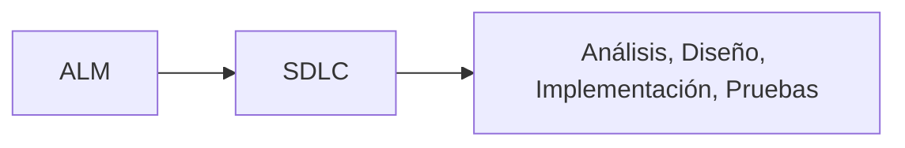

# Notas De Estudio – Plataformas De Ingeniería Del Software, ALM Y CASE

## 1. Introducción General Al Tema

Este resumen aborda las **plataformas de ingeniería del software**, centrándose en dos grandes conceptos:

- **ALM (Application Lifecycle Management)**
    
- **CASE (Computer-Aided Software Engineering)**

El objetivo es comprender su contexto, utilidad, alcance y las principales herramientas asociadas.

---

## 2. Application Lifecycle Management (ALM)

### Definición

**ALM** es la gestión integral del ciclo de vida de una aplicación, desde la idea inicial hasta su retirada. Incluye procesos, herramientas y metodologías para controlar todas las fases del ciclo de vida del software.

### Fases Del Ciclo De Vida Cubiertas Por ALM


### Valor Y Utilidad

|Beneficio|Descripción|
|---|---|
|Trazabilidad|Conexión automática entre requisitos y artefactos posteriores.|
|Visibilidad global|Permite entender qué se desarrolla, qué se mantiene y qué está en producción.|
|Mejora continua|Facilita identificar áreas de optimización.|
|Priorización|Ayuda a decidir qué proyectos deben entrar o no al ciclo productivo.|
|Gestión del esfuerzo|Diferencia entre tareas de valor (nuevos requisitos) y deuda técnica.|

### Ámbito De Aplicación

- Departamentos de TI grandes
    
- Organizaciones con productos críticos
    
- Equipos que requieren control de versiones, trazabilidad y analítica integral

---

## 3. Relación Entre ALM Y SDLC

### SDLC (Software Development Life Cycle)

El **SDLC** es un subconjunto de ALM. Se centra únicamente en el proceso de desarrollo del software.



ALM incluye fases adicionales como monitorización, mantenimiento, gestión de cartera y retirada.

---

## 4. Plataformas ALM En El Mercado

### Ejemplos Destacados

|Plataforma|Capacidades|
|---|---|
|Atlassian Suite (Jira, Bitbucket, Confluence, Bamboo)|Control de versiones, documentación, CI/CD, gestión de tareas|
|CodeBeamer|Trazabilidad extrema, gestión de riesgos, PLM|
|Spira Suite|Gestión de pruebas, requisitos y proyectos|

### Funcionalidades Comunes De Plataformas ALM

- Gestión de requisitos
    
- Análisis, diseño e implementación
    
- CI/CD y DevOps
    
- Gestión de riesgos
    
- Product Line Management
    
- Dashboards y analítica avanzada

---

## 5. Herramientas CASE

### Definición

Las plataformas CASE ayudan a **sistematizar el análisis, diseño y modelado** del sistema, permitiendo además validaciones y generación automática de artefactos (como código o modelos derivados).

### Objetivo General

Transformar la necesidad ("qué se debe hacer") en diseño técnico ("cómo hacerlo") mediante modelos con semántica formal.

---

## 6. Tipos De Plataformas CASE

### 6.1 Papyrus / Enterprise Architect (Modelado UML Tradicional)

- Permite crear modelos UML conformes a estándares.
    
- Incluye análisis estático de modelos y generación automática de código.
    
- Los modelos no son simples dibujos: tienen **semántica y restricciones formales**.

### 6.2 PlantUML (Lenguaje Específico De Dominio)

- Funciona con un **DSL** (domain-specific language) textual.
    
- Permite escribir estructuras UML usando código como:

```Python
@startuml
class Libro
class Autor
Libro --> Autor
@enduml
```

- Útil para automatizar la generación de diagrams por programas externos.
    
- Orientada a **integración y automatización**, no solo uso manual.

### 6.3 WebGME (Metamodelado Y Generación De Editores)

Enfoque basado en **metamodelos**:

|Función|Descripción|
|---|---|
|Definir metamodelos|Se describe la estructura del lenguaje/modelo.|
|Generar editores|El sistema genera automáticamente el editor correspondiente.|
|Decoradores|Permiten controlar cómo se visualizan los elementos.|
|Visualizadores|Permiten explorar el modelo desde diferentes perspectivas.|
|Restricciones|Validación estructural del modelo.|
|Transformaciones|Plugins para convertir modelos o generar código.|

WebGME combina modelado, metamodelado, visualización y programación.

---

## 7. Comparación De Enfoques CASE

|Enfoque|Característica Principal|Ejemplo|
|---|---|---|
|Modelado UML|Modelar con restricciones formales|Papyrus, EA|
|DSL textual|Generar diagrams a partir de código|PlantUML|
|Metamodelado|Crear lenguajes y editores completos|WebGME|

---

## 8. Resumen Integrado Del Tema

- **ALM** ofrece una visión completa del ciclo de vida del software.
    
- **SDLC** es una parte de ALM, centrado en el desarrollo.
    
- Las plataformas ALM permiten trazabilidad, visibilidad y priorización de proyectos.
    
- Las herramientas CASE sistematizan análisis, diseño y modelado.
    
- Existen tres enfoques principales CASE:
    
    - Modelado UML formal
        
    - DSL para generación de diagrams
        
    - Metamodelado para crear lenguajes y editores
        
- La ingeniería del software moderna combina ALM + CASE para maximizar control y automatización del ciclo completo.

---

## MicroTest