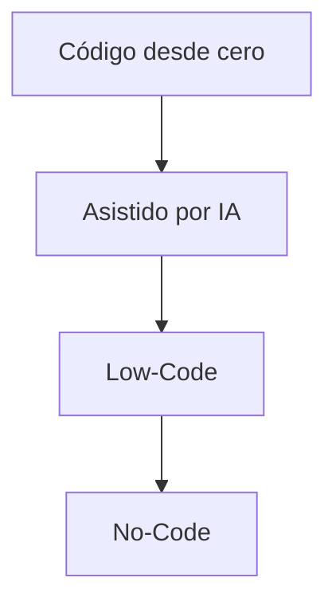

# Introducción Y Contexto General

Estas notas de estudio resumen y organizan los conceptos clave del transcript sobre **plataformas Low-Code y No-Code**, su historia, motivación, definiciones y relación con la Ingeniería de Software Basada en Modelos (MDE). También incluyen una taxonomía conceptual y el análisis del impacto de estas herramientas en el panorama actual del desarrollo de software.

---

# 1. Historia Y Motivación Del Low-Code / No-Code

## 1.1 Primeros Antecedentes

**James Martin (1981)** presentó la idea de crear soluciones “sin programadores” en su libro _Application Development Without Programmers_.  
Este planteamiento surge como una evolución natural de:

- La necesidad de **abstraer** la complejidad del desarrollo.
    
- El deseo de crear software más rápido y con menos conocimientos técnicos.

## 1.2 Evolución Histórica De la Abstracción En Software

La ingeniería del software siempre ha buscado elevar el nivel de abstracción:

|Etapa|Descripción|Impacto|
|---|---|---|
|Lenguaje máquina|Ceros y unos|Máxima complejidad, mínima abstracción|
|Ensamblador|Uso de mnemónicos|Reducción leve de complejidad|
|Lenguajes 3GL (C, Java…)|Sintaxis de alto nivel|Productividad alta, menor detalle del hardware|
|Lenguajes 4GL|Especificación más declarativa|Más cercanos al problema que a la máquina|
|Herramientas CASE|Representación mediante cajas y bloques|Automatización parcial del código|
|MDE (Model-Driven Engineering)|Modelos independientes de la tecnología|Generación automática del código base|
|**Low-Code / No-Code**|Creación visual de aplicaciones|Democratización del desarrollo|

## 1.3 Origen Del Término Low-Code

- **2011**: La consultora _Forrester_ acuña “Low-Code Development Platform”.
    
- **2021**: _Forbes_ lo destaca como una de las tendencias más disruptivas.

---

# 2. Problemas Actuales Del Desarrollo De Software

## 2.1 Brecha De Talento Tecnológico

- Crece la demanda de profesionales.
    
- Aumenta la complejidad de tecnologías y lenguajes.
    
- Falta de perfiles especializados.
    
- Menor disponibilidad de tiempo para desarrollar.

## 2.2 Estrategias Para Enfrentar Estos Desafíos

- Fomentar participación temprana en **STEM**, especialmente de niñas.
    
- Integrar perfiles no técnicos a equipos de desarrollo.
    
- Incrementar el uso de **herramientas de automatización** para ampliar la capacidad productiva.
    
- Incluir herramientas asistidas por **inteligencia artificial**.

---

# 3. Definiciones Clave De Low-Code Y No-Code

## 3.1 Definición De Forrester (Low-Code Platform)

Una plataforma Low-Code:

- Facilita el desarrollo y entrega de aplicaciones.
    
- Reduce la codificación manual.
    
- Favorece **configuración rápida** y **despliegue ágil**.
    
- Minimiza la dependencia de programación tradicional.
    
- Incluye no solo creación sino también **puesta en producción**.

## 3.2 Definición De Gartner (Low-Code Application Platform - LCAP)

Se caracteriza por:

- Desarrollo declarativo basado en modelos.
    
- Técnicas Low-Code y No-Code.
    
- Despliegue simplificado tipo “one-click deployment”.
    
- Orientación a perfiles **no técnicos** (Citizen Developers).

---

# 4. Relación Con Model-Driven Engineering (MDE)

## 4.1 Similitudes

- Ambos usan modelos como capa de abstracción.
    
- Ambos suelen generar código automáticamente.
    
- Buscan elevar la eficiencia del desarrollo.

## 4.2 Diferencias

Aunque técnicamente similares, Low-Code:

- Se posiciona como más “comercial” y accessible.
    
- Es más amigable para audiencias no técnicas.
    
- Su éxito es de **popularización**, no de innovación técnica.

## 4.3 Aportes Del Estudio De Kabot

- No hay diferencias técnicas significativas con MDE.
    
- El término Low-Code populariza y facilita la comprensión del enfoque.

---

# 5. Problemas De Clasificación En la Actualidad

No existe una definición universalmente aceptada.  
Algunos estudios mezclan herramientas muy heterogéneas.  
Ejemplos:

- **Un CMS** no encaja dentro de Low-Code por no cumplir con las definiciones de Forrester/Gartner.

---

# 6. Taxonomía Propuesta

Para entender el ecosistema Low-Code / No-Code se consideran dos ejes:

## 6.1 Eje De Utilidad (Tipo De solución)

- **Código desde cero** → Máxima personalización, require expertos.
    
- **Asistido por IA** → Aumenta la eficiencia pero sigue siendo código.
    
- **Low-Code** → Interfaz visual con propiedades configurables.
    
- **No-Code** → Máxima abstracción, orientado a usuarios sin conocimientos técnicos.

## 6.2 Eje De Automatización (Velocidad Y abstracción)

- A mayor abstracción → mayor eficiencia pero menor personalización.
    
- A menor abstracción → más flexibilidad, pero require más trabajo manual.

## 6.3 Representación Visual De la Taxonomía (Mermaid)

## 6.4 Contraste Visual Entre Flexibilidad Y Facilidad

|Nivel|Flexibilidad|Facilidad|Perfil objetivo|
|---|---|---|---|
|Código|Muy alta|Baja|Desarrolladores expertos|
|Asistido por IA|Alta|Media|Devs con herramientas|
|Low-Code|Media|Alta|Devs y Citizen Developers avanzados|
|No-Code|Baja|Muy alta|Usuarios no técnicos|

---

# 7. Características Y Limitaciones De Las Plataformas Low-Code / No-Code

## 7.1 Ventajas

- Desarrollo rápido.
    
- Menor dependencia de programadores expertos.
    
- Interfaz visual (drag-and-drop).
    
- Despliegue simplificado.
    
- Reducción de tiempos de entrega.

## 7.2 Limitaciones

- Menor control de detalles (ejemplo: pixel-perfect UI).
    
- Configuraciones limitadas según la plataforma.
    
- Dificultad para proyectos de personalización extrema.
    
- Dependencia del proveedor o ecosistema.

---

# 8. Ejemplo Ilustrativo: OutSystems

La plataforma OutSystems:

- Utilize una capa gráfica independiente del lenguaje de programación.
    
- Genera código automáticamente a partir de modelos.
    
- Es representativa del enfoque Low-Code empresarial.

---

# 9. Conclusiones Generales

- Low-Code y No-Code no introducen una revolución técnica respecto a MDE.
    
- Sí representan una revolución **práctica y de mercado**.
    
- Democratizan el desarrollo de software.
    
- Ayudan a cerrar la brecha de talento.
    
- Permiten integrar perfiles no técnicos en la creación de soluciones.

---

# Summary of Key Points

- Low-Code / No-Code son parte de un proceso histórico de aumentar la abstracción en desarrollo.
    
- Surgen por la necesidad de acelerar la creación de software ante la brecha de talento.
    
- Forrester y Gartner establecen definiciones centradas en rapidez, modelos y despliegue simplificado.
    
- Su relación con MDE es directa: comparten fundamentos técnicos.
    
- La diferencia clave es su accesibilidad y adopción comercial.
    
- Existen limitaciones en personalización, pero ventajas importantes en velocidad.
    
- La taxonomía ayuda a entender su posición en el espectro del desarrollo.

---

# MicroTest

1. Según la frase de Grady Booch, ¿cuál es la característica distintiva en la evolución de la ingeniería de software a lo largo de su historia?
	- La respuesta: **b. El aumento constante en el nivel de abstracción.**
	    
	- Justificación: La frase de Booch indica que la ingeniería de software siempre ha avanzado elevando el nivel de abstracción, alejándose del lenguaje máquina hacia herramientas y modelos más altos.
2. ¿Cuál de las siguientes afirmaciones refleja una consecuencia directa de la situación actual en el sector de las tecnologías de la información?
	- La respuesta: **d. La escasez persistente de perfiles IT.**
	    
	- Justificación: El transcript explica que la demanda de profesionales tecnológicos crece, pero no así la oferta, generando una escasez que no parece revertirse.
3. Según la definición de Forrester, ¿cuál es una característica clave de una plataforma low-code?
	- La respuesta: **d. Desarrollo con una codificación manual mínima.**
	    
	- Justificación: Forrester define low-code como plataformas que permiten desarrollar aplicaciones con muy poca codificación manual, agilizando el desarrollo y el despliegue.