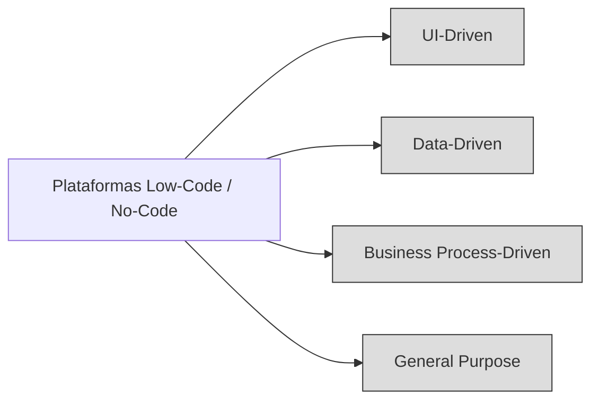

# Valor Y Utilidad De Las Plataformas Low-Code Y No-Code

# 1. Introducción Al Valor De Las Plataformas Low-Code Y No-Code

Las plataformas Low-Code y No-Code aportan beneficios significativos al desarrollo de software, especialmente en contextos donde se busca rapidez, reducción de costos y menor dependencia de personal altamente técnico. Permiten acelerar el ciclo de vida de aplicaciones y facilitan la participación de perfiles no especializados.

---

# 2. Beneficios Principales De Las Plataformas Low-Code / No-Code

## 2.1 Reducción De Esfuerzo Y Costos

- Disminuyen el trabajo manual necesario para construir aplicaciones.
    
- Reducen el coste asociado al desarrollo y a los equipos expertos.
    
- Permiten adaptar rápidamente a nuevos empleados sin altos conocimientos técnicos.

## 2.2 Mayor Velocidad De Desarrollo Y Despliegue

- Aceleran el **time-to-market**.
    
- Automatizan la generación de código y el despliegue, usualmente en la nube.
    
- Facilitación de la creación de **MVPs** (productos mínimos viables).

## 2.3 Accesibilidad Para Perfiles no Técnicos

**Citizen Developer:**  
Persona sin formación profunda en programación que puede crear aplicaciones mediante herramientas visuals.

Estas plataformas permiten formar equipos híbridos con especialistas y no especialistas, reduciendo la brecha técnica.

## 2.4 Incremento De la Agilidad Empresarial

- Adaptación rápida a cambios del entorno de negocio.
    
- Desarrollo iterativo y continuo.
    
- Mantenimiento evolutivo simplificado.

## 2.5 Mejor Gobernanza De TI

Previenen el **Shadow IT**, permitiendo que los usuarios creen soluciones dentro del marco y supervisión del departamento de TI.

---

# 3. Facilitación Del Mantenimiento Y Operaciones

- Menor costo de pruebas gracias a la estandarización.
    
- Despliegues automatizados.
    
- Integración más sencilla con la infraestructura existente.
    
- Mantenimiento evolutivo simplificado mediante modelos actualizables.

---

# 4. Criterios Clave Para Seleccionar Una Plataforma Low-Code / No-Code

## 4.1 Costos

|Tipo de costo|Descripción|
|---|---|
|Fijo|Generalmente licencias por desarrollador|
|Variable|Uso de infraestructura, tamaño o complejidad del modelo|

## 4.2 Riesgo De Lock-in

**Lock-in:** Dependencia del proveedor.  
Consideraciones:

- Qué sucede si el proveedor cambia precios.
    
- Qué ocurre si deja de operar.
    
- ¿El código generado es accessible o portable?

## 4.3 Curva De Aprendizaje

Evaluar lo fácil y rápido que es adoptar la plataforma.

## 4.4 Capacidad De Integración

Compatibilidad con sistemas existentes, APIs, servicios externos o infraestructura previa.

## 4.5 Calidad Del Código Generado

- Cumplimiento de estándares.
    
- Mantenibilidad.
    
- Legibilidad.

## 4.6 Flexibilidad De Despliegue

Posibilidad de ejecutar en:

- Nube pública
    
- Nube privada
    
- Instalación on-premise

## 4.7 Nivel De Personalización

Qué tanto puede adaptarse a necesidades específicas más allá de la configuración estándar.

---

# 5. Enfoques O Categorías De Plataformas Low-Code / No-Code

## 5.1 UI-Driven

- El foco principal es la interfaz de usuario.
    
- El diseño comienza por las pantallas.
    
- Enfoque útil para aplicaciones orientadas a interacción con usuarios finales.

## 5.2 Data-Driven

- El punto de partida son los datos y bases de datos.
    
- Ideal para aplicaciones CRUD, administrativas o centradas en información estructurada.

## 5.3 Business Process-Driven

- Se inicia modelando procesos de negocio.
    
- Adecuado para automatización de flujos, BPM o casos de negocio.

## 5.4 General Purpose

- Combinan procesos, lógica, datos e interfaz de usuario.
    
- Proporcionan flexibilidad total.
    
- Ejemplo representativo: plataformas como OutSystems.

## 5.5 Diagrama Comparativo De Enfoques (Mermaid)

---

# 6. Tabla Comparativa De Enfoques

|Enfoque|Punto de partida|Tipo de aplicaciones ideales|Ventaja|
|---|---|---|---|
|UI-Driven|Pantallas|Apps con mucha interacción visual|Diseño rápido de interfaces|
|Data-Driven|Modelos de datos|Sistemas de gestión y CRUD|Gestión eficiente de datos|
|Business Process-Driven|Procesos|Automatización empresarial|Flujo claro y estructurado|
|General Purpose|Mixto|Soluciones complejas|Flexibilidad alta|

---

# Summary of Key Points

- Las plataformas Low-Code y No-Code reducen costos, esfuerzo y dependencia técnica.
    
- Permiten desarrollar más rápido, desplegar automáticamente y crear MVPs fácilmente.
    
- Favorecen la agilidad organizacional y evitan el Shadow IT mediante gobernanza centralizada.
    
- La selección adecuada require analizar costos, lock-in, integración, curva de aprendizaje y flexibilidad.
    
- Existen cuatro categorías principales: UI-Driven, Data-Driven, Business Process-Driven y General Purpose.

---

# MicroTest

1. ¿Cuál es el enfoque principal de las plataformas low-code UI-driven?
    
	- La respuesta: **c. Interfaz de usuario.**
	    
	- Justificación: Las plataformas UI-driven se centran en que el diseño y modelado inicial parte de las pantallas y la interacción visual del usuario.

2. ¿Cuáles son algunos de los criterios esenciales que las organizaciones deben considerar al seleccionar plataformas low-code y no-code?
	
	- La respuesta: **c. El coste de licenciamiento y uso, la curva de aprendizaje, la capacidad de integración y la posibilidad de adaptación a necesidades específicas.**
	    
	- Justificación: El transcript menciona explícitamente estos criterios como claves en la evaluación y selección de una plataforma.
3. ¿Cuál de las siguientes afirmaciones es una propuesta de valor de las plataformas low-code y no-code?
	
	- La respuesta: **d. Reducción del esfuerzo y costos asociados al desarrollo de software, facilitando la adaptación de nuevos empleados y permitiendo un desarrollo más rápido.**
	    
	- Justificación: Este es uno de los beneficios centrales descritos, destacando eficiencia, reducción de costos y facilidad de adopción.