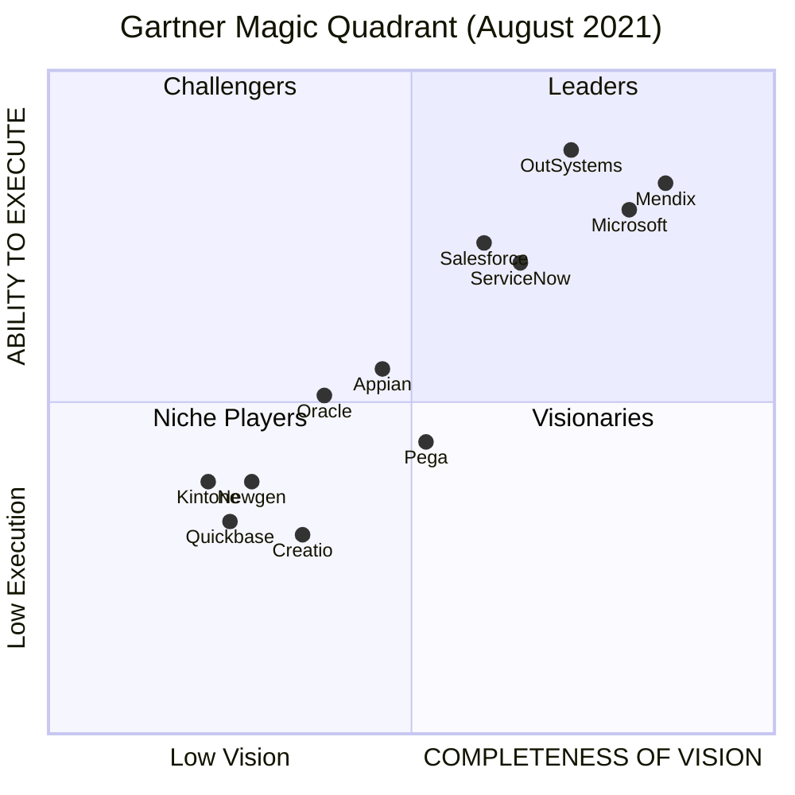
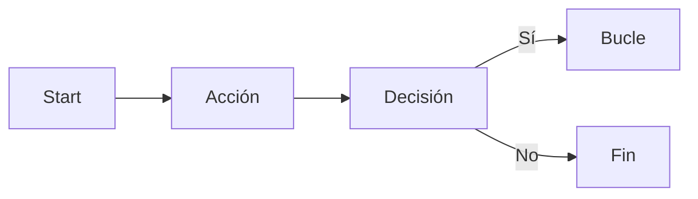
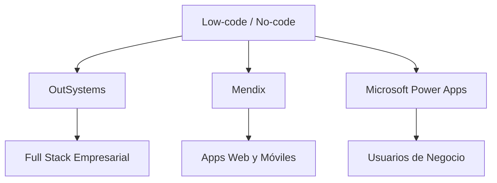

# Idea Clave 3: Principales Plataformas Low-code Y No-code Comerciales (Parte 1)

## 1. Introducción a Las Plataformas Low-code Y No-code

Las plataformas **low-code** y **no-code** son entornos de desarrollo que permiten crear aplicaciones con un uso mínimo (o nulo) de programación tradicional. Su objetivo principal es **acelerar el desarrollo de aplicaciones**, reducir la dependencia de desarrolladores expertos y acercar la creación de software a perfiles de negocio.

- **Low-code**: permiten extender o personalizar con código cuando es necesario.
    
- **No-code**: se basan casi completamente en configuraciones visuals y reglas predefinidas.

Estas plataformas son ampliamente evaluadas por analistas tecnológicos como **Gartner** y **Forrester**, que las posicionan en cuadrantes según su liderazgo, visión y capacidad de ejecución.

---

## 2. Principales Plataformas Líderes Según Analistas

Los informes de Gartner y Forrester identifican como líderes a varias plataformas consolidadas en el mercado:

|Plataforma|Enfoque principal|Tipo|
|---|---|---|
|OutSystems|Aplicaciones empresariales full stack|Low-code|
|Mendix|Apps web y móviles de alta productividad|Low-code|
|Microsoft Power Apps|Apps, flujos y datos para negocio|No-code / Low-code|
|ServiceNow|Servicios y soporte empresarial|Low-code|

Estas soluciones se consideran **top vendors** por su madurez, adopción empresarial y capacidades técnicas.

---

## 3. [OutSystems](https://www.outsystems.com/pricing-and-editions/)

### 3.1 Descripción General

**OutSystems** es una de las plataformas low-code mejor posicionadas por Gartner y Forrester, considerada líder de mercado desde hace años.

Está orientada al desarrollo de **aplicaciones empresariales**, especialmente aquellas relacionadas con:

- Gestión de datos
    
- Interacción con usuarios
    
- Procesos de negocio
    
- Aplicaciones responsive y multiplataforma

No está pensada para casos como videojuegos o análisis estadístico avanzado.

---

### 3.2 Características Principales

- Entorno de desarrollo **integrado de escritorio** (no web).
    
- Despliegue **nativo en la nube**.
    
- Generación de **aplicaciones nativas** para distintos dispositivos.
    
- Conectores predefinidos para **fuentes de datos externas**.
    
- Orientada tanto a perfiles técnicos como no técnicos.
    
- Formación que permite crear aplicaciones en **menos de tres semanas**.

---

### 3.3 Desarrollo Visual Y Arquitectura

OutSystems permite un **desarrollo visual full stack**, donde el usuario puede modelar:

- Base de datos
    
- Lógica de negocio del servidor
    
- Integraciones con APIs y apps externas
    
- Interfaz de usuario
    
- Procesos de negocio

El despliegue se realiza con **un solo clic**, generando automáticamente el código.

**Arquitectura tecnológica**:

- Basada en **.NET** y **ASP.NET Core**
    
- Modelo **Platform as a Service (PaaS)** desplegado directamente en la nube de OutSystems.

---

### 3.4 Definición De Lógica Y Flujos

La lógica se define mediante un sistema visual similar a un **diagrama de actividades**:

- Disparadores (start)
    
- Acciones
    
- Bucles
    
- Decisiones condicionales

Uno de sus elementos más potentes es el **editor de expresiones**, que permite definir reglas complejas sin escribir código tradicional.

---

## 4. Mendix

### 4.1 Descripción General

**Mendix**, adquirida por Siemens, es una plataforma de **altísima productividad** para crear aplicaciones web y móviles. Combina capacidades **no-code** con la opción de extender funcionalidades mediante código, lo que la sitúa claramente como **low-code**.

---

### 4.2 Entorno De Desarrollo

El entorno de desarrollo se denomina **Mendix Studio**, y se basa en:

- Modelado visual
    
- Técnicas de **drag & drop**
    
- Orientación a perfiles técnicos y de negocio

Facilita el diseño del **modelo de dominio**, usuarios y roles del sistema.

---

### 4.3 Lógica De Negocio: Microflujos Y Nanoflujos

Mendix introduce dos conceptos clave para definir la lógica empresarial:

- **Microflujos**:  
    Lógica ejecutada en el servidor, ideal para procesos complejos y reglas de negocio.
    
- **Nanoflujos**:  
    Lógica ligera, generalmente ejecutada del lado del cliente, orientada a interacción rápida.

Ambos conceptos son visuals y conceptualmente similares a los flujos de OutSystems.

---

### 4.4 Otras Funcionalidades Destacadas

- **Depuración en vivo** para identificar y corregir errores rápidamente.
    
- Soporte completo para aplicaciones web y móviles.
    
- Alta escalabilidad y enfoque empresarial.

---

## 5. [Microsoft Power Apps](https://www.microsoft.com/en-us/power-platform/products/power-apps#pricing)

### 5.1 Descripción General

**Microsoft Power Apps** forma parte de la suite Power Platform y está especialmente orientada a **usuarios no técnicos y perfiles de negocio**. Permite crear aplicaciones, flujos y modelos de datos con despliegue nativo en **Microsoft Azure**.

---

### 5.2 Components Principales De la Power Platform

|Componente|Función|
|---|---|
|Power Apps|Creación de aplicaciones personalizadas|
|Power Automate|Automatización de procesos y flujos de trabajo|
|Power BI|Analítica y visualización de datos|
|Power Virtual Agents|Creación de chatbots|

---

### 5.3 Integración Y Evolución Con IA

- Integración nativa con **Power BI** para análisis de datos.
    
- En versiones recientes se prevé la inclusión de:
    
    - **Copilot**
        
    - **Power AI Builder**
        
- El objetivo es permitir la creación de aplicaciones y pantallas mediante **interfaces conversacionales basadas en inteligencia artificial** (aún no totalmente integradas en el memento del vídeo).

---

## 6. Comparativa Conceptual De Las Plataformas

---

## 7. Información Adicional Relevante

- Estas plataformas reducen el **time-to-market** de aplicaciones empresariales.
    
- Facilitan la colaboración entre **TI y negocio**.
    
- Son especialmente útiles para:
    
    - Automatización de procesos
        
    - Aplicaciones internas
        
    - Prototipado rápido
        
    - Modernización de sistemas legacy

---

## 8. Resumen De Puntos Clave

- Las plataformas low-code/no-code lideran el desarrollo rápido de aplicaciones empresariales.
    
- OutSystems destaca por su enfoque full stack y potencia técnica.
    
- Mendix combina facilidad visual con extensibilidad mediante código.
    
- Microsoft Power Apps está claramente orientada a usuarios de negocio e integración con Azure.
    
- Gartner y Forrester posicionan estas soluciones como líderes del mercado.
    
- La tendencia futura apunta a una mayor integración de **inteligencia artificial** en el desarrollo.

---

## MicroTest

1. Según el análisis de Forrester, ¿qué solución low-code no está entre los líderes del mercado?
    
    - La respuesta: c. Appian.
        
    - Justificación: En el transcript se mencionan como líderes según Forrester y Gartner a OutSystems, Mendix, Microsoft Power Apps y ServiceNow. Appian no aparece citado dentro de los líderes mencionados en el análisis presentado.
        
2. Según el cuadrante de Gartner, ¿qué solución low-code está entre los líderes del mercado?
    
    - La respuesta: d. Todas las anteriores.
        
    - Justificación: El transcript indica que Gartner posiciona como líderes a OutSystems, Mendix y Microsoft Power Apps, por lo que todas las opciones listadas forman parte del grupo de líderes.
        
3. Marca la respuesta incorrecta en relación con la plataforma OutSystems:
    
    - La respuesta: d. Todas las anteriores.
        
    - Justificación: OutSystems no tiene un IDE web colaborativo sino uno de escritorio, no permite seleccionar libremente la tecnología de generación de código (está basada en .NET y ASP.NET Core) y no se menciona soporte para asistentes tipo Copilot, por lo que todas las afirmaciones previas son incorrectas.