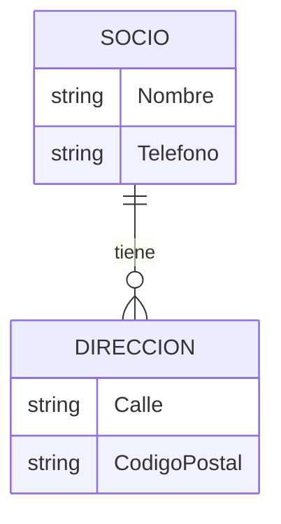

# Idea Clave 4: Principales Plataformas Low-code Y No-code Comerciales (Parte 2)

**Demostración práctica con OutSystems**

## 1. Introducción a la Demostración

En este vídeo se muestra una **demostración práctica** del uso de **OutSystems**, centrada en la creación de una aplicación desde cero y en cómo la plataforma permite modelar rápidamente los distintos elementos de una aplicación empresarial.

La demo cubre:

- Creación del entorno
    
- Modelado de datos
    
- Generación automática de interfaces
    
- Publicación en la nube
    
- Manejo de relaciones entre entidades
    
- Implementación básica de lógica de negocio

---

## 2. Preparación Del Entorno En OutSystems

### 2.1 Creación De Cuenta Y Entorno

Para comenzar a trabajar con OutSystems es necesario:

1. Crear una **cuenta gratuita** en OutSystems.
    
2. Crear un **entorno** (environment).
    
3. Descargar el **entorno de desarrollo** (IDE de escritorio).

OutSystems utilize un **IDE desktop**, no basado en navegador.

---

### 2.2 Creación De Una Nueva Aplicación

- Se crea una aplicación nueva desde cero.
    
- Se genera al menos **un módulo**, requisito mínimo para que la aplicación funcione.
    
- Todo el desarrollo se realiza dentro del entorno visual del IDE.

---

## 3. Modelado De la Aplicación

OutSystems permite modelar visualmente todos los components principales de una aplicación:

- **Base de datos**
    
- **Lógica de negocio**
    
- **Interfaz de usuario**
    
- **Procesos de negocio**

Si el proyecto está correctamente modelado, se puede **publicar** pulsando el botón verde, que inicia el despliegue automático.

---

## 4. Ejemplo Práctico 1: Modelado De Datos (Entidad Socio)

### 4.1 Creación De la Entidad

Se crea una entidad llamada **Socio**, marcada como pública para permitir acceso anónimo.

Campos definidos:

- Nombre
    
- Teléfono
    
- Fecha de nacimiento

Este paso representa el **modelado de la base de datos**, sin escribir código SQL.

---

### 4.2 Generación Automática De Interfaz

- Se arrastra la entidad **Socio** a la capa de interfaz.
    
- OutSystems genera automáticamente:
    
    - Una **lista** de socios
        
    - Una **ficha de detalle** del socio

Por defecto, la plataforma usa su sistema nativo de control de usuarios, pero al marcar la entidad como pública se elimina la autenticación.

---

## 5. Publicación De la Aplicación

### 5.1 Proceso De Publicación

Al pulsar el botón verde:

1. Se validan los modelos.
    
2. Se genera el código automáticamente.
    
3. Se compila la aplicación.
    
4. Se empaqueta.
    
5. Se despliega en la nube de OutSystems.

Características clave:

- El **código fuente no es accessible** para el usuario.
    
- Al finalizar, el botón cambia a azul y se obtiene una **URL pública** para acceder a la aplicación.

---

## 6. Ejemplo Práctico 2: Inserción De Datos

Desde la aplicación publicada:

- Se añaden nuevos socios mediante la interfaz generada.
    
- Los datos se guardan directamente en la base de datos modelada.

Esto demuestra la integración automática entre:

- Datos
    
- Interfaz
    
- Lógica básica de persistencia

---

## 7. Ejemplo Práctico 3: Relación Entre Entidades (Socio Y Dirección)

### 7.1 Creación De la Entidad Dirección

Se crea una nueva entidad llamada **Dirección** con los campos:

- Called
    
- Código postal

Relación definida:

- Un **socio puede tener varias direcciones**.
    
- Una **dirección pertenece a un único socio**.

Esto representa una relación **uno a muchos (1:N)**.

---

### 7.2 Generación Automática De Pantallas

- Al arrastrar la entidad Dirección a la interfaz:
    
    - Se generan automáticamente la lista y la ficha.
        
    - Se añade una nueva opción en el menú de navegación.

Si la entidad no es pública, el sistema solicita autenticación.

---

### 7.3 Configuración De Acceso Público

Para permitir acceso anónimo:

- Se marca la pantalla de Direcciones como pública.
    
- Se vuelve a publicar la aplicación.

---

## 8. Mostrar Direcciones Asociadas a Un Socio

### 8.1 Creación De Una Consulta Filtrada

Dentro de la ficha del socio:

1. Se crea una nueva **fetch (consulta)**.
    
2. Se filtran las direcciones donde:
    
    - El socio de la dirección sea igual al socio actual de la pantalla.

---

### 8.2 Visualización En la Interfaz

- Se arrastra el resultado de la consulta a la pantalla.
    
- OutSystems muestra automáticamente las direcciones asociadas al socio seleccionado.

Resultado:

- En la ficha del socio se ven tanto sus datos como sus direcciones.
    
- Si un socio no tiene direcciones, no se muestra información adicional.

---

## 9. Ejemplo Práctico 4: Lógica De Borrado De Un Socio

### 9.1 Creación Del Botón De Borrado

- Se duplica un botón existente.
    
- Se renombra como **Delete**.
    
- Se configura para que sea visible solo bajo ciertas condiciones usando el **editor de expresiones**.

---

### 9.2 Acción Del Botón

- Se crea una **Client Action** asociada al botón.
    
- Esta acción ejecuta la operación de borrado sobre la entidad Socio.

---

### 9.3 Problema Detectado

- Si un socio tiene direcciones asociadas, el borrado falla.
    
- Se produce un error porque no se ha controlado la integridad referential.

Este comportamiento es correcto desde el punto de vista de los datos, pero require lógica adicional.

---

### 9.4 Posibles Mejoras

Para corregir el problema se debería:

- Comprobar antes del borrado si el socio tiene direcciones.
    
- Evitar el borrado o mostrar un mensaje informativo.
    
- Redirigir correctamente a la lista de socios tras el borrado exitoso.

---

## 10. Capacidades Demostradas De OutSystems

Durante la demo se evidencian varias capacidades clave:

|Capacidad|Descripción|
|---|---|
|Modelado de datos|Creación visual de entidades y relaciones|
|UI automática|Generación de listas y fichas|
|Publicación rápida|Despliegue en la nube con un clic|
|Lógica visual|Acciones y expresiones sin código|
|Integridad de datos|Control de relaciones entre entidades|

---

## 11. Información Adicional Relevante

- OutSystems integra automáticamente frontend, backend y base de datos.
    
- Favorece el **desarrollo rápido de aplicaciones empresariales**.
    
- La lógica compleja require planificación previa del modelo de datos.
    
- Es fundamental controlar validaciones y reglas antes de operaciones críticas como el borrado.

---

## 12. Resumen De Puntos Clave

- OutSystems permite crear aplicaciones completas desde cero de forma visual.
    
- El modelado de datos genera automáticamente interfaces funcionales.
    
- La publicación se realiza con un solo clic en la nube.
    
- Las relaciones entre entidades se gestionan de forma gráfica.
    
- La lógica de negocio básica se implementa mediante acciones y expresiones.
    
- Es necesario añadir controles adicionales para evitar errores de integridad.

---

## MicroTest

1. El modelo de generación de código en OutSystems es el siguiente:
    
    - La respuesta: b.
        
    - Justificación: En la demo se muestra que al pulsar el botón verde superior OutSystems valida los modelos, genera automáticamente el código, lo compila, lo empaqueta y lo despliega directamente en su nube sin intervención adicional del usuario.
        
2. OutSystems genera código:
    
    - La respuesta: c.
        
    - Justificación: OutSystems utilize una arquitectura basada en .NET, pero este proceso es completamente transparente para el usuario, que no ve ni selecciona la tecnología ni los patrones de generación de código.
        
3. OutSystems permite modelar:
    
    - La respuesta: d.
        
    - Justificación: La plataforma permite modelar visualmente la base de datos, la lógica de negocio tanto en el cliente como en el servidor y las pantallas de interacción con el usuario, tal como se demuestra en la creación de entidades, acciones y interfaces.