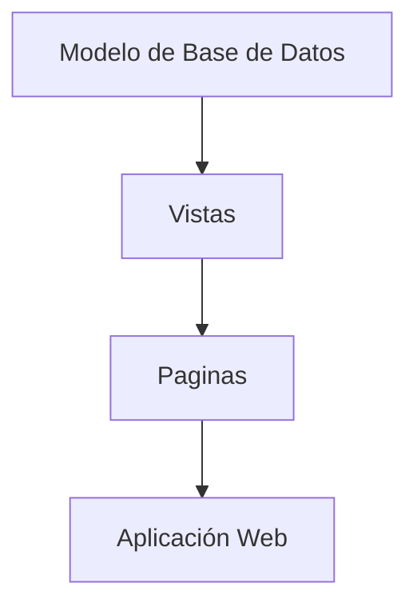
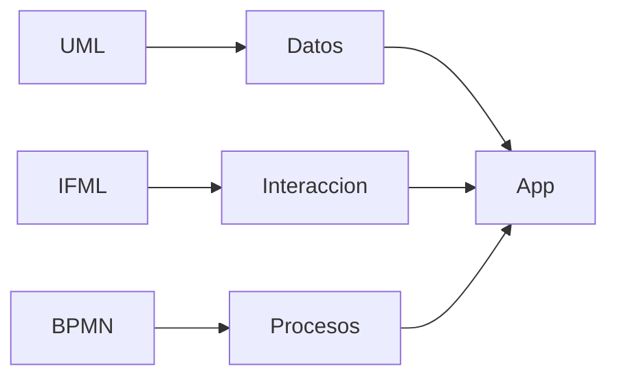

# Idea Clave 5: Principales Plataformas Low-code Y No-code Abiertas (Parte 1)

## 1. Introducción a Las Plataformas Low-code Y No-code Abiertas

Las plataformas **low-code** y **no-code abiertas** son soluciones cuyo **código fuente está disponible** y el **código generado es accessible**, lo que permite mayor control, personalización y despliegue flexible.  
Importante: _abiertas_ no implica necesariamente _gratuitas_; implica **acceso al código y transparencia tecnológica**.

**Relevancia**

- Mayor control sobre la arquitectura y el despliegue.
    
- Posibilidad de auditoría y extensión profunda.
    
- Alternativa a plataformas comerciales cerradas (vendor lock-in).

---

## 2. Panorama General De Plataformas Abiertas

Existe un conjunto amplio y en crecimiento de plataformas abiertas citadas en literatura técnica, análisis de mercado y revisiones especializadas. La lista no es exhaustiva debido a la rápida evolución del ecosistema.

**Criterios comunes**

- Acceso al código fuente.
    
- Generación de código visible.
    
- Enfoque en productividad y modelado visual.
    
- Soporte para despliegues en nube y on-premise.

---

## 3. Saltcorn

### 3.1 Definición Y Enfoque

**Saltcorn** es una plataforma **no-code** con capacidad **low-code**, orientada al desarrollo de **aplicaciones web data-driven** (centradas en bases de datos).

- Permite crear aplicaciones sin programar.
    
- Puede extenderse con **JavaScript** y arquitecturas **event-driven**.
    
- Ideal para aplicaciones de gestión de datos.

---

### 3.2 Modelado Y Funcionamiento

El desarrollo se basa en:

1. **Modelado de la base de datos** (entidades y relaciones).
    
2. Definición de **vistas**.
    
3. Construcción de **páginas** combinando vistas.

Tipos de vistas:

- Lista de elementos.
    
- Ficha editable.
    
- Ficha solo lectura.
    
- Carruseles.
    
- Filtros.

Este enfoque evita formularios tradicionales y se basa en modelos similares a **Entidad-Relación / UML**.

---

### 3.3 Casos De Uso Y Ejemplos

Saltcorn ofrece ejemplos listos para usar, como:

- Blogs
    
- Libretas de notas
    
- Gestión de proyectos
    
- Seguimiento de incidencias
    
- Wikis
    
- Gestión de equipos

Estos ejemplos sirven como base para personalizar aplicaciones rápidamente.

---

### 3.4 Licencia Y Despliegue

- **Licencia MIT**.
    
- Opciones de despliegue:
    
    - Nube de Saltcorn (pruebas o PaaS).
        
    - Despliegue **on-premise**.
        
    - Entornos locales descargables.

---

## 4. WebRatio

### 4.1 Definición Y Propósito

**WebRatio** es una plataforma visual para crear **aplicaciones empresariales web y móviles** sin necesidad de programar, con fuerte énfasis en la **digitalización de procesos**.

---

### 4.2 Entornos De Desarrollo

WebRatio dispone de tres entornos diferenciados:

- **Web**
    
- **Mobile**
    
- **Business Process Automation (BPA)**

Esto permite cubrir aplicaciones, movilidad y automatización de procesos desde una misma plataforma.

---

### 4.3 Herramientas Visuals

Incluye diseñadores visuals especializados:

- Interaction Flow Designer
    
- GeoSpatial Designer
    
- Business Process Designer

Estas herramientas facilitan el diseño intuitivo de aplicaciones complejas.

---

### 4.4 Uso De Lenguajes De Modelado Estándar

WebRatio destaca por el uso intensivo de estándares de modelado:

|Lenguaje|Uso principal|
|---|---|
|IFML|Modelado de flujos de interacción|
|BPMN|Modelado de procesos de negocio|
|UML|Estructuras de datos y arquitectura|

---

### 4.5 Barrera De Entrada

Aunque potente, WebRatio presenta una **curva de aprendizaje elevada**:

- IFML y BPMN no son triviales para perfiles no técnicos.
    
- Require conocimientos previous de estándares de modelado (OMG).

---

## 5. ABP Framework

### 5.1 Definición

**ABP Framework** es una infraestructura integral para la construcción de **aplicaciones web modernas**, basada en **mejores prácticas de ingeniería de software**.

No es puramente no-code, sino una solución **low-code orientada a desarrolladores**.

---

### 5.2 Tecnología Y Arquitectura

- Diseñado para **.NET y ASP.NET Core**.
    
- Proporciona una arquitectura robusta y estructurada.
    
- Incluye:
    
    - Plantillas de inicio
        
    - Módulos
        
    - Temas
        
    - Herramientas
        
    - Guías y documentación

---

### 5.3 Objetivo Principal

- Automatizar tareas repetitivas del desarrollo.
    
- Facilitar la correcta implementación de arquitecturas modernas.
    
- Garantizar consistencia y calidad del código.

Se compara conceptualmente con **JHipster**, aunque con tecnologías distintas y enfoque específico en .NET.

---

## 6. Comparativa Resumida De Plataformas

| Plataforma    | Tipo               | Enfoque principal             | Público objetivo       |
| ------------- | ------------------ | ----------------------------- | ---------------------- |
| Saltcorn      | No-code / Low-code | Apps web data-driven          | No técnicos y técnicos |
| WebRatio      | Low-code           | Apps empresariales y procesos | Técnicos / analistas   |
| ABP Framework | Low-code           | Arquitectura web .NET         | Desarrolladores        |

---

## 7. Información Adicional Relevante

- Las plataformas abiertas reducen la dependencia de proveedores.
    
- Son ideales para organizaciones con requisitos de seguridad o despliegue local.
    
- La elección depende del equilibrio entre facilidad de uso y control técnico.
    
- No todas son adecuadas para perfiles completamente no técnicos.

---

## 8. Resumen De Puntos Clave

- Las plataformas low-code/no-code abiertas ofrecen acceso al código fuente y mayor control.
    
- Saltcorn destaca por su enfoque data-driven y facilidad de uso.
    
- WebRatio se apoya en estándares de modelado como IFML, BPMN y UML.
    
- ABP Framework está orientado a arquitecturas .NET y buenas prácticas.
    
- La apertura implica flexibilidad, pero puede aumentar la complejidad inicial.

---

## MicroTest

1. ¿Cuál de las siguientes plataformas low-code hace uso del estándar interaction flow modeling language para crear los modelos?
    
    - La respuesta: a. WebRatio.
        
    - Justificación: En el transcript se indica explícitamente que WebRatio utilize de forma extensiva lenguajes de modelado estándar como IFML (Interaction Flow Modeling Language) para definir los flujos de interacción de las aplicaciones.
        
2. Saltcorn es una plataforma low-code cuyo enfoque de modelado es:
    
    - La respuesta: c. Data-driven.
        
    - Justificación: Saltcorn se describe como una plataforma claramente orientada a aplicaciones de gestión de bases de datos, donde primero se modelan los datos y a partir de ellos se generan vistas y páginas, lo que corresponde a un enfoque data-driven.
        
3. ¿Cuál de las siguientes plataformas low-code genera soluciones basadas en ASP.NET Core?
    
    - La respuesta: c. abp.io.
        
    - Justificación: El ABP Framework (abp.io) está diseñado específicamente para la pila tecnológica .NET y ASP.NET Core, mientras que Saltcorn y OpenXava no se basan en esta tecnología.