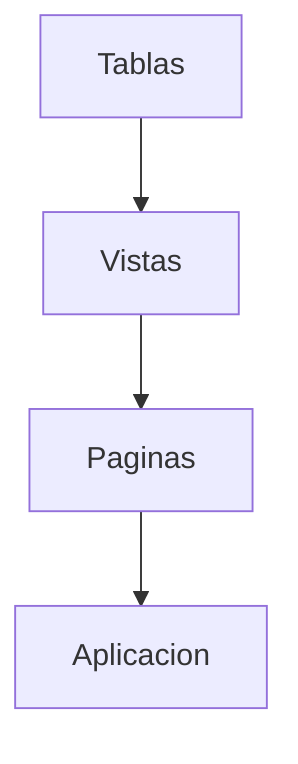
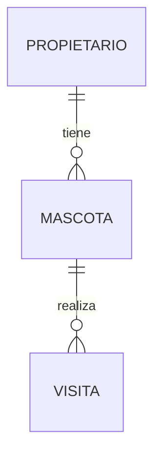

# Idea Clave 6: Principales Plataformas Low-code Y No-code Abiertas (Parte 2)

**Demostración práctica con Saltcorn**

## 1. Introducción a la Demostración

En este vídeo se presenta una **demostración práctica** de **Saltcorn**, una plataforma **abierta**, **low-code / casi no-code**, orientada principalmente a la **gestión de datos**. El objetivo es mostrar cómo crear una aplicación completa modelando datos, vistas y páginas, sin necesidad de programación tradicional.

Saltcorn es especialmente adecuada para:

- Aplicaciones CRUD
    
- Sistemas de gestión de información
    
- Portales internos y herramientas administrativas

---

## 2. Conceptos Fundamentales En Saltcorn

Saltcorn permite definir cuatro tipos principales de elementos:

|Elemento|Descripción|
|---|---|
|Tablas|Definen el modelo de datos|
|Vistas|Formas de interactuar con los datos|
|Páginas|Composición de vistas|
|Otros|Integraciones, triggers y extensions|

Estos elementos se combinan para construir aplicaciones web completas.

---

## 3. Instalación Y Ejecución

### 3.1 Opciones De Uso

- Uso online mediante la demo en la web (no siempre disponible).
    
- Instalación local (opción mostrada en el vídeo).

### 3.2 Instalación Con Docker

Pasos recomendados:

1. Clonar el repositorio de Saltcorn.
    
2. Ejecutar **Docker Compose**.
    
3. Acceder al entorno web.
    
4. Crear el usuario administrador en el primer arranque.

Este método permite tener el entorno operativo rápidamente.

---

## 4. Ejemplo Práctico 1: Creación De Una Tabla (Socios)

### 4.1 Definición De la Tabla

Se crea una tabla llamada **Socios**, definiendo campos con validaciones.

Campos definidos:

- **Nombre**
    
    - Obligatorio
        
    - Longitud mínima
        
    - Longitud máxima
        
    - Expresiones regulares
        
    - Mensajes de error personalizados
        
- **Fecha de nacimiento**
    
    - Tipo fecha
        
- **Tipo de socio**
    
    - Enumerado (por ejemplo: premium, basic, platinum)
        
- **Saldo**
    
    - Numérico
        
    - Valor mínimo (0)
        
- **Anulado**
    
    - Booleano

Este paso representa el **modelado data-driven**, donde el diseño de la base de datos es el punto de partida.

---

### 4.2 Relaciones Entre Tablas

Saltcorn permite definir relaciones entre tablas (1:N, N:M).  
Ejemplo citado:

- Un **propietario** tiene varias **mascotas**.
    
- Una **mascota** tiene varias **visitas**.

Estas relaciones permiten mostrar información relacionada de forma jerárquica en la interfaz.

---

## 5. Vistas En Saltcorn

### 5.1 Definición De Vista

Una **vista** es la forma en que el usuario interactúa con una tabla.

### 5.2 Tipos De Vistas Disponibles

|Tipo de vista|Función|
|---|---|
|List|Lista en formato tabla|
|Edit|Ficha editable|
|Show|Ficha solo lectura|
|List + Show|Lista y ficha combinadas|
|Feed|Entradas tipo blog|
|Filter|Filtrado de datos|

---

## 6. Ejemplo Práctico 2: Lista De Socios

### 6.1 Creación De la Lista

- Se crea una vista de tipo **List** sobre la tabla Socios.
    
- Se marca como **pública**.
    
- Se seleccionan los campos visible:
    
    - Nombre
        
    - Fecha de nacimiento
        
    - Saldo
        
    - Anulado
        
    - Tipo de socio

Esto genera automáticamente una rejilla con los datos.

---

## 7. Ejemplo Práctico 3: Ficha De Socio

### 7.1 Creación De la Ficha

- Vista de tipo **Edit**.
    
- Asociada a la tabla Socios.
    
- Marcada como pública.

### 7.2 Personalización

- Reordenación visual de los campos.
    
- Inclusión de texto descriptivo.
    
- Botón **Save** para guardar cambios.
    
- Botón **Go back** como acción secundaria para volver a la pantalla anterior.

---

## 8. Ejemplo Práctico 4: Vista Lista-ficha

### 8.1 Vista Combinada

- Se crea una vista **List + Show/Edit**.
    
- Permite:
    
    - Ver la lista de socios.
        
    - Editar un socio seleccionado en la misma pantalla.

Este patrón mejora la experiencia de usuario en aplicaciones administrativas.

---

## 9. Acción De Añadir Nuevos Registros

### 9.1 Configuración Del Botón "Añadir"

- Se edita la vista de lista.
    
- Se define una acción:
    
    - Tipo: enlace
        
    - Texto: "Añadir"
        
    - Posición: parte superior izquierda
        
    - Destino: ficha de creación

---

### 9.2 Validaciones En Acción

Al crear un socio:

- Se validan automáticamente las reglas definidas en la tabla (longitud mínima, valores obligatorios, etc.).
    
- Si los datos no cumplen las reglas, se muestran mensajes de error.

---

## 10. Edición Y Navegación

Desde la vista lista-ficha:

- Se pueden editar socios existentes.
    
- Se actualizan los datos en tiempo real.
    
- La navegación entre vistas es automática y declarativa.

---

## 11. Ejemplo Avanzado: Datos Relacionados

En un ejemplo más complejo:

- Desde la ficha de un propietario:
    
    - Se muestra su información.
        
    - Se lista sus mascotas.
        
    - Desde cada mascota se accede a las visitas asociadas.

Este comportamiento se basa directamente en las **relaciones entre tablas**, sin código adicional.

---

## 12. Extensibilidad Mediante Módulos

Saltcorn permite:

- Instalar módulos adicionales desde el panel.
    
- Añadir components como:
    
    - Date pickers
        
    - Elementos visuals avanzados
        
    - Controles personalizados

La instalación es directa y los components quedan disponibles en el editor visual.

---

## 13. Capacidades Demostradas De Saltcorn

|Capacidad|Descripción|
|---|---|
|Modelado data-driven|El diseño parte de la base de datos|
|Validaciones|Definidas a nivel de campo|
|UI declarativa|Generación automática de vistas|
|Relaciones|Navegación entre datos relacionados|
|Extensibilidad|Plugins y módulos instalables|

---

## 14. Información Adicional Relevante

- Saltcorn es ideal para aplicaciones de gestión de datos.
    
- Reduce significativamente el tiempo de desarrollo.
    
- Permite despliegues locales, en la nube o híbridos.
    
- Combina simplicidad no-code con extensibilidad low-code.

---

## 15. Resumen De Puntos Clave

- Saltcorn es una plataforma abierta low-code orientada a datos.
    
- El desarrollo se basa en tablas, vistas y páginas.
    
- Las validaciones se definen directamente en el modelo.
    
- Las relaciones permiten mostrar datos jerárquicos sin código.
    
- La interfaz se genera de forma automática y personalizable.
    
- La extensibilidad se logra mediante módulos instalables.

---

## MicroTest

1. En Saltcorn, ¿cómo se representa un tipo enumerado?
    
    - La respuesta: c. Mediante la propiedad Options asociada a un campo de tipo String.
        
    - Justificación: En Saltcorn los tipos enumerados no se definen como un datatype independiente, sino como un campo (normalmente String) al que se le configuran las **Options**, donde se listan los valores permitidos (por ejemplo: basic, premium, platinum).
        
2. Indica el tipo de vista que Saltcorn no tiene:
    
    - La respuesta: c. Ficha con detalles (Edit+Select).
        
    - Justificación: Saltcorn dispone de vistas como List, Edit, Show, List+Show y Filter. No existe una vista denominada explícitamente “Edit+Select”; las vistas combinadas se manejan mediante configuraciones como List+Show o mediante relaciones entre tablas.
        
3. Los elementos conceptuales que tiene Saltcorn para modelar son:
    
    - La respuesta: a. Tablas, vistas y páginas.
        
    - Justificación: El modelado en Saltcorn se basa en **tablas** para los datos, **vistas** para la interacción con esos datos y **páginas** para componer y organizar las vistas dentro de la aplicación.