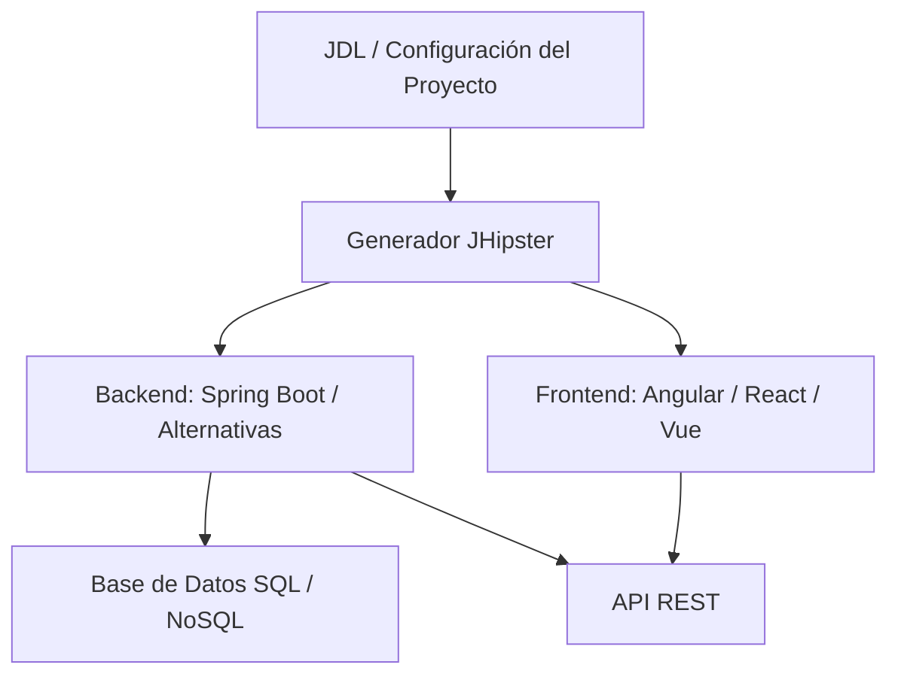

# Idea Clave 7: Principales Plataformas Aceleradoras (Parte 1)

## 1. Introducción a Las Plataformas Aceleradoras De Desarrollo

### Definición

Las **plataformas aceleradoras de desarrollo** son herramientas que permiten generar automáticamente una base inicial de un proyecto de software (bootstrap), creando un **esqueleto o arquetipo** con configuraciones y código predefinido.

### Contexto Y Relevancia

- No siempre se consideran estrictamente **low-code** o **no-code**.
    
- Su objetivo principal es **agilizar la fase inicial del desarrollo**, reduciendo el tiempo necesario para empezar un proyecto desde cero.
    
- Son especialmente útiles en entornos empresariales y proyectos grandes donde la estandarización es clave.

### Ventaja Principal

- Generación rápida de la estructura del proyecto.
    
- Reducción del código repetitivo (boilerplate).

### Limitación Principal

- Una vez generado el proyecto, el desarrollo posterior se realiza **manualmente sobre el código fuente**.
    
- Existe una **dificultad de sincronización** entre:
    
    - El modelo original definido en la herramienta.
        
    - Los cambios manuales realizados posteriormente en el código.

---

## 2. Concepto De Bootstrap Y Generación De Esqueletos

### Bootstrap En Desarrollo De Software

El **bootstrap** es el proceso de crear la estructura inicial de una aplicación, incluyendo:

- Arquitectura base.
    
- Configuración del entorno.
    
- Integración inicial de tecnologías.

### Importancia

- Acelera el arranque del proyecto.
    
- Reduce errores de configuración inicial.
    
- Establece buenas prácticas desde el inicio.

---

## 3. JHipster: Plataforma Aceleradora De Código Abierto

### Definición

**JHipster** es una plataforma de desarrollo **open source** que permite generar automáticamente aplicaciones web modernas, principalmente basadas en:

- **Backend**: Java con Spring Boot.
    
- **Frontend**: Angular, React o Vue.

### Objetivo Principal

Facilitar la creación de aplicaciones listas para usar a partir de:

- Un **cuestionario de configuración del proyecto**.
    
- Un **modelo de datos** definido mediante un lenguaje específico.

---

## 4. Modelado Y Generación Automática En JHipster

### Configuración Del Proyecto

- Se responde un **cuestionario inicial**.
    
- La información se guarda en un archivo de configuración.

### JDL (JHipster Domain Language)

**JDL** es un lenguaje declarativo que permite:

- Definir entidades.
    
- Especificar relaciones entre entidades.
    
- Describir atributos y restricciones.

#### Relevancia Del JDL

- Centraliza el modelo de datos.
    
- Permite generar automáticamente:
    
    - Entidades.
        
    - Controladores.
        
    - Servicios.
        
    - Repositorios.

---

## 5. Arquitectura Generada Por JHipster

### Tipos De Arquitectura Soportados

- **Monolítica**
    
- **Microservicios**

### Tecnologías Principales

|Capa|Tecnologías soportadas|
|---|---|
|Backend|Spring Boot (Java, Kotlin), Micronaut, Quarkus, Node.js, .NET|
|Frontend|Angular, React, Vue|
|Móvil|Ionic, React Native|
|Base de datos|SQL y NoSQL|
|Infraestructura|Kubernetes, Cloud Providers|

### Relación Entre Components (arquitectura general)

---

## 6. Generación De Código Y Funcionalidades Incluidas

### Código Generado Automáticamente

- API REST completa:
    
    - Controladores.
        
    - Servicios.
        
    - Repositorios.
        
- Código boilerplate para acelerar el desarrollo.

### Seguridad

Incluye integración automática de:

- **JWT (JSON Web Token)**.
    
- **OAuth 2**.  
    Para autenticación y autorización segura de endpoints.

### Gestión De Base De Datos

- Soporte para bases de datos **SQL y NoSQL**.
    
- Gestión de esquemas mediante **Liquibase**.

---

## 7. Productividad Y Desarrollo Ágil

### Funcionalidades Para Desarrollo Rápido

- Recarga automática para visualizar cambios en tiempo real.
    
- Facilita la creación rápida de prototipos.

### Integración CI/CD

- Soporte para **pipelines de Integración Continua y Despliegue Continuo (CI/CD)**.
    
- Favorece el trabajo colaborativo y la entrega frecuente.

---

## 8. Internacionalización Y Documentación

### Internacionalización (i18n)

- Soporte nativo para aplicaciones multilingües.
    
- Permite definir y gestionar múltiples idiomas desde el inicio.

### Documentación Automática

- Generación de documentación de la API usando:
    
    - **Swagger**
        
    - **Asciidoctor**

---

## 9. Herramientas Adicionales De JHipster

### JHipster CLI

- Interfaz de línea de commandos.
    
- Facilita:
    
    - Generación de proyectos.
        
    - Administración del código generado.
        
    - Regeneración parcial del proyecto.

---

## 10. Despliegue Y Enfoque Cloud Native

### Principios Cloud Native

- Aplicaciones preparadas para contenedores.
    
- Configuración flexible y parametrizable.

### Plataformas De Despliegue Soportadas

- Kubernetes
    
- AWS
    
- Azure
    
- Google Cloud
    
- Cloud Foundry
    
- Heroku
    
- OpenShift

---

## 11. Uso Y Popularidad De JHipster

### Contexto De Uso

- Muy utilizado en:
    
    - Aplicaciones empresariales.
        
    - Proyectos basados en microservicios.

### Razones De Su Popularidad

- Acelera el desarrollo.
    
- Aplica buenas prácticas de la industria.
    
- Ofrece un ecosistema completo y robusto.

---

## Resumen De Puntos Clave

- Las plataformas aceleradoras generan rápidamente el esqueleto de un proyecto.
    
- JHipster es una herramienta open source orientada a aplicaciones web modernas.
    
- Utilize cuestionarios y JDL para generar backend, frontend y configuraciones.
    
- Soporta múltiples arquitecturas, tecnologías y despliegues en la nube.
    
- Su principal limitación es la sincronización entre modelo y cambios manuales.
    
- Es ampliamente usada en entornos empresariales por su productividad y robustez.

---

## MicroTest

1. Marca la respuesta correcta. Las plataformas aceleradoras que generan automáticamente mucho código son:
    
    - La respuesta: c.
        
    - Justificación: Estas plataformas no encajan estrictamente en low-code o no-code, ya que su función principal es generar un esqueleto inicial del proyecto y, a partir de ahí, el desarrollo continúa programando manualmente sobre el código generado.
        
2. Un problema asociado a este tipo de plataformas es:
    
    - La respuesta: b.
        
    - Justificación: Una de las principales limitaciones es la dificultad de sincronización: si se regenera el proyecto tras modificar manualmente el código, los cambios pueden sobrescribirse.
        
3. Sus beneficios asociados son que:
    
    - La respuesta: d.
        
    - Justificación: Estas plataformas se actualizan con frecuencia, generan estructuras funcionales rápidamente y permiten acceso al código fuente, reduciendo el riesgo de dependencia del proveedor (lock-in).