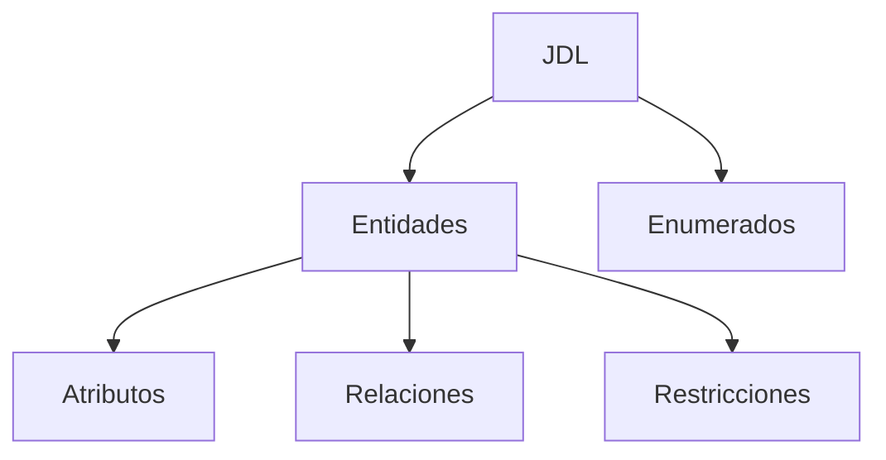

# Idea Clave 8: Principales Plataformas Aceleradoras (Parte 2)

## 1. JHipster Como Plataforma Aceleradora (visión práctica)

### Definición

**JHipster** es una plataforma aceleradora que permite realizar el **bootstrapping** de aplicaciones generando automáticamente un gran volumen de código fuente.  
No se clasifica como low-code ni no-code porque el desarrollador **continúa programando directamente sobre el código generado**.

### Relevancia

- Acelera significativamente la fase inicial de implementación.
    
- Permite partir de una arquitectura completa y funcional en muy poco tiempo.
    
- Es especialmente útil en proyectos empresariales y académicos para prototipado avanzado.

---

## 2. Requisitos E Instalación Inicial

### Dependencias Necesarias

Antes de usar JHipster es necesario tener instalado:

|Herramienta|Función|
|---|---|
|Java|Backend con Spring Boot|
|Git|Control de versiones|
|Node.js|Frontend y herramientas|
|Maven o Gradle|Gestión de dependencias y build|

### Contexto

JHipster utilize **Yeoman** como generador de código, lo que permite definir proyectos a partir de plantillas.

---

## 3. Proceso De Bootstrapping Interactivo

### Cuestionario Inicial

Al ejecutar JHipster desde consola, se inicia un **asistente interactivo** que pregunta por:

- Nombre del proyecto
    
- Tipo de arquitectura
    
- Seguridad
    
- Base de datos
    
- Cliente frontend
    
- Idiomas
    
- Herramientas adicionales

Este proceso define completamente el esqueleto de la aplicación.

---

## 4. Decisiones De Arquitectura

### Tipo De Aplicación

- **Monolítica**: toda la aplicación en un solo despliegue.
    
- Microservicios (no usado en el ejemplo).

### Cliente Feign

- Se desactiva en aplicaciones monolíticas.
    
- Se usa principalmente en arquitecturas de microservicios.

---

## 5. Testing Y Reactividad

### Testing

- Se puede integrar testing avanzado con:
    
    - Gatling
        
    - Cucumber
        
- En el ejemplo solo se usa testing básico (JUnit).

### Web Reactivo

- Opción de usar **Spring WebFlux**.
    
- En el ejemplo se opta por un modelo no reactivo.

---

## 6. Seguridad De la Aplicación

### Opciones Disponibles

- JWT (JSON Web Token)
    
- OAuth 2
    
- Autenticación basada en base de datos

### Elección En El Ejemplo

Se selecciona **JWT**, que:

- Permite autenticación stateless.
    
- Es común en APIs REST modernas.

---

## 7. Configuración De Base De Datos Y Perfiles

### Tipo De Base De Datos

- Relacional
    
- No relacional

En el ejemplo: **Relacional**

### Perfiles De Spring

JHipster genera automáticamente perfiles separados:

|Perfil|Base de datos|
|---|---|
|Desarrollo|H2 (en memoria, rápida)|
|Producción|PostgreSQL|

### Ventaja

Permite optimizar velocidad en desarrollo y robustez en producción.

---

## 8. Caché Y Persistencia

### Opciones

- Niveles de caché configurables
    
- Hibernate de segundo nivel

### Beneficio

Mejora el rendimiento reduciendo accesos repetitivos a la base de datos.

---

## 9. Herramientas De Build E Integración

### Build

- Maven
    
- Gradle

En el ejemplo: **Maven**

### Integraciones Opcionales

- ElasticSearch
    
- Mensajería
    
- Observabilidad

(No seleccionadas en el ejemplo).

---

## 10. Cliente Frontend

### Opciones Disponibles

- Angular
    
- React
    
- Vue
    
- Sin cliente

### Selección

- **Angular**
    
- Sin framework adicional de estilos.

### Consola De Administración

- Activada.
    
- Permite gestión del sistema, métricas y configuración.

---

## 11. Internacionalización (i18n)

### Idiomas Configurados

- Español
    
- Inglés
    
- Francés

### Archivos Generados

- Recursos de traducción para frontend y backend.
    
- Cambio dinámico de idioma en tiempo de ejecución.

---

## 12. Archivo De Configuración `.yo-rc.json`

### Función

Guarda todas las respuestas del asistente inicial.

### Contenido

- Tipo de arquitectura
    
- Seguridad
    
- Herramientas
    
- Base de datos
    
- Frontend
    
- Claves secretas (JWT)

### Consideración Importante

Entre versiones de JHipster pueden cambiar:

- Nombres de propiedades
    
- Estructura del archivo  
    Por lo tanto, la regeneración no siempre es totalmente automática.

---

## 13. Estructura Del Proyecto Generado

### Organización Principal

|Carpeta|Contenido|
|---|---|
|`/src/main/java`|Backend (Spring Boot)|
|`/src/main/webapp`|Frontend|
|`/src/main/resources`|Configuración e i18n|
|`/docker`|Soporte para contenedores|

### Backend Generado

- Entidades
    
- Repositorios JPA
    
- Servicios
    
- DTOs
    
- Mappers
    
- Controladores REST

Todo el código es **autogenerado**.

---

## 14. Perfiles De Configuración

### Archivos Creados

- `application-dev.yml`
    
- `application-prod.yml`

### Funcionalidades Adicionales

- Datos fake (modo Faker) en desarrollo.
    
- Credenciales iniciales preconfiguradas.

---

## 15. Compilación Y Ejecución

### Proceso

1. Descarga de dependencias Maven.
    
2. Instalación de dependencias frontend (`npm install`).
    
3. Build completo del proyecto.
    
4. Ejecución con perfil de desarrollo.

### Acceso

- Aplicación disponible en `localhost:8080`.
    
- Acceso como usuario administrador.

---

## 16. Interfaz De Administración

### Funcionalidades Disponibles

- Gestión de entidades
    
- Logs de aplicación
    
- Configuración
    
- Métricas del sistema
    
- Cambio de idioma
    
- Estado de la aplicación

---

## 17. Modelado De Datos Con JDL

### JDL (JHipster Domain Language)

Lenguaje específico de dominio para definir:

- Entidades
    
- Atributos
    
- Restricciones
    
- Enumerados
    
- Relaciones
    
- Paginación

### Ejemplo Conceptual

---

## 18. Importación De JDL Y Regeneración

### Proceso Paso a Paso

1. Crear o descargar archivo `.jdl`.
    
2. Ejecutar commando `jhipster import-jdl archivo.jdl`.
    
3. JHipster analiza el modelo.
    
4. Genera:
    
    - Entidades
        
    - Servicios
        
    - Controladores
        
    - DTOs
        
    - Frontend CRUD
        
    - Cambios en Liquibase
        
5. Resolver conflictos (sobrescribir en el ejemplo).
    
6. Recompilar y ejecutar la aplicación.

---

## 19. Código Generado Tras Importar JDL

### Backend

- Dominio
    
- Repositorios
    
- Servicios
    
- DTOs y mappers
    
- Controladores REST

### Base De Datos

- Scripts Liquibase
    
- Changelogs incrementales

### Frontend

- Vistas CRUD completas
    
- Navegación automática
    
- Datos fake visible

---

## 20. API Y Observabilidad

### API REST

- OpenAPI / Swagger disponible.
    
- Permite probar endpoints directamente.

### Métricas Y Monitoreo

- Uso del sistema
    
- Estado de servicios
    
- Perfil de rendimiento

---

## Resumen De Puntos Clave

- JHipster acelera la creación de aplicaciones completas mediante generación automática de código.
    
- El asistente inicial define toda la arquitectura del proyecto.
    
- Genera backend, frontend, seguridad, bases de datos y perfiles.
    
- Usa JDL para modelar datos y regenerar código de forma estructurada.
    
- Facilita pruebas, internacionalización, métricas y administración.
    
- Es una herramienta potente para levantar grandes volúmenes de código en poco tiempo.

## MicroTest

1. La instrucción para importar una descripción de una base de datos en un fichero atendiendo al JHipster Description Language es:
    
    - La respuesta: d.
        
    - Justificación: JHipster utilize el commando `jhipster import-jdl` para leer un fichero JDL y generar automáticamente las entidades, servicios, controladores y resto del código asociado al modelo de datos.
        
2. Para definir un tipo enumerado en JHipster usamos:
    
    - La respuesta: a.
        
    - Justificación: En JDL los tipos enumerados se definen con la palabra clave `enum`, indicando el nombre del enumerado y sus valores posibles, tal como se muestra en el ejemplo.
        
3. Para monitorizar, JHipster incluye en su consola:
    
    - La respuesta: b.
        
    - Justificación: JHipster integra la pila Elastic (ElasticSearch, Logstash y Kibana) para la visualización de logs y monitorización del estado y métricas de la aplicación.