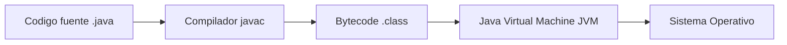
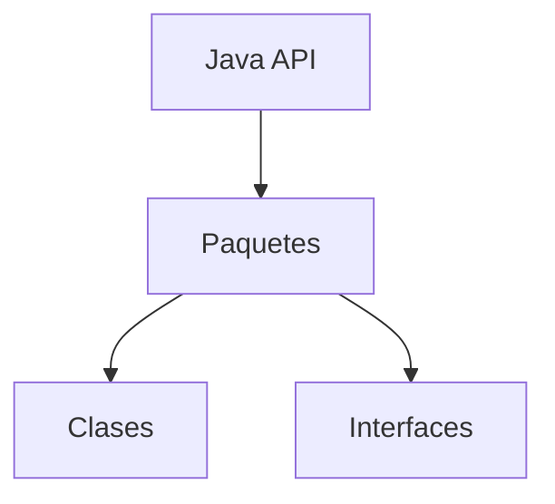
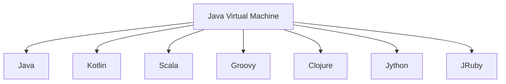

# Plataformas De Desarrollo En Java – Notas De Estudio

## 1. Java Como Lenguaje De Programación Y Plataforma Tecnológica

Java se puede entender desde **dos perspectivas principales**:

1. **Como lenguaje de programación**
    
2. **Como plataforma tecnológica**

Esta double naturaleza permite no solo desarrollar aplicaciones, sino también ejecutarlas en múltiples entornos gracias a su infraestructura tecnológica.

### Definición: Java

**Java** es un lenguaje de programación de alto nivel y una plataforma tecnológica diseñada para desarrollar aplicaciones portables, seguras y robustas que pueden ejecutarse en múltiples sistemas operativos mediante la **Java Virtual Machine (JVM)**.

---

## 2. Características Principales Del Lenguaje Java

Java posee varias características fundamentales que lo hacen adecuado para el desarrollo de aplicaciones empresariales, sistemas distribuidos y aplicaciones multiplataforma.

|Característica|Descripción|Importancia|
|---|---|---|
|Orientado a objetos|Basado en clases y objetos|Facilita la reutilización y modularidad del código|
|Multiproceso (multithreading)|Permite ejecutar múltiples procesos simultáneamente|Mejora el rendimiento|
|Arquitectura neutra|Independiente del hardware|Permite ejecutar el mismo programa en distintos sistemas|
|Portable|Compatible con múltiples plataformas|Permite ejecutar programas en diferentes sistemas operativos|
|Seguro|Incluye mecanismos de seguridad en tiempo de ejecución|Reduce riesgos de ejecución de código malicioso|
|Robusto|Manejo avanzado de errores y memoria|Incrementa la estabilidad de las aplicaciones|
|Tipado estático fuerte|Los tipos se verifican en compilación|Reduce errores en tiempo de ejecución|

### Evolución Del Lenguaje

Java ha evolucionado para incorporar **conceptos de programación funcional**, lo que permite:

- Expresiones lambda
    
- Interfaces funcionales
    
- Programación declarativa con streams

Esto facilita escribir código **más conciso, expresivo y eficiente**.

---

## 3. Gestión De Memoria En Java

Java incluye un mecanismo automático para la gestión de memoria.

### Recolector De Basura (Garbage Collector)

**Definición:**  
El **Garbage Collector** es un sistema automático que identifica y elimina objetos que ya no son utilizados por el programa.

Beneficios:

- Evita fugas de memoria
    
- Reduce errores de gestión manual de memoria
    
- Mejora la estabilidad del sistema

---

## 4. Ejecución De Programas Java Y Portabilidad

La **portabilidad** es uno de los principios fundamentales de Java.

El lema más conocido es:

**Write Once, Run Anywhere (Escribir una vez, ejecutar en cualquier lugar).**

Esto se logra gracias a la **Java Virtual Machine**.

### Proceso De Compilación Y Ejecución

1. El código fuente se escribe en archivos `.java`.
    
2. El compilador **javac** convierte el código en **bytecode**.
    
3. El bytecode se guarda en archivos `.class`.
    
4. La **JVM** interpreta o ejecuta ese bytecode.

### Definiciones Clave

**Bytecode**  
Representación intermedia del programa Java que puede ejecutarse en cualquier sistema que tenga una JVM.

**Java Virtual Machine (JVM)**  
Entorno de ejecución virtual que interpreta o compila el bytecode para ejecutarlo en el sistema operativo correspondiente.

---

## 5. Components De la Plataforma Java

La plataforma Java está formada principalmente por dos components:

- **Java Virtual Machine (JVM)**
    
- **Java API**

### Java API

**Definición:**  
La **Java API (Application Programming Interface)** es una gran colección de components de software reutilizables que permiten desarrollar aplicaciones más rápidamente.

Incluye:

- Clases
    
- Interfaces
    
- Bibliotecas
    
- Paquetes

### Organización De la Java API

Esto permite estructurar y reutilizar el software de forma eficiente.

---

## 6. Versiones O Ediciones De la Plataforma Java

Existen varias ediciones de Java diseñadas para distintos tipos de sistemas.

|Edición|Descripción|Uso principal|
|---|---|---|
|Java Standard Edition (Java SE)|Plataforma base de Java|Aplicaciones de escritorio y servidores|
|Java Enterprise Edition (Java EE / Jakarta EE)|Extensión para sistemas empresariales|Aplicaciones web y sistemas distribuidos|
|Java Micro Edition (Java ME)|Diseñada para dispositivos con recursos limitados|Dispositivos móviles y embebidos|
|Java Card|Plataforma para tarjetas inteligentes|Sistemas de seguridad|
|Java TV|Plataforma para televisores interactivos|Software de televisión|
|Java para IoT|Entornos con recursos limitados|Dispositivos conectados|

Estas ediciones proporcionan **bibliotecas y herramientas específicas según el tipo de aplicación**.

---

## 7. Modelo De Licenciamiento De Java (Desde Java 11)

A partir de **Java 11**, Oracle implementó un nuevo modelo de licenciamiento para el uso de la JVM en entornos empresariales.

### Opciones De Licenciamiento

|Licencia|Descripción|
|---|---|
|Oracle Java SE Subscription|Licencia para desarrollo y producción|
|Oracle Java SE Desktop Subscription|Orientada a aplicaciones de escritorio|

### Beneficios De la Suscripción

- Actualizaciones de seguridad
    
- Mejoras de rendimiento
    
- Correcciones de estabilidad
    
- Soporte official de Oracle

Costo aproximado mencionado: **alrededor de 3 USD por usuario al mes**.

---

## 8. Implementaciones De la Máquina Virtual De Java

Existen diferentes implementaciones de la JVM que permiten ejecutar aplicaciones Java.

Algunas implementaciones conocidas incluyen:

- HotSpot
    
- OpenJDK
    
- GraalVM
    
- OpenJ9

### Distribuciones Más Utilizadas

|Distribución|Descripción|
|---|---|
|Oracle JDK|Distribución official mantenida por Oracle|
|OpenJDK|Implementación abierta del estándar Java|
|Adoptium / AdoptOpenJDK|Distribución comunitaria basada en OpenJDK|

Actualmente **OpenJDK es la base de muchas distribuciones modernas de Java**.

---

## 9. Lenguajes Que Se Ejecutan En la JVM

Una de las grandes ventajas de la JVM es que **no solo ejecuta Java**, sino también otros lenguajes compatibles.

### Ejemplos De Lenguajes JVM

|Lenguaje|Tipo|Características|
|---|---|---|
|Scala|Estático|Combina programación funcional y orientada a objetos|
|Kotlin|Estático|Muy utilizado en desarrollo Android|
|Groovy|Dinámico|Lenguaje flexible orientado a scripting|
|Clojure|Funcional|Basado en Lisp|
|Jython|Dinámico|Implementación de Python para JVM|
|JRuby|Dinámico|Implementación de Ruby para JVM|

### Ecosistema De Lenguajes En la JVM

Estos lenguajes permiten utilizar **diferentes paradigmas de programación** aprovechando la misma infraestructura de ejecución.

---

# Resumen De Puntos Clave

- Java funciona tanto como **lenguaje de programación** como **plataforma tecnológica**.
    
- Sus principales características incluyen **portabilidad, seguridad, robustez y orientación a objetos**.
    
- El código Java se compila en **bytecode**, que es ejecutado por la **Java Virtual Machine (JVM)**.
    
- La **Java API** proporciona una gran colección de bibliotecas organizadas en paquetes.
    
- Existen varias **ediciones de Java** para distintos tipos de aplicaciones, como Java SE, Java EE y Java ME.
    
- Desde **Java 11**, Oracle introdujo un modelo de **licenciamiento por suscripción**.
    
- Existen varias implementaciones de la JVM, siendo **OpenJDK y Oracle JDK las más comunes**.
    
- La JVM permite ejecutar otros lenguajes como **Kotlin, Scala, Groovy y Clojure**, ampliando el ecosistema de desarrollo.

---

## MicroTest

1. ¿Cuál de los siguientes lenguajes no se menciona como compatible con la máquina virtual de Java?
    
    - La respuesta: d. C++.
        
    - Justifacion: En el contenido se mencionan lenguajes compatibles con la JVM como Scala, Clojure, Kotlin, Groovy, Jython y JRuby. Aunque Ruby aparece indirectamente mediante JRuby, C++ no es un lenguaje que se ejecute sobre la Java Virtual Machine ni fue mencionado como compatible en el material.
        
2. En relación con la gestión de memoria en Java, ¿qué función específica realiza el recolector de basura (garbage collector)?
    
    - La respuesta: d. Recupera la memoria no utilizada en el memento adecuado.
        
    - Justifacion: El Garbage Collector en Java se encarga de identificar objetos que ya no están siendo utilizados por el programa y liberar la memoria que ocupaban automáticamente, evitando fugas de memoria y eliminando la necesidad de gestionar memoria manualmente.
        
3. Indica la respuesta correcta en relación con las características de Java como lenguaje de programación:
    
    - La respuesta: c. Soporta múltiples hilos de ejecución (multiproceso).
        
    - Justifacion: Java soporta multithreading de forma nativa, permitiendo ejecutar múltiples hilos de manera concurrente. Las otras opciones son incorrectas porque Java es fuertemente tipado (no débilmente tipado), es orientado a objetos y el bytecode puede set decompilado para aproximarse al código fuente original.