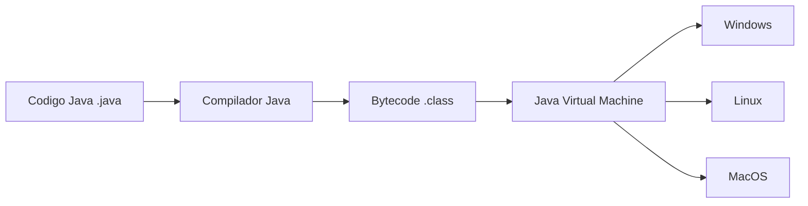
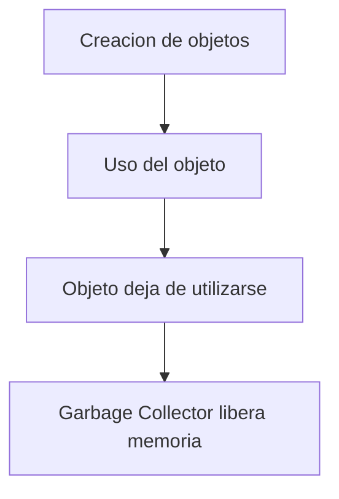

# Valor Y Utilidad De Las Plataformas Para El Desarrollo En Java – Notas De Estudio

## 1. Introducción Al Valor De Las Plataformas Java

Las plataformas de desarrollo basadas en Java permiten construir sistemas utilizando una **pila tecnológica independiente de la plataforma**. Esto significa que las aplicaciones pueden ejecutarse en diferentes sistemas operativos sin modificar el código.

El valor de Java se centra en las características asociadas a la ejecución de programas sobre la **Java Virtual Machine (JVM)**, que actúa como una capa intermedia entre la aplicación y el sistema operativo.

### Definición: Plataforma Independiente

Una **plataforma independiente** es aquella que permite que un programa funcione en diferentes sistemas operativos y arquitecturas de hardware sin necesidad de modificar el código fuente.

En Java, esto se logra mediante el uso de **bytecode y la JVM**.

---

## 2. Independencia De Plataforma

Uno de los mayores beneficios de Java es su **capacidad de portabilidad**.

### Concepto Clave

El código Java se compila en **bytecode**, el cual puede ejecutarse en cualquier sistema que tenga instalada una **Java Virtual Machine** compatible.

Esto permite el principio conocido como:

**Write Once, Run Anywhere (WORA)**.

### Proceso De Ejecución Multiplataforma

### Ventajas De la Portabilidad

- Eliminación de adaptaciones específicas para cada sistema operativo
    
- Reducción del esfuerzo de mantenimiento
    
- Mayor facilidad para distribuir software en múltiples plataformas

---

## 3. API Común De Java

Otro beneficio importante es la existencia de una **API común** que proporciona acceso uniforme a diferentes recursos del sistema.

### Definición: Java API

La **Java API (Application Programming Interface)** es un conjunto de bibliotecas y herramientas que permiten a los desarrolladores interactuar con diferentes recursos del sistema de manera consistente.

### Funciones Que Proporciona la API

|Recurso del sistema|Funcionalidad|
|---|---|
|Archivos|Lectura y escritura de archivos|
|Memoria|Gestión automática de memoria|
|Redes|Comunicación mediante protocolos de red|
|Dispositivos|Acceso a periféricos y recursos del sistema|

Gracias a la API, tareas como la manipulación de archivos funcionan de forma **idéntica en cualquier sistema operativo**.

Esto ocurre porque la **JVM abstrae las diferencias entre sistemas operativos**.

---

## 4. Verificación Del Código En la JVM

La JVM incluye un mecanismo que **verifica el bytecode antes de ejecutarlo**.

### Definición: Verificador De Bytecode

El **Bytecode Verifier** es un componente de la JVM que revisa el código compilado antes de ejecutarlo para asegurar que cumple las reglas de seguridad y estructura definidas por la máquina virtual.

### Verificaciones Realizadas

- Cumplimiento de las restricciones de la JVM
    
- Integridad del bytecode
    
- Uso correcto de memoria
    
- Compatibilidad con el compilador

Estas verificaciones garantizan que el código sea **seguro y válido antes de su ejecución**.

---

## 5. Seguridad En Java

Java fue diseñado desde sus inicios con un enfoque fuerte en la **seguridad**.

### Mecanismos De Seguridad

|Mecanismo|Descripción|
|---|---|
|Verificación de bytecode|Asegura que el código sea seguro antes de ejecutarse|
|Aislamiento del sistema|Las aplicaciones Java no interactúan directamente con el sistema operativo|
|Control de acceso|Limita operaciones peligrosas|

### Beneficios De Seguridad

- Prevención de software malicioso
    
- Protección del sistema operativo
    
- Mayor confiabilidad de las aplicaciones

La JVM actúa como **una capa de protección entre la aplicación y el sistema operativo**.

---

## 6. Gestión Automática De Memoria

Una de las ventajas más importantes del desarrollo en Java es la **gestión automática de memoria**.

### Definición: Asignación Automática De Memoria

La **JVM asigna automáticamente memoria** para variables y objetos durante la ejecución del programa.

Los desarrolladores no necesitan gestionar manualmente:

- Reservas de memoria
    
- Liberación de memoria
    
- Manejo de punteros

### Garbage Collector

El **Garbage Collector** recupera automáticamente la memoria que ya no está siendo utilizada.

### Funcionamiento General

### Beneficios

- Reducción de fugas de memoria
    
- Código más sencillo
    
- Mayor estabilidad del sistema

---

## 7. Ventajas Del Desarrollo En Java

Las características de la JVM y del lenguaje permiten obtener múltiples beneficios.

|Ventaja|Explicación|
|---|---|
|Portabilidad|El mismo programa funciona en distintos sistemas|
|API común|Facilita el desarrollo multiplataforma|
|Seguridad|Protege al sistema de código malicioso|
|Gestión automática de memoria|Reduce errores y simplifica el desarrollo|
|Robustez|Mayor estabilidad en aplicaciones|

Estas características hacen que Java sea **una tecnología muy utilizada en sistemas empresariales y aplicaciones de gran escala**.

---

## 8. Desventajas Del Uso De Java

A pesar de sus ventajas, Java también presenta algunos inconvenientes.

### 8.1 Menor Rendimiento En Tiempo De Ejecución

Los programas Java pueden set **menos eficientes** que programas escritos en lenguajes compilados directamente a código máquina.

Esto ocurre porque:

- El código se ejecuta sobre la JVM
    
- El bytecode es interpretado o compilado en tiempo de ejecución

### Comparación Simplificada

|Lenguaje|Ejecución|
|---|---|
|C/C++|Compilación directa a código máquina|
|Java|Ejecución mediante JVM|

Esto puede afectar el rendimiento en aplicaciones muy exigentes.

---

### 8.2 Mayor Consumo De Memoria

El uso de la JVM implica un **consumo adicional de memoria**.

Esto ocurre porque:

- La JVM necesita ejecutarse junto con la aplicación
    
- Se requieren estructuras adicionales para la gestión de memoria

Este aspecto puede set problemático en:

- dispositivos móviles
    
- sistemas embebidos
    
- entornos con recursos limitados

---

### 8.3 Costes Adicionales En Entornos De Nube

En entornos cloud donde el costo depende de los recursos utilizados:

- Mayor consumo de memoria
    
- Uso adicional de CPU

Esto puede generar **costos adicionales de ejecución**.

---

### 8.4 Dependencia De la JVM

El funcionamiento de las aplicaciones Java depende directamente de la JVM.

Si la JVM presenta:

- errores
    
- fallos de seguridad
    
- problemas de compatibilidad

Esto puede afectar al programa que se ejecuta sobre ella.

Aunque las implementaciones modernas son muy estables, esta dependencia representa un **riesgo potential**.

---

## 9. Evaluación Del Uso De Java

Antes de utilizar Java en un proyecto es importante considerar:

- requisitos de rendimiento
    
- consumo de memoria
    
- entorno de ejecución
    
- costos de infraestructura

A pesar de sus limitaciones, Java sigue siendo una **tecnología muy robusta y ampliamente utilizada**.

---

# Resumen De Puntos Clave

- Java permite desarrollar aplicaciones **independientes de la plataforma** gracias a la JVM.
    
- El código Java se compila en **bytecode**, que puede ejecutarse en múltiples sistemas operativos.
    
- La **Java API proporciona una interfaz común** para interactuar con recursos del sistema.
    
- La JVM incluye **verificación de bytecode**, lo que mejora la seguridad.
    
- Java incorpora **gestión automática de memoria mediante Garbage Collector**.
    
- Las principales ventajas de Java son **portabilidad, seguridad, robustez y facilidad de desarrollo**.
    
- Entre sus desventajas destacan **menor rendimiento, mayor consumo de memoria y dependencia de la JVM**.

---

## MicroTest

1. ¿Cuál es una desventaja mencionada en el uso de Java en comparación con C++?
    
    - La respuesta: a. Mayor consumo de memoria.
        
    - Justifacion: El material menciona que el uso de la Java Virtual Machine implica un consumo adicional de memoria durante la ejecución, ya que la JVM debe ejecutarse junto con la aplicación. En comparación, lenguajes como C++ se compilan directamente a código máquina y no requieren esta capa adicional.
        
2. ¿Qué función realiza la Java virtual machine al cargar el bytecode en Java?
    
    - La respuesta: c. Verificación de corrección.
        
    - Justifacion: Cuando la JVM carga el bytecode, realiza verificaciones exhaustivas para asegurar que el código cumple las restricciones de la máquina virtual, está correctamente compilado y no representa riesgos de seguridad. Este proceso se conoce como verificación de bytecode.
        
3. ¿Cuál es uno de los beneficios clave del desarrollo en Java debido a su ejecución sobre la máquina virtual?
    
    - La respuesta: c. Independencia de plataforma.
        
    - Justifacion: Gracias a la JVM, el bytecode Java puede ejecutarse en diferentes sistemas operativos sin necesidad de modificar el programa. Esto permite el principio "Write Once, Run Anywhere", que es uno de los beneficios más importantes del uso de Java.