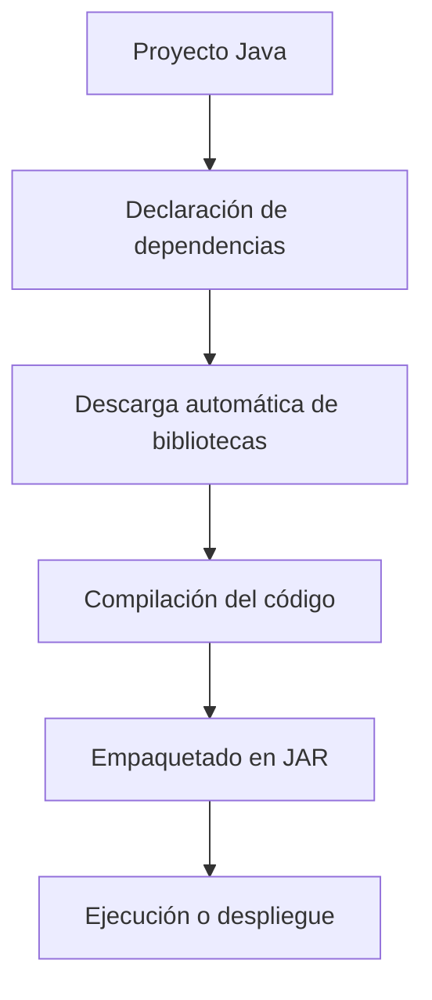

# Plataformas Para la Gestión De Dependencias Y Procesos De Compilación En Java

## Introducción

En el desarrollo de aplicaciones Java es común que los proyectos dependan de **bibliotecas externas**. Estas bibliotecas contienen funcionalidades reutilizables que el proyecto puede utilizar sin tener que implementarlas desde cero.

Estas bibliotecas normalmente se distribuyen como archivos **JAR (Java ARchive)**.

### Problema De la Gestión Manual De Dependencias

Cuando las dependencias se agregan manualmente al proyecto dentro del IDE:

- Deben configurarse manualmente en cada entorno.
    
- Si el proyecto se mueve a otra máquina, la configuración debe repetirse.
    
- El proceso de compilación y empaquetado puede volverse complejo.

### Solución

Para resolver este problema existen **herramientas de gestión de dependencias y automatización de compilación**, que permiten:

- Declarar dependencias externas automáticamente.
    
- Automatizar el proceso de compilación.
    
- Generar paquetes ejecutables.
    
- Ejecutar pruebas.

## Conceptos Clave

### Dependencia

Una **dependencia** es una biblioteca externa que un proyecto necesita para funcionar.

Ejemplo:

Un proyecto puede depender de una biblioteca para:

- manejo de archivos
    
- acceso a bases de datos
    
- procesamiento de JSON
    
- frameworks web

### Archivo JAR

Un **JAR (Java ARchive)** es un archivo comprimido que contiene:

- clases compiladas de Java
    
- recursos
    
- metadatos

Se utilize para **distribuir bibliotecas o aplicaciones Java**.

### Automatización De Compilación

La **automatización de compilación** consiste en usar herramientas que ejecutan automáticamente tareas como:

- compilar código
    
- ejecutar pruebas
    
- generar paquetes
    
- ejecutar aplicaciones

## Herramientas Principales En Java

Las herramientas más importantes para gestionar dependencias y automatizar compilaciones en Java son:

|Herramienta|Organización|Característica principal|
|---|---|---|
|Apache Ant|Apache Foundation|Automatización basada en scripts XML|
|Apache Maven|Apache Foundation|Gestión estructurada de dependencias y compilación|
|Gradle|Open Source|Automatización moderna con alto rendimiento|

## Relación Entre Dependencias Y Compilación



Estas herramientas permiten automatizar todo este flujo.

## Apache Ant

### Definición

**Apache Ant** es una herramienta de línea de commandos utilizada para **automatizar procesos de compilación en proyectos Java**.

Fue una de las primeras herramientas creadas para este propósito.

### Características Principales

- Utilize archivos **XML** para definir tareas.
    
- Permite crear **objetivos (targets)** para diferentes acciones.
    
- Es altamente **flexible**.
    
- No impone una estructura específica al proyecto.

### Archivo De Configuración

Ant utilize un archivo llamado:

```Python
build.xml
```

En este archivo se definen los **objetivos de compilación**.

### Ejemplo De Archivo build.xml

```xml
<project name="MiProyecto" default="compile">

    <target name="compile">
        <javac srcdir="src" destdir="bin"/>
    </target>

    <target name="jar">
        <jar destfile="app.jar" basedir="bin"/>
    </target>

</project>
```

### Explicación Paso a Paso

1. `<project>` define el proyecto y el objetivo por defecto.
    
2. `<target name="compile">` define una tarea llamada compile.
    
3. `<javac>` compila el código fuente.
    
4. `<target name="jar">` crea un archivo JAR.
    
5. `<jar>` empaqueta las clases compiladas.

### Ejecución Desde Línea De Commandos

Para ejecutar Ant:

```Python
ant build
```

Esto ejecuta el objetivo definido en el archivo `build.xml`.

## Apache Maven

### Definición

**Apache Maven** es una herramienta que gestiona **dependencias y procesos de compilación de manera estructurada**.

Promueve buenas prácticas y una organización estándar en los proyectos.

### Características Principales

- Gestión automática de dependencias.
    
- Estructura estándar de proyectos.
    
- Sistema de construcción consistente.
    
- Uso de un archivo central de configuración.

### Archivo De Configuración

Maven utilize un archivo llamado:

```Python
pom.xml
```

POM significa **Project Object Model**.

Este archivo contiene:

- dependencias
    
- configuración del proyecto
    
- instrucciones de compilación

### Ejemplo De pom.xml

```xml
<project>
    <modelVersion>4.0.0</modelVersion>

    <groupId>com.ejemplo</groupId>
    <artifactId>mi-proyecto</artifactId>
    <version>1.0</version>

    <dependencies>
        <dependency>
            <groupId>org.json</groupId>
            <artifactId>json</artifactId>
            <version>20210307</version>
        </dependency>
    </dependencies>

</project>
```

### Explicación Paso a Paso

1. `<groupId>` identifica la organización del proyecto.
    
2. `<artifactId>` define el nombre del proyecto.
    
3. `<version>` especifica la versión.
    
4. `<dependencies>` contiene las bibliotecas necesarias.
    
5. Maven descarga automáticamente estas dependencias.

### Estructura Estándar De Maven

Maven impone una estructura de proyecto específica.

|Carpeta|Contenido|
|---|---|
|src/main/java|Código fuente|
|src/test/java|Pruebas|
|src/main/resources|Recursos (imágenes, configuraciones)|

### Commandos Comunes De Maven

|Commando|Función|
|---|---|
|mvn compile|Compila el proyecto|
|mvn package|Genera el archivo JAR|
|mvn test|Ejecuta pruebas|
|mvn install|Instala el paquete en el repositorio local|

## Gradle

### Definición

**Gradle** es una herramienta moderna de automatización de compilación que combina:

- flexibilidad
    
- alto rendimiento
    
- facilidad de personalización

### Características Principales

- Código abierto.
    
- Utilize **DSL basado en Groovy o Kotlin**.
    
- Ejecución de tareas en paralelo.
    
- Optimización usando resultados de ejecuciones previas.

### Ventajas De Gradle

|Ventaja|Explicación|
|---|---|
|Compilación incremental|Solo recompila lo que cambió|
|Ejecución paralela|Mejora el rendimiento|
|Alta extensibilidad|Permite crear tareas personalizadas|

### Importancia En Android

Gradle es la **herramienta official de compilación para Android** y se encuentra integrada en **Android Studio**.

### Archivo De Configuración

Gradle utilize un archivo llamado:

```Python
build.gradle
```

### Ejemplo De build.gradle

```groovy
plugins {
    id 'java'
}

dependencies {
    implementation 'org.json:json:20210307'
}
```

### Explicación Paso a Paso

1. `plugins` activa funcionalidades necesarias.
    
2. `id 'java'` indica que el proyecto utilize Java.
    
3. `dependencies` declara las bibliotecas necesarias.
    
4. Gradle descarga automáticamente las dependencias.

### Commandos Comunes De Gradle

|Commando|Función|
|---|---|
|gradle build|Compila el proyecto|
|gradle test|Ejecuta pruebas|
|gradle jar|Genera el archivo JAR|

## Comparación Entre Ant, Maven Y Gradle

|Característica|Ant|Maven|Gradle|
|---|---|---|---|
|Año aproximado|Más antiguo|Posterior a Ant|Más moderno|
|Gestión de dependencias|Manual|Automática|Automática|
|Lenguaje de configuración|XML|XML|Groovy / Kotlin|
|Estructura obligatoria|No|Sí|Flexible|
|Rendimiento|Medio|Medio|Alto|

## Información Adicional Relevante

Actualmente en el desarrollo Java moderno:

- **Maven y Gradle** son las herramientas más utilizadas.
    
- Maven destaca por su **estandarización**.
    
- Gradle destaca por su **velocidad y flexibilidad**.

En proyectos empresariales:

- Maven es muy común en entornos corporativos.
    
- Gradle domina en proyectos **Android** y en sistemas de compilación complejos.

## Resumen De Puntos Clave

- Los proyectos Java suelen depender de **bibliotecas externas empaquetadas en archivos JAR**.
    
- Gestionar dependencias manualmente dificulta la portabilidad del proyecto.
    
- Herramientas de automatización permiten **declarar dependencias y automatizar compilaciones**.
    
- **Apache Ant** fue la primera herramienta de este tipo y usa scripts XML.
    
- **Apache Maven** gestiona dependencias automáticamente mediante el archivo `pom.xml`.
    
- **Gradle** es una herramienta moderna que usa DSL basado en Groovy o Kotlin.
    
- Maven impone una **estructura estándar de proyecto**, mientras que Gradle es más flexible.
    
- Gradle es la **herramienta official de compilación para Android**.

## MicroTest

1. ¿Cuál de las siguientes afirmaciones es verdadera sobre Ant?
    
    - La respuesta: c. Se configura mediante un archivo build.xml.
        
    - Justifacion:  
        Apache Ant utilize un archivo de configuración llamado **build.xml**, escrito en XML, donde se definen los objetivos (targets) y tareas del proceso de compilación, empaquetado o ejecución del proyecto.
        
2. ¿Qué herramienta de construcción es conocida por su flexibilidad y rendimiento, permite escribir scripts de compilación en Groovy o Kotlin DSL y es oficialmente compatible con Android?
    
    - La respuesta: c. Gradle.
        
    - Justifacion:  
        **Gradle** es una herramienta moderna de automatización de compilación que utilize **DSL basado en Groovy o Kotlin**, ofrece alto rendimiento mediante compilación incremental y ejecución paralela, y además es la **herramienta official de compilación para proyectos Android**.
        
3. ¿Cuál es el commando correcto para compilar un proyecto Maven desde la línea de commandos?
    
    - La respuesta: b. mvn compile.
        
    - Justifacion:  
        El commando **mvn compile** ejecuta la fase de compilación del ciclo de vida de Maven, lo que compila el código fuente del proyecto ubicado normalmente en la carpeta **src/main/java**. Ds