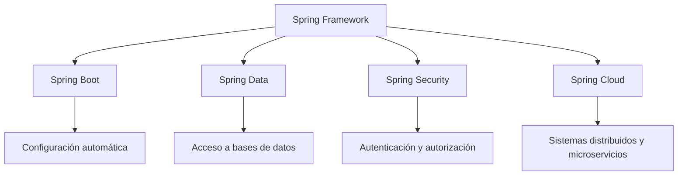
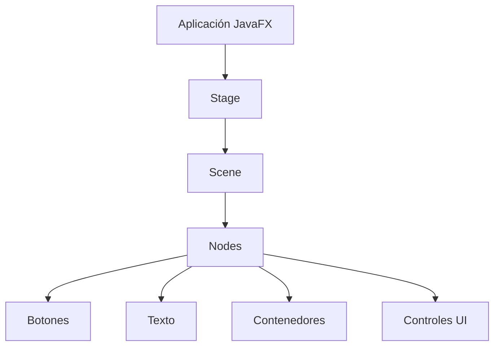

# Plataformas Aceleradoras Del Desarrollo En Java

## Introducción

En el ecosistema de Java existen diversas **plataformas, frameworks y librerías** que permiten acelerar el desarrollo de aplicaciones. Estas herramientas abstraen tareas complejas relacionadas con infraestructura, configuración o generación de código, permitiendo que los desarrolladores se concentren principalmente en la **lógica de negocio**.

Entre las plataformas destacadas se encuentran:

- **Spring Framework**: plataforma integral para desarrollo de aplicaciones empresariales.
    
- **JavaFX**: plataforma para construir interfaces gráficas modernas en Java.
    
- **Lombok**: biblioteca que reduce el código repetitivo mediante generación automática de métodos.

Estas herramientas permiten desarrollar aplicaciones más rápido, con menor cantidad de código y con una arquitectura más organizada.

---

# Spring Framework

## Definición

**Spring Framework** es una plataforma integral para el desarrollo de aplicaciones Java que proporciona infraestructura y herramientas para construir aplicaciones robustas, especialmente en entornos empresariales.

Su objetivo principal es **separar la lógica de negocio de los aspectos técnicos de infraestructura**, como:

- manejo de dependencias
    
- gestión de transacciones
    
- comunicación entre components
    
- seguridad
    
- acceso a datos

Esto permite que los desarrolladores se enfoquen en implementar la funcionalidad principal del sistema.

---

## Principio De Inversión De Control (IoC)

Uno de los conceptos fundamentales de Spring es la **Inversión de Control (IoC)**.

### Definición

La **Inversión de Control** es un principio de diseño de software donde el control del flujo del programa no lo tiene el programador directamente, sino un **contenedor o framework que gestiona los components del sistema**.

En otras palabras:

- En programación tradicional, el código crea y controla sus dependencias.
    
- En Spring, el framework se encarga de **crear y administrar los objetos necesarios**.

Esto mejora:

- modularidad
    
- reutilización
    
- facilidad de pruebas

### Flujo De Ejecución Tradicional Vs Spring

```mermaid
flowchart TD

A[Aplicación tradicional] --> B[main()]
B --> C[Crear objetos]
C --> D[Gestionar dependencias]
D --> E[Ejecutar lógica]

F[Aplicación con Spring] --> G[Spring Container]
G --> H[Gestiona dependencias]
H --> I[Inicializa componentes]
I --> J[Ejecuta lógica de la aplicación]
```

En aplicaciones Spring:

- el **contenedor de Spring controla el ciclo de vida de los objetos**
    
- el desarrollador solo define **qué components existen y cómo se relacionan**

---

## Inyección De Dependencias (Dependency Injection)

### Definición

La **inyección de dependencias** es el mecanismo mediante el cual el framework **proporciona automáticamente las dependencias que una clase necesita**.

En lugar de que una clase cree sus dependencias, estas son **inyectadas desde el exterior por el contenedor de Spring**.

### Beneficios

|Beneficio|Explicación|
|---|---|
|Bajo acoplamiento|Las clases no dependen directamente de implementaciones concretas|
|Mayor testabilidad|Permite reemplazar dependencias fácilmente en pruebas|
|Modularidad|Components independientes y reutilizables|

---

## POJOs En Spring

### Definición

Un **POJO (Plain Old Java Object)** es una clase Java simple que no depende de frameworks específicos.

Spring permite crear aplicaciones usando **POJOs normals**, sobre los cuales se aplican servicios empresariales como:

- transacciones
    
- seguridad
    
- acceso a datos

Esto se conoce como **programación no invasiva**, porque el framework **no obliga a modificar el diseño básico de las clases**.

---

## Casos De Uso De Spring

Spring permite implementar múltiples funcionalidades empresariales de forma sencilla:

|Funcionalidad|Descripción|
|---|---|
|Transacciones con bases de datos|Gestión automática de transacciones|
|Servicios Web|Convertir métodos en endpoints|
|Mensajería|Integración con sistemas de mensajería|
|Administración del sistema|Facilita la configuración y monitoreo|

---

## Ecosistema Spring

Spring no es un único framework, sino un **ecosistema de proyectos especializados**.

### Principales Módulos

|Proyecto|Función|
|---|---|
|Spring Boot|Simplifica la configuración inicial de aplicaciones|
|Spring Data|Facilita el acceso y manejo de bases de datos|
|Spring Cloud|Implementa patrones para sistemas distribuidos|
|Spring Security|Manejo de autenticación y control de acceso|

### Relación Entre Components



---

# JavaFX

## Definición

**JavaFX** es una plataforma de código abierto para desarrollar **interfaces gráficas de usuario (GUI)** en aplicaciones Java.

Está diseñada para crear aplicaciones cliente modernas para:

- escritorio
    
- dispositivos móviles
    
- sistemas embebidos

---

## Características Principales

JavaFX proporciona herramientas para crear aplicaciones visualmente ricas con elementos interactivos.

Entre sus capacidades destacan:

- gráficos vectoriales
    
- animaciones
    
- reproducción de audio
    
- reproducción de video
    
- integración web
    
- interfaces interactivas

Estas características permiten crear aplicaciones con **experiencias visuals avanzadas**.

---

## Components De Una Aplicación JavaFX

Las aplicaciones JavaFX suelen estructurarse en tres partes principales:



### Elementos

|Elemento|Descripción|
|---|---|
|Stage|Ventana principal de la aplicación|
|Scene|Contenedor que agrupa los elementos visuals|
|Node|Components individuales de la interfaz|

---

# Lombok

## Definición

**Lombok** es una biblioteca de Java que reduce el **código repetitivo (boilerplate)** mediante la generación automática de código durante la compilación.

Esto se logra mediante **anotaciones** que generan automáticamente métodos comunes.

---

## Problema Que Resuelve

En Java tradicional, una clase simple puede requerir muchos métodos repetitivos:

- getters
    
- setters
    
- constructores
    
- métodos `toString`
    
- métodos `equals` y `hashCode`

Esto aumenta el tamaño del código sin agregar lógica real.

Lombok elimina esta necesidad.

---

## Ejemplo Sin Lombok

```java
public class Usuario {

    private String nombre;
    private int edad;

    public Usuario(String nombre, int edad) {
        this.nombre = nombre;
        this.edad = edad;
    }

    public String getNombre() {
        return nombre;
    }

    public void setNombre(String nombre) {
        this.nombre = nombre;
    }

    public int getEdad() {
        return edad;
    }

    public void setEdad(int edad) {
        this.edad = edad;
    }
}
```

Este código contiene muchos métodos repetitivos.

---

## Ejemplo Con Lombok

```java
import lombok.Data;

@Data
public class Usuario {

    private String nombre;
    private int edad;

}
```

### Paso a Paso

1. Se agrega la anotación `@Data`.
    
2. Lombok genera automáticamente:
    
    - getters
        
    - setters
        
    - `toString`
        
    - `equals`
        
    - `hashCode`
        
3. Durante la compilación, el código generado se incorpora automáticamente.

---

## Integración Con IDEs

Lombok se integra con la mayoría de entornos de desarrollo:

- IntelliJ IDEA
    
- Eclipse
    
- NetBeans

Esto permite que el IDE **reconozca el código generado**, evitando errores durante el desarrollo.

---

# Comparación De Las Plataformas

|Plataforma|Tipo|Propósito|
|---|---|---|
|Spring|Framework|Desarrollo de aplicaciones empresariales|
|JavaFX|Plataforma GUI|Desarrollo de interfaces gráficas|
|Lombok|Librería|Reducción de código repetitivo|

---

# Importancia De Estas Herramientas En El Desarrollo Java

Estas plataformas ayudan a mejorar la productividad del desarrollo al:

- reducir complejidad técnica
    
- disminuir código repetitivo
    
- facilitar la arquitectura de aplicaciones
    
- permitir desarrollo más rápido

En proyectos modernos de Java, especialmente empresariales, **Spring y Lombok son herramientas ampliamente utilizadas**.

---

# Resumen De Puntos Clave

- Existen frameworks y librerías que aceleran el desarrollo en Java.
    
- **Spring Framework** gestiona infraestructura para aplicaciones empresariales.
    
- Spring utilize **Inversión de Control (IoC)** e **Inyección de Dependencias**.
    
- Las aplicaciones Spring trabajan con **POJOs**, manteniendo una programación no invasiva.
    
- El ecosistema Spring incluye proyectos como **Spring Boot, Spring Data, Spring Cloud y Spring Security**.
    
- **JavaFX** permite crear interfaces gráficas modernas con soporte para multimedia y animaciones.
    
- **Lombok** reduce el código repetitivo generando automáticamente métodos comunes mediante anotaciones.
    
- Estas herramientas permiten a los desarrolladores centrarse en la **lógica del negocio** en lugar de en la infraestructura técnica.

---

# MicroTest

1. ¿Cuál es el objetivo principal del marco Spring en el desarrollo de aplicaciones Java?
    
    - La respuesta: b. Simplificar la gestión de dependencias y la inversión de control.
        
    - Justifacion: Spring está diseñado para manejar la infraestructura de una aplicación, especialmente mediante **Inversión de Control (IoC)** e **inyección de dependencias**, lo que permite que los desarrolladores se concentren en la lógica de negocio en lugar de gestionar manualmente las dependencias entre components.
        
2. ¿Cuál es el propósito principal de la biblioteca de Java llamada Lombok?
    
    - La respuesta: d. Evitar la escritura manual de métodos get o set mediante anotaciones.
        
    - Justifacion: Lombok utilize **anotaciones** para generar automáticamente código repetitivo como **getters, setters, constructores, toString, equals y hashCode** durante la compilación, reduciendo la cantidad de código que el programador debe escribir manualmente.
        
3. ¿Cuál de las siguientes afirmaciones describe mejor a Spring Boot?
    
    - La respuesta: c. Es una extensión independiente del marco Spring Framework para facilitar la configuración por defecto.
        
    - Justifacion: Spring Boot forma parte del ecosistema de Spring y su objetivo es **simplificar la configuración inicial de aplicaciones**, proporcionando configuraciones automáticas y reduciendo la necesidad de configuraciones manuales extensas al iniciar un proyecto Spring.