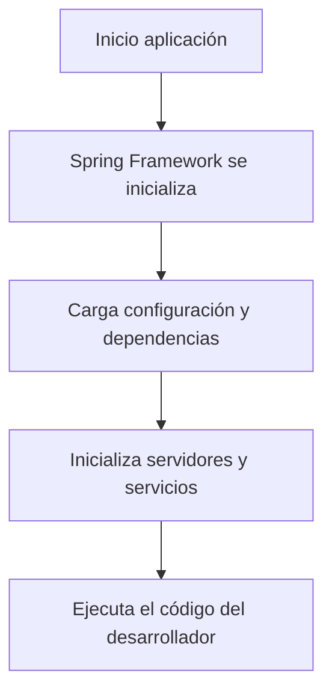
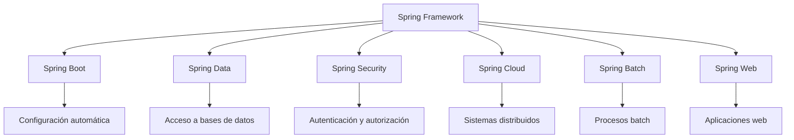

# Plataformas Aceleradoras Del Desarrollo En Java – Parte 2 (Spring)

## Introducción Al Framework Spring

Spring es un **framework de desarrollo para Java** compuesto por una colección de proyectos que permiten crear diferentes tipos de aplicaciones, incluyendo:

- aplicaciones **web**
    
- aplicaciones **backend**
    
- procesos **batch**
    
- sistemas **distribuidos**
    
- servicios **cloud**

El objetivo de Spring es **simplificar el desarrollo empresarial** proporcionando herramientas que gestionan aspectos técnicos de la aplicación como la configuración, la comunicación entre components y la infraestructura.

---

# Características Principales De Spring

## 1. Gestión De Dependencias

Spring permite gestionar automáticamente las **librerías necesarias para un proyecto**.

### Definición

Las **dependencias** son bibliotecas externas que una aplicación necesita para funcionar, por ejemplo:

- librerías web
    
- conectores de base de datos
    
- frameworks de seguridad
    
- librerías de mensajería

En proyectos Spring, estas dependencias normalmente se gestionan mediante:

- **Maven**
    
- **Gradle**

Estas herramientas descargan y organizan automáticamente las librerías necesarias.

---

## 2. Inversión De Control (IoC)

### Definición

La **Inversión de Control (IoC)** es un principio de diseño en el que el **framework controla el flujo de ejecución del programa**, en lugar de que el programador controle manualmente cada paso.

Esto significa que el framework:

- crea objetos
    
- configura dependencias
    
- inicializa servicios
    
- ejecuta components

Todo esto ocurre **antes de que el código principal del programador se ejecute**.

### Ejemplo Conceptual



---

# Spring Boot

## Definición

**Spring Boot** es un proyecto del ecosistema Spring que permite **iniciar aplicaciones rápidamente con configuraciones predeterminadas**.

Spring Boot simplifica el desarrollo porque toma muchas decisiones automáticamente, como:

- elegir un servidor web por defecto
    
- configurar librerías
    
- establecer configuraciones iniciales

Por ejemplo, Spring Boot suele iniciar automáticamente un **servidor Tomcat embebido**.

---

## Ventajas De Spring Boot

|Ventaja|Descripción|
|---|---|
|Configuración automática|Reduce la necesidad de configuraciones manuales|
|Servidor embebido|No es necesario instalar servidores externos|
|Arranque rápido|Permite crear aplicaciones funcionales en pocos pasos|
|Integración con Spring|Acceso completo al ecosistema Spring|

---

# Ecosistema Del Framework Spring

Spring incluye múltiples módulos especializados.

## Components Principales

|Módulo|Función|
|---|---|
|Spring Core|Base del framework|
|Spring Boot|Configuración automática y arranque rápido|
|Spring Data|Integración con bases de datos|
|Spring Web|Desarrollo de aplicaciones web|
|Spring Cloud|Arquitecturas distribuidas|
|Spring Batch|Procesamiento de datos en lote|
|Spring Security|Seguridad y autenticación|
|Spring Integration|Integración entre sistemas|

---

## Arquitectura Del Ecosistema Spring



---

# Creación De Proyectos Spring

## Spring Initializr

El **Spring Initializr** es una herramienta web que permite generar rápidamente la estructura inicial de un proyecto Spring.

Permite configurar:

- nombre del proyecto
    
- lenguaje (Java, Kotlin, Groovy)
    
- gestor de dependencias (Maven o Gradle)
    
- versión de Spring
    
- dependencias necesarias

Esta herramienta genera un proyecto listo para compilar y ejecutar.

---

# Ejemplo De Aplicación: Spring PetClinic

Una aplicación comúnmente utilizada para aprender Spring es **PetClinic**, que simula un sistema de gestión para una clínica veterinaria.

La aplicación permite:

- gestionar veterinarios
    
- gestionar dueños de mascotas
    
- registrar visitas
    
- consultar información

---

# Compilación Y Ejecución De Un Proyecto Spring

## Requisitos

Para ejecutar un proyecto Spring se necesitan:

- **Java JDK**
    
- **Maven**
    
- **Git** (para descargar el proyecto)

---

## Compilar El Proyecto

Se utilize Maven para compilar la aplicación.

Ejemplo de commando:

```bash
mvn package
```

Este commando:

1. descarga dependencias
    
2. compila el código
    
3. ejecuta pruebas
    
4. genera un archivo ejecutable `.jar`

En algunos casos se puede omitir la ejecución de pruebas para acelerar el proceso.

---

## Ejecutar la Aplicación

Una vez compilado el proyecto se genera un archivo `.jar`.

Ejemplo de ejecución:

```bash
java -jar spring-petclinic.jar
```

Al ejecutarlo:

- Spring se inicializa
    
- configura automáticamente el servidor
    
- inicia el servidor web
    
- conecta con la base de datos

---

# Inicialización Automática Del Servidor

Una característica importante de Spring Boot es que puede iniciar automáticamente un servidor web embebido.

Por ejemplo:

- **Tomcat**
    
- **Jetty**

Esto significa que el desarrollador **no necesita instalar ni configurar un servidor manualmente**.

---

# Estructura De Un Proyecto Spring

Un proyecto Spring típico incluye varios components importantes.

## 1. Archivo POM (Maven)

El archivo `pom.xml` contiene:

- dependencias
    
- versiones
    
- plugins de compilación

Ejemplo conceptual de estructura:

|Elemento|Función|
|---|---|
|dependencies|Librerías necesarias|
|plugins|Herramientas de compilación|
|properties|Configuraciones del proyecto|

---

## 2. Clase Principal De Spring Boot

La aplicación se inicia mediante una clase principal que contiene la anotación:

```java
@SpringBootApplication
public class Application {

    public static void main(String[] args) {
        SpringApplication.run(Application.class, args);
    }

}
```

### Funcionamiento Paso a Paso

1. La anotación `@SpringBootApplication` indica que se trata de una aplicación Spring Boot.
    
2. El método `main()` inicia el framework.
    
3. `SpringApplication.run()` arranca el contenedor Spring.
    
4. Spring configura automáticamente todos los components necesarios.

---

# Archivos De Configuración

## application.properties

Las aplicaciones Spring suelen incluir un archivo de configuración llamado:

```Python
application.properties
```

Este archivo permite configurar la aplicación **sin modificar el código fuente**.

Ejemplos de configuración:

- puertos del servidor
    
- conexiones a bases de datos
    
- perfiles de entorno

---

## Uso De Perfiles

Spring permite manejar diferentes configuraciones según el entorno.

Ejemplos:

|Perfil|Uso|
|---|---|
|dev|desarrollo|
|test|pruebas|
|prod|producción|

Esto facilita la integración con sistemas de **integración continua (CI/CD)**.

---

# Persistencia De Datos Con Spring

Spring puede integrarse con bases de datos utilizando **Java Persistence API (JPA)**.

## Entidades

Una **entidad** representa una tabla en la base de datos.

Ejemplo conceptual:

```java
@Entity
public class Person {

    @Id
    private Long id;

    private String name;

}
```

## Explicación

1. `@Entity` indica que la clase representa una tabla.
    
2. `@Id` identifica la clave primaria.
    
3. Los atributos representan columnas.

---

# Repositorios

Spring Data permite crear repositorios para acceder a datos sin escribir SQL manualmente.

Ejemplo conceptual:

```java
public interface PersonRepository extends JpaRepository<Person, Long> {

}
```

Esto permite:

- guardar registros
    
- consultar datos
    
- eliminar registros

sin implementar los métodos manualmente.

---

# Controladores Y APIs

Spring permite exponer servicios web mediante **controladores REST**.

Ejemplo conceptual:

```java
@RestController
public class PetController {

    @GetMapping("/api/pets")
    public List<Pet> getPets() {
        return petService.findAll();
    }

}
```

## Funcionamiento

1. `@RestController` define un controlador web.
    
2. `@GetMapping` define una ruta HTTP.
    
3. Cuando un cliente accede a `/api/pets`, se ejecuta el método.
    
4. La respuesta se devuelve en formato JSON.

---

# Recursos Del Proyecto

Dentro de la carpeta `resources` suelen encontrarse:

|Carpeta|Contenido|
|---|---|
|application.properties|configuración|
|templates|vistas|
|static|archivos web|
|messages|internacionalización|
|database|scripts de base de datos|

---

# Integración Frontend

Aunque Spring puede servir contenido web directamente, en aplicaciones modernas se suele utilizar:

- **Angular**
    
- **React**
    
- **Vue**

En estos casos:

- Spring actúa como **backend**
    
- el frontend se desarrolla con frameworks JavaScript.

---

# Resumen De Puntos Clave

- Spring es un framework potente para el desarrollo de aplicaciones empresariales en Java.
    
- Implementa **inversión de control** y **gestión automática de dependencias**.
    
- **Spring Boot** facilita el arranque de proyectos mediante configuraciones automáticas.
    
- Los proyectos Spring suelen gestionarse con **Maven o Gradle**.
    
- Spring puede iniciar automáticamente servidores web como **Tomcat**.
    
- Las aplicaciones se configuran mediante archivos como **application.properties**.
    
- Spring se integra con bases de datos mediante **JPA y repositorios**.
    
- Los **controladores REST** permiten exponer APIs web fácilmente.
    
- En arquitecturas modernas, Spring suele utilizarse como **backend**, mientras que el frontend se desarrolla con frameworks JavaScript.

---

## MicroTest

1. En el video, el ejemplo se genera desde un Spring Initializr accessible en:
    
    - La respuesta: b. [https://start.spring.io/](https://start.spring.io/)
        
    - Justifacion: Spring Initializr es la herramienta official utilizada para generar proyectos Spring Boot de forma automática. El sitio [https://start.spring.io/](https://start.spring.io/) permite seleccionar dependencias, tipo de proyecto (Maven o Gradle), lenguaje y versión de Spring, generando la estructura inicial del proyecto.
        
2. En el ejemplo, la aplicación se define mediante:
    
    - La respuesta: a. Una anotación @SpringBootApplication.
        
    - Justifacion: En Spring Boot la aplicación se define principalmente mediante la anotación **@SpringBootApplication**, que indica al framework que esa es la clase principal desde la cual debe iniciar la configuración automática, el escaneo de components y el arranque del contenedor Spring. El método `main()` solo inicia la ejecución de Java, y `mvn spring-boot:run` es únicamente una forma de ejecutar la aplicación, pero no define la aplicación en sí.
        
3. En el ejemplo, el modelo de datos persistente se define mediante:
    
    - La respuesta: b. Una anotación @Entity.
        
    - Justifacion: En Spring con JPA, el modelo persistente se define mediante clases POJO anotadas con @Entity, lo que indica que la clase representa una tabla en la base de datos. Las propiedades de la clase corresponden a las columnas de la tabla.