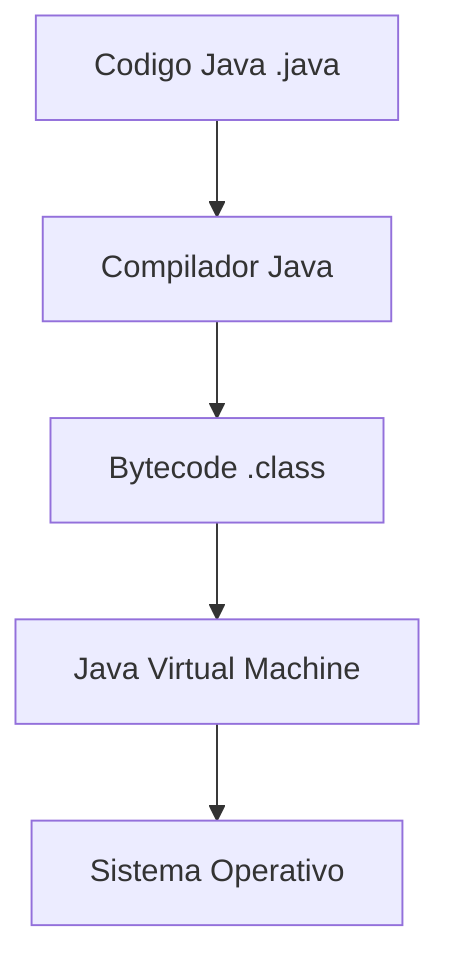
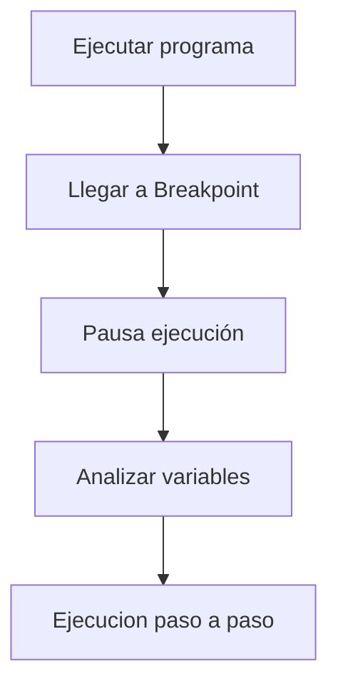
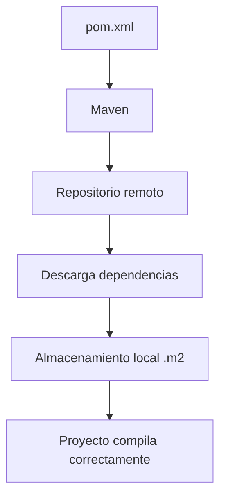

# Resumen Del Tema: Plataformas De Desarrollo De Sistemas Con Java

## Introducción

El tema aborda los **conceptos fundamentales del desarrollo de software utilizando Java**, incluyendo:

- el contexto del lenguaje y la plataforma Java
    
- las características principales del lenguaje
    
- el funcionamiento de la máquina virtual de Java
    
- el uso de entornos de desarrollo integrados (IDE)
    
- la gestión de dependencias y compilación
    
- plataformas que aceleran el desarrollo como **Spring** y **Lombok**

El objetivo es comprender cómo Java permite desarrollar aplicaciones portables, mantenibles y escalables.

---

# Java Como Lenguaje Y Plataforma

## Java Como Lenguaje De Programación

Java es un **lenguaje de programación orientado a objetos**, aunque las versiones más recientes también incluyen soporte para **programación funcional**.

### Características Principales

|Característica|Descripción|
|---|---|
|Orientado a objetos|Permite modelar sistemas mediante clases y objetos|
|Fuertemente tipado|Los tipos de datos se verifican en tiempo de compilación|
|Estáticamente tipado|Los tipos se definen antes de la ejecución|
|Multihilo|Permite ejecutar múltiples procesos simultáneamente|
|Gestión automática de memoria|Utilize Garbage Collector para liberar memoria|

---

## Java Como Plataforma

Java no es solo un lenguaje; también es una **plataforma de ejecución** compuesta principalmente por dos elementos:

|Componente|Función|
|---|---|
|JVM (Java Virtual Machine)|Ejecuta el bytecode|
|API de Java|Conjunto de librerías estándar|

### Proceso De Ejecución De Java



### Explicación

1. El programador escribe código en Java.
    
2. El compilador lo convierte en **bytecode**.
    
3. El bytecode es ejecutado por la **JVM**.
    
4. La JVM funciona sobre el sistema operativo.

Esto permite que Java sea **independiente de la plataforma**.

---

# Independencia De Plataforma

## Concepto

Uno de los mayores beneficios de Java es la filosofía:

**Write Once, Run Anywhere (WORA)**  
Escribir una vez, ejecutar en cualquier sistema.

Esto se logra porque el código se ejecuta en la **máquina virtual**, que actúa como una capa intermedia entre el programa y el sistema operativo.

### Ventajas

|Ventaja|Descripción|
|---|---|
|Portabilidad|El mismo programa puede ejecutarse en Windows, Linux o macOS|
|Compatibilidad|No depende del hardware|
|Ecosistema amplio|Permite ejecutar múltiples lenguajes|

### Desventajas

|Desventaja|Explicación|
|---|---|
|Menor eficiencia|Existe una capa adicional entre el código y el hardware|
|Dependencia de la JVM|Si la JVM tiene errores, afecta al sistema|

---

# Gestión De Memoria En Java

Java utilize un sistema automático llamado **Garbage Collector**.

## Definición

El **Garbage Collector** es un proceso automático que libera memoria ocupada por objetos que ya no se utilizan.

### Ejemplo Conceptual

Cuando se crea un objeto:

```java
List<String> lista = new ArrayList<>();
```

- el objeto ocupa memoria
    
- cuando deja de usarse
    
- el Garbage Collector libera esa memoria automáticamente

### Comportamiento Del Consumo De Memoria


---

# Lenguajes Que Utilizan la JVM

La JVM no ejecuta únicamente Java. Otros lenguajes también utilizan esta plataforma.

## Ejemplos

|Lenguaje|Uso|
|---|---|
|Kotlin|Desarrollo Android|
|Scala|Sistemas distribuidos|
|Groovy|Automatización|
|JRuby|Ruby sobre JVM|
|Clojure|Programación funcional|

Esto convierte a la JVM en una **plataforma de ejecución multi-lenguaje**.

---

# Entornos De Desarrollo Integrado (IDE)

## Definición

Un **IDE (Integrated Development Environment)** es una herramienta que facilita el desarrollo de software integrando múltiples funcionalidades.

### Funciones Principales De Un IDE

|Función|Descripción|
|---|---|
|Edición de código|Resaltado de sintaxis y autocompletado|
|Compilación|Construcción automática del proyecto|
|Ejecución|Permite ejecutar programas|
|Depuración|Permite analizar el comportamiento del código|

### IDEs Populares Para Java

|IDE|Características|
|---|---|
|IntelliJ IDEA|Muy utilizado en desarrollo professional|
|Eclipse|IDE tradicional de Java|
|NetBeans|Integración sencilla con Java|

---

# Depuración De Programas (Debugging)

## Definición

La **depuración** es el proceso de analizar un programa para encontrar errores.

Se realiza utilizando herramientas del IDE como **breakpoints**.

### Funcionamiento



### Beneficios

- permite observar el estado de las variables
    
- facilita detectar errores lógicos
    
- evita depender únicamente de logs o impresiones en consola

---

# Gestión De Dependencias

Las aplicaciones modernas utilizan muchas librerías externas.

Para gestionarlas se utilizan herramientas como:

|Herramienta|Archivo de configuración|
|---|---|
|Ant|build.xml|
|Maven|pom.xml|
|Gradle|build.gradle|

---

## Maven

### Definición

**Maven** es una herramienta de automatización de compilación y gestión de dependencias.

Permite declarar librerías necesarias en un archivo llamado:

```Python
pom.xml
```

### Funcionamiento



### Ventajas

- descarga automática de librerías
    
- control de versiones
    
- integración con pipelines CI/CD

---

# Plataformas Que Aceleran El Desarrollo

## Spring Framework

Spring es un framework que facilita el desarrollo de aplicaciones empresariales.

### Características Principales

|Característica|Descripción|
|---|---|
|Inversión de Control|El framework controla la ejecución|
|Inyección de Dependencias|El framework crea e inyecta objetos|
|Configuración automática|Reduce código de infraestructura|

### Ejemplo Conceptual

En lugar de crear objetos manualmente:

```java
Servicio servicio = new Servicio();
```

Con Spring se usa anotaciones y el framework crea el objeto automáticamente.

---

## Lombok

### Definición

Lombok es una biblioteca que **reduce el código repetitivo** en Java.

Permite generar automáticamente:

- getters
    
- setters
    
- constructores
    
- métodos `toString`
    
- builders

### Ejemplo

Sin Lombok:

```java
public class User {
    private String name;

    public String getName(){
        return name;
    }

    public void setName(String name){
        this.name = name;
    }
}
```

Con Lombok:

```java
@Getter
@Setter
public class User {
    private String name;
}
```

Durante la compilación Lombok genera los métodos automáticamente.

---

# Ventajas Y Desventajas De Java

## Ventajas

|Ventaja|Explicación|
|---|---|
|Independencia de plataforma|El mismo programa funciona en distintos sistemas|
|Gran ecosistema|Amplia cantidad de librerías|
|Comunidad grande|Amplio soporte|
|Seguridad|Modelo robusto de ejecución|

---

## Desventajas

|Desventaja|Explicación|
|---|---|
|Menor rendimiento que código nativo|Debido a la JVM|
|Dependencia de la máquina virtual|Si falla afecta al programa|
|Mayor consumo de memoria|JVM require recursos adicionales|

---

# Resumen De Puntos Clave

- Java es tanto **lenguaje de programación como plataforma**.
    
- La plataforma Java está formada por **JVM y API estándar**.
    
- El código Java se compila a **bytecode**, ejecutado por la máquina virtual.
    
- Esto permite **independencia de plataforma**.
    
- Java utilize **Garbage Collector** para gestionar memoria automáticamente.
    
- Existen múltiples **lenguajes que se ejecutan en la JVM**.
    
- Los **IDEs** facilitan el desarrollo mediante edición, compilación, ejecución y depuración.
    
- Las dependencias se gestionan mediante herramientas como **Maven o Gradle**.
    
- **Spring** permite desarrollar aplicaciones empresariales con inversión de control e inyección de dependencias.
    
- **Lombok** reduce código repetitivo mediante generación automática de métodos.
