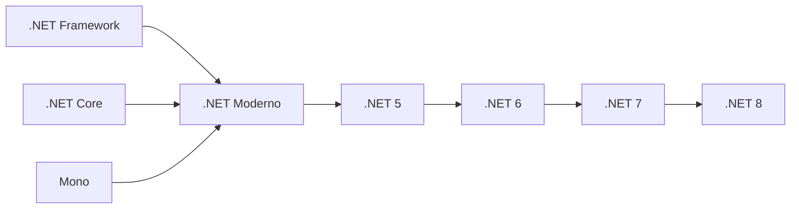
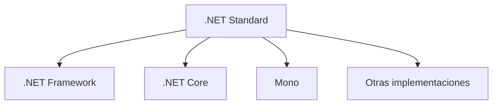
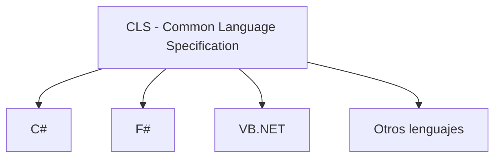

# Contexto De Las Plataformas Para El Desarrollo En .NET

## Introducción a .NET

.NET es una **plataforma tecnológica de desarrollo de software** creada por Microsoft que agrupa un conjunto de herramientas, bibliotecas y entornos de ejecución diseñados para crear diferentes tipos de aplicaciones.

Actualmente, .NET se presenta como una plataforma:

- **Gratuita**
    
- **De código abierto**
    
- **Multiplataforma**

Esto permite a los desarrolladores crear aplicaciones que se ejecutan en múltiples sistemas operativos y dispositivos.

---

# Tipos De Aplicaciones Que Se Pueden Desarrollar Con .NET

La plataforma .NET permite construir una gran variedad de sistemas y aplicaciones.

|Tipo de aplicación|Descripción|
|---|---|
|Aplicaciones de consola|Programas ejecutados desde la línea de commandos|
|Aplicaciones de escritorio|Interfaces gráficas tradicionales|
|Aplicaciones web|Sitios web y APIs|
|Aplicaciones móviles|Apps para Android e iOS|
|Microservicios|Arquitecturas distribuidas y escalables|
|Aplicaciones en la nube|Servicios cloud-native|
|Funciones serverless|Funciones ejecutadas bajo demanda en la nube|
|Videojuegos|Desarrollo con motores como Unity|
|IoT|Sistemas para dispositivos inteligentes|

---

# Características Generales De .NET

## Multiplataforma

.NET permite desarrollar aplicaciones que se ejecutan en distintos sistemas operativos:

- Windows
    
- macOS
    
- Linux
    
- iOS
    
- Android

Esto se logra manteniendo una **estructura uniforme de código y archivos de proyecto**, independientemente del tipo de aplicación desarrollada.

---

## Uniformidad Del Ecosistema

Todas las aplicaciones desarrolladas con .NET comparten:

- el mismo **modelo de proyecto**
    
- acceso a las mismas **APIs**
    
- el mismo **entorno de ejecución**

Esto facilita la reutilización de código y el aprendizaje de la plataforma.

---

# Implementaciones De .NET

.NET se presenta en distintas implementaciones adaptadas a diferentes necesidades.

|Implementación|Descripción|
|---|---|
|.NET Framework|Implementación original optimizada para Windows|
|.NET Core / .NET 5+|Versión moderna, multiplataforma|
|Mono|Implementación ligera utilizada en juegos y aplicaciones móviles|
|Universal Windows Platform (UWP)|Plataforma para aplicaciones Windows y dispositivos IoT|

---

## Evolución De .NET

La evolución de la plataforma ha llevado a una convergencia en una versión moderna unificada conocida como **.NET (Core)**.

La versión más reciente mencionada es **.NET 8**, lanzada en noviembre de 2023.

---

# .NET Standard

## Definición

**.NET Standard** es una especificación que define un conjunto común de APIs que deben implementar las distintas plataformas .NET.

Su objetivo es permitir que **bibliotecas de código sean compatibles entre diferentes implementaciones de .NET**.

---

## Problema Que Resuelve

Antes de .NET Standard, cada implementación tenía sus propias APIs.

Esto provocaba:

- incompatibilidades entre plataformas
    
- dificultad para reutilizar librerías

.NET Standard introduce un **conjunto común de APIs compatibles**.

---

## Funcionamiento De .NET Standard

Esto permite que una biblioteca desarrollada bajo .NET Standard pueda ejecutarse en diferentes plataformas.

---

# Arquitectura Modular De .NET

.NET adopta un enfoque **modular**, permitiendo dividir funcionalidades en diferentes bibliotecas.

Estas bibliotecas pueden set:

|Tipo de biblioteca|Características|
|---|---|
|Específicas de plataforma|Diseñadas para un sistema operativo específico|
|Portables|Diseñadas para funcionar en múltiples plataformas|

Este enfoque facilita la reutilización de components y mejora la mantenibilidad del software.

---

# Independencia De Lenguaje En .NET

Una característica importante de .NET es su **soporte para múltiples lenguajes de programación**.

Esto significa que diferentes lenguajes pueden ejecutarse en la misma plataforma y compartir bibliotecas.

---

## Common Language Specification (CLS)

### Definición

La **Common Language Specification (CLS)** define un conjunto de reglas que deben seguir los lenguajes que quieran set compatibles con .NET.

Estas reglas garantizan:

- interoperabilidad entre lenguajes
    
- compatibilidad de bibliotecas
    
- reutilización de código

---

## Interoperabilidad Entre Lenguajes

Todos estos lenguajes pueden utilizar las mismas bibliotecas dentro de la plataforma .NET.

---

# Lenguajes Principales De .NET

## `C#`

### Características

- Lenguaje moderno orientado a objetos
    
- Fuertemente tipado
    
- Diseñado específicamente para la plataforma .NET

### Uso Común

- aplicaciones web
    
- servicios backend
    
- aplicaciones de escritorio
    
- aplicaciones en la nube

---

## `F#`

### Características

- Lenguaje funcional
    
- Sintaxis concisa
    
- Alto rendimiento en procesamiento de datos

### Uso Común

- análisis de datos
    
- cálculos científicos
    
- sistemas financieros

---

## Visual Basic .NET

### Características

- Sintaxis cercana al lenguaje natural
    
- Orientado a facilitar el aprendizaje

### Uso Común

- aplicaciones empresariales
    
- aplicaciones de escritorio

---

# Lenguajes Extendidos En .NET

La comunidad ha desarrollado implementaciones de otros lenguajes para ejecutarse en la plataforma .NET.

|Lenguaje|Implementación|
|---|---|
|Python|IronPython|
|Ruby|IronRuby|

Estas implementaciones permiten ejecutar estos lenguajes sobre el entorno .NET.

---

# Ventajas De la Plataforma .NET

|Ventaja|Explicación|
|---|---|
|Multiplataforma|Permite ejecutar aplicaciones en múltiples sistemas|
|Ecosistema amplio|Gran cantidad de herramientas y bibliotecas|
|Soporte multi-lenguaje|Diferentes lenguajes pueden ejecutarse en la misma plataforma|
|Arquitectura modular|Permite reutilizar components fácilmente|
|Integración con la nube|Integración nativa con servicios cloud|

---

# Resumen De Puntos Clave

- .NET es una **plataforma de desarrollo creada por Microsoft**.
    
- Actualmente es **gratuita, de código abierto y multiplataforma**.
    
- Permite desarrollar aplicaciones de consola, escritorio, web, móviles, IoT y videojuegos.
    
- Existen diferentes implementaciones como **.NET Framework, .NET Core, Mono y UWP**.
    
- **.NET Standard** define un conjunto común de APIs para asegurar compatibilidad entre plataformas.
    
- La plataforma soporta múltiples lenguajes gracias a la **Common Language Specification (CLS)**.
    
- Los lenguajes principales son **C#, F# y Visual Basic .NET**.
    
- Otros lenguajes como **Python o Ruby** pueden ejecutarse mediante implementaciones como **IronPython o IronRuby**.
    
- La versión moderna del ecosistema es **.NET 5+**, siendo **.NET 8** una de las versiones recientes.

---

## MicroTest

1. ¿Cuál es un objetivo de .NET Standard?
    
    - La respuesta: b. Definir reglas comunes para la interoperabilidad de lenguajes.
        
    - Justifacion: .NET Standard define un conjunto común de APIs que deben implementar las diferentes plataformas de .NET, permitiendo que bibliotecas desarrolladas en un lenguaje o plataforma puedan set utilizadas en otras. Esto facilita la interoperabilidad entre lenguajes y plataformas dentro del ecosistema .NET.
        
2. ¿Cuáles son los tres principales lenguajes de programación en .NET?
    
    - La respuesta: d. C#, F#, Visual Basic.
        
    - Justifacion: Los tres lenguajes principales soportados oficialmente por la plataforma .NET son C#, F# y Visual Basic .NET. Estos lenguajes están diseñados para funcionar directamente con el ecosistema .NET y aprovechar sus bibliotecas, runtime y herramientas.
        
3. ¿Qué implica la interoperabilidad de lenguajes en .NET?
    
    - La respuesta: b. Se puede acceder a tipos y miembros de bibliotecas de clases sin conocer el lenguaje original.
        
    - Justifacion: La interoperabilidad en .NET permite que código escrito en diferentes lenguajes compatibles (como C#, F# o VB.NET) pueda interactuar entre sí. Gracias a la Common Language Specification (CLS), un programa puede usar bibliotecas creadas en otro lenguaje sin necesidad de conocer el lenguaje en el que fueron desarrolladas.