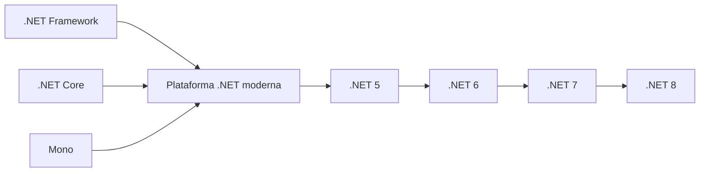
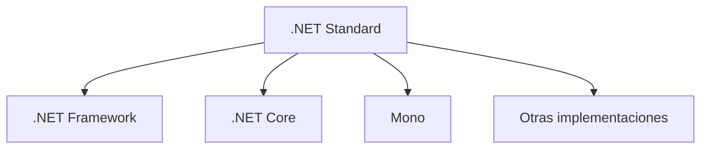
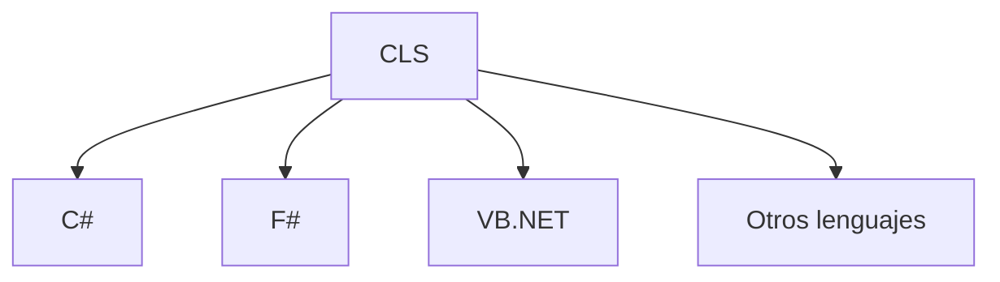

# Contexto De Las Plataformas Para El Desarrollo En .NET

## Introducción a la Plataforma .NET

.NET es una **plataforma tecnológica de desarrollo de software** creada por Microsoft. Bajo el nombre .NET se agrupa un conjunto de herramientas, bibliotecas y entornos de ejecución diseñados para facilitar el desarrollo de aplicaciones.

Originalmente, Microsoft creó diferentes implementaciones de .NET a lo largo del tiempo para responder a:

- cambios tecnológicos
    
- necesidades del mercado
    
- nuevos tipos de dispositivos y aplicaciones

Actualmente, .NET se caracteriza por set:

- gratuita
    
- de código abierto
    
- multiplataforma

Esto permite desarrollar aplicaciones que pueden ejecutarse en diferentes sistemas operativos y dispositivos.

---

# Tipos De Aplicaciones Que Se Pueden Desarrollar Con .NET

La plataforma .NET permite crear múltiples tipos de aplicaciones dentro del mismo ecosistema.

|Tipo de aplicación|Descripción|
|---|---|
|Aplicaciones de consola|Programas que se ejecutan en terminal o línea de commandos|
|Aplicaciones de escritorio|Software con interfaz gráfica para PC|
|Aplicaciones móviles|Apps para Android e iOS|
|Aplicaciones web|Sitios web y APIs|
|Microservicios|Servicios pequeños y especializados|
|Aplicaciones cloud-native|Aplicaciones diseñadas para ejecutarse en la nube|
|Funciones serverless|Funciones ejecutadas bajo demanda en la nube|
|Videojuegos|Desarrollo con motores como Unity|
|IoT|Aplicaciones para dispositivos conectados|

Este amplio rango de aplicaciones convierte a .NET en una **plataforma versátil para desarrollo de software moderno**.

---

# Características Principales De .NET

## Multiplataforma

.NET permite desarrollar aplicaciones que pueden ejecutarse en varios sistemas operativos:

- Windows
    
- macOS
    
- Linux
    
- iOS
    
- Android

Esto significa que un mismo proyecto puede adaptarse a diferentes entornos sin necesidad de reescribir el código.

---

## Uniformidad Del Código Y Proyectos

Una característica importante de .NET es que mantiene **una estructura uniforme de código y archivos de proyecto**, sin importar el tipo de aplicación que se esté desarrollando.

Esto implica que:

- los desarrolladores usan las mismas herramientas
    
- se utilizan las mismas APIs
    
- el modelo de ejecución es consistente

Esto facilita el aprendizaje y el mantenimiento de proyectos.

---

# Implementaciones De .NET

A lo largo del tiempo han existido varias implementaciones de la plataforma .NET, cada una diseñada para distintos tipos de aplicaciones.

|Implementación|Descripción|
|---|---|
|.NET Framework|Implementación original optimizada para aplicaciones Windows|
|.NET Core / .NET 5+|Implementación moderna multiplataforma|
|Mono|Implementación ligera utilizada en videojuegos y aplicaciones móviles|
|Universal Windows Platform (UWP)|Plataforma para aplicaciones Windows e IoT|

---

## Evolución De .NET

Las diferentes implementaciones han evolucionado hacia una plataforma más unificada.

La versión más reciente mencionada es **.NET 8**, lanzada en noviembre de 2023.

---

# .NET Standard

## Definición

**.NET Standard** es una especificación que define un conjunto común de **APIs que deben implementar las distintas plataformas .NET**.

Esto permite que una biblioteca de código funcione en diferentes implementaciones de la plataforma.

---

## Problema Que Resuelve

Antes de .NET Standard:

- cada implementación de .NET tenía APIs diferentes
    
- las bibliotecas no siempre eran compatibles entre plataformas

.NET Standard introduce un **contrato común de APIs** que garantiza compatibilidad.

---

## Funcionamiento De .NET Standard

Esto permite desarrollar **bibliotecas reutilizables** que funcionen en múltiples plataformas.

---

# Arquitectura Modular En .NET

.NET adopta un enfoque **modular**, donde las funcionalidades se organizan en bibliotecas de clases.

Estas bibliotecas pueden set:

|Tipo de biblioteca|Características|
|---|---|
|Bibliotecas específicas|Diseñadas para una plataforma concreta|
|Bibliotecas portables|Diseñadas para funcionar en varias plataformas|

Este enfoque mejora:

- reutilización de código
    
- mantenimiento del software
    
- portabilidad entre sistemas

---

# Independencia De Lenguaje En .NET

Una de las características más importantes de .NET es su **soporte para múltiples lenguajes de programación**.

Esto permite que diferentes lenguajes puedan utilizar las mismas bibliotecas y trabajar dentro del mismo ecosistema.

---

# Common Language Specification (CLS)

## Definición

La **Common Language Specification (CLS)** define un conjunto de reglas que deben seguir los lenguajes compatibles con .NET.

Estas reglas permiten que los lenguajes:

- interactúen entre sí
    
- compartan bibliotecas
    
- mantengan compatibilidad en el entorno de ejecución

---

## Interoperabilidad Entre Lenguajes

Gracias a CLS, un programa puede utilizar bibliotecas desarrolladas en otro lenguaje sin necesidad de conocer ese lenguaje.

---

# Lenguajes Principales De .NET

## C#

### Definición

C# es el **lenguaje principal de la plataforma .NET**.

### Características

- Orientado a objetos
    
- Fuertemente tipado
    
- Moderno y seguro

### Uso Común

- aplicaciones web
    
- APIs
    
- microservicios
    
- aplicaciones cloud

---

## F#

### Definición

F# es un **lenguaje funcional de alto rendimiento** dentro del ecosistema .NET.

### Características

- sintaxis concisa
    
- programación funcional
    
- eficiente para procesamiento de datos

### Uso Común

- análisis de datos
    
- aplicaciones científicas
    
- cálculos complejos

---

## Visual Basic .NET

### Definición

Visual Basic .NET es un lenguaje con **sintaxis más cercana al lenguaje humano**.

### Características

- fácil de aprender
    
- ampliamente utilizado en aplicaciones empresariales

### Uso Común

- aplicaciones de escritorio
    
- sistemas empresariales

---

# Lenguajes Extendidos En .NET

La comunidad ha desarrollado implementaciones de otros lenguajes para ejecutarse en la plataforma .NET.

|Lenguaje|Implementación|
|---|---|
|Python|IronPython|
|Ruby|IronRuby|

Estas implementaciones permiten utilizar estos lenguajes dentro del entorno .NET.

---

# Ventajas De la Plataforma .NET

|Ventaja|Descripción|
|---|---|
|Multiplataforma|Permite ejecutar aplicaciones en múltiples sistemas|
|Ecosistema amplio|Gran cantidad de herramientas y bibliotecas|
|Soporte multi-lenguaje|Diferentes lenguajes pueden trabajar juntos|
|Arquitectura modular|Facilita reutilización de código|
|Integración con la nube|Soporte para aplicaciones cloud y microservicios|

---

# Resumen De Puntos Clave

- .NET es una **plataforma de desarrollo creada por Microsoft**.
    
- Actualmente es **gratuita, de código abierto y multiplataforma**.
    
- Permite desarrollar aplicaciones de consola, escritorio, web, móviles, IoT y videojuegos.
    
- Existen distintas implementaciones como **.NET Framework, .NET Core, Mono y UWP**.
    
- **.NET Standard** define un conjunto común de APIs para garantizar compatibilidad entre implementaciones.
    
- La **Common Language Specification (CLS)** permite interoperabilidad entre lenguajes.
    
- Los lenguajes principales de la plataforma son **C#, F# y Visual Basic .NET**.
    
- La versión moderna de la plataforma ha evolucionado hasta **.NET 8**.

---

## MicroTest

1. ¿Cuál de las siguientes afirmaciones describe correctamente una ventaja clave de .NET?
    
    - La respuesta: d. .NET permite desarrollar aplicaciones para diferentes sistemas operativos.
        
    - Justifacion: Una de las principales ventajas de .NET, especialmente desde .NET Core y versiones posteriores como .NET 5–8, es que es **multiplataforma**, permitiendo desarrollar aplicaciones que se ejecutan en Windows, Linux y macOS.
        
2. ¿Cuál es un aspecto positivo relacionado con la biblioteca común en .NET?
    
    - La respuesta: d. Existe una amplia biblioteca de clases en diferentes lenguajes y una sólida documentación.
        
    - Justifacion: .NET incluye una **Base Class Library (BCL)** muy extensa que proporciona funcionalidades reutilizables y está disponible para distintos lenguajes compatibles con la plataforma. Además, cuenta con documentación official amplia y una comunidad activa que contribuye a su desarrollo y aprendizaje.
        
3. ¿Cuál es una crítica común relacionada con el vendor lock-in en .NET?
    
    - La respuesta: b. La dependencia de las decisiones que tome Microsoft puede set una preocupación para algunos desarrolladores.
        
    - Justifacion: El **vendor lock-in** ocurre cuando una tecnología depende fuertemente de un proveedor. En el caso de .NET, aunque es parcialmente de código abierto, su evolución y muchas decisiones estratégicas dependen de Microsoft, lo que puede generar preocupación sobre la dependencia del ecosistema.