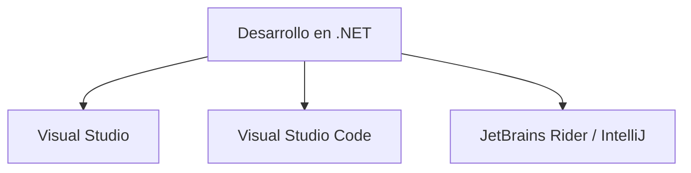

# Entornos De Desarrollo Integrados (IDE) En .NET — Parte 1

## Introducción

En el desarrollo de aplicaciones con .NET es fundamental contar con **Entornos de Desarrollo Integrados (IDE)** que faciliten la escritura, compilación, depuración y mantenimiento del código.

Los IDE proporcionan herramientas que permiten:

- escribir código de forma eficiente
    
- detectar errores
    
- depurar aplicaciones
    
- integrar sistemas de control de versiones
    
- automatizar compilaciones y pruebas

Entre los entornos más utilizados para desarrollar en .NET destacan:

- Visual Studio
    
- Visual Studio Code
    
- IntelliJ / JetBrains Rider

Según encuestas recientes de desarrolladores (Developer Survey 2023), **Visual Studio Code** es uno de los entornos más utilizados debido a su carácter gratuito y extensible.

---

# ¿Qué Es Un Entorno De Desarrollo Integrado (IDE)?

## Definición

Un **IDE (Integrated Development Environment)** es una aplicación que proporciona herramientas integradas para el desarrollo de software.

Un IDE suele incluir:

- editor de código
    
- compilador o intérprete
    
- herramientas de depuración
    
- integración con sistemas de control de versiones
    
- herramientas de pruebas

---

## Components De Un IDE

|Componente|Función|
|---|---|
|Editor de código|Permite escribir y editar el código fuente|
|Compilador / Runtime|Ejecuta o compila el programa|
|Depurador (Debugger)|Permite detectar y corregir errores|
|Control de versiones|Integración con Git u otros sistemas|
|Herramientas de pruebas|Permiten ejecutar pruebas automáticas|

---

# IDE Populares Para .NET

Estos entornos permiten desarrollar aplicaciones dentro del ecosistema .NET, aunque con diferentes niveles de integración.

---

# Visual Studio

## Definición

**Visual Studio** es el entorno de desarrollo integrado principal desarrollado por Microsoft para el desarrollo de aplicaciones dentro del ecosistema .NET.

Es una plataforma completa diseñada para desarrollar distintos tipos de aplicaciones.

---

## Tipos De Aplicaciones Que Permite Crear

Visual Studio permite desarrollar:

|Tipo de aplicación|Descripción|
|---|---|
|Aplicaciones de escritorio|Programas con interfaz gráfica|
|Aplicaciones web|Sitios web y APIs|
|Aplicaciones móviles|Apps híbridas o nativas|
|Servicios web|APIs y servicios backend|

---

## Compatibilidad De Plataforma

Visual Studio permite trabajar con distintos sistemas y plataformas.

|Plataforma|Soporte|
|---|---|
|Windows|Soporte completo|
|macOS|Versión disponible|
|Android|Desarrollo móvil|
|Linux|Soporte mediante herramientas y contenedores|
|Cloud|Integración con Azure|

---

## Lenguajes Compatibles

Visual Studio permite programar en múltiples lenguajes.

|Lenguaje|Uso|
|---|---|
|C#|Lenguaje principal de .NET|
|Visual Basic .NET|Aplicaciones empresariales|
|F#|Programación funcional|
|C++|Aplicaciones de alto rendimiento|
|Python|Desarrollo general|

---

## Características Principales

Visual Studio incluye numerosas funcionalidades que facilitan el desarrollo de software.

|Característica|Descripción|
|---|---|
|Depuración (Debugging)|Permite encontrar y corregir errores|
|Diagnóstico|Análisis del comportamiento del programa|
|Integración con Git|Control de versiones|
|Marketplace de extensions|Permite ampliar funcionalidades|
|Desarrollo de bases de datos|Herramientas para trabajar con bases de datos|
|Desarrollo móvil|Creación de aplicaciones multiplataforma|
|Integración con Azure|Desarrollo y despliegue en la nube|

---

## Herramientas Avanzadas

Visual Studio incluye herramientas avanzadas para optimizar el desarrollo.

|Herramienta|Función|
|---|---|
|IntelliTrace|Permite rastrear la ejecución del código|
|Data Collector|Recolección de datos durante pruebas|
|Agentes de prueba|Automatización de pruebas|
|CLI Tools|Automatización de compilaciones mediante línea de commandos|

Estas herramientas permiten mejorar la **productividad y calidad del software**.

---

# Visual Studio Code

## Definición

**Visual Studio Code (VS Code)** es un **editor de código fuente ligero y extensible** desarrollado por Microsoft.

Aunque algunos desarrolladores lo consideran solo un editor de código, su sistema de **extensions** permite convertirlo en un entorno de desarrollo muy completo.

---

## Características Principales

|Característica|Descripción|
|---|---|
|Ligero|Consume pocos recursos|
|Multiplataforma|Funciona en Windows, macOS y Linux|
|Extensible|Gran ecosistema de extensions|
|Integración con Git|Control de versiones integrado|
|Soporte multi-lenguaje|Compatible con muchos lenguajes|

---

## Lenguajes Y Tecnologías Soportadas

Visual Studio Code ofrece soporte para múltiples lenguajes mediante extensions.

|Lenguaje|Soporte|
|---|---|
|JavaScript|Integrado|
|TypeScript|Integrado|
|Node.js|Integrado|
|C#|Mediante extensions|
|Java|Mediante extensions|
|Python|Mediante extensions|
|PHP|Mediante extensions|
|Go|Mediante extensions|

También ofrece soporte para runtimes y plataformas como:

- .NET
    
- Unity

---

## Ventajas De Visual Studio Code

|Ventaja|Descripción|
|---|---|
|Gratuito|Accessible para cualquier desarrollador|
|Muy ligero|Ideal para equipos con menos recursos|
|Gran comunidad|Amplio ecosistema de extensions|
|Alta popularidad|Uno de los editores más utilizados según encuestas|

---

# Comparación Visual Studio Vs Visual Studio Code

|Característica|Visual Studio|Visual Studio Code|
|---|---|---|
|Tipo|IDE completo|Editor extensible|
|Consumo de recursos|Alto|Bajo|
|Funcionalidades integradas|Muchas|Básicas|
|Extensions|Sí|Sí|
|Multiplataforma|Parcial|Completa|
|Popularidad|Alta|Muy alta|

---

# Uso Típico De Cada Herramienta

|Herramienta|Uso más común|
|---|---|
|Visual Studio|Proyectos empresariales grandes|
|Visual Studio Code|Desarrollo rápido y ligero|
|Visual Studio Code|Desarrollo web y multiplataforma|

---

# Importancia De Los IDE En El Desarrollo .NET

Los IDE facilitan significativamente el proceso de desarrollo porque:

- automatizan tareas repetitivas
    
- mejoran la detección de errores
    
- integran herramientas de pruebas
    
- permiten trabajar con repositorios de código

Esto mejora la **productividad y calidad del software desarrollado**.

---

# Resumen De Puntos Clave

- Un **IDE** es un entorno que integra herramientas necesarias para desarrollar software.
    
- En el ecosistema .NET destacan **Visual Studio, Visual Studio Code y otros entornos como JetBrains Rider**.
    
- **Visual Studio** es el IDE más completo para desarrollar aplicaciones en .NET.
    
- Permite crear aplicaciones web, móviles, de escritorio y servicios.
    
- Incluye herramientas avanzadas de depuración, pruebas y diagnóstico.
    
- **Visual Studio Code** es un editor de código ligero y extensible.
    
- Gracias a su sistema de extensions puede utilizarse como entorno de desarrollo para múltiples lenguajes.
    
- VS Code es uno de los entornos más populares entre desarrolladores.

---

## MicroTest

1. ¿En qué sistemas operativos puede ejecutarse Visual Studio Code?
    
    - La respuesta: c. En Windows, macOS y Linux.
        
    - Justifacion: Visual Studio Code es un editor de código **multiplataforma**, diseñado para ejecutarse en los principales sistemas operativos como Windows, macOS y Linux, lo que permite a los desarrolladores trabajar en distintos entornos.
        
2. ¿Qué lenguajes de programación son compatibles con Visual Studio?
    
    - La respuesta: c. C++, C#, Java y más.
        
    - Justifacion: Visual Studio soporta múltiples lenguajes de programación mediante herramientas integradas y extensions, incluyendo C++, C#, Python, JavaScript y otros, lo que lo convierte en un entorno de desarrollo muy versátil.
        
3. ¿Cuál es la principal característica de Visual Studio Code?
    
    - La respuesta: c. Editor de código ligero y potente.
        
    - Justifacion: Visual Studio Code se caracteriza por set un **editor de código ligero pero muy potente**, que puede ampliarse mediante extensions para soportar múltiples lenguajes, herramientas y plataformas de desarrollo.