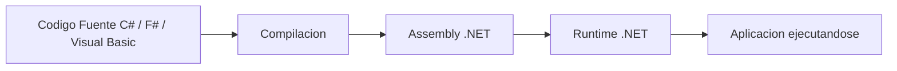
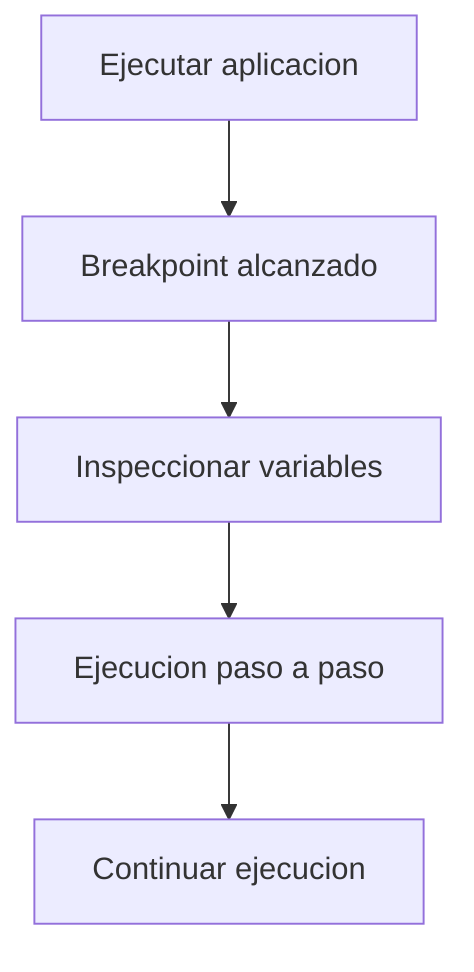

# Introducción Al Desarrollo Con .NET Y Visual Studio

## 1. Plataforma .NET

### Definición

.NET es una **plataforma de desarrollo de software creada por Microsoft** que permite construir diferentes tipos de aplicaciones utilizando un mismo conjunto de herramientas, lenguajes y bibliotecas.

Su objetivo principal es proporcionar un **entorno unificado** para el desarrollo de software, donde el código y la estructura de los proyectos mantienen una apariencia similar independientemente del tipo de aplicación creada.

### Tipos De Aplicaciones Que Se Pueden Desarrollar Con .NET

|Tipo de aplicación|Tecnología utilizada|
|---|---|
|Aplicaciones de consola|.NET Runtime|
|Aplicaciones de escritorio|Windows Forms, WPF|
|Aplicaciones web|ASP.NET|
|Aplicaciones móviles|.NET MAUI / Xamarin|
|Microservicios|ASP.NET Core|
|Aplicaciones en la nube|Azure|
|Videojuegos|Motores compatibles con .NET|
|Internet de las Cosas|IoT frameworks|
|Servicios de Windows|Windows Services|

### Características Principales

- Código reutilizable entre distintos tipos de aplicaciones.
    
- Acceso a las mismas bibliotecas y APIs.
    
- Entorno multiplataforma.
    
- Integración con herramientas de Microsoft como Azure.
    
- Gran ecosistema de librerías.

---

## 2. Arquitectura Y Funcionamiento De .NET

En .NET todas las aplicaciones siguen una estructura similar: el código fuente se compila y se ejecuta sobre un **runtime**.

### Conceptos Clave

|Concepto|Definición|
|---|---|
|Runtime|Entorno que ejecuta las aplicaciones .NET|
|API|Conjunto de librerías y funciones disponibles|
|Proyecto|Estructura de archivos que compone una aplicación|
|Compilación|Proceso de transformar el código fuente en código ejecutable|

### Flujo General De Ejecución



---

## 3. Lenguajes Compatibles Con .NET

Las implementaciones de .NET permiten programar principalmente con tres lenguajes:

|Lenguaje|Descripción|
|---|---|
|C#|Lenguaje principal de la plataforma|
|F#|Lenguaje funcional|
|Visual Basic|Lenguaje orientado a productividad|

El más utilizado actualmente es **C#**.

---

## 4. Implementaciones De .NET

Las implementaciones son las distintas versiones del entorno que permiten ejecutar aplicaciones .NET.

### 4.1 .NET Framework

#### Definición

Primera implementación de .NET, lanzada en **2002**.

Características:

- Solo funciona en **Windows**
    
- Diseñado para **aplicaciones de escritorio**
    
- Actualmente está en mantenimiento

Versión final con soporte:

.NET Framework **4.8**

### 4.2 .NET Core / .NET 5+

#### Definición

Implementación moderna y **multiplataforma**.

Permite ejecutar aplicaciones en:

- Windows
    
- Linux
    
- macOS

Características principales:

- Código abierto
    
- Mejor rendimiento
    
- Diseñado para aplicaciones modernas

Versiones relevantes:

|Versión|Estado|
|---|---|
|.NET Core 3.1|Soporte extendido|
|.NET 5|Deprecado|
|.NET 6|Versión estable con soporte|

### 4.3 Mono

Implementación alternativa creada para ejecutar aplicaciones .NET en **entornos multiplataforma** antes de .NET Core.

Actualmente se utilize principalmente como:

- compilador
    
- runtime para algunos sistemas móviles

### 4.4 Universal Windows Platform (UWP)

Framework orientado a crear aplicaciones para:

- Tablets
    
- Teléfonos
    
- Xbox
    
- IoT

---

## 5. Herramientas De Desarrollo

Las aplicaciones .NET pueden desarrollarse usando diferentes herramientas.

### Visual Studio

IDE completo desarrollado por Microsoft.

Características:

- Editor de código
    
- depuración avanzada
    
- integración con compilación
    
- gestión de proyectos
    
- integración con servidores

### Visual Studio Code

Editor de código ligero que se puede ampliar mediante extensions.

### Línea De Commandos .NET CLI

Permite crear y ejecutar proyectos directamente desde terminal.

Ejemplo:

```Python
dotnet new webapp -n MiAplicacion --no-https -f net5.0
```

Explicación:

|Parámetro|Función|
|---|---|
|dotnet|herramienta CLI|
|new|crea un nuevo proyecto|
|webapp|tipo de proyecto|
|-n|nombre del proyecto|
|--no-https|desactiva HTTPS|
|-f net5.0|versión del framework|

---

## 6. Ejecución De Aplicaciones

Una vez creado el proyecto se puede ejecutar con:

```Python
dotnet run
```

Esto realiza:

1. Compilación del código
    
2. Ejecución de la aplicación

### Ejecución Con Recompilación Automática

```Python
dotnet watch run
```

Este commando:

- detecta cambios en el código
    
- recompila automáticamente
    
- vuelve a ejecutar la aplicación

Ideal para **entornos de desarrollo**.

---

## 7. Estructura De Un Proyecto .NET

Cuando se abre un proyecto en Visual Studio se observa una estructura común.

Elementos principales:

|Archivo|Función|
|---|---|
|appsettings.json|configuración de la aplicación|
|Program.cs|punto de entrada|
|Pages|interfaz de usuario|
|Controllers|lógica del servidor|

---

## 8. Lenguaje C#

### Características

C# es el lenguaje principal de .NET.

Tiene similitudes con Java.

Comparación:

|C#|Java|
|---|---|
|namespace|package|
|using|import|
|propiedades automáticas|getters/setters|

---

## 9. Servidor De Desarrollo IIS Express

Cuando se ejecuta una aplicación web desde Visual Studio se utilize **IIS Express**.

### Definición

Servidor web ligero que permite ejecutar aplicaciones localmente durante el desarrollo.

Funciona como un entorno de pruebas antes del despliegue en producción.

---

## 10. Framework Blazor

### Definición

Blazor es un framework de código abierto que permite crear aplicaciones web usando **C# en lugar de JavaScript**.

Forma parte del proyecto **ASP.NET Core**.

Tecnologías utilizadas:

- C#
    
- HTML
    
- CSS

### Ventaja Principal

Permite desarrollar aplicaciones web interactivas sin necesidad de JavaScript.

---

## 11. Ejemplo De Blazor: Contador

Ejemplo simplificado de contador en Blazor.

```csharp
<button @onclick="IncrementCount">Click</button>

<p>Current count: @count</p>

@code {
    int count = 0;

    void IncrementCount()
    {
        count++;
    }
}
```

### Explicación Paso a Paso

1. Se define un botón HTML.
    
2. `@onclick` conecta el botón con una función en C#.
    
3. `count` es la variable que guarda el valor.
    
4. `IncrementCount()` aumenta el contador.
    
5. Blazor actualiza automáticamente la interfaz.

---

## 12. Depuración En Visual Studio

Una de las ventajas del IDE es la capacidad de depuración.

### Breakpoints

Un **breakpoint** es un punto donde la ejecución del programa se detiene.

Permite:

- inspeccionar variables
    
- analizar el flujo del programa
    
- ejecutar paso a paso

### Flujo De Depuración



---

## 13. Entity Framework

### Definición

Entity Framework es el **framework de acceso a datos de .NET**.

Permite interactuar con bases de datos utilizando objetos en lugar de consultas SQL directas.

Equivalente conceptual en Java:

**JPA (Java Persistence API)**

### Components

|Componente|Función|
|---|---|
|Entity|representación de una tabla|
|DbContext|conexión con la base de datos|
|Migration|control de cambios en el esquema|

---

## 14. Repositorios De Ejemplos

Microsoft mantiene repositorios oficiales con ejemplos de ASP.NET Core.

Ejemplos incluyen:

- CRUD
    
- aplicaciones web
    
- uso de Entity Framework
    
- arquitectura cliente-servidor

Estos repositorios permiten:

- aprender buenas prácticas
    
- reutilizar código
    
- probar proyectos completos

---

## 15. Ejecución De Aplicaciones Con Docker

Algunos proyectos de ejemplo pueden ejecutarse usando Docker.

Commandos:

```Python
docker compose build
docker compose up
```

### Explicación

|Commando|Función|
|---|---|
|build|construye las imágenes|
|up|inicia los contenedores|

Esto permite ejecutar todo el sistema de forma automática.

---

# Resumen De Puntos Clave

- .NET es una plataforma de desarrollo creada por Microsoft para construir múltiples tipos de aplicaciones.
    
- Permite desarrollar software para escritorio, web, móvil, nube e IoT.
    
- Los lenguajes principales son C#, F# y Visual Basic.
    
- Existen varias implementaciones: .NET Framework, .NET Core/.NET 5+, Mono y UWP.
    
- Visual Studio es el IDE principal para desarrollar aplicaciones .NET.
    
- La herramienta CLI permite crear y ejecutar proyectos desde la terminal.
    
- Blazor permite crear aplicaciones web usando C# en lugar de JavaScript.
    
- Entity Framework facilita el acceso a bases de datos mediante programación orientada a objetos.
    
- Visual Studio ofrece herramientas avanzadas de depuración como breakpoints.
    
- Existen repositorios oficiales con ejemplos completos de aplicaciones ASP.NET Core.

## MicroTest

1. En el video, para crear el ejemplo, ¿qué instrucción se lanza?
    
    - La respuesta: c. dotnet new webapp
        
    - Justifacion: En el video se muestra el uso de la herramienta de línea de commandos de .NET para crear un nuevo proyecto web usando la instrucción **dotnet new webapp**, que genera automáticamente la estructura base de una aplicación web.
        
2. En el video, ¿en qué fichero se realiza la configuración del sistema de logging?
    
    - La respuesta: b. appsettings.json
        
    - Justifacion: En los proyectos .NET la configuración de la aplicación, incluyendo el sistema de logging y otros parámetros, se define en el archivo **appsettings.json**, que actúa como archivo central de configuración.
        
3. En el video, ¿qué instrucción se debe lanzar para ejecutar desde línea de commandos el proyecto?
    
    - La respuesta: d. dotnet run
        
    - Justifacion: Para ejecutar una aplicación .NET desde la terminal se utilize el commando **dotnet run**, que compila el proyecto si es necesario y luego ejecuta la aplicación.