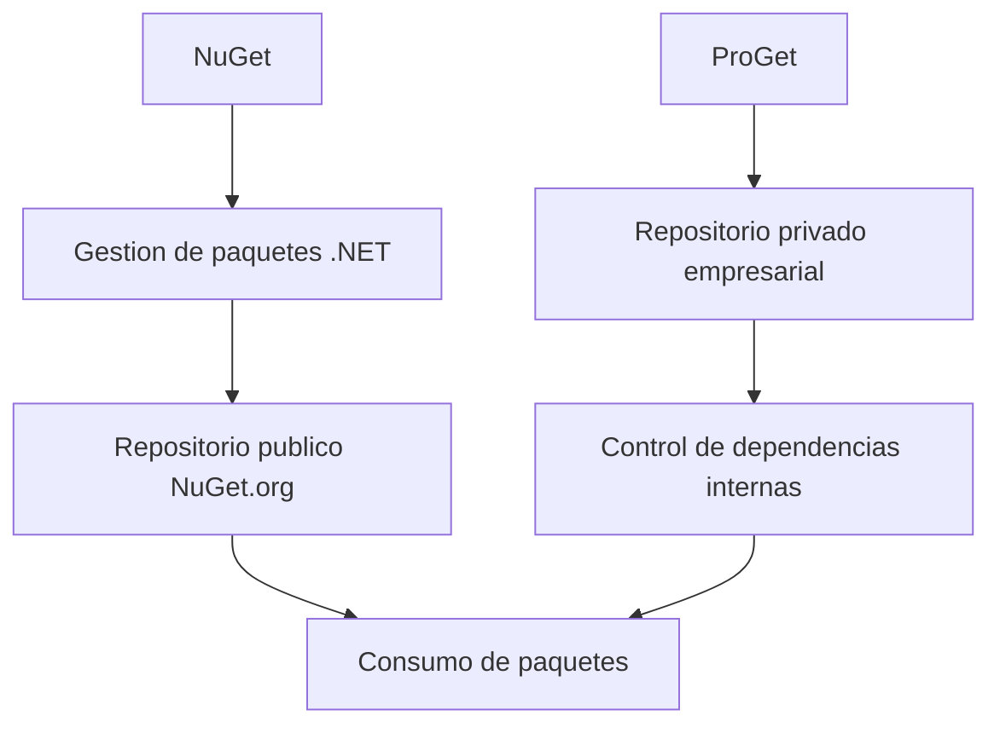

# Plataformas Para la Gestión De Paquetes En .NET

## 1. Introducción a la Gestión De Paquetes

### Definición

La **gestión de paquetes** es el proceso mediante el cual se administran las dependencias, bibliotecas y recursos que utilize un proyecto de software. En el ecosistema .NET, estas dependencias se distribuyen en unidades llamadas **paquetes**.

### Importancia En El Desarrollo De Software

La gestión de paquetes permite:

- Reutilizar código entre diferentes proyectos.
    
- Simplificar la instalación de bibliotecas externas.
    
- Mantener control sobre versiones de dependencias.
    
- Automatizar actualizaciones y configuraciones.

En proyectos modernos, la gestión de dependencias es esencial para mantener **consistencia y compatibilidad** entre los distintos components del sistema.

### Flujo General De Gestión De Paquetes


---

# 2. Concepto De Paquete En .NET

## Definición

Un **paquete** es una unidad distribuible que contiene:

- Código compilado
    
- Bibliotecas
    
- recursos
    
- metadatos de configuración

Los paquetes permiten encapsular funcionalidades específicas que pueden reutilizarse en distintos proyectos.

## Contenido Típico De Un Paquete

|Elemento|Descripción|
|---|---|
|DLL|Bibliotecas compiladas|
|Recursos|Archivos adicionales necesarios|
|Metadatos|Información sobre versión y dependencias|
|Manifiesto|Archivo descriptivo del paquete|

Los desarrolladores pueden:

- Crear paquetes propios
    
- Compartirlos públicamente
    
- Usarlos internamente en una organización

---

# 3. Gestión De Dependencias

## Definición

La **gestión de dependencias** consiste en declarar qué bibliotecas necesita un proyecto y qué versiones específicas deben utilizarse.

Esto garantiza:

- compatibilidad entre components
    
- reproducibilidad del proyecto
    
- estabilidad del software

## Archivos De Configuración En .NET

Los proyectos .NET incluyen archivos donde se especifican las dependencias.

|Archivo|Función|
|---|---|
|packages.config|lista tradicional de paquetes|
|.csproj (PackageReference)|gestión moderna de dependencias|
|NuGet.config|configuración de repositorios|

Ejemplo conceptual de referencia de paquete:

```Python
<PackageReference Include="Newtonsoft.Json" Version="13.0.1" />
```

Este ejemplo indica que el proyecto depende de una biblioteca específica con una versión concreta.

---

# 4. Repositorios De Paquetes

## Definición

Los **repositorios de paquetes** son sistemas donde se almacenan y distribuyen paquetes de software.

Tipos de repositorios:

|Tipo|Descripción|
|---|---|
|Públicos|accesibles para cualquier desarrollador|
|Privados|restringidos a organizaciones|

## Ventajas De Los Repositorios

- distribución centralizada de bibliotecas
    
- control de acceso
    
- reutilización de código
    
- control de versiones

---

# 5. NuGet

## 5.1 Definición

**NuGet** es el sistema official de gestión de paquetes para el ecosistema .NET.

Permite:

- crear paquetes
    
- publicarlos
    
- instalarlos
    
- gestionar dependencias

Es una herramienta fundamental en el desarrollo moderno con .NET.

---

## 5.2 Estructura De Un Paquete NuGet

Un paquete NuGet es esencialmente un archivo comprimido.

|Elemento|Descripción|
|---|---|
|.nupkg|archivo del paquete|
|DLL|código compilado|
|manifest|metadatos del paquete|
|dependencias|otros paquetes requeridos|

Un archivo `.nupkg` es técnicamente un **archivo ZIP** que contiene todos estos components.

---

## 5.3 Flujo De Uso De NuGet


---

## 5.4 Repositorio Público NuGet.org

**NuGet.org** es el repositorio official público donde los desarrolladores publican y descargan paquetes.

Características:

- acceso global
    
- miles de bibliotecas disponibles
    
- integración directa con Visual Studio

También es possible configurar **repositorios privados** dentro de organizaciones.

---

## 5.5 Herramientas De NuGet

NuGet proporciona diferentes herramientas para gestionar paquetes.

|Herramienta|Función|
|---|---|
|.NET CLI|gestión desde línea de commandos|
|nuget.exe|cliente de NuGet|
|Visual Studio Package Manager|interfaz gráfica|
|Visualizador de paquetes|exploración de dependencias|

Ejemplo de instalación de paquete mediante CLI:

```Python
dotnet add package Newtonsoft.Json
```

### Explicación Paso a Paso

1. `dotnet` invoca la herramienta CLI de .NET.
    
2. `add package` indica que se agregará una dependencia.
    
3. `Newtonsoft.Json` es el nombre del paquete.
    
4. El gestor descarga el paquete desde el repositorio.
    
5. Se añade automáticamente al archivo del proyecto.

---

## 5.6 Restauración Automática De Paquetes

Una característica importante de NuGet es la **restauración de paquetes**.

Cuando se abre un proyecto:

1. el sistema revisa las dependencias declaradas
    
2. descarga automáticamente los paquetes necesarios
    
3. los instala en el entorno de desarrollo

Esto evita tener que incluir bibliotecas dentro del repositorio del proyecto.

---

# 6. Compatibilidad De Paquetes

Los paquetes pueden diseñarse para diferentes versiones del framework.

Opciones comunes:

|Tipo de compatibilidad|Descripción|
|---|---|
|.NET Standard|máxima compatibilidad|
|.NET específico|orientado a versiones concretas|
|multiplataforma|compatible con distintos sistemas|

El estándar **.NET Standard** facilita la reutilización de código entre múltiples implementaciones de .NET.

---

# 7. ProGet

## 7.1 Definición

**ProGet** es una plataforma empresarial de gestión de paquetes desarrollada por **Inedo**.

Originalmente fue diseñada como un **repositorio privado para NuGet**, pero evolucionó hasta convertirse en una solución completa de gestión de artefactos.

---

## 7.2 Características Principales

|Característica|Descripción|
|---|---|
|Repositorios privados|almacenamiento interno de paquetes|
|gestión de dependencias|control de bibliotecas utilizadas|
|soporte para DevOps|integración con pipelines|
|paquetes universales|distribución de aplicaciones|
|análisis de vulnerabilidades|seguridad del software|
|gestión de licencias|control de cumplimiento legal|

---

## 7.3 Uso En Entornos Empresariales

ProGet permite:

- centralizar paquetes internos
    
- compartir bibliotecas entre equipos
    
- controlar despliegues
    
- gestionar components de terceros

Esto mejora la **consistencia del software en diferentes entornos**.

---

# 8. Relación Entre NuGet Y ProGet



NuGet se centra en la **gestión y distribución de paquetes**, mientras que ProGet ofrece **infraestructura empresarial para almacenarlos y administrarlos**.

---

# 9. Ventajas De la Gestión De Paquetes En .NET

|Ventaja|Explicación|
|---|---|
|Reutilización de código|bibliotecas compartidas entre proyectos|
|Control de versiones|evita incompatibilidades|
|Automatización|instalación y actualización automática|
|Colaboración|equipos comparten components|
|Seguridad|gestión de dependencias externas|

---

# Resumen De Puntos Clave

- La gestión de paquetes en .NET permite administrar dependencias y reutilizar código de manera eficiente.
    
- Los paquetes contienen bibliotecas compiladas, recursos y metadatos necesarios para una funcionalidad específica.
    
- Las dependencias se declaran en archivos de configuración como `packages.config` o `.csproj`.
    
- NuGet es el sistema official de gestión de paquetes en .NET y permite crear, publicar y consumir paquetes.
    
- Los paquetes NuGet se distribuyen como archivos `.nupkg` que contienen código compilado y metadatos.
    
- Los repositorios pueden set públicos (NuGet.org) o privados dentro de organizaciones.
    
- La restauración automática de paquetes permite reproducir proyectos fácilmente.
    
- ProGet es una plataforma empresarial para alojar y gestionar paquetes de forma centralizada.
    
- La gestión de paquetes mejora la productividad, la colaboración y la consistencia del desarrollo de software.

## MicroTest

1. ¿Qué funcionalidad ofrece ProGet para mejorar la seguridad en el desarrollo de software?
    
    - La respuesta: b. Detección y bloqueo de licencias de código abierto.
        
    - Justifacion: ProGet incluye herramientas de seguridad como análisis de licencias y vulnerabilidades en los paquetes, lo que permite detectar y bloquear licencias de código abierto que puedan set incompatibles con las políticas de una organización.
        
2. ¿Cuál es el papel principal de NuGet en el desarrollo de software en .NET?
    
    - La respuesta: d. Facilitar la creación, publicación y consumo de paquetes .NET.
        
    - Justifacion: NuGet es el gestor de paquetes official del ecosistema .NET y su función principal es permitir a los desarrolladores crear, publicar, distribuir e instalar paquetes que contienen bibliotecas y dependencias reutilizables.
        
3. ¿Cuál de las siguientes características no es proporcionada por NuGet?:
    
    - La respuesta: c. Registro de despliegues en Otter y Octopus Deploy.
        
    - Justifacion: NuGet se encarga de la creación, publicación, exploración y gestión de dependencias de paquetes en el ecosistema .NET, e incluso puede integrarse con herramientas como NuGet Package Explorer. Sin embargo, el **registro de despliegues en herramientas como Otter y Octopus Deploy** corresponde a sistemas de gestión de despliegue y automatización DevOps, no al gestor de paquetes NuGet.