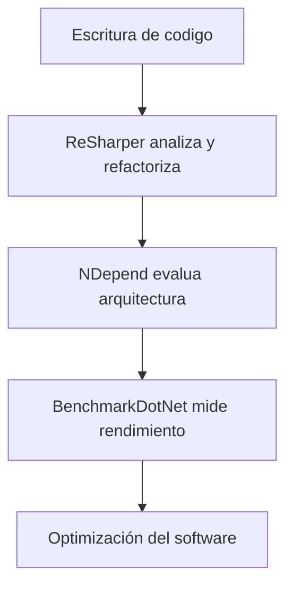

# Plataformas Aceleradoras Del Desarrollo En .NET

## 1. Introducción

El desarrollo de aplicaciones modernas require herramientas que permitan **acelerar la escritura, análisis y optimización del código**. En el ecosistema .NET existen diversas plataformas y extensions que se integran dentro de los **IDEs (Integrated Development Environments)** para mejorar la productividad de los desarrolladores.

Estas herramientas ayudan a:

- Automatizar la **refactorización del código**
    
- Analizar la **calidad del software**
    
- Detectar **problemas de rendimiento**
    
- Evaluar **métricas de diseño**
    
- Optimizar el proceso de desarrollo

Las plataformas aceleradoras actúan como **extensions del entorno de desarrollo**, proporcionando análisis automáticos y herramientas avanzadas.

---

# 2. Entornos De Desarrollo Integrados (IDE)

## Definición

Un **IDE (Integrated Development Environment)** es una herramienta que reúne múltiples funcionalidades para el desarrollo de software en un solo entorno.

Funciones principales de un IDE:

|Función|Descripción|
|---|---|
|Editor de código|Permite escribir código fuente|
|Compilador|Traduce el código a ejecutables|
|Depurador|Permite detectar errores|
|Gestión de proyectos|Organiza archivos y dependencias|
|Integración de herramientas|Permite añadir extensions|

Ejemplo común en el desarrollo .NET:

- Visual Studio

Las plataformas aceleradoras suelen integrarse directamente en estos entornos.

---

# 3. Tipos De Herramientas De Aceleración Del Desarrollo

Las herramientas mencionadas en el transcript se enfocan en diferentes aspectos del desarrollo.

|Tipo de herramienta|Objetivo|
|---|---|
|Refactorización|Mejorar la estructura del código|
|Análisis estático|Evaluar calidad del código|
|Métricas de software|Medir complejidad y acoplamiento|
|Benchmarking|Evaluar rendimiento|
|Perfilado|Analizar ejecución del programa|

---

# 4. ReSharper

## 4.1 Definición

**ReSharper** es una extensión desarrollada por **JetBrains** que se integra con **Visual Studio** para mejorar la productividad de los desarrolladores .NET.

Su objetivo principal es **facilitar la escritura y mantenimiento de código de alta calidad**.

---

## 4.2 Lenguajes Soportados

ReSharper ofrece soporte para varios lenguajes utilizados en proyectos .NET.

|Lenguaje|Uso|
|---|---|
|C#|Lenguaje principal de .NET|
|JavaScript|Desarrollo web|
|TypeScript|Desarrollo web tipado|
|C++|Desarrollo de sistemas|
|MSBuild scripts|Automatización de compilación|

---

## 4.3 Funcionalidades Principales

|Funcionalidad|Descripción|
|---|---|
|Análisis de código en tiempo real|Detecta errores mientras se escribe código|
|Refactorización automática|Permite mejorar estructura del código|
|Navegación avanzada|Facilita moverse entre archivos|
|Formateo de código|Mejora la legibilidad|
|Limpieza automática|Elimina código innecesario|

ReSharper incluye:

- más de **2000 inspecciones de código**
    
- más de **60 patrones de refactorización**

---

## 4.4 Herramientas Adicionales En Versión Ultimate

La versión completa incluye herramientas adicionales para análisis avanzado.

|Herramienta|Función|
|---|---|
|dotCover|Cobertura de pruebas unitarias|
|dotTrace|Profiling de rendimiento|
|dotMemory|Análisis de uso de memoria|

Estas herramientas permiten analizar el comportamiento del programa durante su ejecución.

---

# 5. NDepend

## 5.1 Definición

**NDepend** es una herramienta de **análisis estático de código** para aplicaciones .NET.

Permite evaluar la calidad del software mediante el análisis de la estructura del código.

---

## 5.2 Objetivos Principales

NDepend ayuda a analizar:

- arquitectura del software
    
- calidad del código
    
- dependencias entre módulos
    
- complejidad del sistema

---

## 5.3 Métricas Analizadas

|Métrica|Descripción|
|---|---|
|Complejidad ciclomática|mide la complejidad lógica del código|
|Acoplamiento|dependencia entre módulos|
|Cohesión|relación entre funciones de un módulo|
|Calidad del diseño|evaluación arquitectónica|

Estas métricas ayudan a detectar:

- código difícil de mantener
    
- dependencias innecesarias
    
- arquitectura ineficiente

---

## 5.4 Lenguaje De Consulta CQLinq

NDepend utilize un lenguaje de consulta llamado **CQLinq**.

### Definición

CQLinq permite definir **reglas personalizadas para evaluar el código fuente**.

Se pueden crear reglas para:

- detectar malas prácticas
    
- validar estándares de arquitectura
    
- controlar dependencias

Estas reglas pueden ejecutarse:

- durante el desarrollo
    
- en pipelines de integración continua

---

## 5.5 Integración Con CI/CD

NDepend puede integrarse en pipelines de **Integración Continua**.

Esto permite:

- verificar automáticamente la calidad del código
    
- evitar que se introduzcan errores arquitectónicos
    
- mantener estándares de desarrollo

---

# 6. BenchmarkDotNet

## 6.1 Definición

**BenchmarkDotNet** es una herramienta utilizada para **medir el rendimiento del código .NET**.

Permite crear experimentos reproducibles para analizar el comportamiento de métodos o algoritmos.

---

## 6.2 Objetivo Del Benchmarking

El benchmarking permite:

- comparar algoritmos
    
- medir tiempos de ejecución
    
- analizar consumo de recursos
    
- optimizar rendimiento

---

## 6.3 Funcionamiento

El funcionamiento de BenchmarkDotNet es similar a escribir **pruebas unitarias**, pero enfocadas en medir rendimiento.

Flujo de ejecución:


---

## 6.4 Ejemplo De Benchmark

Ejemplo básico en C#:

```csharp
using BenchmarkDotNet.Attributes;
using BenchmarkDotNet.Running;

public class TestBenchmark
{
    [Benchmark]
    public void MetodoPrueba()
    {
        int suma = 0;
        for(int i = 0; i < 1000; i++)
        {
            suma += i;
        }
    }
}

class Program
{
    static void Main()
    {
        BenchmarkRunner.Run<TestBenchmark>();
    }
}
```

### Explicación Paso a Paso

1. Se importan las bibliotecas de BenchmarkDotNet.
    
2. Se crea una clase que contiene el método a analizar.
    
3. El atributo `[Benchmark]` indica qué método debe medirse.
    
4. BenchmarkDotNet ejecuta el método múltiples veces.
    
5. El sistema analiza estadísticamente los resultados.
    
6. Se genera un reporte con métricas de rendimiento.

---

## 6.5 Características Principales

|Característica|Descripción|
|---|---|
|Motor estadístico|garantiza resultados confiables|
|Ejecución repetida|reduce errores de medición|
|Reportes detallados|muestran tiempos y métricas|
|Comparación de métodos|permite evaluar diferentes algoritmos|

---

## 6.6 Formatos De Exportación

BenchmarkDotNet permite exportar resultados en diferentes formatos.

|Formato|Uso|
|---|---|
|HTML|reportes visuals|
|CSV|análisis en hojas de cálculo|
|XML|integración con herramientas|

---

## 6.7 Uso En Proyectos Reales

BenchmarkDotNet es utilizado por numerosos proyectos importantes en el ecosistema .NET.

Ejemplos:

- .NET Runtime
    
- .NET Compiler
    
- .NET Performance

Más de **20,000 proyectos en GitHub** utilizan esta herramienta.

---

# 7. Comparación De Herramientas Aceleradoras

|Herramienta|Tipo|Objetivo principal|
|---|---|---|
|ReSharper|extensión IDE|productividad y refactorización|
|NDepend|análisis estático|calidad del código|
|BenchmarkDotNet|benchmarking|medición de rendimiento|

---

# 8. Flujo De Mejora De Calidad Del Software

Estas herramientas pueden combinarse en el ciclo de desarrollo.



---

# Resumen De Puntos Clave

- Las plataformas aceleradoras ayudan a mejorar la productividad en el desarrollo .NET.
    
- Estas herramientas suelen integrarse en IDEs como Visual Studio.
    
- ReSharper facilita la refactorización, navegación y análisis del código.
    
- NDepend permite evaluar la calidad del software mediante análisis estático y métricas de arquitectura.
    
- BenchmarkDotNet se utilize para medir el rendimiento de métodos y algoritmos.
    
- Estas herramientas permiten detectar problemas de diseño, optimizar rendimiento y mejorar la calidad del código.
    
- BenchmarkDotNet utilize un motor estadístico para garantizar mediciones confiables.
    
- NDepend permite definir reglas personalizadas mediante el lenguaje CQLinq.
    
- La combinación de estas herramientas mejora el ciclo completo de desarrollo de software.

## MicroTest

1. ¿Cuál de las siguientes herramientas se centra en el análisis de dependencias y estadísticas de código?
    
    - La respuesta: d. Ndepend.
        
    - Justifacion: NDepend es una herramienta de análisis estático para proyectos .NET que se enfoca en analizar la arquitectura del software, las dependencias entre components y métricas de código como complejidad, acoplamiento y cohesión.
        
2. ¿Qué característica es esencial para BenchmarkDotNet en la realización de investigaciones de rendimiento?
    
    - La respuesta: a. Precisión y fiabilidad en las mediciones de rendimiento.
        
    - Justifacion: BenchmarkDotNet está diseñado para medir el rendimiento de métodos y algoritmos con alta precisión, utilizando un motor estadístico que ejecuta múltiples pruebas para garantizar resultados confiables y reproducibles.
        
3. ¿Cuál es una de las principales funciones de ReSharper en el desarrollo de software?
    
    - La respuesta: a. Evaluación de calidad de código y refactorización.
        
    - Justifacion: ReSharper es una extensión para Visual Studio que ayuda a mejorar la calidad del código mediante análisis en tiempo real, detección de problemas, refactorización automática y herramientas de navegación y limpieza del código.