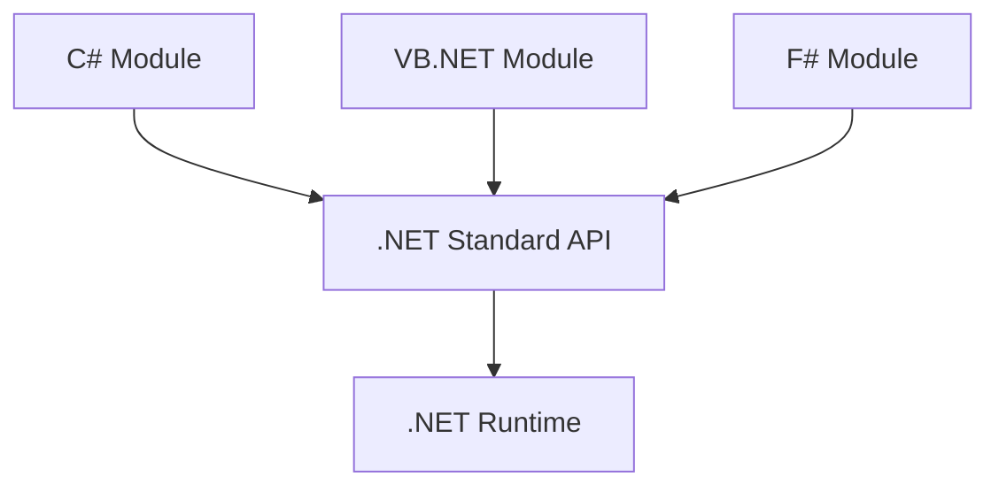
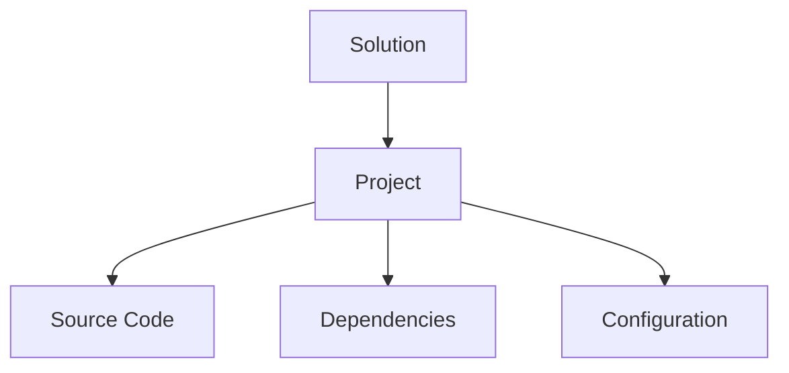

# Plataformas De Desarrollo En .NET

## 1. Contexto De la Plataforma .NET

### Definición De .NET

**.NET** es un ecosistema de desarrollo creado por Microsoft que permite construir distintos tipos de aplicaciones utilizando múltiples lenguajes y plataformas.

No es una sola plataforma, sino **una colección de plataformas y herramientas** que permiten desarrollar software para diferentes entornos.

### Tipos De Aplicaciones Que Se Pueden Desarrollar

|Tipo de aplicación|Ejemplos|
|---|---|
|Aplicaciones Web|APIs, aplicaciones web|
|Aplicaciones de escritorio|Software para Windows, Linux o macOS|
|Aplicaciones móviles|Apps móviles con Xamarin|
|Cloud-native|Microservicios y sistemas distribuidos|
|Machine Learning|Aplicaciones con inteligencia artificial|
|Videojuegos|Desarrollo con Unity|
|IoT|Sistemas para dispositivos conectados|

Esto convierte a .NET en una plataforma **multiplataforma y multipropósito**.

---

## 2. Funcionamiento De la Plataforma .NET

El funcionamiento de .NET es similar al modelo de Java.

1. El desarrollador escribe el **código fuente**.
    
2. El código se **compila**.
    
3. El código compilado es ejecutado por una **máquina virtual de .NET**.

### Flujo De Ejecución


### Compilación Just-In-Time (JIT)

A diferencia de Java, .NET utilize **compilación JIT (Just In Time)**.

Definición:

La **compilación JIT** convierte el código intermedio en **código nativo del sistema operativo en tiempo de ejecución**, lo que mejora el rendimiento.

Ventajas:

- Mayor eficiencia de ejecución
    
- Optimización para el sistema operativo específico

---

## 3. Implementaciones De .NET

Existen diferentes implementaciones del runtime .NET.

|Implementación|Características|
|---|---|
|.NET Framework|Primera versión, enfocada en aplicaciones Windows|
|Mono|Implementación ligera utilizada en dispositivos con menos recursos|
|.NET Core|Plataforma moderna, multiplataforma|
|.NET 5+|Evolución de .NET Core, unifica la plataforma|
|Universal Windows Platform (UWP)|Usado para IoT y Xbox|

Actualmente la plataforma principal es **.NET 7 y .NET 8**.

---

## 4. Lenguajes Compatibles Con .NET

La plataforma permite utilizar varios lenguajes.

Lenguajes principales:

|Lenguaje|Uso|
|---|---|
|C#|Lenguaje principal de .NET|
|Visual Basic .NET|Alternativa más simple|
|F#|Lenguaje funcional|
|IronPython|Implementación de Python para .NET|
|IronRuby|Implementación de Ruby para .NET|

Todos estos lenguajes pueden interactuar entre sí gracias a una API común.

---

## 5. .NET Standard

### Definición

**.NET Standard** es una API común que permite compartir código entre diferentes implementaciones de .NET.

Esto permite que components escritos en diferentes lenguajes puedan interactuar entre sí.

### Ejemplo De Interoperabilidad

Un proyecto podría tener:

- Un módulo en **C#**
    
- Otro en **Visual Basic**
    
- Otro en **F#**

Todos pueden interactuar gracias a la API común.



---

## 6. Ventajas De .NET

### 1. Independencia De Plataforma

El código puede ejecutarse en diferentes sistemas operativos:

- Windows
    
- Linux
    
- macOS

Esto permite el modelo:

**Write once, run anywhere**

### 2. Amplia Variedad De Aplicaciones

.NET permite desarrollar:

- aplicaciones web
    
- aplicaciones móviles
    
- videojuegos
    
- sistemas cloud
    
- IoT

### 3. Mayor Eficiencia De Ejecución

Gracias a la compilación **JIT**, parte del código se convierte en **binario nativo**, mejorando el rendimiento.

---

## 7. Desventajas De .NET

### 1. Dependencia Del Runtime

Para ejecutar aplicaciones .NET es necesario tener instalada la plataforma correspondiente.

Esto puede generar problemas si:

- el runtime tiene errores
    
- existen incompatibilidades de versiones

### 2. Vendor Lock-in

Definición:

**Vendor Lock-in** es la dependencia de una tecnología o proveedor específico.

En este caso:

- Microsoft controla gran parte del ecosistema
    
- Cambios en políticas o herramientas pueden afectar proyectos.

---

# Entornos De Desarrollo (IDE) Para .NET

## Visual Studio

Es el **IDE official de Microsoft para .NET**.

Características principales:

- Autocompletado de código
    
- Corrección de sintaxis
    
- Depuración
    
- Gestión de dependencias
    
- Ejecución y compilación
    
- Monitoreo de variables

### Estructura De Un Proyecto En Visual Studio



---

## Visual Studio Code

Visual Studio Code es un **editor de código extensible**.

Aunque inicialmente es un editor simple, mediante extensions puede ofrecer funcionalidades similares a un IDE:

- compilación
    
- depuración
    
- gestión de dependencias
    
- creación de proyectos

Es una alternativa popular porque es:

- ligero
    
- multiplataforma
    
- gratuito

---

# Gestión De Paquetes En .NET

## NuGet

### Definición

**NuGet** es el gestor de paquetes de .NET.

Permite instalar, actualizar y gestionar librerías externas utilizadas en un proyecto.

Un paquete contiene:

- librerías compiladas
    
- recursos
    
- metadatos
    
- dependencias

Los paquetes se almacenan en archivos con extensión:

```Python
.nupkg
```

Estos archivos son básicamente **archivos ZIP con recursos**.

---

## Funcionamiento De NuGet

Cuando un proyecto necesita una librería:

1. Se declara la dependencia
    
2. NuGet descarga el paquete
    
3. Se integran automáticamente las dependencias necesarias


### Tipos De Repositorios

|Tipo|Descripción|
|---|---|
|Público|Ej. NuGet.org|
|Privado|Repositorios internos de empresas|

---

# Herramientas Aceleradoras Del Desarrollo

Estas herramientas ayudan a mejorar:

- calidad del código
    
- rendimiento
    
- mantenibilidad

---

## ReSharper

### Definición

**ReSharper** es una extensión de Visual Studio que ayuda a mejorar el código automáticamente.

Funciones principales:

- refactorización automática
    
- detección de errores
    
- sugerencias de mejora
    
- limpieza de código

### Ejemplos De Mejoras Automáticas

- detectar código duplicado
    
- dividir métodos demasiado grandes
    
- eliminar código inaccessible

---

## NDepend

### Definición

**NDepend** es una herramienta de análisis estático para proyectos .NET.

Permite analizar:

- dependencias
    
- complejidad del código
    
- deuda técnica
    
- cobertura de pruebas

### Dashboard De Análisis

Genera paneles visuals con métricas de calidad.

Indicadores típicos:

|Métrica|Descripción|
|---|---|
|Complejidad ciclomática|Dificultad del código|
|Cobertura de pruebas|Porcentaje de código testeado|
|Deuda técnica|Problemas acumulados en el código|

---

## BenchmarkDotNet

### Definición

**BenchmarkDotNet** es una herramienta para medir el rendimiento del código.

Permite comparar distintas implementaciones de un algoritmo.

Métricas que analiza:

- tiempo de ejecución
    
- consumo de CPU
    
- consumo de memoria

### Ejemplo De Benchmark

```csharp
using BenchmarkDotNet.Attributes;

public class ExampleBenchmark
{
    [Benchmark]
    public void Metodo1()
    {
        int x = 0;
        for(int i = 0; i < 1000; i++)
            x += i;
    }
}
```

### Explicación Del Código

1. Se importa la librería BenchmarkDotNet.
    
2. Se define una clase de pruebas.
    
3. El atributo `[Benchmark]` indica el método que se medirá.
    
4. BenchmarkDotNet ejecuta múltiples iteraciones para obtener métricas precisas.

Esto permite comparar diferentes implementaciones de código y detectar cuál es más eficiente.

---

# Resumen De Conceptos Clave

- .NET es un ecosistema de desarrollo creado por Microsoft que permite construir múltiples tipos de aplicaciones.
    
- Utilize una máquina virtual y compilación **Just-In-Time** para ejecutar el código.
    
- Soporta varios lenguajes como **C#, VB.NET y F#**.
    
- **.NET Standard** permite compartir código entre diferentes implementaciones.
    
- **Visual Studio** es el IDE principal para desarrollo .NET.
    
- **NuGet** es el gestor de paquetes que permite instalar librerías y dependencias.
    
- Herramientas como **ReSharper, NDepend y BenchmarkDotNet** ayudan a mejorar la calidad, arquitectura y rendimiento del software.
