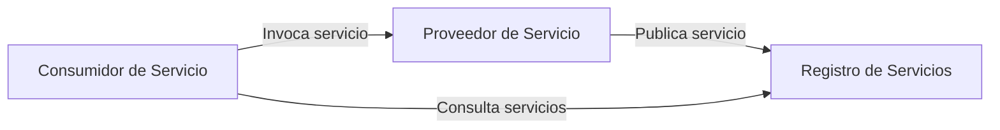
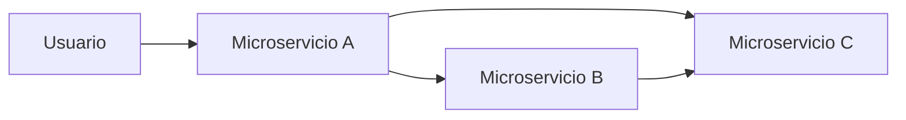
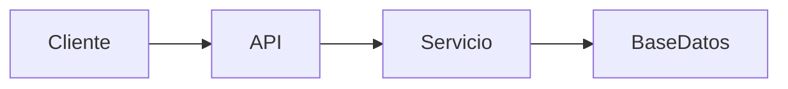

# Ingeniería De Servicios Y Arquitecturas Orientadas a Servicios

## 1. Ingeniería De Servicios

### Definición

La **ingeniería de servicios** (Service-Oriented Software Engineering) es una disciplina de la ingeniería de software enfocada en diseñar y construir sistemas distribuidos mediante **servicios reutilizables e independientes**.

Su objetivo principal es **descomponer sistemas complejos en unidades autoejecutables** que puedan set utilizadas por múltiples aplicaciones o components.

### Características Principales

|Característica|Descripción|
|---|---|
|Modularidad|El sistema se divide en servicios independientes|
|Reutilización|Los servicios pueden set utilizados por diferentes aplicaciones|
|Interoperabilidad|Los servicios pueden comunicarse incluso si están construidos con tecnologías distintas|
|Acoplamiento débil|Los components dependen lo menos possible entre sí|

### Servicio De Software

Un **servicio de software** se define como:

> Una descripción de operaciones que intercambian datos entre un proveedor y un consumidor.

Estas operaciones pueden tener como efecto:

- Obtener información del sistema
    
- Modificar el estado del sistema
    
- Ejecutar procesos específicos

---

## 2. Aplicaciones Orientadas a Servicios

Las **aplicaciones orientadas a servicios (SOA-based applications)** están compuestas por múltiples servicios que interactúan entre sí.

### Propiedades Clave

- Servicios **débilmente acoplados**
    
- Uso de **estándares y protocolos compartidos**
    
- **Colaboración dinámica** entre proveedores y consumidores
    
- **Reutilización de funcionalidades**

---

## 3. Arquitectura Orientada a Servicios (SOA)

### Definición

La **Arquitectura Orientada a Servicios (SOA)** es un estilo de arquitectura que permite construir aplicaciones mediante **components independientes (servicios)** que interactúan entre sí.

Estos servicios funcionan como **cajas negras**, es decir:

- El consumidor conoce **qué hace el servicio**
    
- No necesita conocer **cómo está implementado internamente**

### Objetivo De SOA

Permitir que diferentes servicios se **orquesten** para soportar **procesos de negocio específicos**.

---

### Components Principales De SOA

Existen **tres actores fundamentales** en una arquitectura orientada a servicios.

|Actor|Descripción|
|---|---|
|Proveedor de servicios|Publica las capacidades del servicio|
|Consumidor de servicios|Utilize los servicios publicados|
|Registro de servicios|Catálogo donde se descubren los servicios disponibles|

---

### Relación Entre Actores

Este modelo permite que los servicios puedan **descubrirse dinámicamente** dentro del sistema.

---

## 4. Servicios Web (Web Services)

### Definición

Un **servicio web (Web Service)** es un sistema de software diseñado para permitir la **interoperabilidad entre máquinas a través de una red**.

Permite que diferentes aplicaciones se comuniquen aunque estén desarrolladas con **distintas tecnologías o lenguajes**.

---

### Components Clave

|Elemento|Descripción|
|---|---|
|WSDL|Lenguaje de descripción del servicio|
|SOAP|Protocolo para intercambio de mensajes|
|XML|Formato común de datos|

---

### WSDL (Web Service Description Language)

El **WSDL** describe formalmente:

- Qué operaciones ofrece el servicio
    
- Qué parámetros recibe
    
- Qué datos devuelve
    
- Cómo acceder al servicio

Esto permite que otros sistemas puedan **interpretar automáticamente cómo usar el servicio**.

---

### Protocolo SOAP

**SOAP (Simple Object Access Protocol)** es un protocolo basado en XML utilizado para el intercambio de mensajes entre aplicaciones.

Características:

- Independiente del lenguaje
    
- Basado en XML
    
- Utilizado en arquitecturas de servicios tradicionales

---

## 5. Microservicios

### Definición

Los **microservicios** son un enfoque arquitectónico que organiza una aplicación como un **conjunto de servicios pequeños e independientes**.

Cada microservicio:

- Es **autónomo**
    
- Tiene **su propio ciclo de vida**
    
- Puede **desplegarse de manera independiente**

---

### Características Principales

| Característica   | Descripción                                                   |
| ---------------- | ------------------------------------------------------------- |
| Independencia    | Cada servicio puede desarrollarse y desplegarse por separado  |
| Escalabilidad    | Se pueden escalar servicios individuales                      |
| Mantenibilidad   | Facilita la evolución del sistema                             |
| Equipos pequeños | Cada microservicio suele set gestionado por un equipo pequeño |

---

### Ciclo De Vida Independiente

Cada microservicio debe tratarse como **un proyecto independiente** con:

- su propio repositorio
    
- su propio despliegue
    
- su propio ciclo de desarrollo

---

### Interacción Entre Microservicios

Los microservicios colaboran para cumplir **objetivos de negocio comunes**.

---

### Error Común Sobre Microservicios

Un error frecuente es creer que:

- Microservicios = servicios pequeños
    
- Microservicios = contenedores Docker

Esto es incorrecto.

Para set un microservicio debe cumplir:

- Independencia
    
- Ciclo de vida propio
    
- Despliegue autónomo

---

## 6. REST (Representational State Transfer)

### Definición

**REST (Representational State Transfer)** es un **estilo arquitectónico** para diseñar sistemas distribuidos en Internet.

Fue diseñado para guiar la construcción de sistemas **escalables y eficientes**, especialmente para aplicaciones web.

---

### Enfoque Basado En Recursos

REST se centra en **recursos**, los cuales se identifican mediante **sustantivos**.

Ejemplos:

|Recurso|Endpoint|
|---|---|
|Usuarios|`/users`|
|Productos|`/products`|
|Pedidos|`/orders`|

---

### Representación De Recursos

Un recurso puede representarse en distintos formatos:

|Formato|Uso|
|---|---|
|JSON|Muy usado en APIs modernas|
|XML|Usado en sistemas más antiguos|
|HTML|Representación para navegadores|

La representación del recurso **no depende de la implementación del servicio**.

---

## 7. Restricciones Arquitectónicas De REST

REST se basa en **seis restricciones arquitectónicas** que garantizan escalabilidad y simplicidad.

|Restricción|Descripción|
|---|---|
|Cliente-Servidor|Separación entre interfaz de usuario y lógica del servidor|
|Stateless|Cada petición contiene toda la información necesaria|
|Cacheable|Las respuestas pueden almacenarse en cache|
|Interfaz uniforme|Forma estándar de interactuar con recursos|
|Sistema en capas|La arquitectura puede tener múltiples capas|
|Code on demand|El servidor puede enviar código ejecutable|

---

### Arquitectura REST

El cliente interactúa con recursos mediante **peticiones HTTP**.

---

## 8. APIs RESTful

Un servicio web se considera **RESTful** cuando cumple las restricciones del modelo REST.

Características típicas de APIs RESTful:

|Método HTTP|Acción|
|---|---|
|GET|Obtener recurso|
|POST|Crear recurso|
|PUT|Actualizar recurso|
|DELETE|Eliminar recurso|

---

## 9. Comparación De Conceptos

|Concepto|Definición|
|---|---|
|Servicio|Operación que intercambia datos entre sistemas|
|Web Service|Implementación de servicios accesibles por red|
|REST|Estilo arquitectónico para sistemas web|
|Microservicio|Servicio independiente con ciclo de vida propio|
|SOA|Arquitectura basada en servicios reutilizables|

---

# Resumen De Puntos Clave

- La **ingeniería de servicios** busca construir sistemas mediante servicios reutilizables.
    
- Un **servicio de software** intercambia datos entre proveedor y consumidor.
    
- **SOA** organiza aplicaciones como servicios independientes que colaboran entre sí.
    
- Los **actores principales en SOA** son: proveedor, consumidor y registro de servicios.
    
- Los **servicios web** permiten la interoperabilidad entre sistemas mediante estándares como WSDL y SOAP.
    
- Los **microservicios** son servicios pequeños, autónomos y desplegables de forma independiente.
    
- **REST** es un estilo arquitectónico basado en recursos y utilizado para APIs web.
    
- REST define **seis restricciones** que garantizan escalabilidad y eficiencia en sistemas distribuidos.

---

## MicroTest

1. ¿Cuáles son los tres tipos de actores en una arquitectura orientada a servicios (SOA)?
    
    - La respuesta: b. Proveedores de servicios, usuarios de servicios y registros de servicios.
        
    - Justifacion: En SOA existen tres actores fundamentales. Los proveedores de servicios publican las funcionalidades disponibles, los usuarios o consumidores de servicios utilizan dichas funcionalidades y los registros de servicios funcionan como catálogos donde se publican y descubren los servicios disponibles.
        
2. ¿Cuáles son las restricciones del estilo arquitectónico REST?
    
    - La respuesta: d. Interfaz uniforme, cliente-servidor, sin estado, caché, sistema en capas y código bajo demanda.
        
    - Justifacion: REST define seis restricciones arquitectónicas que permiten construir sistemas escalables en la web: separación cliente-servidor, comunicación sin estado (stateless), posibilidad de caché, interfaz uniforme para interactuar con recursos, arquitectura en capas y la opción de enviar código ejecutable bajo demanda.
        
3. ¿Qué significa la restricción «sin estado» en el contexto de REST?
    
    - La respuesta: c. Cada solicitud de cliente debe container toda la información necesaria.
        
    - Justifacion: La restricción stateless indica que el servidor no guarda el estado de la sesión del cliente entre solicitudes. Por lo tanto, cada petición debe incluir toda la información necesaria para que el servidor pueda procesarla sin depender de solicitudes anteriores.

## Read More

<iframe src="https://microservices.io/patterns/microservices.html" allow="fullscreen" allowfullscreen="" style="height:100%;width:100%; aspect-ratio: 16 / 9; "></iframe>