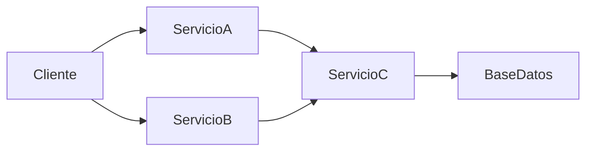
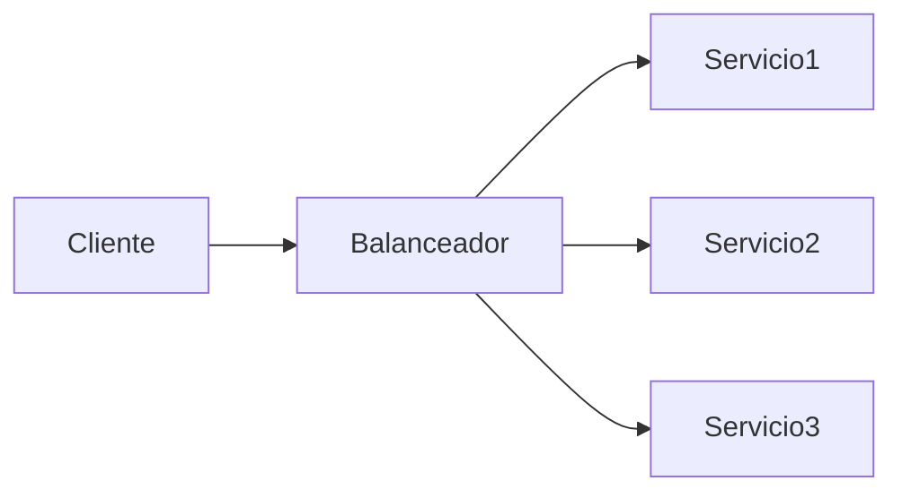

# Valor Y Utilidad De Las Plataformas Para El Desarrollo De Servicios

## 1. Sistemas Distribuidos

### Definición

Un **sistema distribuido** es un conjunto de components de software que se ejecutan en **múltiples computadoras interconectadas**, las cuales se comunican mediante el **intercambio de mensajes** para lograr un objetivo común.

### Características Principales

|Característica|Descripción|
|---|---|
|Components distribuidos|Los elementos del sistema se ejecutan en diferentes máquinas|
|Comunicación por mensajes|Los servicios intercambian datos para coordinar acciones|
|Objetivo común|Los components colaboran para cumplir una funcionalidad global|
|Independencia|Cada componente puede operar de forma autónoma|

### Arquitectura Basada En Servicios En Sistemas Distribuidos

Las arquitecturas orientadas a servicios permiten estructurar sistemas distribuidos mediante **servicios independientes que interactúan entre sí**.

Este modelo permite distribuir responsabilidades entre diferentes servicios.

---

# 2. Ventajas De Los Sistemas Distribuidos Basados En Servicios

La adopción de arquitecturas basadas en servicios aporta múltiples beneficios en el desarrollo de software.

## 2.1 Separación De Preocupaciones

### Definición

La **separación de preocupaciones** implica dividir un sistema en components que se encargan de **responsabilidades específicas**.

### Beneficios

- Mayor claridad en la arquitectura
    
- Facilita mantenimiento
    
- Reduce complejidad del sistema

|Servicio|Responsabilidad|
|---|---|
|Servicio de usuarios|Gestión de cuentas|
|Servicio de pagos|Procesamiento de pagos|
|Servicio de pedidos|Gestión de pedidos|

Cada servicio ejecuta un conjunto específico de tareas.

---

## 2.2 Bajo Acoplamiento

### Definición

El **bajo acoplamiento** significa que los servicios tienen **pocas dependencias entre sí**.

Esto permite modificar un servicio sin afectar al resto del sistema.

### Ventajas

- Cambios aislados
    
- Evolución independiente
    
- Reducción del impacto de errores

Este concepto está inspirado en el **paradigma de diseño orientado a objetos**.

---

## 2.3 Desarrollo Autónomo Y Simultáneo

Una de las ventajas principales es que los servicios pueden desarrollarse **en paralelo por equipos diferentes**.

|Beneficio|Descripción|
|---|---|
|Desarrollo independiente|Cada equipo trabaja en su servicio|
|Menor interferencia|Cambios locales no afectan otros módulos|
|Entregas rápidas|Permite ciclos de desarrollo más ágiles|

---

## 2.4 Flexibilidad Tecnológica

Cada servicio puede desarrollarse con **diferentes lenguajes o tecnologías**.

### Ejemplo

|Servicio|Tecnología|
|---|---|
|Servicio de autenticación|Java|
|Servicio de pagos|Python|
|Servicio de catálogo|Node.js|

Los servicios se comunican mediante **protocolos estandarizados**, como:

- HTTP
    
- REST
    
- SOAP

---

## 2.5 Independencia De Plataforma

Gracias al uso de **protocolos estándar**, los servicios pueden ejecutarse en distintas plataformas.

Esto permite que un sistema distribuido esté compuesto por servicios que se ejecutan en:

- diferentes sistemas operativos
    
- distintos entornos cloud
    
- diversas infraestructuras

---

## 2.6 Escalabilidad

### Definición

La **escalabilidad** es la capacidad de un sistema para manejar un aumento en la carga de trabajo.

En arquitecturas de servicios esto se logra mediante la **replicación de instancias del servicio**.

El balanceador distribuye las solicitudes entre múltiples instancias del servicio.

---

## 2.7 Confiabilidad Y Resiliencia

### Definición

- **Confiabilidad:** capacidad del sistema para funcionar correctamente durante largos periodos.
    
- **Resiliencia:** capacidad para recuperarse de fallos.

### Cómo Se Logra

- Replicación de servicios
    
- Distribución de instancias en múltiples infraestructuras
    
- Balanceo de carga

Esto evita que una falla individual detenga todo el sistema.

---

## 2.8 Reutilización De Código

Los servicios funcionan como **components reutilizables**.

Esto permite que un mismo servicio sea utilizado por múltiples aplicaciones.

### Ejemplo

|Servicio|Aplicaciones que lo utilizan|
|---|---|
|Servicio de autenticación|Web, App móvil, API|
|Servicio de pagos|Tienda online, suscripciones|
|Servicio de notificaciones|Email, SMS, Push|

Beneficio principal:

Reduce el tiempo de desarrollo de nuevas funcionalidades.

---

# 3. Plataformas Para El Desarrollo De Servicios

Las plataformas de desarrollo facilitan la creación, consumo y gestión de servicios.

Estas herramientas automatizan múltiples tareas dentro del desarrollo de sistemas distribuidos.

---

## 3.1 Modelado De Interfaces O Contratos

Las plataformas permiten definir **contratos de servicio**, que especifican:

- operaciones disponibles
    
- parámetros de entrada
    
- tipos de respuesta

Esto permite que otros servicios sepan **cómo interactuar con el servicio**.

---

## 3.2 Generación Automática De Código Del Servicio

Muchas plataformas pueden generar automáticamente:

- el **esqueleto del servicio**
    
- las estructuras básicas de implementación

### Beneficios

- Reduce errores manuales
    
- Acelera el desarrollo inicial

---

## 3.3 Generación De Clientes Para Consumir Servicios

Las herramientas también generan automáticamente **clientes o SDKs** para consumir un servicio.

Esto permite que los desarrolladores integren servicios fácilmente en sus aplicaciones.

---

## 3.4 Generación Automática De Documentación

Las plataformas pueden generar documentación automáticamente a partir del contrato del servicio.

Ejemplos comunes en APIs modernas:

- OpenAPI
    
- Swagger

Beneficios:

- Facilita el uso del servicio
    
- Mejora la comunicación entre equipos

---

## 3.5 Generación De Interfaces Web Para Pruebas

Muchas herramientas generan automáticamente una **interfaz web** para probar servicios.

Estas interfaces permiten:

- ejecutar operaciones del servicio
    
- visualizar respuestas
    
- validar parámetros

---

## 3.6 Soporte Para Múltiples Protocolos

Las plataformas permiten interactuar con servicios mediante diversos protocolos de comunicación.

|Protocolo|Uso|
|---|---|
|HTTP|APIs REST|
|SOAP|Web Services tradicionales|
|gRPC|Comunicación de alto rendimiento|

---

## 3.7 Emulación De Servicios

Las plataformas permiten **simular servicios** durante el desarrollo.

Esto es útil cuando:

- un servicio externo no está disponible
    
- un servicio aún no ha sido implementado

Este proceso se conoce como **mocking**.

---

## 3.8 Pruebas En Entornos Distribuidos

Las herramientas ayudan a realizar pruebas de sistemas distribuidos, incluyendo:

|Tipo de prueba|Objetivo|
|---|---|
|Pruebas funcionales|Verificar comportamiento del servicio|
|Pruebas de carga|Evaluar rendimiento con muchos usuarios|
|Pruebas de estrés|Analizar límites del sistema|

---

## 3.9 Monitorización De Servicios

Las plataformas permiten monitorear:

- rendimiento de los servicios
    
- consumo de recursos
    
- errores en la comunicación

Esto facilita la **gestión de infraestructuras basadas en servicios**.

---

## 3.10 Despliegue De Servicios

Las herramientas modernas simplifican el **despliegue de servicios y microservicios**.

Esto incluye:

- automatización de despliegues
    
- integración continua
    
- escalado automático

---

# Resumen De Puntos Clave

- Los **sistemas distribuidos** están formados por components que se ejecutan en múltiples computadoras y se comunican mediante mensajes.
    
- Las arquitecturas basadas en servicios permiten construir estos sistemas mediante **servicios independientes**.
    
- Las principales ventajas incluyen:
    
    - separación de responsabilidades
        
    - bajo acoplamiento
        
    - desarrollo autónomo
        
    - flexibilidad tecnológica
        
    - independencia de plataforma
        
    - escalabilidad
        
    - resiliencia
        
    - reutilización de código
        
- Las **plataformas de desarrollo de servicios** simplifican el desarrollo mediante automatización y herramientas de soporte.
    
- Estas plataformas permiten generar código automáticamente, documentar servicios, simular servicios, realizar pruebas distribuidas y monitorear infraestructuras.

## MicroTest

1. ¿Qué funcionalidad es proporcionada por las plataformas y herramientas para el desarrollo de sistemas distribuidos basados en servicios?
    
    - La respuesta: d. Soporte para el modelado de la interfaz o contrato de un servicio.
        
    - Justifacion: Las plataformas de desarrollo de servicios permiten definir y modelar el contrato o interfaz de un servicio, lo cual describe las operaciones disponibles, los parámetros y las respuestas. Esto facilita la integración entre servicios y la generación automática de documentación o código cliente.
        
2. ¿Cuál es uno de los beneficios de la autonomía de los servicios en el desarrollo de sistemas distribuidos?
    
    - La respuesta: d. Desarrollo, prueba y despliegue independientes por parte de equipos.
        
    - Justifacion: La autonomía de los servicios permite que cada uno sea desarrollado, probado y desplegado de manera independiente por diferentes equipos. Esto reduce dependencias entre equipos y permite avanzar en paralelo, mejorando la eficiencia del desarrollo.
        
3. ¿Qué impulsa la robustez de un sistema distribuido basado en servicios ante caídas parciales?
    
    - La respuesta: c. Replicación de múltiples instancias del mismo servicio.
        
    - Justifacion: La robustez y resiliencia del sistema se logra mediante la replicación de varias instancias del mismo servicio en distintas infraestructuras. Si una instancia falla, otras pueden continuar operando, evitando que el sistema completo deje de funcionar.