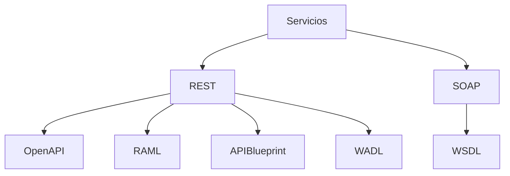

# Modelado Y Descripción De Servicios

## 1. Definición De Un Servicio

### Concepto

En el diseño de **arquitecturas orientadas a servicios**, una de las tareas más importantes es **definir el servicio** que será ofrecido a otros sistemas o aplicaciones.

Un servicio debe incluir:

- **Interfaz**
    
- **Contrato**
    
- **API**

### Interfaz De Servicio

La **interfaz de un servicio** describe:

- las operaciones disponibles
    
- los parámetros que recibe
    
- los datos que devuelve
    
- cómo se invoca el servicio

Esto permite que otros sistemas puedan **interactuar con el servicio sin conocer su implementación interna**.

---

## 2. Contrato De Servicio

### Definición

El **contrato de servicio** es una descripción formal que define cómo interactuar con un servicio.

Incluye información como:

|Elemento|Descripción|
|---|---|
|Operaciones|Funciones que ofrece el servicio|
|Parámetros|Datos de entrada|
|Respuestas|Datos de salida|
|Protocolos|Forma de comunicación|
|Endpoints|Ubicación del servicio|

### Importancia

El contrato permite:

- integrar servicios entre sistemas distintos
    
- generar documentación automáticamente
    
- generar código cliente
    
- facilitar pruebas e integración

---

## 3. Enfoques Para Definir Servicios

Existen dos formas principales de diseñar servicios.

### API First

En este enfoque se **define primero la API** antes de implementar el servicio.

Ventajas:

- mejor diseño
    
- claridad en la arquitectura
    
- permite trabajo paralelo entre equipos

### Code First

En este enfoque el servicio **se implementa primero y la documentación se genera después**.

|Enfoque|Característica|
|---|---|
|API First|Diseño antes de implementar|
|Code First|Implementación antes del contrato|

---

## 4. Lenguajes Y Estándares Para Describir Servicios

Existen múltiples lenguajes que permiten modelar APIs y servicios de manera estructurada.

### Objetivos De Estos Lenguajes

- describir interfaces
    
- documentar servicios
    
- generar código automáticamente
    
- facilitar pruebas
    
- permitir integración entre sistemas

---

# 5. API Blueprint

## Definición

**API Blueprint** es un lenguaje de alto nivel utilizado para describir **interfaces web**.

Se basa en:

- **Markdown**
    
- **MSON (Markdown Syntax for Object Notation)**

## Características

|Característica|Descripción|
|---|---|
|Sintaxis simple|Basada en Markdown|
|Diseño API First|Se define la API antes de implementar|
|Colaboración|Facilita trabajo entre equipos|
|Modularidad|Permite organizar APIs complejas|

## Ejemplo De API Blueprint

```Python
# API Usuarios

## Obtener usuarios [GET /users]

+ Response 200 (application/json)

        [
            { "id": 1, "name": "Juan" },
            { "id": 2, "name": "Ana" }
        ]
```

## Explicación Paso a Paso

1. `# API Usuarios`  
    Define la sección principal de la API.
    
2. `GET /users`  
    Define el endpoint para obtener usuarios.
    
3. `Response 200`  
    Indica que la respuesta exitosa es un código HTTP 200.
    
4. `application/json`  
    Define el formato de respuesta.

---

# 6. OpenAPI Specification

## Definición

**OpenAPI Specification (OAS)** es un estándar ampliamente utilizado para describir **APIs REST**.

Permite que **humanos y máquinas comprendan las capacidades de un servicio** sin acceder al código fuente.

## Características Principales

|Característica|Descripción|
|---|---|
|Formato estándar|YAML o JSON|
|Legible por máquinas|Permite automatización|
|Amplio ecosistema|Integración con muchas herramientas|
|Documentación automática|Generación automática de documentación|

## Ejemplo OpenAPI

```yaml
openapi: 3.0.0
info:
  title: API Usuarios
  version: 1.0

paths:
  /users:
    get:
      summary: Obtener lista de usuarios
      responses:
        '200':
          description: Lista de usuarios
```

## Explicación Paso a Paso

1. `openapi: 3.0.0`  
    Define la versión del estándar.
    
2. `info`  
    Información general de la API.
    
3. `paths`  
    Define las rutas disponibles.
    
4. `/users`  
    Endpoint del servicio.
    
5. `get`  
    Método HTTP utilizado.

---

# 7. RAML (RESTful API Modeling Language)

## Definición

**RAML (RESTful API Modeling Language)** es un lenguaje para describir APIs REST enfocado en **claridad y legibilidad**.

Permite definir:

- recursos
    
- métodos
    
- parámetros
    
- estructuras HTTP

## Características

|Característica|Descripción|
|---|---|
|Alta legibilidad|Diseñado para set fácil de entender|
|Enfoque REST|Basado en recursos HTTP|
|Reutilización|Permite usar bibliotecas|
|Prototipado rápido|Permite probar APIs sin implementación|

## Herramientas Asociadas

|Herramienta|Uso|
|---|---|
|API Designer|Diseño de APIs|
|API Workbench|Desarrollo y pruebas|

Estas herramientas permiten **diseñar y probar APIs sin escribir código**.

---

# 8. WADL (Web Application Description Language)

## Definición

**WADL** es un lenguaje basado en **XML** que describe servicios web basados en **HTTP**.

Su objetivo principal es **modelar recursos web y sus relaciones**.

## Características

|Característica|Descripción|
|---|---|
|Basado en XML|Representación estructurada|
|Independiente de plataforma|Funciona en cualquier tecnología|
|Basado en HTTP|Diseñado para servicios REST|

## Ejemplo Simplificado

```xml
<application>
  <resources base="http://api.example.com/">
    <resource path="/users">
      <method name="GET"/>
    </resource>
  </resources>
</application>
```

## Explicación

1. `<application>`  
    Define la aplicación.
    
2. `<resources>`  
    Define los recursos disponibles.
    
3. `/users`  
    Ruta del recurso.
    
4. `GET`  
    Método HTTP disponible.

---

# 9. WSDL (Web Services Description Language)

## Definición

**WSDL (Web Services Description Language)** es un lenguaje basado en **XML** para describir **servicios web basados en SOAP**.

Describe cómo invocar un servicio y qué datos intercambia.

## Components Principales De WSDL

|Elemento|Descripción|
|---|---|
|Service|Define el servicio|
|Endpoint|Dirección donde se accede al servicio|
|Binding|Protocolo de comunicación|
|Interface|Operaciones disponibles|
|Operation|Funciones del servicio|
|Types|Estructura de datos|

## Ejemplo Simplificado

```xml
<definitions>
  <service name="UserService">
    <port binding="UserBinding">
      <address location="http://example.com/userservice"/>
    </port>
  </service>
</definitions>
```

## Explicación

1. `<definitions>`  
    Define la descripción del servicio.
    
2. `<service>`  
    Define el servicio disponible.
    
3. `<port>`  
    Punto de acceso del servicio.
    
4. `<address>`  
    Dirección del servicio.

---

# 10. Comparación Entre Lenguajes De Descripción

|Lenguaje|Tipo de servicio|Formato|
|---|---|---|
|API Blueprint|APIs REST|Markdown|
|OpenAPI|APIs REST|YAML / JSON|
|RAML|APIs REST|YAML|
|WADL|Servicios HTTP|XML|
|WSDL|Servicios SOAP|XML|

---

# 11. Relación Entre Tecnologías De Descripción



Esto muestra cómo diferentes lenguajes se utilizan dependiendo del tipo de servicio.

---

# Resumen De Puntos Clave

- El **modelado de servicios** consiste en definir la interfaz o contrato de un servicio.
    
- El contrato describe **operaciones, parámetros, respuestas y protocolos**.
    
- Existen dos enfoques principales:
    
    - **API First**: se diseña la API antes de implementar.
        
    - **Code First**: se implementa primero y luego se documenta.
        
- Existen múltiples lenguajes para describir servicios:
    
    - **API Blueprint**
        
    - **OpenAPI**
        
    - **RAML**
        
    - **WADL**
        
    - **WSDL**
        
- **OpenAPI y RAML** son ampliamente utilizados para APIs REST.
    
- **WSDL** se utilize principalmente para servicios basados en **SOAP**.
    
- **WADL** describe servicios basados en **HTTP/REST**.

## MicroTest

1. ¿Cuál de los lenguajes de modelado de API es conocido por su diseño visual que permite describir un API de manera legible por humanos?
    
    - La respuesta: b. RAML.
        
    - Justifacion: RAML (RESTful API Modeling Language) se destaca por su diseño visual y su enfoque en la legibilidad, permitiendo describir APIs de manera clara y comprensible para los desarrolladores. Está diseñado para facilitar la comprensión de recursos, métodos y parámetros de una API REST.
        
2. ¿Cuál de las siguientes opciones es una característica específica de OpenAPI (OAS)?
    
    - La respuesta: b. Descripción de servicios web basados en REST.
        
    - Justifacion: OpenAPI Specification es un estándar utilizado para describir APIs REST. Permite definir de forma estructurada los endpoints, métodos HTTP, parámetros y respuestas de un servicio, facilitando que humanos y herramientas comprendan el funcionamiento del API sin necesidad de revisar el código.
        
3. ¿Cuál es uno de los beneficios asociados al modelado de un servicio al utilizar una descripción de interfaz como OpenAPI (OAS) o RAML?
    
    - La respuesta: c. Facilita la colaboración entre equipos de desarrollo.
        
    - Justifacion: Al definir un contrato claro de la API mediante lenguajes como OpenAPI o RAML, los equipos de desarrollo pueden trabajar de manera coordinada. Esto permite que distintos equipos implementen o consuman servicios basándose en la especificación del contrato, mejorando la comunicación y reduciendo errores de integración.