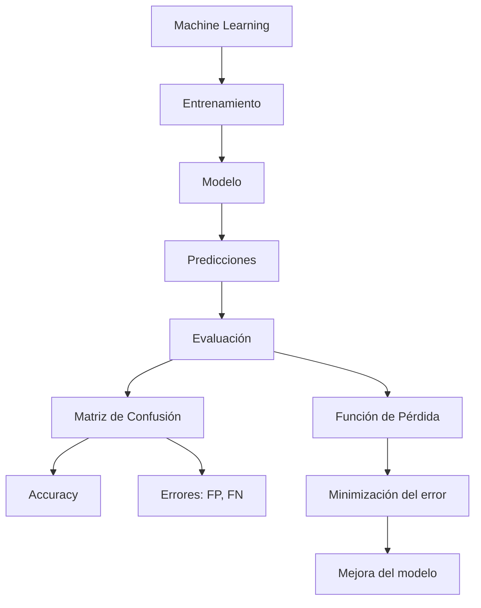
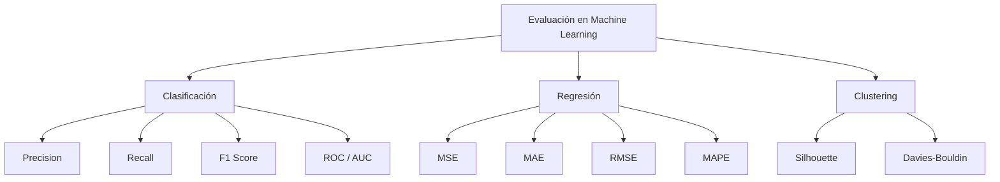
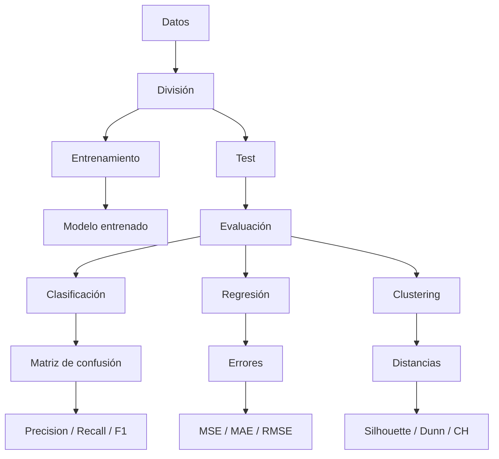

# 1. Introducción: Evaluación En Machine Learning

En **Machine Learning**, no basta con entrenar un modelo; es fundamental **medir si realmente está aprendiendo**.

## Definición De Aprendizaje Automático

El aprendizaje automático se define como:

> Un proceso donde un modelo mejora su desempeño en una tarea específica a lo largo del tiempo mediante entrenamiento.

## Idea Clave

- El aprendizaje **no es instantáneo**, sino **progresivo**.
    
- Se evalúa observando cómo **mejora el modelo con el tiempo**.

---

# 2. ¿Cómo Se Mide El Aprendizaje?

## Comparación Con Humanos

En humanos, usamos:

- Exámenes
	- Escala Wechsier
	- Escala Stanford-Binet
    
- Pruebas de inteligencia (CI) inteligencia multiples de gardener
	- Lingüística
	- Logico matematica
	- espacial
	- Musical
- Cociente intellectual
- Evaluaciones de habilidades
- Inteligencia Emocional

En Machine Learning:

- No se mide "inteligencia abstracta"
    
- Se mide el **desempeño en tareas específicas**
- Se mide por tareas concretas 

## Ejemplos De Tareas En ML

- Clasificación (spam / no spam)
    
- Predicción (precio de una casa)
    
- Reconocimiento (imágenes, voz)
    
- Generalización (adaptarse a nuevos datos)

### Medidas De Aprendizaje

Humanos:

- Analítica de aprendizaje

- Sistemas de Evaluación Académico
	- Exámenes
	- Trabajos Rúbricas
	- Medidas:

- Tienden a set binarias: correcto/incorrecto. verdadero/falso

	2 + 2 = 3 Incorrecto

	2 + 2 = 4 Correcto

---

# 3. Concepto Clave: Error Vs Acierto

En sistemas tradicionales:

- Evaluación binaria: correcto / incorrecto

En Machine Learning:

- Se mide **qué tan lejos está el modelo del resultado correcto**

## Ejemplo De Aprendizaje Progresivo

Que es `2+2`

|Iteración|Resultado del modelo|Resultado real|Error|
|---|---|---|---|
|1|-11000|4|Muy alto|
|10|356|4|Alto|
|100|-23|4|Medio|
|500|13|4|Bajo|
|1000|4|4|0|

## Conclusión

- Aunque el modelo se equivoca al inicio, el **error disminuye**
    
- Esto indica que **sí está aprendiendo**

---

# 4. Evaluación De Modelos

## Definición

La evaluación consiste en medir el desempeño del modelo durante el entrenamiento.

## Tipos De Métricas

1. **Cuantitativas** - `Loss Funcion`
    
    - Basadas en valores numéricos
        
2. **Funciones objetivo**
    
    - Se optimizan durante el entrenamiento

- Objetivo del entrenamiento:
	Maximizar o minimizar la función de pérdida

Las métricas variant según el tipo de modelo y problema

---

# 5. Función De Pérdida (Loss Function)

## Definición

Es una función matemática que mide el error del modelo.

- El objetivo es:
    
    - **Minimizar la pérdida** o
        
    - **Maximizar el desempeño**

## Importancia

- Guía el aprendizaje del modelo
    
- Indica qué tan bien o mal está funcionando

---

# 6. Tipos De Problemas En Machine Learning

## Clasificación

- Salida discreta (categorías)
    
- Ejemplo: correo spam o no spam

## Regresión

- Salida continua (valores numéricos)
    
- Ejemplo: precio de una casa

---

# 7. Modelos De Clasificación

## 7.1 Matriz De Confusión

Es una tabla que compara:

- Valores reales
    
- Valores predichos

## Estructura

| |Predicción Positiva|Predicción Negativa|
|---|---|---|
|**Real Positivo**|True Positive (TP)|False Negative (FN)|
|**Real Negativo**|False Positive (FP)|True Negative (TN)|

## Definiciones

- **True Positive (TP)**  
    El modelo predice positivo y es correcto.
    
- **False Positive (FP)**  
    El modelo predice positivo pero es incorrecto.
    
- **False Negative (FN)**  
    El modelo predice negativo pero era positivo.
    
- **True Negative (TN)**  
    El modelo predice negativo correctamente.

---

# 8. Métricas Derivadas De la Matriz De Confusión

## 8.1 Exactitud (Accuracy)

Mide el porcentaje de aciertos totales:

$$  
Accuracy = \frac{TP + TN}{TP + TN + FP + FN}  
$$

## Interpretación

- Valor entre 0 y 1
    
- Indica qué tan frecuentemente el modelo acierta

## Limitación

- Puede set engañosa en datasets desbalanceados

---

# 9. Relación Entre Conceptos

---

# 10. Idea Fundamental Del Aprendizaje En ML

- No importa solo si el modelo acierta
    
- Importa **cómo mejora el error con el tiempo**
    
- El aprendizaje es:
    
    - Gradual
        
    - Iterativo
        
    - Basado en optimización matemática

---

## 11. Métricas Avanzadas Para Clasificación

Además de la **exactitud (accuracy)**, existen métricas más específicas que permiten entender mejor el comportamiento del modelo, especialmente en problemas reales donde los errores tienen distintos costos.

---

### 11.1 Precisión (Precision)

#### Definición

Mide la **fiabilidad de las predicciones positivas**.

$$  
Precision = \frac{TP}{TP + FP}  
$$

#### Interpretación

- De todos los casos que el modelo predijo como positivos:
    
    - ¿Cuántos realmente lo eran?

#### Cuándo Usarla

- Cuando es importante **evitar falsos positivos**
    
- Ejemplo:
    
    - Detección de fraude
        
    - Clasificación de contenido sensible

---

### 11.2 Sensibilidad (Recall O Recall)

#### Definición

Mide la capacidad del modelo para **detectar todos los positivos reales**.

$$  
Recall = \frac{TP}{TP + FN}  
$$

#### Interpretación

- De todos los positivos reales:
    
    - ¿Cuántos detectó el modelo?

#### Cuándo Usarla

- Cuando es crítico **no perder casos importantes**
    
- Ejemplo:
    
    - Diagnóstico médico
        
    - Detección de amenazas

---

### 11.3 F1 Score

#### Definición

Combina precisión y recall en una sola métrica.

$$  
F1 = 2 \cdot \frac{Precision \cdot Recall}{Precision + Recall} = \frac{2 \cdot  TP} {2 \cdot TP + FP + FN }
$$

#### Interpretación

- Balance entre:
    
    - Evitar falsos positivos
        
    - Evitar falsos negativos

#### Cuándo Usarla

- Datos desbalanceados
    
- Cuando ambas métricas son importantes

---

### 11.4 Especificidad (Specificity)

#### Definición

Mide la capacidad de identificar correctamente los negativos.

$$  
Specificity = \frac{TN}{TN + FP}  
$$

#### Interpretación

- De todos los negativos reales:
    
    - ¿Cuántos fueron correctamente identificados?

#### Cuándo Usarla

- Cuando los falsos positivos tienen alto costo

---

## 12. Selección De Métricas Según El Problema

La métrica adecuada depende del **contexto y consecuencias del error**.

### Ejemplos

| Problema                    | Métrica Prioritaria | Justificación                           |
| --------------------------- | ------------------- | --------------------------------------- |
| Detectar setas venenosas    | Recall              | Evitar falsos negativos (riesgo mortal) |
| Diagnóstico de enfermedades | Recall              | No perder casos reales                  |
| Detección de fraude         | Precision           | Evitar falsas alarmas                   |
| Reconocimiento de imágenes  | Precision           | Lo que se detecta debe set correcto     |

### Idea Clave

- No existe una métrica universal
    
- Depende de:
    
    - Contexto
        
    - Coste del error
        
    - Objetivo del sistema

---

## 13. Umbral De Clasificación

### Definición

Los modelos no devuelven directamente clases, sino **probabilidades**.

- Se define un umbral (threshold) para clasificar:
    
    - ≥ 0.5 → positivo
        
    - < 0.5 → negativo

### Problema

- El valor 0.5 **no siempre es óptimo**

---

## 14. Curva ROC Y AUC

### 14.1 Curva ROC

#### Definición

Representa el rendimiento del modelo para distintos umbrales.

- Eje X: tasa de falsos positivos (FPR)
    
- Eje Y: tasa de verdaderos positivos (TPR / Recall)

#### Interpretación

- Muestra el comportamiento del modelo al cambiar el umbral
    
- Permite elegir el mejor punto de corte

---

### 14.2 AUC (Área Bajo la Curva)

#### Definición

Mide el área bajo la curva ROC.

#### Valores

|Valor|Interpretación|
|---|---|
|1.0|Modelo perfecto|
|0.5|Modelo aleatorio|
|<0.5|Peor que aleatorio|

#### Importancia

- Resume el rendimiento global del modelo

---

## 15. Métricas Para Regresión

En regresión, el objetivo es predecir valores numéricos.

---

### 15.1 Error Cuadrático Medio (MSE)

#### Definición

$$  
MSE = \frac{1}{n} \sum (y_i - \hat{y}_i)^2  
$$

#### Característica

- Penaliza más los errores grandes

---

### 15.2 Error Absoluto Medio (MAE)

#### Definición

$$  
MAE = \frac{1}{n} \sum |y_i - \hat{y}_i|  
$$

#### Característica

- Más interpretable
    
- No penaliza tanto errores grandes

---

### 15.3 Error Porcentual Medio (MAPE)

#### Definición

$$  
MAPE = \frac{1}{n} \sum \left|\frac{y_i - \hat{y}_i}{y_i}\right|  
$$

#### Característica

- Expresa el error en porcentaje

---

### 15.4 RMSE (Raíz Del Error Cuadrático Medio)

#### Definición

$$  
RMSE = \sqrt{MSE}  
$$

#### Característica

- Mantiene unidades originales
    
- Útil en escalas grandes

---

### Comparación De Métricas De Regresión

|Métrica|Sensibilidad a errores grandes|Interpretabilidad|
|---|---|---|
|MSE|Alta|Media|
|RMSE|Alta|Alta|
|MAE|Media|Alta|
|MAPE|Variable|Muy alta|

---

## 16. Análisis Del Error

### Tipos De Comportamiento Del Error

- **Aleatorio** → modelo balanceado
    
- **Sesgado hacia arriba** → sobreestimación
    
- **Sesgado hacia abajo** → subestimación

### Importancia

- Permite entender cómo falla el modelo
    
- Ayuda a mejorar el entrenamiento

---

## 17. Métricas Para Agrupamiento (Clustering)

En aprendizaje no supervisado, no hay etiquetas reales.

---

### 17.1 Índice De Silueta

#### Definición

Mide qué tan bien está asignado un punto a su cluster.

- Considera:
    
    - Distancia dentro del cluster
        
    - Distancia al cluster más cercano

$$
 s(i)= \frac{b(i)-a(i)}{ \max(a(i),b(i))}
$$

#### Interpretación

- Cercano a 1 → buen agrupamiento
    
- Cercano a 0 → ambiguo
    
- Negativo → mal asignado

---

### 17.2 Índice De Davies-Bouldin

#### Definición

Relación entre:

- Dispersión interna del cluster
    
- Distancia entre clusters

## Índice De Davies-Bouldin

$$  
DB = \frac{1}{k} \sum_{i=1}^{k} \max_{j \ne i} \left( \frac{S_i + S_j}{M_{ij}} \right)  
$$

### Donde

- ( k ): número de clusters
    
- ( S_i ): dispersión del cluster ( i ) (distancia promedio de los puntos al centroide)
    
- ( S_j ): dispersión del cluster ( j )
    
- ( M_{ij} ): distancia entre los centroides de los clusters ( i ) y ( j )

---

### Descripción

El **Índice de Davies-Bouldin** mide la calidad de un agrupamiento evaluando dos aspectos clave:

- **Cohesión interna**: qué tan compactos son los clusters (baja dispersión)
    
- **Separación entre clusters**: qué tan alejados están unos de otros

El algoritmo compara cada cluster con los demás y calcula una razón entre:

- la suma de sus dispersiones internas
    
- y la distancia entre sus centroides

Luego, toma el **peor caso (máximo)** para cada cluster y promedia estos valores.

---

### Interpretación

- **Valores bajos** → mejor clustering
    
    - Clusters compactos
        
    - Bien separados
        
- **Valores altos** → peor clustering
    
    - Clusters dispersos
        
    - Muy cercanos entre sí

---

### Idea Clave

El índice penaliza:

- Clusters muy abiertos (alta dispersión)
    
- Clusters muy cercanos entre sí (baja separación)

Por lo tanto, un buen modelo de clustering debe **minimizar este índice**.

#### Interpretación

- Valores bajos → mejor clustering

---

## 18. Relación Entre Tipos De Métricas

---

## 19. Métricas Adicionales Para Clustering

Además de las métricas vistas anteriormente, existen otras que ayudan a evaluar la calidad de los agrupamientos en problemas no supervisados.

---

### 19.1 Índice De Dunn (Meda)

#### Definición

Evalúa la calidad de los clusters considerando:

- **Distancia mínima entre clusters**
    
- **Distancia máxima dentro de un cluster**

$$  
D = \frac{\min_{i \ne j} \left( \delta(C_i, C_j) \right)}{\max_{k} \left( \Delta(C_k) \right)}  
$$

### Donde

- ( C_i, C_j ): clusters distintos
    
- ( \delta(C_i, C_j) ): distancia entre los clusters ( i ) y ( j ) (usualmente la mínima distancia entre puntos de ambos clusters o entre centroides)
    
- ( \Delta(C_k) ): diámetro del cluster ( k ) (máxima distancia entre dos puntos dentro del mismo cluster)

---

### Descripción

El **Índice de Dunn** evalúa la calidad de un agrupamiento considerando:

- **Separación entre clusters** (numerador)
    
- **Compacidad interna de los clusters** (denominador)

El algoritmo busca:

1. La **menor distancia entre cualquier par de clusters**
    
2. El **cluster más disperso** (mayor diámetro interno)
    
3. Calcula la razón entre ambos valores

---

### Interpretación

- **Valores altos** → mejor clustering
    
    - Clusters bien separados
        
    - Clusters compactos
        
- **Valores bajos** → peor clustering
    
    - Clusters muy cercanos entre sí
        
    - Clusters muy dispersos

---

### Idea Clave

El índice penaliza:

- Clusters cercanos (baja separación)
    
- Clusters con alta dispersión interna

Por lo tanto, un buen modelo de clustering debe **maximizar este índice**.

#### Interpretación

- Valores **altos** → mejor clustering
    
- Penaliza:
    
    - Clusters muy dispersos
        
    - Clusters muy cercanos entre sí

#### Idea Clave

- Busca clusters:
    
    - Compactos (poca dispersión interna)
        
    - Bien separados (gran distancia entre clusters)

---

### 19.2 Índice De Calinski-Harabasz

#### Definición

Mide la relación entre:

- Dispersión **entre clusters**
    
- Dispersión **dentro de clusters**

$$  
CH = \frac{\text{Tr}(B_k)}{\text{Tr}(W_k)} \cdot \frac{n - k}{k - 1}  
$$

### Donde

- ( n ): número total de datos
    
- ( k ): número de clusters
    
- ( B_k ): matriz de dispersión **entre clusters**
    
- ( W_k ): matriz de dispersión **dentro de los clusters**
    
- ( \text{Tr}(\cdot) ): traza de una matriz (suma de sus elementos diagonals)

---

### Descripción

El **Índice de Calinski-Harabasz** evalúa la calidad del clustering midiendo la relación entre:

- **Dispersión entre clusters** (qué tan separados están los grupos)
    
- **Dispersión dentro de los clusters** (qué tan compactos son)

El algoritmo:

1. Calcula qué tan alejados están los centroides de los clusters entre sí
    
2. Mide qué tan dispersos están los puntos dentro de cada cluster
    
3. Combina ambas medidas en una razón ajustada por el número de datos y clusters

---

### Interpretación

- **Valores altos** → mejor clustering
    
    - Clusters bien separados
        
    - Clusters compactos
        
- **Valores bajos** → peor clustering
    
    - Clusters solapados
        
    - Alta dispersión interna

---

### Idea Clave

El índice favorece configuraciones donde:

- Los clusters están **muy separados entre sí**
    
- Los puntos dentro de cada cluster están **muy agrupados**

Por lo tanto, un buen modelo de clustering debe **maximizar este índice**.

#### Interpretación

- Valores **altos** → mejor separación y cohesión

#### Idea Clave

- Maximiza:
    
    - Separación entre grupos
        
- Minimiza:
    
    - Variabilidad dentro de cada grupo

---

## 20. Resumen General De Métricas Por Tipo De Problema

|Tipo de problema|Objetivo de evaluación|Métricas principales|
|---|---|---|
|Clasificación|Calidad de decisiones|Accuracy, Precision, Recall, F1, ROC/AUC|
|Regresión|Distancia entre valores|MSE, MAE, RMSE, MAPE|
|Clustering|Estructura de datos|Silhouette, Davies-Bouldin, Dunn, Calinski-Harabasz|

---

## 21. Flujo General De Evaluación En Machine Learning

---

## 22. Herramientas Y Entorno De Trabajo

### 22.1 Jupyter Notebook

#### Definición

Entorno interactivo para programar en Python.

#### Características

- Uso de **celdas**
    
- Permite combinar:
    
    - Código
        
    - Texto explicativo
        
    - Visualizaciones

---

### 22.2 [Kaggle](https://www.kaggle.com/)

#### Definición

Plataforma con datasets públicos para Machine Learning.

#### Usos

- Experimentación
    
- Aprendizaje
    
- Competencias

---

## 23. Ejemplo Práctico: Clasificación (Cáncer De mama)

### Dataset

- 569 muestras
    
- 33 variables
    
- Etiquetas:
    
    - **M (maligno)**
        
    - **B (benigno)**

---

### 23.1 División De Datos

#### Concepto Clave

Separar datos en:

- **Entrenamiento**
    
- **Prueba (test)**

#### Proporciones Comunes

|Entrenamiento|Test|
|---|---|
|80%|20%|
|70%|30%|
|90%|10%|

---

### 23.2 Importancia De la División

Evita:

- **Memorización (overfitting)**

Permite:

- Evaluar capacidad de **generalización**

#### Analogía

- Memorizar → no aprender
    
- Generalizar → aprender correctamente

---

## 24. Modelos Utilizados (Clasificación)

- Regresión logística
    
- K-Nearest Neighbors (KNN)
    
- Support Vector Machines (SVM)
    
- Random Forest

---

### 24.1 Interpretación De Resultados

- Accuracy alta (≈ 95–97%)
    
- Precision alta en algunos modelos (hasta 100%)

#### Problema Detectado

- Algunos modelos clasifican tumores malignos como benignos

#### Consecuencia

- Error crítico en contexto médico

---

### 24.2 Conclusión Clave

- No basta con alta accuracy
    
- Se debe priorizar:
    
    - **Recall (sensibilidad)** en este caso

---

## 25. Matriz De Confusión En Contexto Médico

Error crítico:

|Caso real|Predicción|Problema|
|---|---|---|
|Maligno|Benigno|Grave (no tratamiento)|

---

## 26. Curva ROC En Práctica

- Permite analizar rendimiento en distintos umbrales
    
- Ayuda a justificar decisiones del modelo

---

## 27. Ejemplo Práctico: Regresión (Costes médicos)

### Dataset

- 1338 registros
    
- 7 variables:
    
    - Edad
        
    - IMC
        
    - Hijos
        
    - Fumador
        
    - Región
        
    - etc.

---

### 27.1 Modelos Utilizados

- Regresión lineal
    
- SVR
    
- KNN
    
- Random Forest
    
- Gradient Boosting

---

### 27.2 Validación Cruzada (Cross Validation)

#### Definición

Entrenar el modelo múltiples veces con distintas particiones de datos.

#### Objetivo

- Evitar sesgos en la división de datos
    
- Obtener resultados más robustos

---

### 27.3 Análisis De Errores

Ejemplo:

- Modelo subestima costos médicos

#### Implicación

- Problema según contexto:
    
    - Usuario → negativo
        
    - Aseguradora → positivo

---

## 28. Ejemplo Práctico: Clustering (Segmentación De clientes)

### Dataset

Variables:

- Edad
    
- Ingresos
    
- Nivel de gasto

---

### 28.1 Objetivo

Identificar grupos de clientes con comportamientos similares.

---

### 28.2 Algoritmos Utilizados

- K-Means
    
- DBSCAN

---

### 28.3 Evaluación De Clusters

- Silhouette
    
- Davies-Bouldin
    
- Calinski-Harabasz

---

### 28.4 Interpretación

- Número óptimo de clusters ≈ 5–7
    
- DBSCAN detecta:
    
    - Clusters
        
    - **Anomalías (outliers)**

---

### 28.5 Centroides En K-Means

#### Definición

Punto representativo de cada cluster.

#### Uso Práctico

- Representar grupos de clientes
    
- Seleccionar perfiles tipo

---

## 29. Consideraciones Importantes

### 29.1 Elección De Métricas

Depende de:

- Contexto
    
- Coste del error
    
- Objetivo del modelo

---

### 29.2 Matriz De Confusión

- Es la base de todas las métricas de clasificación
    
- Depende del **umbral de decisión**

---

### 29.3 División De Datos

Errores comunes:

- Usar datasets distintos para entrenamiento y test
    
- Introducir sesgos

---

## 30. Ideas Fundamentales

- No existe una única métrica correcta
    
- Las métricas deben alinearse con el problema real
    
- Evaluar un modelo implica:
    
    - Analizar errores
        
    - Interpretar resultados
        
    - Entender consecuencias

---

## Resumen General De Puntos Clave

- El aprendizaje automático se evalúa por la **mejora del desempeño a lo largo del tiempo**, no solo por aciertos inmediatos.
    
- En Machine Learning es más importante analizar el **error y su reducción progresiva** que una evaluación binaria de correcto/incorrecto.
    
- La **función de pérdida** guía el entrenamiento del modelo, permitiendo optimizar su rendimiento.
    
- Existen tres tipos principales de problemas:
    
    - **Clasificación**: predicción de categorías
        
    - **Regresión**: predicción de valores numéricos
        
    - **Clustering**: agrupación de datos sin etiquetas
        
- La **matriz de confusión** es la base para evaluar modelos de clasificación y permite derivar métricas clave.
    
- Métricas principales en clasificación:
    
    - **Accuracy**: proporción de aciertos (puede set engañosa)
        
    - **Precision**: calidad de los positivos predichos
        
    - **Recall**: capacidad de detectar positivos reales
        
    - **F1 Score**: balance entre precision y recall
        
    - **Specificity**: capacidad de detectar negativos
        
- La elección de métricas depende del **contexto del problema y el costo de los errores**:
    
    - Recall → evitar falsos negativos (ej. medicina)
        
    - Precision → evitar falsos positivos (ej. fraude)
        
- El **umbral de clasificación** afecta directamente el comportamiento del modelo y puede optimizarse mediante:
    
    - **Curva ROC**
        
    - **AUC (Área bajo la curva)**
        
- En regresión, se evalúa la **distancia entre valores reales y predichos** mediante:
    
    - MSE, RMSE → penalizan errores grandes
        
    - MAE → más interpretable
        
    - MAPE → error relativo en porcentaje
        
- El análisis del error permite detectar:
    
    - Sobreestimación
        
    - Subestimación
        
    - Comportamientos sesgados
        
- En clustering, se busca:
    
    - **Alta cohesión interna**
        
    - **Alta separación entre clusters**
        
- Métricas clave de clustering:
    
    - **Silhouette**: calidad de asignación
        
    - **Davies-Bouldin**: relación entre dispersión y separación
        
    - **Dunn**: separación mínima vs dispersión máxima
        
    - **Calinski-Harabasz**: varianza entre vs dentro de clusters
        
- La **división de datos (train/test)** es esencial para evaluar la capacidad de generalización y evitar overfitting.
    
- La **validación cruzada** mejora la confiabilidad del modelo al evitar sesgos en los datos.
    
- No existe una métrica universal:  
    la evaluación correcta depende de **qué errores son más importantes evitar en el problema real**.