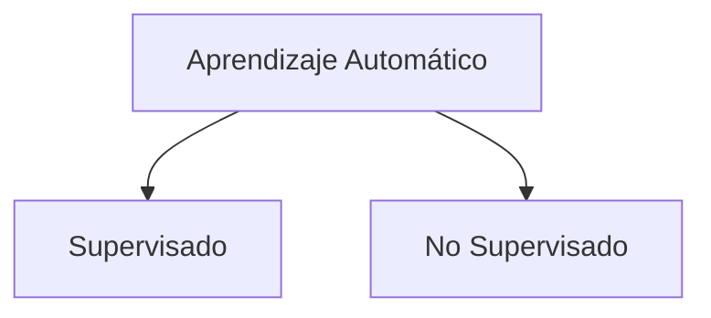
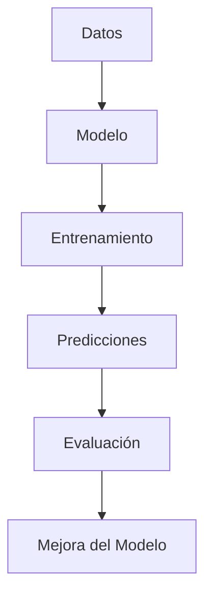

# 1. Introducción Al Aprendizaje Automático

## 1.1 Definición

El **aprendizaje automático (Machine Learning)** es una rama de la inteligencia artificial que se enfoca en el desarrollo de algoritmos capaces de **aprender patrones a partir de datos** y **generalizar comportamientos** sin set programados explícitamente para cada caso.

## 1.2 Idea Clave

En lugar de programar reglas manuales:

- Se proporcionan **datos (ejemplos)**.
    
- El algoritmo **aprende relaciones** dentro de esos datos.
    
- Genera un **modelo** que puede hacer predicciones o tomar decisiones.

## 1.3 Objetivo Principal

Construir sistemas que:

- Aprendan automáticamente.
    
- Mejoren su desempeño con más datos.
    
- Generalicen a situaciones nuevas.

---

# 2. Tipos De Aprendizaje Automático

## 2.1 Clasificación General

---

# 3. Aprendizaje Supervisado

## 3.1 Definición

Es un tipo de aprendizaje donde el modelo se entrena con:

- **Datos de entrada (features)**
    
- **Etiquetas (resultados esperados)**

El objetivo es aprender una función que relacione entradas con salidas.

## 3.2 Tipos De Problemas

|Tipo de problema|Descripción|Ejemplo|
|---|---|---|
|Clasificación|Predice categorías|Spam / No spam|
|Regresión|Predice valores continuous|Precio de una casa|

---

## 3.3 Clasificación

- Salida: valores discretos (categorías)
    
- Ejemplo:
    
    - Email → {Spam, No Spam}

---

## 3.4 Regresión

- Salida: valores numéricos continuous
    
- Ejemplo:
    
    - Tamaño casa → Precio

---

# 4. Aprendizaje No Supervisado

## 4.1 Definición

En este tipo de aprendizaje:

- No existen etiquetas.
    
- El modelo busca **patrones ocultos** en los datos.

---

## 4.2 Tipos Principales

|Tipo|Descripción|Ejemplo|
|---|---|---|
|Agrupamiento (Clustering)|Agrupa datos similares|Segmentación de clientes|
|Detección de anomalías|Identifica datos atípicos|Fraude bancario|

---

## 4.3 Agrupamiento

- Organiza datos en grupos sin etiquetas previas.
    
- Los elementos dentro de un grupo son similares entre sí.

---

## 4.4 Detección De Anomalías

- Identifica datos que **no siguen el patrón general**.
    
- Útil en:
    
    - Seguridad
        
    - Finanzas
        
    - Sistemas críticos

---

# 5. Evaluación De Modelos

## 5.1 Importancia

Permite medir:

- Qué tan bien funciona un modelo
    
- Si puede generalizar a nuevos datos

---

## 5.2 Métricas Comunes

|Tipo de problema|Métrica|
|---|---|
|Clasificación|Precisión, Recall, F1-score|
|Regresión|Error cuadrático medio (MSE), MAE|

---

## 5.3 Concepto Clave

Un buen modelo:

- No solo memoriza datos (overfitting)
    
- Generaliza correctamente a datos nuevos

---

# 6. Aplicaciones Del Aprendizaje Automático

## 6.1 En Ingeniería De Software

- Sistemas de recomendación
    
- Procesamiento de lenguaje natural
    
- Detección de fraudes
    
- Sistemas de predicción
    
- Automatización de procesos

---

## 6.2 Ejemplos Prácticos

|Área|Aplicación|
|---|---|
|E-commerce|Recomendación de productos|
|Finanzas|Detección de fraude|
|Salud|Diagnóstico asistido|
|Tecnología|Asistentes virtuales|

---

# 7. Implicaciones Éticas

## 7.1 Problemas Principales

- Sesgo en los datos
    
- Falta de transparencia
    
- Privacidad
    
- Uso indebido de la IA

---

## 7.2 Consideraciones Importantes

- Los modelos pueden heredar sesgos humanos.
    
- Es importante validar los datos utilizados.
    
- Se debe garantizar el uso responsible.

---

# 8. Relación General De Conceptos

---

# 9. Resumen De Puntos Clave

- El aprendizaje automático permite a las máquinas aprender a partir de datos.
    
- Existen dos tipos principales:
    
    - Supervisado (con etiquetas)
        
    - No supervisado (sin etiquetas)
        
- Problemas clave:
    
    - Clasificación y regresión (supervisado)
        
    - Agrupamiento y anomalías (no supervisado)
        
- Los modelos deben evaluarse con métricas específicas.
    
- Tiene múltiples aplicaciones en la ingeniería del software.
    
- Existen implicaciones éticas importantes que deben considerarse.

