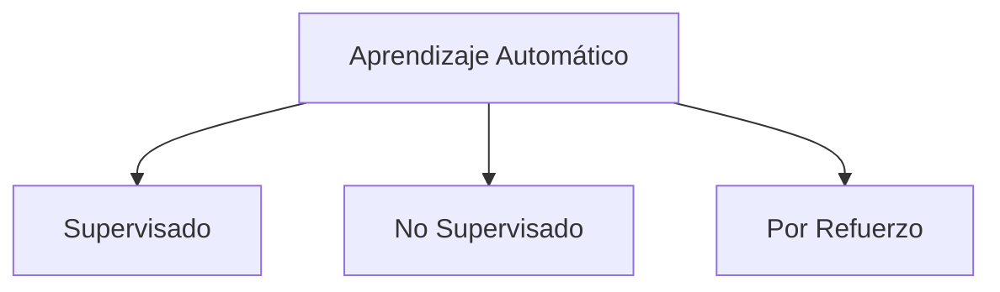
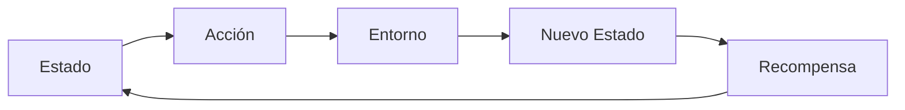

# 1. Definición Y Contexto Del Aprendizaje Automático

## 1.1 Origen

El **aprendizaje automático** surge en los años 80 con el uso de:

- Redes neuronales
    
- Árboles de decisión

Se desarrolló para resolver problemas donde los modelos estadísticos tradicionales no eran suficientes.

## 1.2 Aplicaciones Iniciales

Se utilizó principalmente en problemas complejos como:

- Reconocimiento de voz
    
- Reconocimiento de imágenes
    
- Predicción de series temporales no lineales
    
- Predicción de mercados financieros
    
- Reconocimiento de texto

---

## 1.3 Definición Formal

El aprendizaje automático es un proceso de **inducción de conocimiento** que permite:

- Clasificar información
    
- Procesar lenguaje natural
    
- Automatizar la toma de decisiones

---

# 2. Tipos De Aprendizaje Automático

## 2.1 Clasificación General

---

## 2.2 Comparación De Tipos

|Tipo|Datos etiquetados|Objetivo|
|---|---|---|
|Supervisado|Sí|Predecir resultados|
|No supervisado|No|Encontrar patrones|
|Por refuerzo|No explícitos|Aprender mediante interacción|

---

# 3. Aprendizaje Supervisado

## 3.1 Definición

Utilize datos con **entradas y salidas conocidas** para entrenar modelos.

## 3.2 Subtipos

|Tipo|Objetivo|
|---|---|
|Regresión|Predecir valores numéricos|
|Clasificación|Predecir categorías|

---

# 4. Aprendizaje No Supervisado

## 4.1 Definición

Trabaja con datos **sin etiquetas**, buscando estructuras ocultas.

## 4.2 Subtipos

|Tipo|Objetivo|
|---|---|
|Agrupamiento|Encontrar grupos similares|
|Detección de anomalías|Detectar valores atípicos|

---

# 5. Aprendizaje Por Refuerzo

## 5.1 Definición

Es un paradigma donde un **agente aprende a tomar decisiones** mediante interacción con un entorno, recibiendo recompensas o penalizaciones.

---

## 5.2 Components Principales

|Componente|Descripción|
|---|---|
|Agente|Entidad que toma decisiones|
|Entorno|Sistema con el que interactúa|
|Estado|Situación actual del entorno|
|Acción|Decisión tomada por el agente|
|Recompensa|Retroalimentación del entorno|

---

## 5.3 Ciclo De Funcionamiento

---

## 5.4 Proceso De Aprendizaje

1. El agente observa el estado actual.
    
2. Selecciona una acción.
    
3. El entorno cambia.
    
4. Recibe una recompensa.
    
5. Ajusta su comportamiento.

---

# 6. Políticas De Decisión

## 6.1 Definición

Una **política** es una estrategia que define qué acción tomar en cada estado.

---

## 6.2 Tipos De Políticas

|Tipo|Características|
|---|---|
|Determinística|Una acción fija por estado|
|Estocástica|Probabilidades para cada acción|

---

## 6.3 Ejemplo Conceptual (laberinto)

- Estados: configuraciones del entorno (paredes)
    
- Acciones: avanzar, retroceder, girar
    
- Política: decide qué hacer según el estado

---

# 7. Exploración Vs Explotación

## 7.1 Concepto Clave

|Estrategia|Descripción|
|---|---|
|Exploración|Probar nuevas acciones|
|Explotación|Usar acciones conocidas|

---

## 7.2 Importancia

Se debe lograr un equilibrio:

- Mucha exploración → lento aprendizaje
    
- Mucha explotación → soluciones subóptimas

---

# 8. Algoritmos De Aprendizaje Por Refuerzo

## 8.1 Función Q (Q-Function)

Define la **recompensa esperada** de tomar una acción en un estado.

---

## 8.2 Q-Learning

### Tipo

- Off-policy

### Objetivo

Aprender la política óptima maximizando la recompensa esperada.

### Idea Clave

Actualiza el valor Q utilizando la mejor acción possible en el siguiente estado, independientemente de la política actual.

### Fórmula

$$
Q(s, a) = Q(s, a) + α [ r + γ max(Q(s', a')) - Q(s, a) ]$$

### Parámetros
- α (alpha): tasa de aprendizaje
- γ (gamma): factor de descuento
- r: recompensa
- s: estado actual
- a: acción actual
- s': siguiente estado

### Pasos Del Algoritmo
1. Inicializar Q(s, a) arbitrariamente
2. Para cada episodio:
   - Inicializar estado s
   - Repetir:
     - Elegir acción a (ε-greedy)
     - Ejecutar acción a
     - Observar recompensa r y nuevo estado s'
     - Actualizar Q(s, a)
     - s ← s'
   - Hasta terminar episodio

### Características
- Aprende rápido
- Tiende a ser agresivo
- Puede ser inestable

### Ventajas
- Encuentra políticas óptimas
- No depende de la política actual

### Desventajas
- Puede sobreestimar valores
- Requiere buen balance exploración/explotación

---

## 8.3 SARSA

## SARSA

### Tipo
- On-policy

### Objetivo
Aprender el valor Q siguiendo la política actual.

### Idea Clave
Actualiza el valor Q basándose en la acción que realmente se toma.

### Fórmula
$$

Q(s, a) = Q(s, a) + α [ r + γ Q(s', a') - Q(s, a) ]

$$
### Parámetros
- α (alpha): tasa de aprendizaje
- γ (gamma): factor de descuento
- r: recompensa
- s: estado actual
- a: acción actual
- s': siguiente estado
- a': siguiente acción

### Pasos Del Algoritmo
1. Inicializar Q(s, a)
2. Para cada episodio:
   - Inicializar estado s
   - Elegir acción a (ε-greedy)
   - Repetir:
     - Ejecutar acción a
     - Observar r, s'
     - Elegir a' (ε-greedy)
     - Actualizar Q(s, a)
     - s ← s'
     - a ← a'
   - Hasta terminar episodio

### Características
- Más conservador
- Sigue la política actual

### Ventajas
- Más estable
- Menor riesgo en entornos inciertos

### Desventajas
- Aprendizaje más lento
- Puede no encontrar el óptimo global

---

## 8.4 Comparación

|Característica|Q-Learning|SARSA|
|---|---|---|
|Tipo|Off-policy|On-policy|
|Estabilidad|Baja|Alta|
|Velocidad|Alta|Media|
|Óptimo|Sí|No siempre|

---

# 9. Estrategias De Implementación

## 9.1 ε-Greedy (Epsilon-Greedy)

## ε-Greedy

### Tipo
- Estrategia de selección de acciones

### Objetivo
Balancear exploración y explotación

### Idea Clave
- Con probabilidad ε: explorar (acción aleatoria)
- Con probabilidad 1 - ε: explotar (mejor acción conocida)

### Pseudocódigo
si random < ε:
    elegir acción aleatoria
si no:
    elegir acción con mayor Q(s, a)

### Parámetro
- ε (epsilon): probabilidad de exploración

### Características
- Simple de implementar
- Controla el equilibrio exploración/explotación

### Recomendación
- Usar ε decreciente en el tiempo para mejorar aprendizaje

---

# 10. Aplicaciones Del Aprendizaje Por Refuerzo

|Área|Aplicación|
|---|---|
|Juegos|AlphaGo|
|Robótica|Control de movimiento|
|Vehículos autónomos|Toma de decisiones|
|Salud|Optimización de tratamientos|
|Finanzas|Estrategias de inversión|

---

# 11. Desafíos E Limitaciones

## 11.1 Principales Problemas

|Problema|Descripción|
|---|---|
|Exploración vs explotación|Difícil equilibrio|
|Escalabilidad|Alto costo computacional|
|Diseño de recompensas|Complejo de ajustar|
|Retrasos en recompensa|Difícil aprendizaje|
|Modelado del entorno|No siempre possible|
|Estabilidad|Entrenamiento inestable|
|Convergencia|No siempre óptima|

---

# 12. Resumen De Puntos Clave

- El aprendizaje automático surge para resolver problemas complejos donde fallan los modelos tradicionales.
    
- Existen tres tipos principales:
    
    - Supervisado
        
    - No supervisado
        
    - Por refuerzo
        
- El aprendizaje por refuerzo se basa en interacción con el entorno.
    
- Components clave: agente, entorno, estado, acción y recompensa.
    
- Las políticas determinan el comportamiento del agente.
    
- Q-Learning y SARSA son algoritmos fundamentales.
    
- Existen desafíos importantes como la estabilidad, el costo computacional y la convergencia.

---

# MicroTest