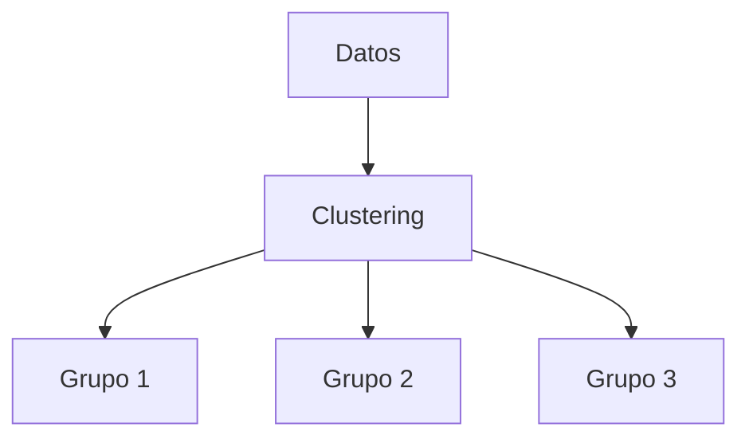
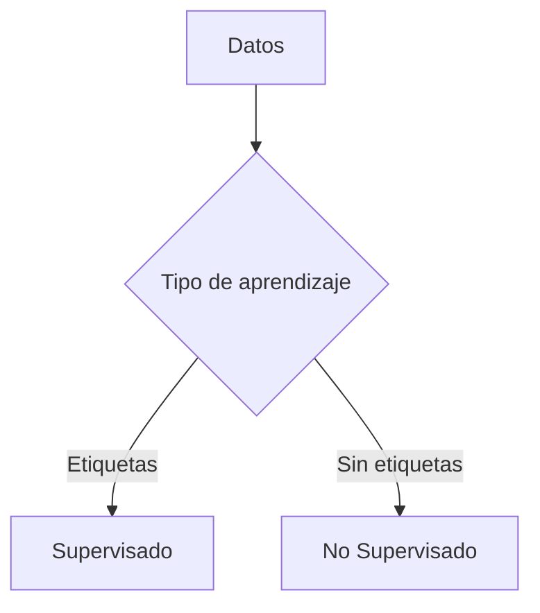

# 1. Introducción: Supervisado Vs No Supervisado

Los dos enfoques más importantes del aprendizaje automático en el desarrollo de software son:

- **Aprendizaje supervisado**
    
- **Aprendizaje no supervisado**

Ambos difieren principalmente en la **disponibilidad de etiquetas (respuestas)** en los datos.

---

# 2. Aprendizaje Supervisado

## 2.1 Definición

El aprendizaje supervisado consiste en aprender una función que relacione:

- Variables de entrada (predictoras)
    
- Variable de salida (respuesta)

Se basa en datos **etiquetados**, donde cada entrada tiene un resultado conocido.

---

## 2.2 Modelo Conceptual

![[Pasted image 20260324214412.png]]

---

## 2.3 Conceptos Clave

|Concepto|Definición|
|---|---|
|Variables independientes (X)|Datos de entrada|
|Variable dependiente (Y)|Resultado esperado|
|Modelo|Función que aproxima la relación entre X e Y|
|Caja negra|Sistema desconocido que genera los datos|

---

## 2.4 Objetivo

![[Pasted image 20260324214428.png]]

Encontrar una función:

$$  
Y = f(X)  
$$

Que permita:

- Predecir resultados futuros
    
- Generalizar a nuevos datos

---

# 3. Tipos De Problemas En Aprendizaje Supervisado

## 3.1 Regresión

### Definición

Predice valores **numéricos continuous**.

### Ejemplo

- Precio de una casa
    
- Temperatura futura

### Características

|Aspecto|Descripción|
|---|---|
|Tipo de salida|Numérica continua|
|Objetivo|Estimar valores|

---

## 3.2 Clasificación

### Definición

Predice **categorías o clases**.

### Ejemplo

- Spam / No spam
    
- Diagnóstico médico

---

## 3.3 Tipos De Clasificación

|Tipo|Descripción|
|---|---|
|Binaria|Dos clases (0/1)|
|Multiclase|Más de dos clases|

---

## 3.4 Conceptos Clave En Clasificación

|Concepto|Descripción|
|---|---|
|Clase|Categoría asignada|
|Etiqueta|Valor discreto|
|Variable de clase|Representa las categorías|

---

# 4. Evaluación Del Modelo Supervisado

## 4.1 Enfoque

El modelo se evalúa por su:

- Capacidad de predicción
    
- Capacidad de generalización

---

# 5. Aprendizaje No Supervisado

## 5.1 Definición

Trabaja con datos **sin etiquetas**, buscando:

- Patrones
    
- Estructuras ocultas

---

## 5.2 Tipos Principales

|Tipo|Objetivo|
|---|---|
|Clustering|Agrupar datos similares|
|Detección de anomalías|Identificar datos atípicos|

---

# 6. Agrupamiento (Clustering)

## 6.1 Definición

Agrupa datos en **clústeres** donde:

- Los elementos dentro del grupo son similares
    
- Los grupos son diferentes entre sí

---

## 6.2 Representación Conceptual

---

## 6.3 Aplicaciones

- Segmentación de clientes
    
- Análisis exploratorio de datos

---

# 7. Detección De Anomalías

## 7.1 Definición

Identifica datos que:

- No siguen el patrón general
    
- Son raros o inusuales

---

## 7.2 Ejemplos

- Fraude financiero
    
- Fallos en sistemas
    
- Diagnósticos médicos

---

## 7.3 Consideración Importante

Aunque puede resolverse con aprendizaje supervisado:

- Solo detecta anomalías conocidas
    
- No generaliza bien a nuevas anomalías

Por eso se prefiere el enfoque no supervisado.

---

# 8. Comparación: Supervisado Vs No Supervisado

|Característica|Supervisado|No supervisado|
|---|---|---|
|Datos|Etiquetados|No etiquetados|
|Objetivo|Predecir|Descubrir patrones|
|Control|Alto|Bajo|
|Ejemplo|Clasificación|Clustering|

---

## 8.1 Diferencia Conceptual

---

# 9. Flujo General Del Aprendizaje

---

# 10. Información Adicional Relevante

- El aprendizaje supervisado es ideal cuando se dispone de datos históricos etiquetados.
    
- El aprendizaje no supervisado es clave en fases exploratorias.
    
- Ambos enfoques pueden combinarse en sistemas híbridos.
    
- La calidad de los datos impacta directamente en el rendimiento del modelo.

---

# 11. Resumen De Puntos Clave

- El aprendizaje supervisado utilize datos etiquetados para aprender relaciones entrada-salida.
    
- Se divide en regresión (valores continuous) y clasificación (categorías).
    
- El aprendizaje no supervisado trabaja sin etiquetas y busca patrones ocultos.
    
- Sus principales técnicas son clustering y detección de anomalías.
    
- La principal diferencia entre ambos es la disponibilidad de etiquetas.
    
- El supervisado predice, el no supervisado descubre.

---

# MicroTest