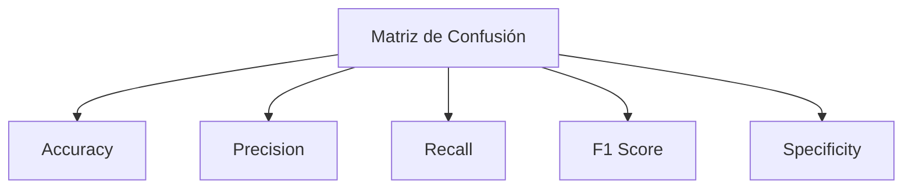
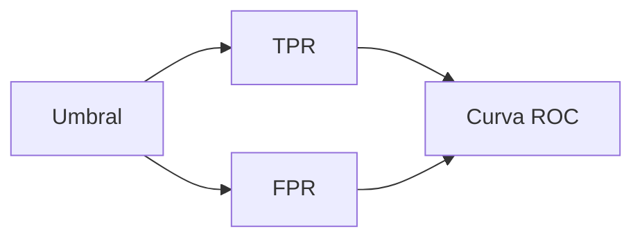

## 1. Evaluación de Modelos de Clasificación

### 1.1 Matriz de Confusión

#### Definición

La **matriz de confusión** es una tabla que permite evaluar el desempeño de un modelo de clasificación comparando:

- Predicciones del modelo
    
- Valores reales
    

---

### 1.2 Estructura

||Real Positiva|Real Negativa|
|---|---|---|
|Predicha Positiva|TP (True Positive)|FP (False Positive)|
|Predicha Negativa|FN (False Negative)|TN (True Negative)|

---

### 1.3 Definiciones clave

|Métrica|Definición|
|---|---|
|TP|Predicción correcta de clase positiva|
|FP|Predicción incorrecta como positiva|
|TN|Predicción correcta de clase negativa|
|FN|Predicción incorrecta como negativa|

---

### 1.4 Interpretación

- Diagonal → aciertos
    
- Fuera de la diagonal → errores
    

---

## 2. Métricas de Clasificación

### 2.1 Accuracy (Exactitud)

$$  
Accuracy = \frac{TP + TN}{TP + TN + FP + FN}  
$$

#### Explicación

Mide la proporción de predicciones correctas sobre el total.

#### Interpretación

- Útil cuando las clases están balanceadas
    
- Puede ser engañosa en datasets desbalanceados
    

---

### 2.2 Precision

$$  
Precision = \frac{TP}{TP + FP}  
$$

#### Explicación

Indica qué proporción de predicciones positivas son correctas.

#### Interpretación

- Alta precisión → pocos falsos positivos
    
- Importante cuando el costo de FP es alto
    

---

### 2.3 Recall (Sensibilidad)

$$  
Recall = \frac{TP}{TP + FN}  
$$

#### Explicación

Mide la capacidad del modelo para encontrar todos los positivos reales.

#### Interpretación

- Alto recall → pocos falsos negativos
    
- Importante en detección de enfermedades, fraude, etc.
    

---

### 2.4 F1 Score

$$  
F1 = \frac{2 \cdot precision \cdot recall}{precision + recall}  
$$

#### Explicación

Es la media armónica entre precision y recall.

#### Interpretación

- Balance entre precisión y recall
    
- Útil cuando hay desbalance de clases
    

---

### 2.5 Specificity (Especificidad)

$$  
Specificity = \frac{TN}{TN + FP}  
$$

#### Explicación

Mide la capacidad de identificar correctamente los negativos.

---

## 3. Relación entre métricas

---

## 4. Clasificación Multiclase

### 4.1 Características

- Más de dos clases
    
- Métricas se calculan por clase y luego se promedian
    

### 4.2 Tipos de promedio

- Macro average
    
- Micro average
    
- Weighted average
    

---

## 5. Curva ROC y AUC

### 5.1 Definición

La curva ROC evalúa el rendimiento del modelo en diferentes umbrales.

---

### 5.2 Métricas involucradas

$$  
TPR = \frac{TP}{TP + FN}  
$$

$$  
FPR = \frac{FP}{FP + TN}  
$$

---

### 5.3 Interpretación

- Mejor modelo → curva cerca de la esquina superior izquierda
    
- Modelo aleatorio → diagonal
    

---

### 5.4 AUC (Area Under Curve)

- Valor entre 0 y 1
    
- 1 → modelo perfecto
    
- 0.5 → modelo aleatorio
    

---

## 6. Métricas de Regresión

### 6.1 Error Cuadrático Medio (MSE)

$$  
MSE = \frac{1}{n} \sum (y_i - \hat{y}_i)^2  
$$

#### Explicación

Promedio del error al cuadrado entre valores reales y predichos.

#### Característica

- Penaliza fuertemente errores grandes
    

---

### 6.2 RMSE

$$  
RMSE = \sqrt{MSE}  
$$

#### Explicación

Raíz del MSE para mantener unidades originales.

---

### 6.3 MAE

$$  
MAE = \frac{1}{n} \sum |y_i - \hat{y}_i|  
$$

#### Explicación

Promedio del error absoluto.

#### Ventaja

- Robusto a outliers
    

---

### 6.4 RMSLE

$$  
RMSLE = \sqrt{\frac{1}{n} \sum (\log(y_i + 1) - \log(\hat{y}_i + 1))^2}  
$$

#### Uso

- Datos con gran variabilidad
    
- Importancia en diferencias relativas
    

---

### 6.5 MAPE

$$  
MAPE = \frac{1}{n} \sum \left| \frac{y_i - \hat{y}_i}{y_i} \right|  
$$

#### Explicación

Error en porcentaje.

---

### 6.6 MPE

$$  
MPE = \frac{1}{n} \sum \left( \frac{y_i - \hat{y}_i}{y_i} \right)  
$$

#### Explicación

Permite detectar sesgo:

- Positivo → subestimación
    
- Negativo → sobreestimación
    

---

## 7. Métricas de Clustering

### 7.1 Silhouette Score

$$  
s(i) = \frac{b(i) - a(i)}{\max(a(i), b(i))}  
$$

#### Explicación

- a(i): distancia intra-clúster
    
- b(i): distancia al clúster más cercano
    

#### Interpretación

- Cercano a 1 → buen agrupamiento
    
- Cercano a 0 → frontera
    
- Negativo → mal agrupado
    

---

### 7.2 Davies-Bouldin Index

$$  
DB = \frac{1}{k} \sum \max \left( \frac{S_i + S_j}{M_{ij}} \right)  
$$

#### Explicación

Relación entre dispersión interna y separación entre clústeres.

#### Interpretación

- Menor valor → mejor
    

---

### 7.3 Dunn Index

$$  
D = \frac{\min(distancia\ entre\ clusters)}{\max(distancia\ dentro\ cluster)}  
$$

#### Interpretación

- Mayor valor → mejor separación
    

---

### 7.4 Adjusted Rand Index (ARI)

$$  
ARI = \frac{RI - Expected}{Max - Expected}  
$$

#### Interpretación

- 1 → coincidencia perfecta
    
- 0 → aleatorio
    

---

### 7.5 Calinski-Harabasz

$$  
CH = \frac{tr(B_k)}{tr(W_k)} \cdot \frac{N-k}{k-1}  
$$

#### Interpretación

- Mayor valor → mejor clustering
    

---

## 8. Selección de Métricas

### 8.1 Factores clave

|Factor|Impacto|
|---|---|
|Tipo de problema|Clasificación / regresión|
|Datos desbalanceados|Afecta accuracy|
|Outliers|Afectan MSE|
|Interpretabilidad|MAE y MAPE más intuitivos|

---

## 9. Resumen de puntos clave

- La matriz de confusión es la base de evaluación en clasificación.
    
- Métricas clave: accuracy, precision, recall, F1 y specificity.
    
- ROC y AUC permiten evaluar modelos sin fijar un umbral.
    
- En regresión destacan MSE, RMSE, MAE, MAPE.
    
- En clustering se usan métricas como silhouette, DB y Dunn.
    
- La elección de la métrica depende del problema y los datos.
    

---

## MicroTest